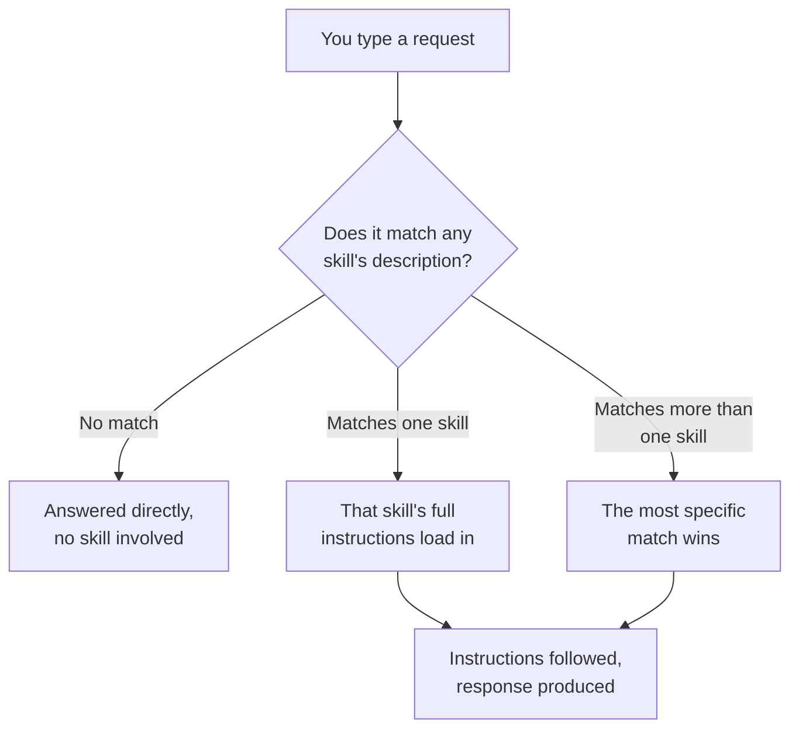
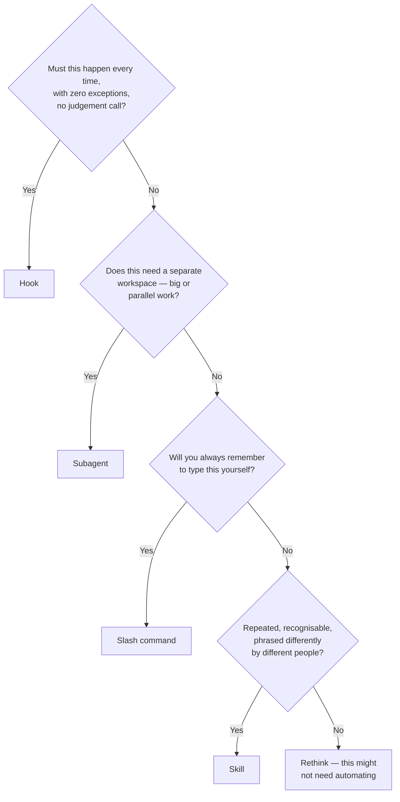
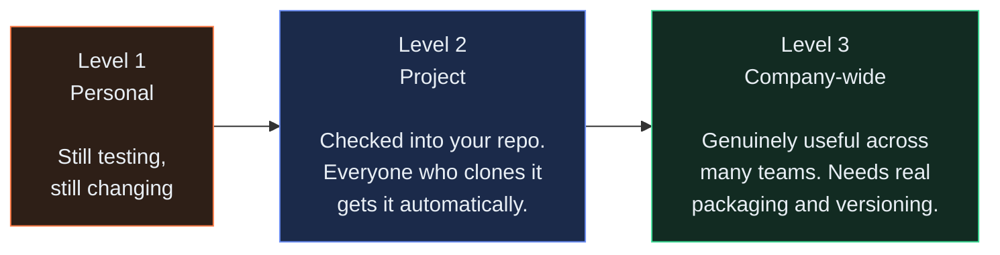
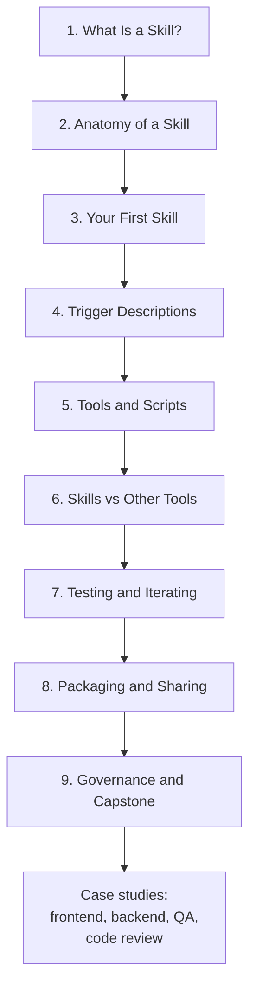
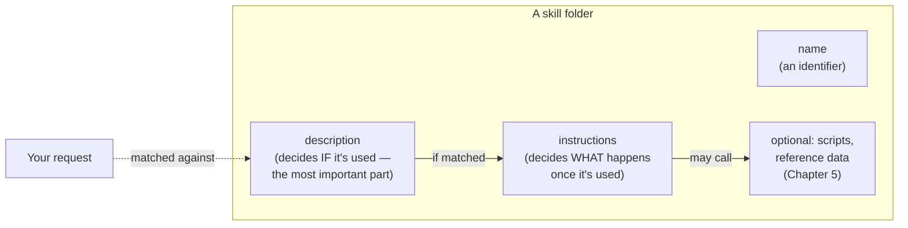

# Visuals

← [Back to README](../README.md)

Two kinds of visual here. The diagrams in Part 1 are real — they're written in Mermaid, which most modern Markdown viewers (including GitHub) render directly, no image generator needed. Part 2 has copy-paste prompts for illustrative art, if you want a more polished, story-driven look for a wiki page or a presentation.

---

## Part 1 — Real diagrams

### How a skill gets picked

The company-directory idea from [Chapter 1](../tutorial/01-what-is-a-skill.md), as a flow.

---

### The decision framework from Chapter 6

---

### The sharing ladder from Chapter 8

Most skills should stop at Level 2. That's a complete, successful outcome — not a step on the way to something bigger.

---

### The nine-chapter arc

---

### A skill's own anatomy

---

## Part 2 — Image-generation prompts

Optional. Use these with any image-capable tool if you want illustrative art — for a team wiki, a slide deck, or an onboarding page. None of this is required to use the tutorial.

### 1. Cover image

**Suggested filename:** `assets/cover.png`

**Brief:** A wide banner showing a software engineer at a desk, split composition — left side shows scattered sticky notes and repeated typing (representing explaining the same thing over and over), right side shows a single calm interaction with an assistant that already "knows" the convention. Warm-to-cool colour transition left to right.

**Style:** Flat, modern illustration. Muted blue, teal, and warm-neutral palette. Wide aspect ratio (roughly 3:1), suitable for a repo banner.

---

### 2. The cast

**Suggested filename:** `assets/kestrel-team.png`

**Brief:** Five simple, friendly illustrated portraits in a row — the protagonist, Rahul (tech lead), Divya (frontend), Vikram (backend), Ananya (QA). Consistent art style across all five so they read as one team.

**Style:** Flat illustration, same style as the cover image. Each person doing something small and specific — Divya at a component preview, Vikram at a terminal, Ananya with a checklist.

---

### 3. The company directory analogy

**Suggested filename:** `assets/directory-analogy.png`

**Brief:** A literal illustrated company directory board, like you'd see in a lobby, but the name plates say things like "Commit Message Skill — writes commit messages, use when asked to commit changes" instead of real job titles. Makes Chapter 1's core analogy visually literal.

**Style:** Clean, slightly playful, like an infographic rather than a photo. Light background, one accent colour for the "matched" entry.

---

### 4. The near-miss (Chapter 9)

**Suggested filename:** `assets/near-miss-review.png`

**Brief:** A small group around a screen in a code review, one person pointing at a specific line with a concerned but calm expression — not alarmed, just careful. Should read as "caught in review, working as intended," not as a disaster.

**Style:** Same flat illustration style as the cast. Calm, neutral colour palette — this is a routine catch, not a crisis, and the art should say that.

---

### 5. The sharing ladder, illustrated

**Suggested filename:** `assets/sharing-ladder-illustrated.png`

**Brief:** A literal small ladder or staircase with three steps, labelled Personal, Project, Company-wide, with a small skill-folder icon climbing it — but stopping comfortably at step two, to visually reinforce that most skills shouldn't climb further than that.

**Style:** Simple, icon-driven, matches the Mermaid diagram above in spirit — this is the same content as a more polished illustration, not new content.

---

← [Back to README](../README.md)
