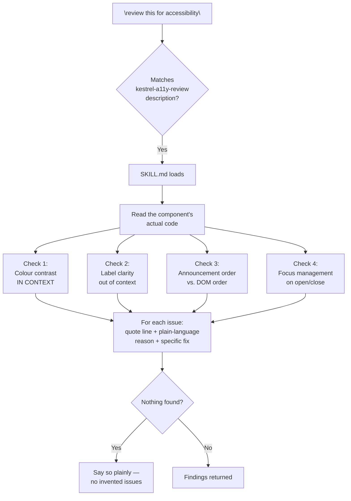

# Flow Diagram — `kestrel-a11y-review`

← [Back to case study](../README.md)

See [SKILL.md](../SKILL.md) for the real instructions this diagram traces, and [the full lifecycle chapter](../../../tutorial/10-lifecycle-of-execution.md) for how the MATCH step works underneath.

---

← [Back to case study](../README.md)
