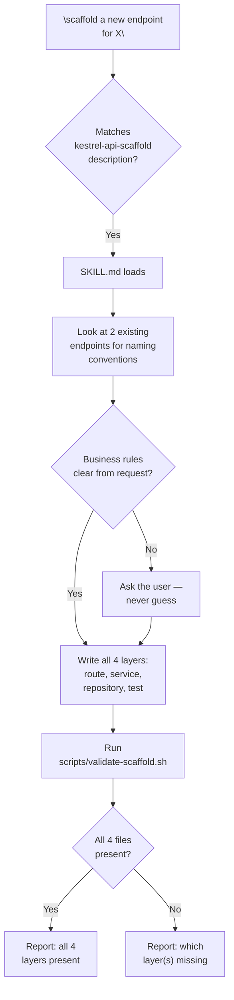

# Flow Diagram — `kestrel-api-scaffold`

← [Back to case study](../README.md)

See [SKILL.md](../SKILL.md) and [scripts/validate-scaffold.sh](../scripts/validate-scaffold.sh) for the real files this diagram traces.

---

← [Back to case study](../README.md)
