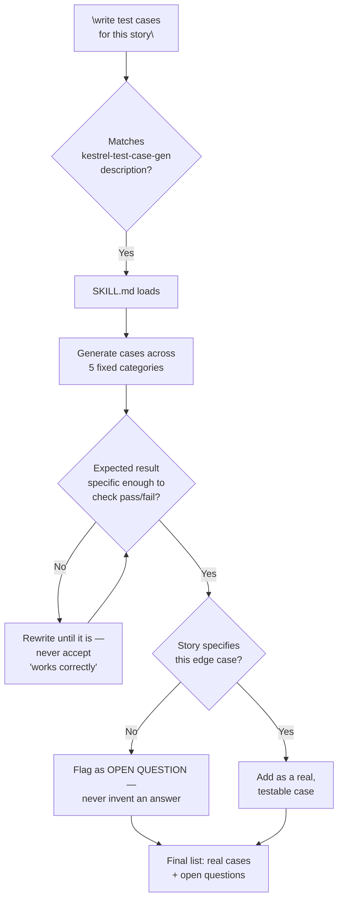

# Flow Diagram — `kestrel-test-case-gen`

← [Back to case study](../README.md)

The `EXP` and `SPEC` checks are the actual fix from ["What went wrong the first time"](../README.md#what-went-wrong-the-first-time--and-why-it-mattered-more-here) — see [SKILL.md](../SKILL.md) for the instructions that enforce them.

---

← [Back to case study](../README.md)
