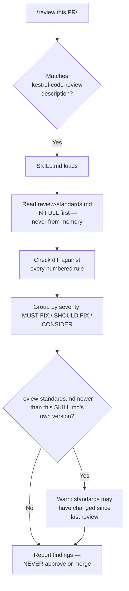

# Flow Diagram — `kestrel-code-review`

← [Back to case study](../README.md)

See [SKILL.md](../SKILL.md) (the instructions) and [review-standards.md](../review-standards.md) (the actual policy, kept as a separate file for exactly the reason explained in ["What went wrong the first time"](../README.md#what-went-wrong-the-first-time)).

---

← [Back to case study](../README.md)
