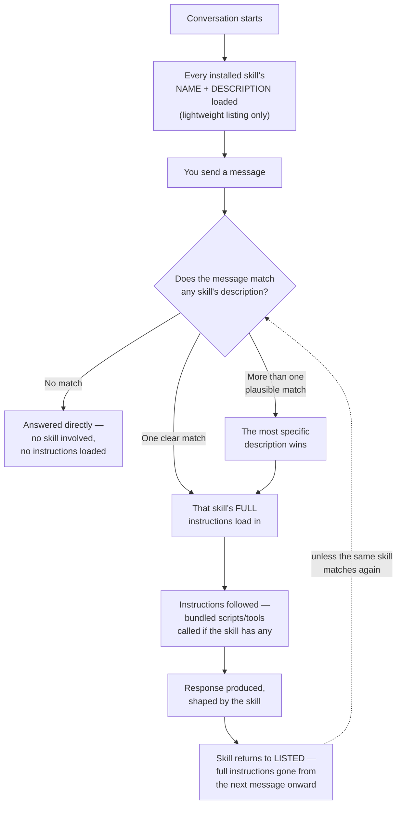

# Chapter 10 — The Execution Lifecycle

← [Chapter 9 — Governance and Capstone](09-governance-and-capstone.md) · [Learning path](../learning-path.md) · Next: [Case Studies →](../case-studies/README.md)

A bonus chapter, not part of the original nine — but worth reading before the case studies, because it answers a question the last nine chapters left unanswered on purpose.

---

## Where you left off

Your commit-message skill is finished, tested, shared, and governed. Rahul has one more question before he sends you off to the case studies:

> "You've built it, triggered it, tested it, shared it. But can you actually walk me through what happens, in order, from the second you type a message to the second you get a response — for a skill that matches, and for one that doesn't? Not the theory. The actual sequence."

You realize you've been treating the skill like a black box that "just triggers." You've never traced the whole thing, start to finish, in order.

---

## What you'll learn

1. The exact sequence of events from before you ever type a message, to after your response arrives.
2. Why only a skill's *description* is present most of the time — not its full instructions — and what that costs and saves.
3. What happens on a clean match, a near-miss, and a real mismatch — traced separately.

---

## The lesson

### The two states every skill lives in

Here's the fact this whole chapter builds on: **a skill exists in one of exactly two states at any moment — listed, or loaded.**

**Listed** is the default, resting state. Every skill you (or anyone else) has installed sits in a known location. At the start of a conversation, a short listing — just each skill's *name* and *description*, not its instructions — is assembled and kept available. This is deliberately lightweight: with ten skills installed, that's ten short descriptions, not ten full instruction sets. The cost of "having a skill available" is small and roughly constant, no matter how long or detailed that skill's actual instructions are.

**Loaded** is temporary, and only happens for the one skill (or occasionally more than one) that actually gets used for a specific request. Its full instructions — however long, however detailed — are read in, in full, only at the moment they're needed.

This two-state design is *why* [Chapter 4](04-writing-trigger-descriptions.md) spent an entire chapter on trigger descriptions. The description isn't a minor detail attached to the real skill. **For almost the entire time a skill exists, the description is the only part of it that's actually present anywhere.** The instructions only become real, for that moment, if the description does its job.

### The full sequence, traced

Walk through what each stage actually means, in order.

**1. Before you type anything.** Every skill you have installed is already sitting in its listed state — name and description only. Nothing has been "chosen" yet. This is the state a skill spends nearly all of its existence in.

**2. You send a message.** The message gets compared against every available skill's description — all of them, every single time, fresh. Nothing is cached from a previous message about which skill you "probably" want this time. A skill that matched five minutes ago gets no special treatment on this message; its description has to match again, on its own merits, right now.

**3. Matching happens.** Either nothing matches — the request is handled directly, with zero skills involved — or exactly one clear match is found — or several skills all look plausible, and the most specific one wins, exactly as [Chapter 1](01-what-is-a-skill.md)'s company-directory analogy described.

**4. Loading.** The moment a skill is matched, its full instructions — the actual `SKILL.md` body, however long — are read in. This is the one and only point where the skill stops being "just a description" and becomes everything you wrote for it.

**5. Execution.** The loaded instructions are followed as part of answering your message. If the skill bundles a script or tool, per [Chapter 5](05-tools-and-scripts.md), that's where it gets called — not before, not speculatively, only once the skill has actually been triggered and is actively running.

**6. Output.** A response comes back, shaped by whatever the skill's instructions said to do.

**7. Reset.** Once that response is delivered, the skill's full instructions aren't carried forward as some kind of standing state. The *next* message starts back at step 2 — comparing fresh against every skill's description again. If the same skill matches again, it loads again, in full, from scratch. Nothing about "it was already loaded a moment ago" makes the second load faster, smarter, or different.

### Why this matters more than it sounds like it should

Once you actually trace it, three things that felt like arbitrary rules turn out to be direct consequences of this lifecycle:

**Why a vague description is worse than a vague instruction body.** A confusing paragraph inside the loaded instructions only matters *after* a match already happened — you're already in the one case where the skill's specific wording gets a chance to be interpreted correctly. A confusing *description* fails at the one gate that decides whether any of that ever happens at all. Chapter 4's whole emphasis follows directly from where the description sits in this sequence — first, and load-bearing.

**Why a skill can't "remember" the last time it ran.** Each message re-runs the matching step from scratch. A skill has no notion of "I ran three messages ago, so I'll assume I'm still relevant." That's not a limitation someone forgot to build — it's what makes a skill trustworthy: it does exactly what its description says, on exactly the message that matches it, every time, with no hidden carryover.

**Why bundled scripts don't run speculatively.** A script bundled into a skill, per Chapter 5, only executes during the execution step — after a real match, as part of actually answering a real request. It never runs "just in case" while the skill sits in its listed state. The cost of having a powerful, script-backed skill installed is the same small, constant cost as having any other skill installed, right up until it's actually the one that matches.

### Tracing a near-miss

Here's the case worth walking through separately, because it's the one that actually breaks trust when it goes wrong. Say two skills exist — one for writing commit messages, one for writing PR descriptions — with descriptions that overlap more than they should. A message like "write something for this change I just made" reaches the matching step, and **both** descriptions look plausible.

[Chapter 1](01-what-is-a-skill.md)'s rule fires here: the more specific match wins. If neither is clearly more specific, that's not a runtime bug to patch — it's a signal, discoverable only by tracing the lifecycle this closely, that the two descriptions need to be rewritten to no longer overlap. The fix always lives at the matching step, in the description — never inside the loaded instructions, because by the time you're inside the instructions, the (possibly wrong) match has already happened.

---

## Try it yourself

Pick two skills you've built or have access to. Write down, from memory, their exact descriptions. Then write three real messages: one that should clearly match the first, one that should clearly match the second, and one deliberately ambiguous message that could plausibly match either. Trace, on paper, which stage of the lifecycle above would catch the ambiguous case — and whether your current descriptions actually resolve it the way [Chapter 1](01-what-is-a-skill.md) says they should, or whether you've just found a real near-miss worth fixing.

---

## What's still missing

Nothing, for the lifecycle of a skill — you've now traced it start to end, twice: once as a builder in Chapters 1 through 9, and once as a runtime sequence here.

What you haven't seen is this same kind of lifecycle trace for a **workflow**, where the sequence is a lot more involved — phases, parallel branches, verification stages — and for an **agent**, where the sequence doesn't even have a fixed length. [AI-Workflows Chapter 10](../../AI-Workflows/tutorial/10-lifecycle-of-execution.md) and [AI-Agents Chapter 10](../../AI-Agents/tutorial/10-lifecycle-of-execution.md) are exactly that, once you're ready for them.

For now: the [case studies](../case-studies/README.md) are next, each one now including a real, ready-to-use `SKILL.md` you can trace through this exact lifecycle yourself.

---

← [Chapter 9 — Governance and Capstone](09-governance-and-capstone.md) · [Learning path](../learning-path.md) · Next: [Case Studies →](../case-studies/README.md)
