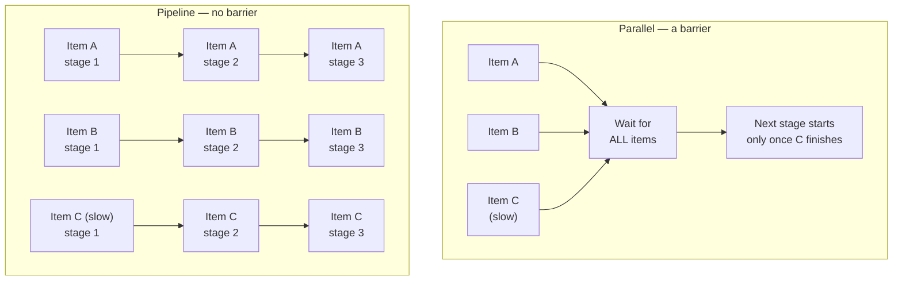
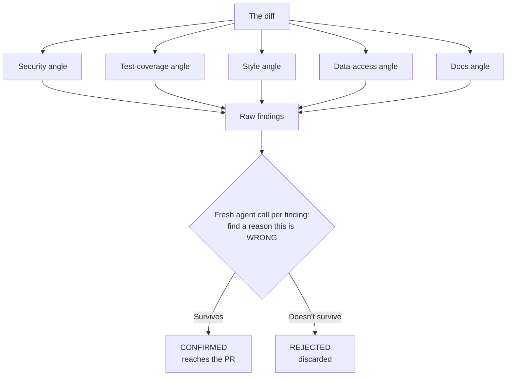
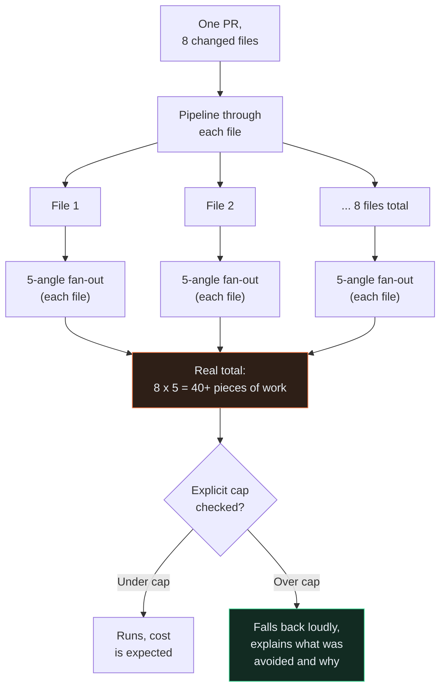
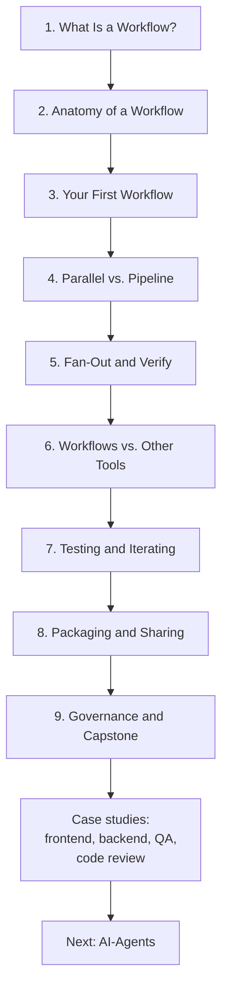
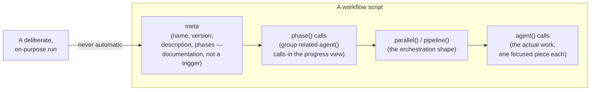
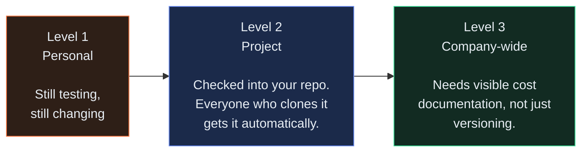

# Visuals

← [Back to README](../README.md)

Same two-part shape as the AI-Skills tutorial's visuals page. Part 1 is real, working Mermaid diagrams — most Markdown viewers, including GitHub, render these directly. Part 2 has copy-paste prompts for illustrative art, if you want a more polished look for a wiki page or a presentation.

---

## Part 1 — Real diagrams

### Parallel vs. pipeline

The single most important picture in this tutorial — [Chapter 4](../tutorial/04-parallel-vs-pipeline.md)'s core distinction, made visual.

In the pipeline, item A can finish all three of its own stages before slow item C even reaches stage 2 — nothing makes A wait for C. That's the entire reason pipeline is the default.

---

### Fan-out and verify

The pattern from [Chapter 5](../tutorial/05-fan-out-and-verify.md) — several angles, then independent verification before anything is trusted.

---

### The nested-multiplication risk

[Chapter 9](../tutorial/09-governance-and-capstone.md)'s near-miss — two individually-reasonable patterns, nested together.

---

### The nine-chapter arc

---

### A workflow's own anatomy

The structural picture from [Chapter 2](../tutorial/02-anatomy-of-a-workflow.md).

---

### The sharing ladder, workflow version

Same three levels as AI-Skills, with the workflow-specific gate on Level 3 from [Chapter 8](../tutorial/08-packaging-and-sharing.md).

Most workflows should stop at Level 2, same as skills — Level 3 asks for one extra thing a skill never needed: the real, written-down cost.

---

## Part 2 — Image-generation prompts

Optional. Use these with any image-capable tool for a team wiki, a slide deck, or an onboarding page. None of this is required to use the tutorial.

### 1. Cover image

**Suggested filename:** `assets/cover.png`

**Brief:** A wide banner showing several small, focused threads of work converging into one combined result — visually distinct from the AI-Skills cover's single calm interaction. Think several small streams merging into one river, or several separate desks feeding into one shared report board.

**Style:** Flat, modern illustration, same palette family as the AI-Skills cover (muted blue, teal, warm-neutral) so the two repos read as one series. Wide aspect ratio (roughly 3:1).

---

### 2. The cast, at their workflows

**Suggested filename:** `assets/kestrel-team-workflows.png`

**Brief:** The same five illustrated portraits as AI-Skills (protagonist, Rahul, Divya, Vikram, Ananya), same consistent style, but each now shown coordinating multiple small work-items at once instead of a single task — Divya with three device-size mockups in front of her, Vikram with several endpoint cards mid-pipeline, Ananya with four labelled test-angle folders.

**Style:** Same flat illustration style as the AI-Skills cast image, for visual continuity across the two repos.

---

### 3. Barrier vs. no barrier, illustrated

**Suggested filename:** `assets/barrier-illustrated.png`

**Brief:** Split image. Left: three runners stopped at a single finish-line tape, all waiting for the slowest one before anyone can continue — a literal barrier. Right: three runners on separate tracks, each running straight through to their own finish line at their own pace. Makes Chapter 4's core idea visually literal without any text needed.

**Style:** Clean, simple, icon-like — closer to an infographic than a photo. One accent colour marking "the slow one" on the left side.

---

### 4. The near-miss, calm not alarming

**Suggested filename:** `assets/near-miss-workflow.png`

**Brief:** A small team looking at a dashboard showing an unexpectedly large number (something like "47 pieces of work"), with one person circling it with a marker — curious and diagnostic, not panicked. Should read as "caught and explained," matching the AI-Skills near-miss image's calm tone.

**Style:** Same flat illustration style as the rest of this series. Neutral palette, one accent colour on the circled number.

---

### 5. Skill inside workflow, illustrated

**Suggested filename:** `assets/skill-inside-workflow.png`

**Brief:** A small, single labelled block ("style review") nested inside a larger diagram of five parallel blocks feeding into one combined report — visually showing that one of the five is smaller and came from somewhere else, without needing any caption. This is the picture-version of Case Study 4's whole point.

**Style:** Simple, icon-driven, matches the fan-out-and-verify Mermaid diagram above in spirit.

---

← [Back to README](../README.md)
