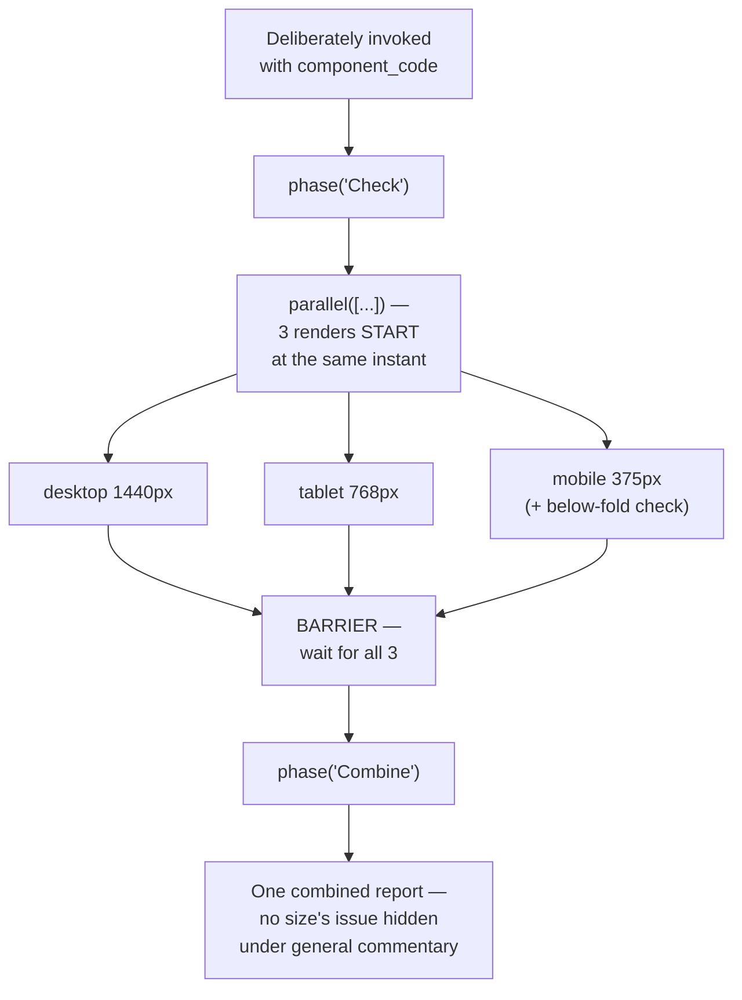

# Flow Diagram — `cross-size-component-check`

← [Back to case study](../README.md)

See [`workflow.md`](../workflow.md) for the real script this diagram traces, and [AI-Workflows Chapter 10](../../../tutorial/10-lifecycle-of-execution.md) for how the barrier step actually behaves at runtime.

---

← [Back to case study](../README.md)
