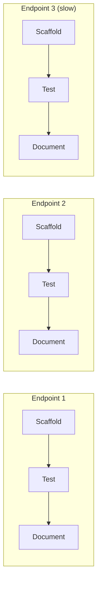

# Flow Diagram — `endpoint-scaffold-test-document`

← [Back to case study](../README.md)

No barrier anywhere in this diagram — endpoint 1 can reach `Document` while endpoint 3 is still on `Scaffold`. See [`workflow.md`](../workflow.md) for the real script, and compare this shape directly against [Case Study 1's](../../01-frontend-workflow/assets/flow-diagram.md) barrier to see [Chapter 4](../../../tutorial/04-parallel-vs-pipeline.md)'s core distinction in two real diagrams.

---

← [Back to case study](../README.md)
