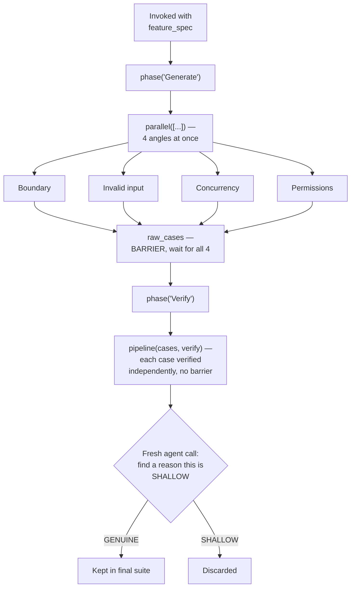

# Flow Diagram — `multi-angle-test-case-generation`

← [Back to case study](../README.md)

See [`workflow.md`](../workflow.md) for the real script, and [the case study](../README.md#what-went-wrong-the-first-time) for why the `V` step's exact wording — "find a reason this is SHALLOW," not "confirm this is good" — is what actually catches the false-coverage risk.

---

← [Back to case study](../README.md)
