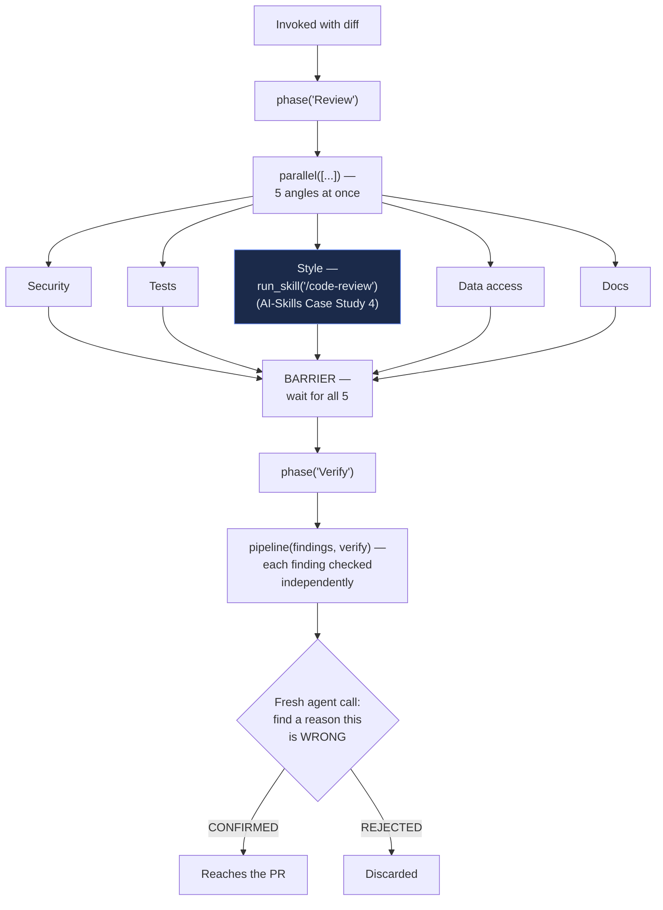

# Flow Diagram — `pr-five-angle-review` v1.1.0

← [Back to case study](../README.md)

The `STYLE` box is the literal, diagrammed proof of this case study's whole point — see [`workflow.md`](../workflow.md) for the real script, and [AI-Skills Case Study 4](../../../../AI-Skills/case-studies/04-code-review-skill/README.md) for the skill it calls.

---

← [Back to case study](../README.md)
