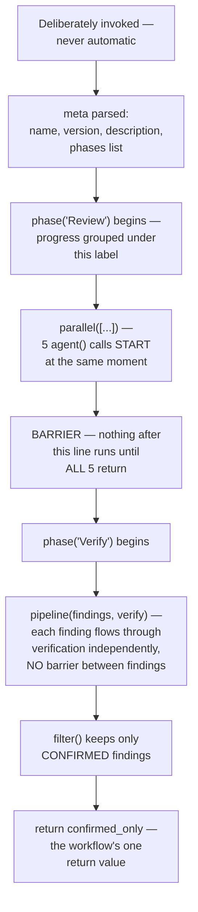

# Chapter 10 — The Execution Lifecycle

← [Chapter 9 — Governance and Capstone](09-governance-and-capstone.md) · [Learning path](../learning-path.md) · Next: [Case Studies →](../case-studies/README.md)

A bonus chapter, not part of the original nine — but worth reading before the case studies, because it traces, in order, everything that happens when a real workflow runs.

---

## Where you left off

Your five-angle review workflow is finished, tested, shared, and governed against runaway cost. Rahul asks one more question before the case studies:

> "You've built it, and you can predict its output. But if I asked you to trace exactly what the system is doing, moment to moment, from the second someone runs this to the second it returns — including what happens if one stage fails — could you?"

You realize you've reasoned about the workflow's *shape* — phases, parallel, pipeline — but never actually walked through its *runtime*, step by step, including the parts that don't show up in the pseudocode.

---

## What you'll learn

1. The full sequence from invocation to return value, for a real multi-phase workflow.
2. What actually happens, moment to moment, inside a `parallel()` barrier and inside a `pipeline()`.
3. What happens when a stage fails partway through — and why that answer is different for parallel and pipeline.

---

## The lesson

### The one fact everything else follows from

A workflow only exists at runtime because someone or something **deliberately invoked it.** Unlike a skill, there's no listening-for-a-match step happening in the background. Per [Chapter 8](08-packaging-and-sharing.md), that's not an accident — it's the whole reason a workflow's cost stays under someone's control. The lifecycle below only starts once that deliberate invocation has already happened.

### The full sequence, traced against the five-angle review

Walk through each stage in order, the way you'd actually watch it happen.

**1. Invocation.** Someone runs the workflow — by name, with a real diff as input. Nothing before this moment exists at runtime; the script itself is just text until this point.

**2. `meta` is read.** Name, version, description, and — critically — the `phases` list, which exists purely so a progress view can group what's about to happen under human-readable labels. `meta` never decides *what* runs; it just names what's coming.

**3. `phase("Review")` begins.** This is a label, not an action — everything that runs until the next `phase()` call gets grouped under "Review" in whatever is watching this run.

**4. `parallel([...])` starts all 5 calls at once.** This is the moment that actually matters most in this whole trace. All 5 `agent()` calls — security, tests, style, data access, docs — begin **at the same instant**, not one after another. None of them knows anything about what the others are doing.

**5. The barrier.** Nothing after the `parallel()` call runs until **every single one** of the 5 calls has returned. If 4 finish in ten seconds and the fifth takes ninety, the whole workflow waits the full ninety seconds before moving on — this is the literal runtime cost [Chapter 4](04-parallel-vs-pipeline.md) taught you to weigh deliberately, not the cost of a mistake.

**6. `phase("Verify")` begins.** A new label. Everything from here groups under "Verify."

**7. `pipeline(findings, verify)` — no barrier this time.** Each of the (up to) 5 raw findings flows through its own verification call independently. Finding #1's verification can finish and move on while finding #4's is still running. This is the direct runtime contrast to step 5 — same workflow, two genuinely different execution shapes, back to back.

**8. `filter()` keeps only `CONFIRMED` findings.** A plain, synchronous step — no new agent calls, just discarding what verification rejected.

**9. `return`.** The workflow produces exactly one value, handed back to whatever invoked it. Nothing about the workflow persists after this — the next invocation starts completely fresh at step 1, with no memory of this run.

### What happens when a stage fails

This is the part the pseudocode alone never shows you, and it's genuinely different for `parallel()` and `pipeline()`.

**Inside a `parallel()` barrier:** if one of the 5 angle-review calls throws — a real error, not just "found nothing" — the barrier still has to resolve for the workflow to continue. A failed thunk inside `parallel()` resolves to `null` rather than crashing the whole run. That means step 5's wait is for all 5 to *settle*, not all 5 to *succeed* — and anything reading the results afterward needs to filter out `null` before treating the list as findings, or a failed angle silently looks identical to "found nothing," which is a real, worth-knowing gap between what happened and what the output implies.

**Inside a `pipeline()`:** if verification throws for one specific finding, only *that finding's* remaining stages are skipped — it drops out of the results, but the other findings continue through their own stages completely unaffected. This is a direct, useful consequence of pipeline's "no barrier" design from Chapter 4: a failure in one item's path was never going to block any other item's path, because they were never synchronized to begin with.

### Tracing the cost-cap fallback from Chapter 9

One more path worth tracing explicitly: what actually happens, in order, when [Chapter 9](09-governance-and-capstone.md)'s `MAX_FILES` cap is exceeded. Invocation happens, `meta` loads, `phase("Review")` begins — and then, *before* any `parallel()` or `pipeline()` call ever starts, the cap check runs, finds the input too large, and the workflow returns its explained fallback message immediately. No angle-review calls ever fire. No cost is spent beyond the cap check itself. That's the entire value of putting the check at the very start of the phase, before any real work begins — tracing the lifecycle this precisely is what makes it obvious *why* the cap has to sit exactly there, and not somewhere later where cost would already have been spent before the fallback ever triggered.

---

## Try it yourself

Take a workflow you've built — your own five-angle review, or the config-discrepancy example from earlier chapters. Trace it the way this chapter traced the five-angle review: write down, in order, every `phase()`, every `parallel()`/`pipeline()` call, and what would happen at each one if a single stage inside it failed. Confirm your workflow's actual behavior matches what you predicted — especially the `null`-on-failure case inside any `parallel()` call.

---

## What's still missing

Nothing, for a workflow's lifecycle — you've now traced a real, multi-phase run start to end, including its failure paths.

What you haven't seen is this same kind of trace for an **agent**, where the sequence doesn't have a fixed length at all, and where the trace itself has to account for a loop that might run once or might run to its full budget. [AI-Agents Chapter 10](../../AI-Agents/tutorial/10-lifecycle-of-execution.md) is exactly that.

For now: the [case studies](../case-studies/README.md) are next, each one now including a real, ready-to-use workflow script you can trace through this exact lifecycle yourself.

---

← [Chapter 9 — Governance and Capstone](09-governance-and-capstone.md) · [Learning path](../learning-path.md) · Next: [Case Studies →](../case-studies/README.md)
