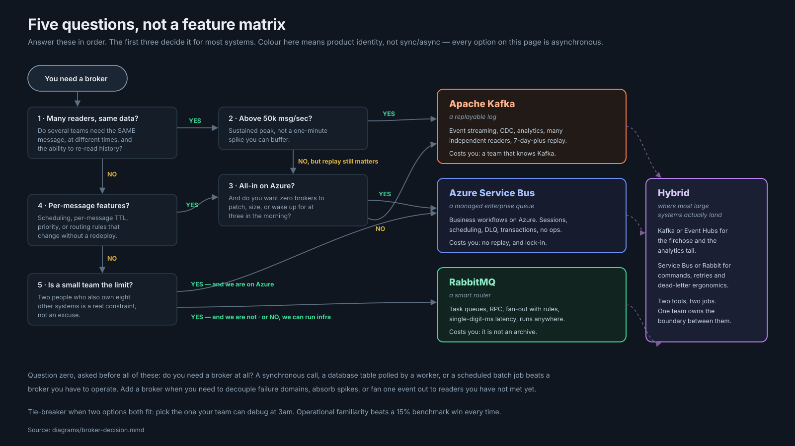

# Messaging Systems — Kafka vs Azure Service Bus vs RabbitMQ

Three brokers, one honest comparison. Written for engineers who have to pick one, run it, and be woken up by it.

Plain English throughout. Every technical term is explained the first time it appears. Every code example gives you the **algorithm in words first**, then the C# — because the algorithm is the part that transfers.

---

## Start here

| You are | Read this | Time |
|---|---|---|
| **"I'm building X — what do I use?"** | [Choose by workload](docs/tutorial.md#17a-choose-by-workload) — 18 workload types, with the reasoning | 5 min |
| **Picking a broker this week** | [One-page summary](docs/summary-one-page.md) → [decision checklist](cheatsheet/decision-checklist.md) | 15 min |
| **Wanting to see the difference concretely** | [One problem, three ways](docs/tutorial.md#17b-one-problem-three-ways) — same requirement on all three | 10 min |
| **Justifying a choice to someone** | [What actually decides it](docs/tutorial.md#17d-the-constraints-that-decide-more-than-features-do) — team, scale, exit cost | 10 min |
| **Suspecting you chose wrong** | [Signals your decision expired](docs/tutorial.md#17e-wrong-reasons-anti-patterns-and-knowing-when-you-were-wrong) | 8 min |
| **Wanting to not choose yet** | [Dapr](docs/dapr.md) — one API over all three, and what it hides | 30 min |
| **New to messaging** | [Tutorial, Part I](docs/tutorial.md#part-i--foundations), then the one system you will use | 45 min |
| **Designing a real system** | [Case study](docs/case-study-ecommerce.md) — three architectures, scored | 35 min |
| **Interviewing (either side)** | [40 questions](docs/interview-qa.md) with collapsible answers, tagged by role | 60 min |
| **On call tonight** | [Runbooks](runbooks/) and [30 real incidents](docs/production-incidents.md) | as needed |
| **Building it** | [C# samples](code/csharp/) — algorithm first, then code | 30 min |
| **Setting up alerts** | [Monitoring](docs/monitoring.md) — queries, dashboards, thresholds with reasoning | 25 min |

---

## TL;DR

- **Kafka is a log you can rewind.** Nothing is deleted when read, so ten teams read the same event independently and you can replay last Tuesday. Costs you a team that knows Kafka.
- **Azure Service Bus is a managed queue with enterprise manners.** Sessions, scheduling, per-message TTL, dead-lettering and transactions are broker features you do not build. Costs you replay and raw throughput.
- **RabbitMQ is a smart router.** The exchange decides where copies go, so you rewire consumers without touching publishers. Costs you archival — a queue is a working set, not a store.
- **All three deliver at-least-once in practice.** Exactly-once exists only inside Kafka, Kafka-to-Kafka. Everything real is at-least-once plus an idempotency key. Build for duplicates or meet them in production.
- **Most large systems end up hybrid** — a firehose broker plus a command broker. Fine when it is a decision with a written boundary; a mess when it is an accident.

---

## Choosing, in five questions



1. **Several teams need the same message, at different times, with history?** Yes → 2. No → 4.
2. **Sustained peak above ~50k msg/sec?** Yes → **Kafka**. No, but replay matters → 3.
3. **All-in on Azure, want zero brokers to operate?** Yes → **Service Bus**. No → **Kafka**.
4. **Need per-message scheduling, TTL, priority, or routing that changes without a redeploy?** Yes → 3. No → 5.
5. **Small ops team a hard constraint?** Yes + Azure → **Service Bus**. Yes, not Azure → **RabbitMQ**. No → **RabbitMQ**.

**Question zero:** do you need a broker at all? A synchronous call, a database table polled by a worker, or a scheduled batch job beats a broker you have to operate.

**Tie-breaker:** pick the one your team can debug at 3am. Operational familiarity beats a 15% benchmark win every time.

---

## How the folders are organised

```
Messaging-Systems/
├── README.md                    ← you are here (the map)
│
├── docs/                        ← the reading material
│   ├── tutorial.md              ← THE MAIN DOCUMENT — 25 sections, all three brokers
│   ├── case-study-ecommerce.md  ← global e-commerce backbone, three architectures scored
│   ├── interview-qa.md          ← 40 questions, collapsible answers, role-tagged
│   ├── production-incidents.md  ← 30 real incidents, 10 per broker
│   ├── monitoring.md            ← Prometheus, Grafana, alert rules with reasoning
│   └── summary-one-page.md      ← paste into a design doc or slide
│
├── images/                      ← EVERY image lives here, nowhere else
│   ├── svg/                     ← 4 hand-authored, dark, annotated
│   └── png/                     ← 1600×900 exports (gitignored, regenerate)
│
├── diagrams/                    ← Mermaid sources, .mmd, GitHub renders them inline
│
├── code/csharp/                 ← 6 files: producer + consumer per broker
│                                  every file opens with the algorithm in plain English
│
├── k8s/                         ← Strimzi CRs, Bitnami values, Azure Service Operator
│
├── runbooks/                    ← one per broker: triage, incidents, routine procedures
│
├── cheatsheet/                  ← print these two
│   ├── cheat-sheet.md
│   └── decision-checklist.md
│
└── scripts/render-diagrams.sh   ← .mmd → SVG + PNG
```

This mirrors the layout of [`../MicroServices/`](../MicroServices/), so the two folders read as one body of work.

---

## Generated assets

Every file, with a direct link.

### Documents

| File | Contents |
|---|---|
| [`docs/tutorial.md`](docs/tutorial.md) | **The main document.** Foundations, then all three brokers across 12 headings each, then comparison, idempotency, outbox, schema evolution, consumer groups, migration, references |
| [`docs/dapr.md`](docs/dapr.md) | **Dapr** — the sidecar abstraction over all three: components per broker, CloudEvents, resiliency, the transactional outbox, what each broker loses, vs MassTransit/NServiceBus |
| [`docs/case-study-ecommerce.md`](docs/case-study-ecommerce.md) | Requirements, three candidate architectures, trade-off scoring, implementation plan, SLOs, incident runbook, cost model, migration plan |
| [`docs/interview-qa.md`](docs/interview-qa.md) | 40 questions — 15 beginner, 15 intermediate, 10 advanced |
| [`docs/production-incidents.md`](docs/production-incidents.md) | 30 incidents with symptoms, root cause, detection, mitigation, long-term fix |
| [`docs/monitoring.md`](docs/monitoring.md) | PromQL, KQL, Grafana panels, alert rules |
| [`docs/summary-one-page.md`](docs/summary-one-page.md) | Export-friendly one-pager |

### Diagrams

| Mermaid source | Rendered image | Shows |
|---|---|---|
| [`diagrams/kafka-architecture.mmd`](diagrams/kafka-architecture.mmd) | [`images/svg/kafka-architecture.svg`](images/svg/kafka-architecture.svg) *(hand-authored)* | Brokers, partitions, leaders/followers, consumer groups, tiered storage |
| [`diagrams/azure-service-bus-architecture.mmd`](diagrams/azure-service-bus-architecture.mmd) | [`images/svg/azure-service-bus-architecture.svg`](images/svg/azure-service-bus-architecture.svg) *(hand-authored)* | Topic, filtered subscriptions, sessions, DLQ, Geo-DR |
| [`diagrams/rabbitmq-architecture.mmd`](diagrams/rabbitmq-architecture.mmd) | [`images/svg/rabbitmq-architecture.svg`](images/svg/rabbitmq-architecture.svg) *(hand-authored)* | Exchange types, bindings, quorum queues, DLX, the TTL retry trick |
| [`diagrams/broker-decision.mmd`](diagrams/broker-decision.mmd) | [`images/svg/broker-decision.svg`](images/svg/broker-decision.svg) *(hand-authored)* | The five questions |
| [`diagrams/delivery-semantics.mmd`](diagrams/delivery-semantics.mmd) | renders inline in [`tutorial.md`](docs/tutorial.md#2-delivery-semantics) | At-most-once vs at-least-once vs effectively-once |
| [`diagrams/case-study-kafka.mmd`](diagrams/case-study-kafka.mmd) | renders inline in [`case-study-ecommerce.md`](docs/case-study-ecommerce.md) | Architecture A |
| [`diagrams/case-study-azure.mmd`](diagrams/case-study-azure.mmd) | renders inline | Architecture B |
| [`diagrams/case-study-rabbitmq.mmd`](diagrams/case-study-rabbitmq.mmd) | renders inline | Architecture C |
| [`diagrams/migration-strangler.mmd`](diagrams/migration-strangler.mmd) | renders inline | Four-phase migration |
| [`diagrams/dapr-architecture.mmd`](diagrams/dapr-architecture.mmd) | renders inline in [`dapr.md`](docs/dapr.md) | Sidecar, component config, and what the abstraction hides |

The four hand-authored SVGs are dense and annotated; the Mermaid companions carry the same structure in a form GitHub renders inline and diffs cleanly. Both are checked in — see [`images/README.md`](images/README.md) for the colour semantics and how to regenerate.

### Code

| File | Teaches |
|---|---|
| [`code/csharp/kafka-producer.cs`](code/csharp/kafka-producer.cs) | Idempotent producer, `acks=all`, keys and partitioning, transactional read-process-write |
| [`code/csharp/kafka-consumer.cs`](code/csharp/kafka-consumer.cs) | Manual commits, cooperative rebalancing, bounded retry, hand-built DLQ |
| [`code/csharp/azure-producer.cs`](code/csharp/azure-producer.cs) | Sessions, batching, scheduled messages, topology as code |
| [`code/csharp/azure-consumer.cs`](code/csharp/azure-consumer.cs) | Lock renewal, all four settlement outcomes, session sagas, DLQ drain |
| [`code/csharp/rabbitmq-producer.cs`](code/csharp/rabbitmq-producer.cs) | Publisher confirms, `mandatory` + returns, quorum queues, **the outbox pattern** |
| [`code/csharp/rabbitmq-consumer.cs`](code/csharp/rabbitmq-consumer.cs) | Prefetch, manual ack, the TTL retry queue, `x-death` triage |
| [`code/csharp/dapr-publisher.cs`](code/csharp/dapr-publisher.cs) | Broker-agnostic publish, partition keys, bulk publish, raw payload, the Dapr outbox |
| [`code/csharp/dapr-subscriber.cs`](code/csharp/dapr-subscriber.cs) | SUCCESS/RETRY/DROP semantics, CloudEvents, dead letter topics |
| [`code/csharp/README.md`](code/csharp/README.md) | How to run them, package versions, local brokers |

### Infrastructure and operations

| File | Contents |
|---|---|
| [`k8s/kafka-helm-values.yaml`](k8s/kafka-helm-values.yaml) | Strimzi node pools, topics as code, ACLs, MirrorMaker 2, PDB |
| [`k8s/rabbitmq-helm-values.yaml`](k8s/rabbitmq-helm-values.yaml) | Bitnami values: quorum queues, watermarks, probes, alert rules |
| [`k8s/azure-service-bus-operator.md`](k8s/azure-service-bus-operator.md) | ASO custom resources, workload identity, KEDA, Private Link, Geo-DR |
| [`k8s/dapr-components.yaml`](k8s/dapr-components.yaml) | The same app on all three brokers: components, subscriptions, resiliency, outbox, sidecar annotations |
| [`runbooks/kafka-runbook.md`](runbooks/kafka-runbook.md) | 7 incidents + routine procedures + escalation |
| [`runbooks/rabbitmq-runbook.md`](runbooks/rabbitmq-runbook.md) | 7 incidents + routine procedures + escalation |
| [`runbooks/azure-runbook.md`](runbooks/azure-runbook.md) | 7 incidents + **what you cannot do**, which matters more here |
| [`cheatsheet/cheat-sheet.md`](cheatsheet/cheat-sheet.md) | Vocabulary, settings, metrics, CLI, sizing rules |
| [`cheatsheet/decision-checklist.md`](cheatsheet/decision-checklist.md) | Questions to answer before coding, red flags, sign-off table |
| [`scripts/render-diagrams.sh`](scripts/render-diagrams.sh) | `.mmd` → SVG + PNG; `--check` mode for CI |

---

## The five things that are true of all three

1. **At-least-once is the contract.** Build idempotent consumers, or meet duplicates in production.
2. **Dual writes do not work.** Saving to a database and publishing a message are two operations that can half-fail. Use the outbox pattern.
3. **The DLQ needs an owner and an alert at depth > 0**, or it is a place messages go to die quietly.
4. **Ordering costs parallelism.** Always. Decide the smallest unit that actually needs it.
5. **Pick the one your team can debug at 3am.** Operational familiarity beats a 15% benchmark win.

---

## Regenerating the diagrams

```bash
./scripts/render-diagrams.sh            # everything
./scripts/render-diagrams.sh case-study # only files matching "case-study"
./scripts/render-diagrams.sh --check    # CI gate: fail if a .mmd has no image
```

Requires Node 18+. The four hand-authored SVGs are skipped so they are never machine-overwritten. PNG export of those needs `pip install cairosvg` — optional, since the SVGs render fine on GitHub.

---

## Assumptions and freshness

Product behaviour, quotas and prices were checked in **July 2026**, against Kafka 3.9 (KRaft), RabbitMQ 4.x (quorum queues), and Azure Service Bus Premium. Vendor limits move. Verify against the live docs before putting money or an SLA behind any number here — the [full assumptions list](docs/tutorial.md#assumptions) is at the top of the tutorial.

Licensed MIT. See [`LICENSE`](LICENSE) for what is original and what summarises vendor documentation.
