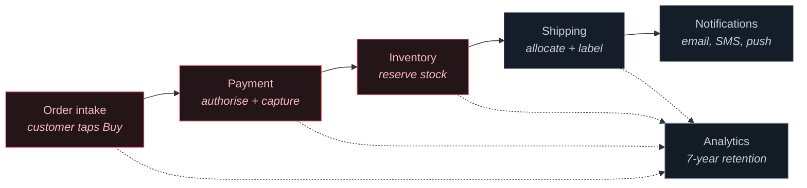
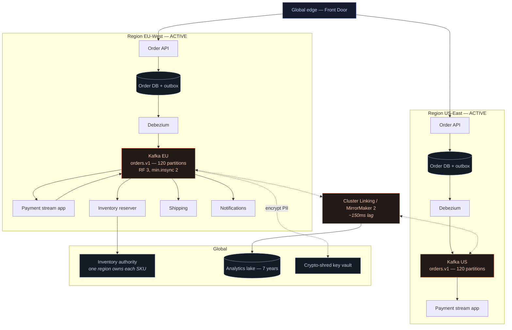
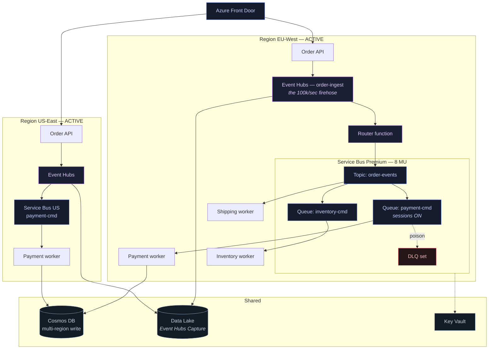
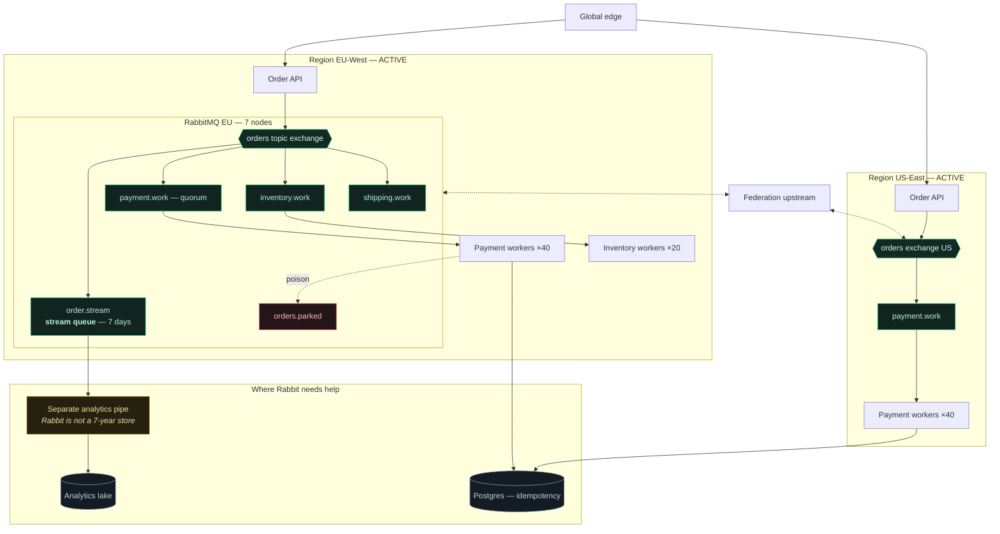
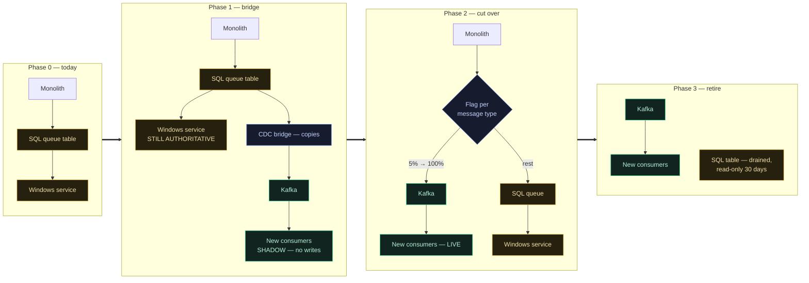

# Case Study — Messaging Backbone for a Global E-commerce Platform

A complete design exercise. Three candidate architectures, scored against real requirements, with the reasoning shown — including where each one fails.

**Reading time: 35 minutes.** If you only read two things, read [the trade-off table](#3-trade-off-analysis) and [the recommendation](#the-recommendation).

---

## 1. Requirements

### The business

A retailer selling in EU, US and APAC. Peak is Black Friday: **100,000 events/sec** across the platform, roughly 12× a normal Tuesday. Order value ranges from €5 to €50,000. Regulated in the EU (GDPR), handling card data (PCI DSS).

### The pipeline



Red is the critical path — the customer is waiting. The rest can be eventually consistent.

### Non-functional requirements, prioritised

Prioritisation is the whole exercise. Everything cannot be P0.

| # | Requirement | Priority | Measurable target |
|---|---|---|---|
| 1 | **No lost orders** | **P0** | Zero order loss. An accepted order is always fulfilled or explicitly cancelled. |
| 2 | **No double charges** | **P0** | Zero duplicate payment captures. |
| 3 | Peak throughput | P0 | 100k events/sec sustained for 4 hours |
| 4 | Critical-path latency | P0 | Order → payment authorised: **p99 < 1s** |
| 5 | Multi-region availability | P0 | Survive losing one region entirely |
| 6 | GDPR erasure | P0 | Delete all personal data within 30 days of request |
| 7 | PCI DSS scope | P0 | Card data never enters the messaging layer |
| 8 | Analytics retention | P1 | 7 years, queryable |
| 9 | Disaster recovery | P1 | **RTO 15 min, RPO 60s** for order data |
| 10 | Inventory consistency | P1 | Oversell < 0.1% of units, always reconcilable |
| 11 | Non-critical latency | P2 | Shipping and notifications within 5 min |
| 12 | Cost | P2 | Under $50k/month for messaging infrastructure |

### The requirements that decide the architecture

Three of these do more work than the others:

**#1 + #2 together** rule out any design that treats delivery as fire-and-forget, and they force the outbox pattern plus idempotent consumers. They are not achievable through broker configuration alone — that is the single most important realisation in this document.

**#8 (7-year retention)** rules out Service Bus as the *only* broker. Its maximum TTL is 14 days. No configuration changes that.

**#3 (100k/sec)** rules out RabbitMQ as the *only* broker and rules out Service Bus for the firehose.

Everything else is a trade-off. Those three are constraints.

### Explicit non-requirements

Worth stating, because they save considerable engineering:

- **Global ordering.** Not required. Per-order ordering is sufficient. This is the difference between a feasible and an infeasible design.
- **Synchronous inventory for every item.** Only for the ~2% of SKUs that are genuinely scarce. The rest can be eventually consistent and reconciled.
- **Real-time analytics.** Five-minute lag to the warehouse is fine.
- **Zero RPO across regions.** Impossible with async replication. 60 seconds is agreed and written down.

---

## 2. Three candidate architectures

Each is designed as if it were the answer, then evaluated honestly.

### Architecture A — Kafka-centric



*Source: [`../diagrams/case-study-kafka.mmd`](../diagrams/case-study-kafka.mmd)*

**Components**

| Component | Choice | Why |
|---|---|---|
| Order intake | API → Postgres + outbox table | Order durability is a database guarantee, not a broker one |
| Outbox → Kafka | Debezium CDC | No dual write, no polling, publishes from the transaction log |
| Event backbone | Kafka, 6 brokers/region, 120 partitions | 120 = 100k/sec ÷ ~1.6k per consumer, ×2 headroom |
| Payment | Kafka Streams, exactly-once v2 | Kafka-to-Kafka transactions are genuine here |
| Inventory | Consumer keyed by SKU + global authority for scarce items | Per-SKU ordering, synchronous only where it must be |
| Analytics | Kafka Connect → Parquet in object storage | 7 years at object-storage prices |
| Cross-region | Cluster Linking | Offsets translated, not identical — duplicates on failover are expected |
| GDPR | Per-customer key encryption; destroy the key to erase | Kafka is append-only; this is the standard answer |

**How #1 and #2 are met**

- **No lost orders:** the order row and the outbox row commit in one database transaction. If Kafka is entirely down, orders still succeed and publish when it returns.
- **No double charges:** payment consumer uses a deterministic idempotency key (`order-123:capture`) with a unique constraint, in the same transaction as the capture record.

**Where it hurts**

- **No native DLQ.** Dead-lettering, retry backoff and triage are all application code — roughly 2–3 weeks of work you would get free elsewhere.
- **No scheduling.** "Remind the customer in 24 hours" needs an external scheduler.
- **Operational weight.** A serious multi-region Kafka estate is 1–1.5 FTE, and that is the real cost line.
- **Partition count is a one-way door.** 120 chosen now; lowering it later is not possible.

---

### Architecture B — Azure-native



*Source: [`../diagrams/case-study-azure.mmd`](../diagrams/case-study-azure.mmd)*

**The key design decision:** Service Bus alone cannot do 100k/sec or 7-year retention. So this architecture uses **two Azure products**: Event Hubs for the firehose and the analytics tail, Service Bus for the commands.

That is not a workaround — it is the correct Azure-native design, and it is why "Azure-native" does not mean "Service Bus only".

| Component | Choice | Why |
|---|---|---|
| Ingest | Event Hubs, 100 partitions | Kafka-compatible, priced for firehose volume |
| Analytics | Event Hubs Capture → ADLS Parquet | Automatic, no code, no Connect cluster |
| Commands | Service Bus Premium, 8 MU | Sessions, DLQ, scheduling as broker features |
| Payment ordering | Session-enabled queue, `SessionId = orderId` | Per-order ordering with saga state in the session |
| Idempotency | Cosmos DB, multi-region write | The dedupe store must be global |
| Retry / DLQ | Native `MaxDeliveryCount` + `$DeadLetterQueue` | Zero code |
| Scheduling | `ScheduleMessageAsync` | One line, no timer service |
| Cross-region | Independent namespaces + Front Door | **Not Geo-DR** — that replicates metadata only |

**Where it hurts**

- **Two Azure products** to understand, with different semantics and different scaling models.
- **Event Hubs is not full Kafka** — no compaction, no transactions, no Connect. If a team assumes otherwise, they find out late.
- **Lock-in.** Genuine and total. Migrating off is a rewrite.
- **Latency.** Service Bus p99 of 100–200 ms eats a real slice of the 1-second budget.
- **Cost is a step function.** 8 MU → 16 MU doubles the bill with no intermediate step.

---

### Architecture C — RabbitMQ-centric



*Source: [`../diagrams/case-study-rabbitmq.mmd`](../diagrams/case-study-rabbitmq.mmd)*

**The honest framing:** this architecture is included because the brief asked for it, and because working through it is instructive. **It does not meet the requirements**, and the reasons are worth understanding precisely.

| Component | Choice | Assessment |
|---|---|---|
| Routing | Topic exchange with hierarchical keys | **Excellent.** Best routing story of the three. |
| Work queues | Quorum queues, bounded | Solid |
| Ordering | Consistent-hash exchange by `orderId` | Works; a plugin rather than a core feature |
| Replay | Stream queues, 7 days | Partial — 7 days, not 7 years |
| Analytics | **A separate pipeline entirely** | Rabbit cannot do this. This is the tell. |
| DLQ | Dead-letter exchange + `x-death` | **Excellent** audit trail |
| Cross-region | Federation | Sound |

**Where it fails, specifically**

1. **100k/sec.** Achievable only by sharding across 4–5 federated clusters. That is five clusters to operate, and the routing between them becomes your problem.
2. **7-year retention.** Not possible. Stream queues do 7 days comfortably. The analytics requirement needs an entirely separate pipeline — at which point you have two systems anyway, and the second one is doing the thing Kafka does natively.
3. **The memory watermark risk at this scale.** One deep queue blocks publishers cluster-wide. At Black Friday volume, that is a checkout outage caused by a telemetry backlog. This exact failure is described in [`tutorial.md`](tutorial.md#16c-rabbitmq--real-world-production-scenarios).

**What it would genuinely be good at:** the command side. If the firehose lived elsewhere, RabbitMQ would handle payment, inventory and shipping queues extremely well — with better routing and lower latency than Service Bus.

---

## 3. Trade-off analysis

Scored 1–5 against the prioritised requirements. **P0 failures are marked, because they are disqualifying rather than merely low-scoring.**

| # | Requirement | Pri | A: Kafka | B: Azure | C: RabbitMQ |
|---|---|---|---|---|---|
| 1 | No lost orders | P0 | 5 — outbox + RF3 | 5 — outbox + managed | 5 — outbox + quorum |
| 2 | No double charges | P0 | 5 — idempotency | 5 — idempotency + dup detection | 5 — idempotency |
| 3 | 100k events/sec | P0 | **5** | **5** (Event Hubs) | **2 — needs 5 federated clusters** |
| 4 | p99 < 1s critical path | P0 | 5 — ~50ms broker | 3 — ~200ms broker | 5 — ~15ms broker |
| 5 | Multi-region | P0 | 4 — Cluster Linking | 4 — independent namespaces | 3 — federation |
| 6 | GDPR erasure | P0 | 3 — crypto-shredding needed | 5 — transient by design | 4 — transient |
| 7 | PCI scope | P0 | 5 — tokens only | 5 | 5 |
| 8 | 7-year retention | P1 | **5 — tiered storage** | **5 — Capture → ADLS** | **1 — impossible** |
| 9 | RTO 15m / RPO 60s | P1 | 4 | 4 | 3 |
| 10 | Inventory consistency | P1 | 5 — keyed ordering | 4 — sessions | 4 — consistent-hash |
| 11 | Non-critical < 5 min | P2 | 5 | 5 | 5 |
| 12 | Cost < $50k/month | P2 | 4 — ~$18k + 1.5 FTE | 3 — ~$32k, no FTE | 4 — ~$12k + 1 FTE |
| — | **Operational burden** | — | **2 — highest** | **5 — lowest** | 3 |
| — | **Portability** | — | 5 | **1 — total lock-in** | 5 |
| — | **Time to first production** | — | 2 — ~4 months | **4 — ~2 months** | 3 — ~3 months |

**Totals: A = 64, B = 66, C = 52.** The totals are close and mostly beside the point — **C fails two P0/P1 requirements outright**, and a failed constraint is not compensated by a good score elsewhere.

### What the table does not show

**Kafka's weakest column is DLQ ergonomics**, and that is 2–3 weeks of engineering plus ongoing maintenance. It does not appear in the requirements, so it does not score — but it is real.

**Azure's weakest column is latency**, and 200 ms of a 1-second budget is a lot to spend on transport when the payment provider call is also in there.

**RabbitMQ's strongest column is routing**, and nothing in the requirements rewards it. That is a fair reflection of this problem, not of RabbitMQ.

---

## The recommendation

### Hybrid — Kafka (or Event Hubs) for the stream, Service Bus for the commands

Neither pure architecture is best. The system has **two shapes of traffic**, and forcing them onto one broker means rebuilding the other's strengths in application code.

```mermaid
flowchart LR
    subgraph FIRE["The firehose — 100k/sec"]
        direction TB
        F1["Order events"]
        F2["Clickstream"]
        F3["Inventory changes"]
        F4["CDC from legacy"]
    end

    subgraph CMD["The commands — ~3k/sec"]
        direction TB
        C1["Capture payment"]
        C2["Reserve stock"]
        C3["Allocate shipment"]
        C4["Send notification"]
    end

    K["<b>Kafka / Event Hubs</b><br/>replay · fan-out · 7-year tail<br/>many readers, one log"]
    S["<b>Service Bus</b><br/>sessions · scheduling · DLQ<br/>transactions · retry"]
    BRIDGE["Router<br/><i>one owner, idempotent</i>"]

    FIRE --> K
    K --> BRIDGE --> S
    S --> CMD
    K --> LAKE[("Analytics — 7 years")]

    classDef kafka fill:#221A16,stroke:#FF7A45,color:#F7C9B4
    classDef asb   fill:#161C2E,stroke:#6C8EF5,color:#C3D2FA
    classDef br    fill:#1A1F33,stroke:#B980F0,color:#DCC9F7
    class K kafka
    class S asb
    class BRIDGE br
```



**The boundary rule**, written down so a new engineer can apply it without asking:

> **An event that many services observe, and that anyone might want to replay → Kafka.**
> **A command with one owner, retry semantics and a dead-letter path → Service Bus.**

**Why this wins**

| Requirement | Solved by |
|---|---|
| 100k/sec + 7-year retention | Kafka / Event Hubs — natively |
| Per-order workflow, sessions, saga state | Service Bus — natively |
| DLQ, retry, scheduling | Service Bus — **zero code**, versus 2–3 weeks on Kafka |
| p99 < 1s | Critical path is Kafka (~50 ms); Service Bus carries the non-critical tail |
| Replay | Kafka |
| Operational burden | Event Hubs + Service Bus = near-zero. Self-hosted Kafka = 1.5 FTE. |

**What it costs**

- Two systems, two failure modes, two on-call runbooks
- A bridge component — the highest-risk part of the design
- A boundary that must be enforced, or it decays into "whatever the team knew"

**The four rules that keep it sane**

1. The boundary is written down and applied without asking.
2. **One team owns the bridge.**
3. The bridge is idempotent in both directions and **copies rather than moves**.
4. The operational cost of two brokers is counted honestly, not waved away.

### If you must pick one

- **On Azure, ops capacity is the constraint** → **Architecture B**. It meets every P0. Accept the latency and the lock-in.
- **Portability or scale is the constraint** → **Architecture A**. Accept the DLQ engineering and the FTE.
- **Neither** → **not C**. It fails two requirements that are not negotiable.

---

## 4. Implementation plan

Fourteen weeks to production for the hybrid.

### Milestones

| Phase | Weeks | Deliverable | Exit criteria |
|---|---|---|---|
| **0 — Foundations** | 1–2 | Infra as code, both brokers in non-prod, CI/CD | `terraform apply` builds a full environment from nothing |
| **1 — Contracts** | 2–4 | Schemas, topic/queue topology, idempotency store | Schema registry live; **idempotency test passing** |
| **2 — Order intake** | 4–6 | Order API + outbox + CDC → Kafka | Orders survive a full broker outage |
| **3 — Payment** | 6–9 | Payment consumer, sessions, DLQ, retry | **Zero double charges under chaos testing** |
| **4 — Inventory + shipping** | 9–11 | Remaining consumers, inventory authority | Oversell < 0.1% under load |
| **5 — Analytics** | 11–12 | Capture / Connect → lake, 7-year lifecycle | Query returns data from the load test |
| **6 — Hardening** | 12–14 | Chaos, load, failover drill, runbooks | **All chaos scenarios pass; DR drill under 15 min** |

**Phase 1's exit criterion is the one that matters.** If the idempotency test does not exist before Phase 3, nobody will discover a broken idempotency check by accident — they will discover it as a double charge.

### Testing strategy

**Functional.** Testcontainers for Kafka; a real Service Bus Standard namespace, since the emulator lacks sessions and transactions.

**Idempotency (explicit, not implied).** Deliver the same message twice, assert one side effect. **This test gates Phase 3.** Without it, the P0 requirement is a hope.

**Load.** 200k events/sec — 2× peak — sustained for four hours. Measure p99 end-to-end, not throughput averages. Watch lag *stability*, not peak rate. Run against production-sized infrastructure or the numbers mean nothing.

**Chaos — the tests that find real bugs.** Each must pass with zero order loss and zero double charges:

| Scenario | Expected behaviour |
|---|---|
| Kill one Kafka broker mid-load | Writes continue (min.insync=2) |
| Kill two brokers on one partition | Writes **rejected**, not silently lost |
| Kill a consumer mid-message | Redelivered, deduped, one side effect |
| Network partition between regions | Both regions serve locally; replication catches up |
| Slow the payment API to 30s | Locks renew; no rebalance storm; no duplicate captures |
| Inject a poison message | Dead-lettered within 5 attempts; partition keeps moving |
| Fill a broker disk | Degrades and alerts; does not silently drop |
| Fail an entire region | RTO under 15 min; RPO under 60s |

The "slow the payment API" test finds more production bugs than the rest combined.

**Soak.** 72 hours at 30% load. Finds connection leaks, memory creep, offset-retention surprises and certificate expiry.

### Rollout

**Canary by percentage, feature-flagged per message type.**

| Stage | Traffic | Duration | Rollback trigger |
|---|---|---|---|
| Shadow | 100% shadowed, **0% authoritative** | 1 week | Any output mismatch |
| Canary | 1% | 2 days | Error rate > 0.1% |
| Ramp | 10% → 50% | 1 week | p99 > 1s, or any duplicate charge |
| Full | 100% | — | Same |
| Retire legacy | — | 30 days later | — |

**Shadow mode is not optional.** New consumers process, compute, compare — and **do not write**. Discrepancies found here are free; found in production they are refunds.

**Blue/green for the brokers, canary for the consumers.** Broker upgrades are all-or-nothing per cluster; consumer changes are the ones that benefit from gradual exposure.

**Never canary during a peak event.** The flag exists so you can go to 0% in seconds. Test that path before you need it.

---

## 5. SLOs and monitoring

### Service level objectives

| SLO | Target | Error budget | Measured as |
|---|---|---|---|
| Order acceptance availability | 99.95% | 21 min/month | Successful order submissions ÷ attempts |
| Order → payment authorised | p99 < 1s | 1% over | End-to-end trace |
| Order → shipped notification | p99 < 5 min | 1% over | End-to-end trace |
| Order loss | **0** | **None** | Orders in DB vs orders fulfilled or cancelled |
| Duplicate charges | **0** | **None** | Payment provider reconciliation |
| Analytics freshness | < 5 min | 5% over | Lake watermark vs event time |

The two zero-budget SLOs are business commitments, not engineering targets. Any breach is an incident review regardless of duration.

### The dashboards

**1 — Business health** (the one on the wall)
Orders/min vs the same day last week · end-to-end p50/p99 · failed orders · DLQ depth across all queues · payment success rate

**2 — Broker health**
Kafka: under-replicated partitions, offline partitions, controller count, disk, request handler idle %
Service Bus: throttled requests, CPU, active connections, active + dead-lettered message counts

**3 — Consumer health**
Lag per group per partition · processing rate · error rate · rebalance frequency · **estimated time to drain**

Time-to-drain is the number to put in front of an incident commander. "Lag is 400,000" means nothing to them. "We will be caught up in 12 minutes" is a decision they can act on.

**4 — Cost**
Messaging units · Kafka storage growth · cross-region transfer · operations/month on Service Bus

Full queries and alert rules: [`monitoring.md`](monitoring.md).

### Alert rules that page

| Alert | Condition | Severity |
|---|---|---|
| Order loss detected | Orders in DB without a matching event, > 0 | **P1 — page** |
| Duplicate charge detected | Reconciliation mismatch, > 0 | **P1 — page** |
| Offline partitions | > 0 for 1 min | **P1 — page** |
| Publishers blocked | Any connection blocked 1 min | **P1 — page** |
| Critical path p99 | > 1s for 5 min | P2 — page |
| Consumer lag | Time-to-drain > 15 min | P2 — page |
| DLQ depth | > 0 for 15 min | P3 — ticket |
| Throttling | > 0 for 5 min | P3 — ticket |

**Everything that pages must have a runbook entry.** An alert without a documented response is a notification, not an alert.

---

## 6. Incident runbook — major outage

### Scenario: EU Kafka cluster loses quorum during Black Friday

**Symptoms.** Offline partitions > 0 in EU. Order API returning 500s. Payment consumers idle. US unaffected.

**Impact.** EU checkout is down. ~60% of peak revenue. Every minute is material.

#### T+0 — Confirm and declare (2 min)

```bash
kubectl -n kafka get pods -l strimzi.io/cluster=orders-kafka
kx bin/kafka-topics.sh --bootstrap-server $BS --describe --unavailable-partitions
```

Declare a Sev-1. Incident commander, comms lead, two engineers. Start the timeline document immediately — reconstructing it afterwards is always worse.

#### T+2 — Stop the bleeding (5 min)

**The orders are not lost.** The outbox pattern means they are in Postgres. Kafka being down stops *propagation*, not *acceptance*.

```bash
# Confirm the API is still accepting and writing to the outbox
curl -s https://api-eu/health/orders | jq .outbox_writable
```

If the API is failing because it waits on Kafka, **that is a bug** — the outbox is meant to decouple exactly this. Disable the synchronous publish path:

```bash
kubectl -n orders set env deploy/order-api PUBLISH_MODE=outbox-only
```

Orders now accumulate in the outbox and drain when Kafka returns. **Checkout is restored.** This step alone converts an outage into a delay.

#### T+7 — Decide: recover or fail over

| Option | RTO | Data loss | When |
|---|---|---|---|
| **A. Restore brokers** | 10–30 min | None | Brokers are recoverable |
| **B. Fail EU traffic to US** | 5 min | None; latency +80 ms | Brokers unrecoverable, US has capacity |
| **C. Unclean leader election** | 2 min | **Yes** | Last resort, needs sign-off |

**Try A first, prepare B in parallel.** Do not consider C until A has clearly failed.

```bash
# A
kubectl -n kafka describe pod orders-kafka-broker-2
kubectl -n kafka logs orders-kafka-controller-0 --tail=100
kx df -h /var/lib/kafka/data     # disk full is the most common cause

# B — prepared in parallel, executed only if A fails
az network front-door routing-rule update --set backendPools.eu.enabled=false
```

#### T+15 — If A and B both fail

Option C loses data. It requires a **named business decision-maker**, not an engineer:

```bash
# LAST RESORT. This loses records. Note the exact time.
kx bin/kafka-leader-election.sh --bootstrap-server $BS \
  --election-type UNCLEAN --all-topic-partitions
```

Then immediately reconcile from the outbox — that is the authoritative record, which is precisely why the pattern exists.

#### T+30 — Recovery

1. Confirm all partitions online and under-replicated back to 0
2. Restore `PUBLISH_MODE=normal`
3. Watch the outbox drain — **expect a large lag spike, and do not panic**
4. Verify no duplicate charges (idempotency should have absorbed them; verify, do not assume)
5. Re-enable EU traffic gradually — 10%, 50%, 100%

#### T+24h — Review

Blameless. Required outputs: timeline, root cause, **why detection took as long as it did**, and specific action items with owners and dates. "Improve monitoring" is not an action item.

### Other scenarios

| Scenario | Playbook |
|---|---|
| Consumer backlog explosion | [Kafka runbook §2](../runbooks/kafka-runbook.md#incident-2--consumer-lag-climbing) |
| Publishers blocked | [RabbitMQ runbook §1](../runbooks/rabbitmq-runbook.md#incident-1--publishers-blocked) |
| Service Bus throttling | [Azure runbook §1](../runbooks/azure-runbook.md#incident-1--throttling) |
| Poison message storm | [Tutorial §18](tutorial.md#18-dead-letter-handling-and-poison-messages) |
| Region loss | This document, option B |

---

## 7. Cost model

*Indicative, July 2026. Verify before committing budget.*

### Self-hosted Kafka + Service Bus (the recommendation, self-hosted variant)

| Item | Spec | Monthly |
|---|---|---|
| Kafka brokers | 12 × (8 vCPU, 32 GB, 1 TB SSD), 2 regions | $9,600 |
| Kafka controllers | 6 × (2 vCPU, 8 GB) | $600 |
| Cross-region replication | ~15 TB/month egress | $1,500 |
| Object storage (7-year tail) | ~400 TB, cool tier | $4,000 |
| Service Bus Premium | 8 MU × 2 regions | $10,400 |
| Cosmos DB (idempotency) | Multi-region, 20k RU/s | $2,900 |
| Monitoring | Managed Prometheus + Grafana | $800 |
| **Infrastructure** | | **$29,800** |
| **Engineering** | 1.5 FTE @ $150k | **$18,750** |
| **Total** | | **$48,550** |

### Fully managed (Event Hubs + Service Bus)

| Item | Spec | Monthly |
|---|---|---|
| Event Hubs Premium | 8 PU × 2 regions | $16,000 |
| Event Hubs Capture | Included in Premium | $0 |
| Data Lake storage | ~400 TB, cool | $4,000 |
| Service Bus Premium | 8 MU × 2 regions | $10,400 |
| Cosmos DB | Multi-region, 20k RU/s | $2,900 |
| Monitoring | Azure Monitor | $600 |
| **Infrastructure** | | **$33,900** |
| **Engineering** | 0.25 FTE | **$3,125** |
| **Total** | | **$37,025** |

### The comparison people get wrong

Fully managed is **$11,500/month cheaper** once engineering is counted honestly — and it reaches production two months sooner.

Self-hosted looks cheaper on infrastructure alone ($29,800 vs $33,900) and that is the number that ends up in most spreadsheets. Adding the engineer reverses the conclusion entirely.

### The cost drivers to watch

| Driver | Risk | Control |
|---|---|---|
| **Cross-region transfer** | Grows with replication; easy to forget | Replicate only what the other region needs |
| **Object storage growth** | 7 years compounds | Lifecycle policies; hot → cool → archive |
| **Service Bus operations** | On Standard, empty receives are billed | Premium's flat fee, or long polling |
| **Messaging units** | Step function — 8→16 doubles the bill | Scale consumers before scaling the namespace |
| **Idle Kafka capacity** | Sized for Black Friday, running in February | Tiered storage; scale brokers seasonally |

**Peak versus steady state.** Black Friday needs 100k/sec; a normal Tuesday needs 8k. Sizing everything for peak wastes roughly 11 months of capacity. Managed services scale with a config change; self-hosted Kafka rebalancing takes hours and must be planned. That flexibility is worth real money and rarely appears in the comparison.

---

## 8. Migration from the legacy system

**Starting point.** A .NET monolith with a SQL Server table used as a queue: `INSERT` a row, a Windows service polls every 5 seconds, `UPDATE` status when done. It works, it does ~2,000 orders/hour, and it will not survive Black Friday.

**The principle: never migrate messages. Migrate producers and consumers.**



### Phase 0 — Prerequisites (weeks 1–2)

**Idempotency first.** The bridge in Phase 1 *will* produce duplicates. Consumers must handle them before the bridge exists, not after.

- [ ] Idempotency store live, with the double-delivery test passing
- [ ] Message schemas defined and registered
- [ ] Both brokers in production, monitored
- [ ] Runbooks written and walked through

### Phase 1 — Bridge and shadow (weeks 3–6)

Debezium reads the SQL Server transaction log on the existing queue table and publishes to Kafka. **The monolith is not modified.** That is the whole appeal: no risk to the working system.

The Windows service remains authoritative. New consumers run in shadow — process, compute, compare, **do not write**.

**Exit criterion: 99.9% output match over one week, with every discrepancy explained.** Not "mostly matching". An unexplained discrepancy is a bug you are about to ship.

### Phase 2 — Cut over (weeks 7–12)

Feature flag per message type, least critical first:

| Order | Type | Why this order |
|---|---|---|
| 1 | Notifications | Lowest blast radius; a missed email is recoverable |
| 2 | Analytics events | No customer impact at all |
| 3 | Shipping | Eventually consistent already |
| 4 | Inventory | Reconcilable if wrong |
| 5 | **Payment** | **Last. Money.** |

Each: 5% for two days → 50% for three days → 100% for one week before the next type.

**Watch a full business cycle between steps.** A weekday-only canary misses weekend batch behaviour, and month-end finds things nothing else does.

### Phase 3 — Retire (weeks 13–14)

1. Stop writing to the SQL queue table
2. Let the Windows service drain it to zero
3. Keep the table read-only for **30 days** as a rollback path
4. Decommission the service
5. Delete the bridge, the flags and the shadow code

Step 5 matters. Migration scaffolding left in place becomes permanent, and in two years nobody will remember whether it is load-bearing.

### Rollback

| Phase | Rollback | Time |
|---|---|---|
| 1 | Turn off the bridge. Nothing else changes. | 1 min |
| 2 | Flip the flag. Old consumers still running. | **30 seconds** |
| 3 | Restart the Windows service, re-enable writes | 15 min |
| Post-3 | **No rollback.** | — |

**Do not enter Phase 3** until the new system has survived a full business cycle including a month-end, a peak day, and at least one real incident.

### The traps specific to this migration

| Trap | Mitigation |
|---|---|
| The SQL table has no message ids | Generate deterministic ids from the row key in the bridge |
| Ordering was implicit (`ORDER BY id`) | Map to a Kafka partition key. **Verify the ordering unit matches.** |
| The monolith reads the queue table for reporting | Find every reader before dropping the table. There is always one nobody mentioned. |
| Retry logic lives in the Windows service | Rebuild it explicitly. Do not assume it was correct. |
| Nobody knows the current failure rate | **Measure it in Phase 0.** Without a baseline you cannot tell whether you improved anything. |

That last one is the most common and the most expensive. Teams migrate, something looks wrong, and nobody can say whether it was wrong before.

---

## Appendix — the decisions and why

| Decision | Chosen | Rejected | Because |
|---|---|---|---|
| Broker strategy | Hybrid | Single broker | Two traffic shapes; forcing one means rebuilding the other in app code |
| Order durability | Outbox + CDC | Direct publish | Dual writes half-fail; no retry logic fixes that |
| Ordering unit | Per order | Global; per customer | Global kills parallelism; per customer creates partition skew |
| Exactly-once | Effectively-once | Kafka transactions end to end | Transactions do not span the database. Say so. |
| Multi-region | Active-active, independent clusters | Stretched cluster; Geo-DR | Stretched clusters false-partition. Geo-DR loses in-flight messages. |
| Inventory | Global authority for scarce SKUs only | Fully distributed; fully centralised | Distributed oversells; centralised adds latency to 98% that do not need it |
| GDPR | Crypto-shredding | Deletion | Kafka is append-only. Destroy the key. |
| Analytics | Object storage via Capture/Connect | Kafka retention | Cheaper by an order of magnitude at 7 years |
| Scaling | KEDA on queue depth | HPA on CPU | A worker blocked on a slow API uses no CPU while the backlog grows |
| Deployment | Managed where possible | Self-hosted everything | The FTE costs more than the infrastructure |

---

*Concepts: [`tutorial.md`](tutorial.md) · Operations: [`../runbooks/`](../runbooks/) · Code: [`../code/csharp/`](../code/csharp/) · Infrastructure: [`../k8s/`](../k8s/)*
