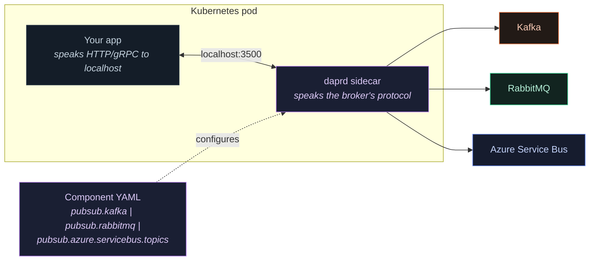

# Dapr — the abstraction layer over all three

**Reading time: 30 minutes.** If you read one section, read [what you give up](#4-what-you-give-up-per-broker) — it is the part that decides whether Dapr is right for you.

---

## The one-line version

> **Dapr is not a broker.** It is a sidecar [a second container running beside your app in the same pod] that gives you one API for publish and subscribe, with the actual broker chosen in a YAML file.

Your code says `PublishEventAsync("pubsub", "orders", order)`. Whether that lands in Kafka, Azure Service Bus or RabbitMQ is decided by a config file you can change without recompiling anything.

That is genuinely useful, and it is not free. This document is mostly about the price.

---

## Contents

1. [What Dapr actually is](#1-what-dapr-actually-is)
2. [The pub/sub building block](#2-the-pubsub-building-block)
3. [What Dapr gives you for free](#3-what-dapr-gives-you-for-free)
4. [What you give up, per broker](#4-what-you-give-up-per-broker)
5. [The CloudEvents envelope — the surprise everyone hits](#5-the-cloudevents-envelope--the-surprise-everyone-hits)
6. [Operational reality](#6-operational-reality)
7. [Dapr vs MassTransit vs NServiceBus](#7-dapr-vs-masstransit-vs-nservicebus)
8. [When to use Dapr, and when not to](#8-when-to-use-dapr-and-when-not-to)
9. [The tension with "do not build a lowest-common-denominator facade"](#9-the-tension-with-do-not-build-a-lowest-common-denominator-facade)

---

## 1. What Dapr actually is

Dapr (Distributed Application Runtime) is a set of **building blocks** [standard APIs for things every distributed app needs] exposed over local HTTP and gRPC by a sidecar process called `daprd`.



*Source: [`../diagrams/dapr-architecture.mmd`](../diagrams/dapr-architecture.mmd). Purple is the abstraction layer — the same colour this repo's sibling [`../../MicroServices/`](../../MicroServices/) uses for Dapr and service meshes.*

### The building blocks that touch messaging

| Block | What it does | Relevance here |
|---|---|---|
| **Pub/sub** | Publish and subscribe over any supported broker | **The subject of this document** |
| **Bindings** | Trigger on, or send to, external systems (queues, blob, cron, HTTP) | An alternative to pub/sub for point-to-point |
| **State store** | Key/value with optional transactions | Hosts the **transactional outbox** — see Section 3 |
| **Workflow** | Durable, code-first orchestration | A saga alternative to Service Bus sessions |
| **Actors** | Virtual actors with turn-based concurrency | Per-entity ordering without partition keys |
| **Configuration, secrets, locks** | Supporting infrastructure | Not messaging, but they arrive with the sidecar |

You can adopt pub/sub alone. Most teams do, and it is the sensible entry point.

### Supported message brokers

Dapr has components for far more than the three in this tutorial — Kafka, RabbitMQ, Azure Service Bus (topics and queues), Redis Streams, NATS JetStream, Pulsar, AWS SNS/SQS, GCP Pub/Sub, MQTT, in-memory, and more.

That breadth is the selling point and also the constraint: **an API that must work across all of them can only expose what they have in common.**

---

## 2. The pub/sub building block

### A component per broker

The same application code runs against any of these. Only the YAML changes.

**Kafka**

```yaml
apiVersion: dapr.io/v1alpha1
kind: Component
metadata:
  name: pubsub                    # ← your code refers to this NAME, never to Kafka
spec:
  type: pubsub.kafka
  version: v1
  metadata:
    - name: brokers
      value: "orders-kafka-bootstrap:9092"
    - name: consumerGroup
      value: "payments-service"   # the Kafka consumer group
    - name: authType
      value: "password"
    - name: saslMechanism
      value: "SCRAM-SHA-512"
    - name: saslUsername
      secretKeyRef: { name: kafka-auth, key: username }
    - name: saslPassword
      secretKeyRef: { name: kafka-auth, key: password }
    - name: maxMessageBytes
      value: "1048576"
```

**RabbitMQ**

```yaml
apiVersion: dapr.io/v1alpha1
kind: Component
metadata:
  name: pubsub                    # ← same name. Your code does not change.
spec:
  type: pubsub.rabbitmq
  version: v1
  metadata:
    - name: connectionString
      secretKeyRef: { name: rabbit-auth, key: connectionString }
    - name: durable
      value: "true"
    - name: deliveryMode
      value: "2"                  # persistent
    - name: prefetchCount
      value: "20"                 # the setting from tutorial §12c, exposed here
    - name: requeueInFailure
      value: "false"              # do NOT requeue blindly — see tutorial §5c
```

**Azure Service Bus**

```yaml
apiVersion: dapr.io/v1alpha1
kind: Component
metadata:
  name: pubsub                    # ← same name again
spec:
  type: pubsub.azure.servicebus.topics
  version: v1
  metadata:
    - name: namespaceName
      value: "orders-sb-eu.servicebus.windows.net"
    - name: azureClientId          # workload identity — no connection string
      value: "00000000-0000-0000-0000-000000000000"
    - name: maxDeliveryCount
      value: "5"
    - name: lockDurationInSec
      value: "60"
    - name: maxConcurrentHandlers
      value: "16"
```

Full manifests including subscriptions, resiliency and the outbox: [`../k8s/dapr-components.yaml`](../k8s/dapr-components.yaml).

**This is the whole pitch.** Three brokers, one application. Change `spec.type`, restart the pod, and you are on a different broker.

### Publishing

```csharp
// No broker SDK. No broker types. No connection management.
await _dapr.PublishEventAsync("pubsub", "orders", order, ct);
```

Compare that with the ~120 lines of configuration and error handling in [`../code/csharp/kafka-producer.cs`](../code/csharp/kafka-producer.cs). The reduction is real.

Broker-specific behaviour that *does* survive is passed as metadata:

```csharp
var metadata = new Dictionary<string, string>
{
    ["partitionKey"] = order.OrderId,   // Kafka partition / Service Bus session id
    ["ttlInSeconds"] = "86400",         // per-message TTL where the broker supports it
};
await _dapr.PublishEventAsync("pubsub", "orders", order, metadata, ct);
```

`partitionKey` is the important one: it is how you keep the per-entity ordering that Section 3 of the tutorial says you almost always need.

### Subscribing — three ways

**Declarative** (a Kubernetes resource; the app just exposes an endpoint):

```yaml
apiVersion: dapr.io/v2alpha1
kind: Subscription
metadata:
  name: order-events
spec:
  pubsubname: pubsub
  topic: orders
  deadLetterTopic: orders-dlq      # ← DLQ on every broker, including Kafka
  routes:
    rules:
      - match: 'event.type == "OrderPlaced"'
        path: /orders/placed
      - match: 'event.type == "OrderCancelled"'
        path: /orders/cancelled
    default: /orders/unknown
scopes:
  - payment-service                 # only this app receives it
```

Those `match` rules are **content-based routing on every broker** — including Kafka, which has none natively. Dapr evaluates them in the sidecar, so it costs you a delivery you then discard, but the application-level ergonomics match Service Bus filters.

**Programmatic** — the app returns its subscriptions from `/dapr/subscribe` at startup.

**Streaming** — the app opens a bidirectional stream and pulls, rather than having messages pushed at an HTTP endpoint. Better flow control; worth preferring for high-throughput consumers.

---

## 3. What Dapr gives you for free

These are the reasons to adopt it beyond portability, and they are underrated.

### Dead-letter topics on every broker

```yaml
deadLetterTopic: orders-dlq
```

One line. On Service Bus and RabbitMQ this maps onto native mechanisms. **On Kafka it gives you something Kafka does not have** — the DLQ that [tutorial §18](tutorial.md#18-dead-letter-handling-and-poison-messages) says you otherwise build yourself, and which [§17b](tutorial.md#17b-one-problem-three-ways) prices at 2–3 weeks of engineering.

If you are on Kafka and were going to build DLQ plumbing anyway, that is a genuine, quantifiable saving.

### Declarative resiliency

Retries, timeouts and circuit breakers as configuration rather than code:

```yaml
apiVersion: dapr.io/v1alpha1
kind: Resiliency
metadata:
  name: messaging-resiliency
spec:
  policies:
    retries:
      backoff:
        policy: exponential
        maxInterval: 30s
        maxRetries: 5
    circuitBreakers:
      failFast:
        maxRequests: 1
        interval: 30s
        timeout: 60s
        trip: consecutiveFailures > 10
  targets:
    components:
      pubsub:
        inbound:
          retry: backoff
          circuitBreaker: failFast
```

The circuit breaker is the part worth noting. Hand-written consumers rarely have one, and it is exactly what stops a failing downstream dependency from burning your entire retry budget.

### The transactional outbox

Dapr implements the pattern from [tutorial §19](tutorial.md#19-idempotency--the-pattern-that-makes-everything-else-safe) inside the state store:

```yaml
spec:
  type: state.postgresql
  metadata:
    - name: outboxPublishPubsub
      value: "pubsub"
    - name: outboxPublishTopic
      value: "orders"
```

Write state through Dapr in a transaction, and the message publishes atomically with it. **This is the single most valuable thing Dapr offers a team that has not built an outbox**, because dual writes are the failure mode people do not notice until an order silently vanishes.

Caveat worth stating: it couples your persistence to Dapr's state API. If your data access is EF Core with a rich domain model, you will likely keep your own outbox table and use the pattern from [`../code/csharp/rabbitmq-producer.cs`](../code/csharp/rabbitmq-producer.cs) instead.

### Other things that arrive with it

- **mTLS between sidecars**, on by default — encrypted service-to-service traffic with no application change
- **Secret references** in components, so no credentials in YAML
- **Consistent observability** — OpenTelemetry traces spanning publish and subscribe, across languages, without instrumenting each broker client
- **Bulk publish and subscribe** for throughput-sensitive paths
- **Scopes**, so a component is only visible to named apps

---

## 4. What you give up, per broker

**This is the section that decides it.** The Dapr API is the intersection of what every supported broker can do. Whatever made you choose your broker is at risk of being exactly what the abstraction hides.

| Native capability | Under Dapr |
|---|---|
| **Kafka** — manual offset control, seek, replay to a timestamp | **Lost.** Dapr manages offsets. No offset reset, no "reprocess from Tuesday". |
| **Kafka** — transactions / exactly-once within Kafka | **Lost.** No transactional producer API. |
| **Kafka** — consumer group rebalance tuning, static membership, partition assignment strategy | **Mostly lost.** Component metadata exposes a subset; the fine control from [§21](tutorial.md#21-consumer-group-management) is not there. |
| **Kafka** — partition key | **Kept** via `partitionKey` metadata |
| **Kafka** — log compaction | **Kept** (a topic property, not an API concern) |
| **Service Bus** — sessions and session state | **Historically unsupported or partial.** Verify against your Dapr version before designing around it. If ordered sagas with session state are the reason you chose Service Bus, this is disqualifying. |
| **Service Bus** — scheduled messages (`ScheduleMessageAsync`) | **Not exposed as a first-class API.** The scheduling that [§16b](tutorial.md#16b-service-bus--real-world-production-scenarios) calls a one-line win is not straightforwardly available. |
| **Service Bus** — `Defer`, explicit `DeadLetter` with a custom reason | **Reduced.** You get ack/nack semantics, not the four-outcome model from [§5b](tutorial.md#5b-service-bus--definition-and-core-concepts). |
| **Service Bus** — SQL subscription filters | **Replaced**, not kept. Dapr routing rules run in the sidecar, so you pay the delivery and then discard. |
| **Service Bus** — duplicate detection | Component metadata, where supported |
| **RabbitMQ** — exchange types, custom bindings, routing keys | **Largely lost.** Dapr manages its own topology. The routing flexibility that is RabbitMQ's main advantage is the thing the abstraction flattens. |
| **RabbitMQ** — priority queues | **Lost.** Nothing in the Dapr API expresses priority. |
| **RabbitMQ** — publisher confirms, `mandatory` + returns | Handled internally; not yours to control |
| **All three** — the native client's full error taxonomy | **Lost.** You see Dapr errors, not `ProduceException` or `ServiceBusFailureReason`. |

### The rule this produces

> **Dapr is a good fit when you chose your broker for reasons Dapr preserves, and a bad fit when you chose it for reasons Dapr hides.**

Worked through:

| You chose | Because | Dapr verdict |
|---|---|---|
| **Kafka** | Throughput and fan-out | ✅ Both preserved |
| **Kafka** | Replay and reprocessing | ❌ **Offset control is gone.** Do not use Dapr. |
| **Kafka** | Exactly-once stream processing | ❌ No transaction API |
| **Service Bus** | Zero ops, managed | ✅ Preserved — and Dapr adds a sidecar to operate, which partly undoes the reason |
| **Service Bus** | Sessions, scheduling, four-outcome settlement | ❌ **The reasons you chose it are the ones hidden** |
| **RabbitMQ** | Simple work queues, low latency | ✅ Fine |
| **RabbitMQ** | Routing flexibility, priority | ❌ **Flattened by the abstraction** |
| **Any** | You genuinely do not know which broker yet | ✅ **The strongest case for Dapr** |

Note the pattern: the two strongest single-broker reasons — Kafka replay and Service Bus sessions — are both incompatible with Dapr. That is not a coincidence. Broker-defining features are broker-specific by definition, and abstractions remove what is specific.

---

## 5. The CloudEvents envelope — the surprise everyone hits

By default, Dapr wraps your payload in a **CloudEvents** envelope [a CNCF standard for describing an event]. You publish this:

```json
{ "orderId": "order-123", "total": 49.99 }
```

A native consumer reading the same topic sees this:

```json
{
  "id": "5929aaac-a5e2-4ca1-859c-edfe73f11565",
  "source": "order-api",
  "type": "com.dapr.event.sent",
  "specversion": "1.0",
  "datacontenttype": "application/json",
  "data": { "orderId": "order-123", "total": 49.99 },
  "pubsubname": "pubsub",
  "topic": "orders",
  "traceid": "00-58e0f3b6...-01"
}
```

**Consequences that catch people:**

1. **A non-Dapr consumer on the same topic breaks.** It expects your payload and receives an envelope. This is the number one problem in mixed Dapr/native estates.
2. **Message size grows** by a few hundred bytes — irrelevant for 10 KB orders, significant for a 200-byte telemetry firehose at 100k/sec.
3. **Your idempotency key moves.** The CloudEvent `id` is Dapr's, not yours. Keep your own deterministic id **inside** `data` — the rule from [§19](tutorial.md#19-idempotency--the-pattern-that-makes-everything-else-safe) applies unchanged, and relying on the envelope `id` gives you a fresh value on every republish.
4. **The trace id is in the envelope**, which is genuinely useful — distributed tracing across languages with no work.

**Opting out:**

```csharp
var metadata = new Dictionary<string, string> { ["rawPayload"] = "true" };
await _dapr.PublishEventAsync("pubsub", "orders", order, metadata, ct);
```

Use `rawPayload` when Dapr and non-Dapr consumers share a topic. Understand that you then lose the tracing correlation the envelope was carrying.

**Decide this before the first message ships.** Changing envelope format on a live topic is a breaking schema change, and [§20](tutorial.md#20-schema-evolution-and-versioning) applies in full.

---

## 6. Operational reality

The sidecar is a real component with real costs. Budget for it honestly.

### Resource cost

| Item | Typical |
|---|---|
| Sidecar memory | 50–150 MB per pod |
| Sidecar CPU | 10–100 m idle, more under load |
| Added publish latency | Sub-millisecond to a few ms (a localhost hop) |
| Control plane | ~4 pods: operator, sentry, placement, sidecar-injector |

At 200 application pods that is roughly **10–30 GB of memory doing nothing but abstraction.** Sometimes worth it. Always worth counting.

### The failure modes that are Dapr's, not the broker's

**Startup ordering.** Your app can start before `daprd` is ready, and the first publishes fail. Handle it:

```yaml
annotations:
  dapr.io/enabled: "true"
  dapr.io/app-id: "order-api"
  dapr.io/app-port: "8080"
  dapr.io/sidecar-liveness-probe-delay-seconds: "10"
```

and retry the first publish in application code. Do not assume the sidecar is up.

**Shutdown ordering.** If `daprd` is killed before your app finishes in-flight work, those messages fail. Set `dapr.io/block-shutdown-duration` and a `terminationGracePeriodSeconds` that exceeds your longest handler.

**Version skew.** Control plane and sidecars are upgraded separately, and components are versioned per Dapr release. A cluster-wide Dapr upgrade touches every pod — treat it as a platform-wide change, not a routine bump.

**Three places to look.** Every incident now starts with "is it my code, the sidecar, or the broker?". The runbooks in [`../runbooks/`](../runbooks/) all assume you can reach the broker client directly; under Dapr, add a step to check sidecar logs first:

```bash
kubectl logs <pod> -c daprd --tail=100
kubectl get components -A                # is the component even loaded?
kubectl get subscriptions -A
curl localhost:3500/v1.0/healthz         # from inside the pod
```

**Component load failures are quiet.** A malformed component or an unresolvable secret means the sidecar starts and pub/sub simply does not work. Alert on it — this is the Dapr analogue of the "silence instead of failure" pattern that accounts for four of the [thirty incidents](production-incidents.md#what-repeats-across-all-thirty).

### Monitoring additions

On top of everything in [`monitoring.md`](monitoring.md), add:

| Metric | Why |
|---|---|
| `dapr_component_pubsub_egress_count` (by success/failure) | Publishes actually reaching the broker |
| `dapr_component_pubsub_ingress_count` | Deliveries to your handler |
| `dapr_http_server_request_count` on subscription paths | Whether your endpoint is being called at all |
| `dapr_resiliency_activations_total` | Retries and circuit-breaker trips — invisible otherwise |
| Sidecar restart count | Skew, OOM, or config problems |

That fourth row matters. Dapr's declarative retries are silent by design; without this metric, a service can be retrying constantly and looking healthy.

---

## 7. Dapr vs MassTransit vs NServiceBus

Dapr is not the only abstraction, and for a .NET team it is often not the first one to consider.

| | **Dapr** | **MassTransit** | **NServiceBus** |
|---|---|---|---|
| Form | Sidecar process | .NET library | .NET library + tooling |
| Languages | **Any** | .NET only | .NET only |
| Brokers | Very many | Rabbit, ASB, SQS, Kafka (rider) | Rabbit, ASB, SQS, MSMQ |
| Licence | Free (CNCF) | Free (Apache 2.0) | **Commercial** |
| Saga support | Workflow building block | **Excellent** | **Excellent** |
| Broker feature access | **Common subset** | Deeper — exposes native config | Deeper |
| Ops cost | Sidecar per pod | **None** — it is a NuGet package | None |
| Latency added | A localhost hop | **In-process** | In-process |
| Beyond messaging | State, secrets, actors, workflow | Messaging only | Messaging + monitoring tooling |
| Best when | **Polyglot, multi-cloud, portability is real** | **.NET shop wanting patterns without a sidecar** | .NET shop wanting commercial support |

**For a .NET-only team, MassTransit is usually the better default.** It gives you the retry, DLQ, saga and outbox patterns without adding a process to every pod, and it lets you reach native broker configuration when you need it. That is the failure mode Dapr struggles with.

**Dapr wins decisively when the estate is polyglot.** Six services in four languages all messaging identically, with one observability story, is worth a sidecar. A .NET monolith plus two .NET services is not.

---

## 8. When to use Dapr, and when not to

### Use Dapr when

- **The estate is polyglot.** One messaging API across .NET, Go, Python and Java is real value that a per-language library cannot give you.
- **Multi-cloud or hybrid is a genuine requirement**, not a hypothetical — you actually deploy to two clouds, or ship the same product to customers who run different infrastructure.
- **You genuinely do not know the broker yet.** Start on RabbitMQ in a container, change one YAML line to move to Kafka or Service Bus later. This is the strongest single case for Dapr.
- **You are on Kafka and want a DLQ, retries and an outbox** you were otherwise going to hand-build.
- **You want the other building blocks too** — state, secrets, actors, workflow. The sidecar cost amortises across several problems instead of one.
- **You are edge or IoT**, where the target infrastructure varies per deployment.

### Do not use Dapr when

- **You need the broker-defining features** — Kafka replay and offset control, Service Bus sessions and scheduling, RabbitMQ routing and priority. [Section 4](#4-what-you-give-up-per-broker) lists these precisely.
- **You are single-language and single-broker with no swap plan.** You are paying a sidecar for portability you will never use. Use the native client, or MassTransit.
- **Latency is genuinely critical.** The hop is small, but it is on every message and it is not zero.
- **The team is small.** Dapr is another runtime, another control plane, another upgrade cycle, another layer in every incident. A two-person team is usually better off knowing one broker deeply.
- **You are already deep in one broker's native features.** Retrofitting Dapr means giving them up.
- **Non-Dapr consumers share your topics** and you have not decided the CloudEvents question ([Section 5](#5-the-cloudevents-envelope--the-surprise-everyone-hits)).

### The tell that it is costing more than it saves

> **You are using Dapr, but reaching past it for native broker features.**

The moment you add a Kafka client alongside `DaprClient` to reset offsets, or a Service Bus SDK to use sessions, you are paying for the abstraction and not getting it. That is the signal to drop Dapr for that service and use the native client. It is not a failure; it is information, and acting on it early is much cheaper than acting on it late.

---

## 9. The tension with "do not build a lowest-common-denominator facade"

[Tutorial §17d](tutorial.md#17d-the-constraints-that-decide-more-than-features-do) says, about keeping migration affordable:

> *Abstract at the boundary, not the API. Wrap publish and consume behind your own interface. Do not build a lowest-common-denominator façade over all three — you lose exactly the features you chose the broker for.*

Dapr **is** a lowest-common-denominator façade over all three. So is that advice wrong, or is Dapr?

Neither. Three things change the calculation:

1. **You did not build it.** The warning is about the cost of *building and maintaining* a façade — a nontrivial internal project that becomes someone's job forever. Dapr is maintained by a CNCF community, and that is a genuinely different proposition from your own abstraction layer.
2. **It gives back more than portability.** The outbox, DLQ-on-Kafka, declarative resiliency and cross-language tracing are things you would otherwise build regardless of portability. A façade that only abstracts is pure cost; one that also supplies patterns can pay for itself.
3. **The warning still holds where it hurts.** "You lose exactly the features you chose the broker for" is precisely the [Section 4](#4-what-you-give-up-per-broker) table. Dapr does not escape it — it makes the trade explicit and lets you decide with open eyes.

**The synthesis:**

> Do not build your own broker abstraction. If you need one, adopt a maintained one — and only if the features you chose your broker for survive it.

If nothing you value survives the abstraction, the honest answer is not a better abstraction. It is one broker, used natively, and the migration plan in [§22](tutorial.md#22-migration) if you ever need to move.

---

## Code and manifests in this repo

| File | Contents |
|---|---|
| [`../code/csharp/dapr-publisher.cs`](../code/csharp/dapr-publisher.cs) | Publishing, partition keys, bulk publish, raw payload, the outbox |
| [`../code/csharp/dapr-subscriber.cs`](../code/csharp/dapr-subscriber.cs) | Declarative and programmatic subscriptions, ack/retry/drop, idempotency, DLQ handling |
| [`../k8s/dapr-components.yaml`](../k8s/dapr-components.yaml) | Components for all three brokers, subscriptions, resiliency, outbox state store |
| [`../diagrams/dapr-architecture.mmd`](../diagrams/dapr-architecture.mmd) | The sidecar diagram above |

---

## A note on version drift

Dapr moves faster than the brokers underneath it. **Component metadata options, and which native features are exposed, change between releases** — several capabilities listed as missing in [Section 4](#4-what-you-give-up-per-broker) have been partially added over time, and more will be.

The architectural points in this document are stable: a sidecar costs resources, an abstraction exposes an intersection, and hiding the feature you chose your broker for is a bad trade. **The specific capability list is not stable.** Check the [Dapr pub/sub component reference](https://docs.dapr.io/reference/components-reference/supported-pubsub/) for your exact version before designing around any single row.

Checked against Dapr 1.15, July 2026.

---

*Concepts: [`tutorial.md`](tutorial.md) · Decision framework: [`tutorial.md#17a`](tutorial.md#17a-choose-by-workload) · Broader Dapr context in the sibling folder: [`../../MicroServices/tutorial/04-choosing-a-broker.md`](../../MicroServices/tutorial/04-choosing-a-broker.md)*
