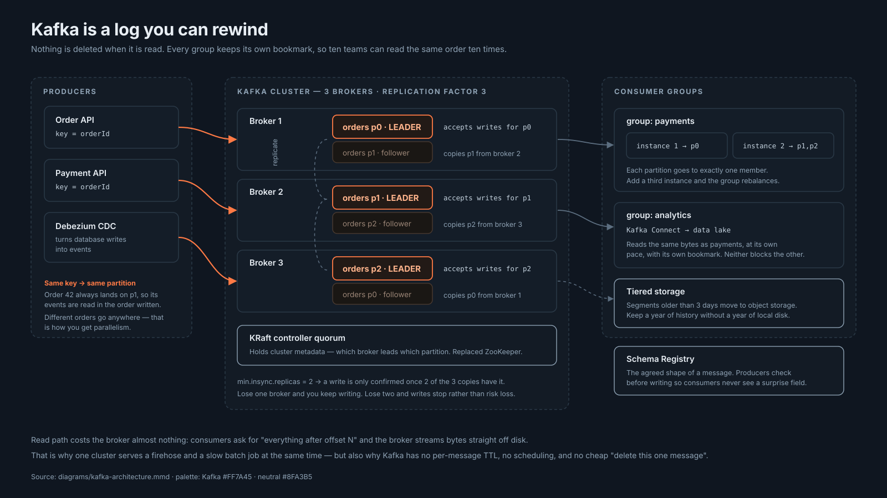
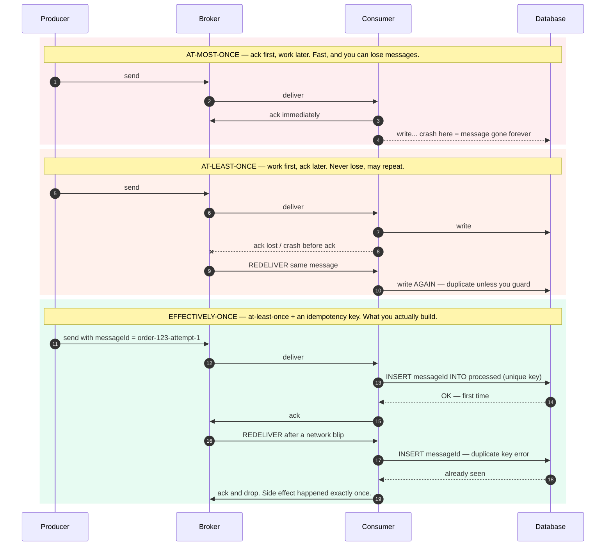
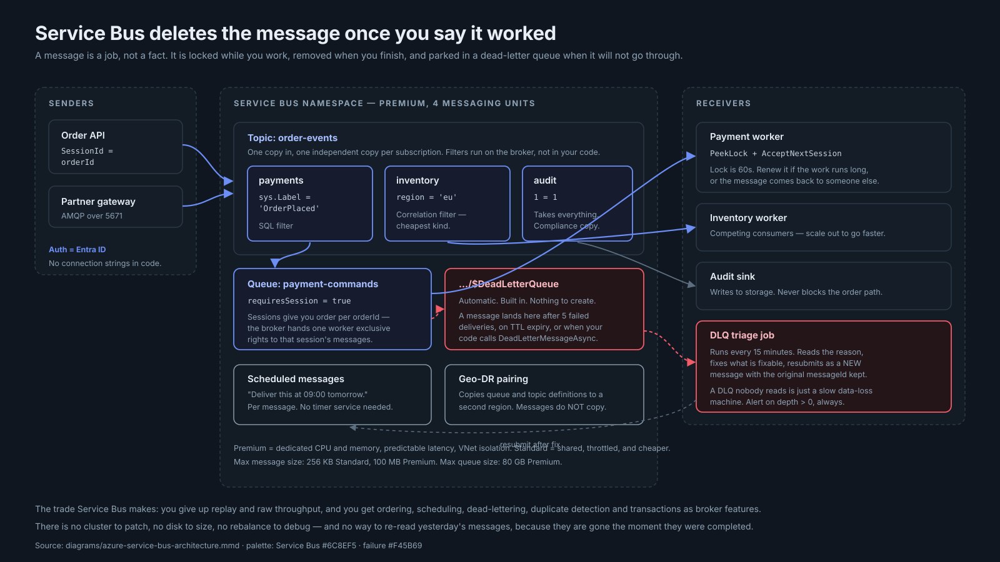
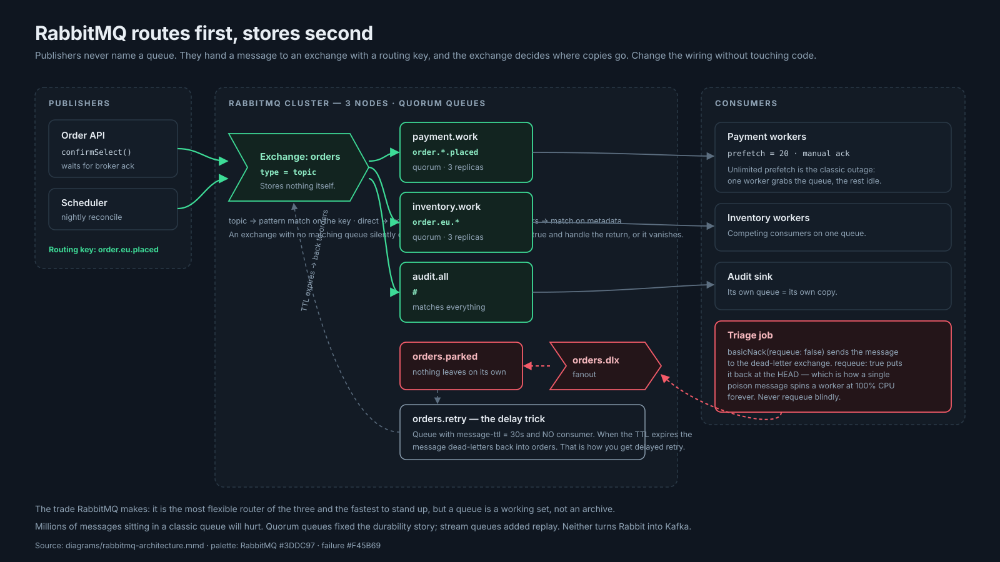
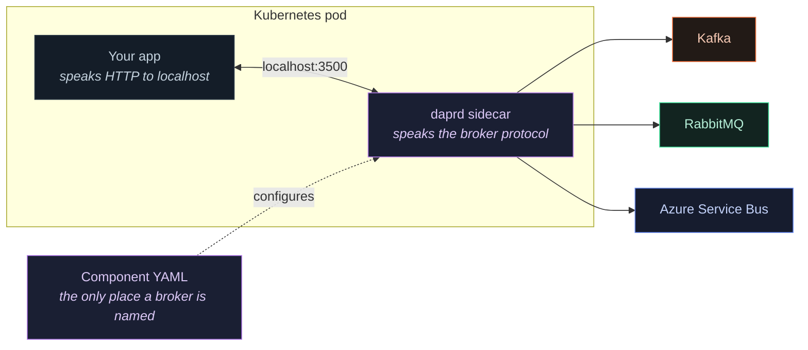
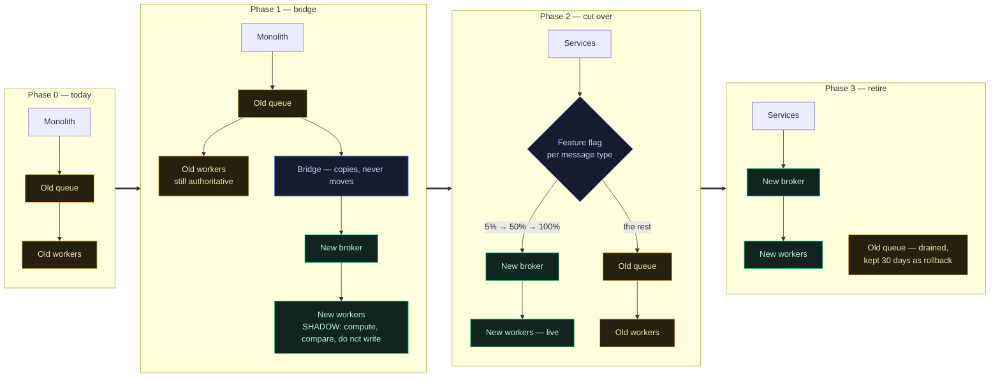

# Kafka vs Azure Service Bus vs RabbitMQ — A Working Tutorial

Three brokers, one honest comparison. Written for engineers who have to pick one, run it, and be woken up by it.

**Estimated reading time: 110 minutes** for the whole thing. 12 minutes if you read only the TL;DR, [17a](#17a-choose-by-workload), and the checklist.

**If you are here to answer "when do I use what, and why", read these four in order:** [Section 4](#4-the-five-questions) (five questions) → [17a](#17a-choose-by-workload) (workload lookup) → [17b](#17b-one-problem-three-ways) (one problem, three ways) → [17d](#17d-the-constraints-that-decide-more-than-features-do) (what actually decides it). That is 25 minutes and it is the whole decision.

---

## Assumptions

I made these calls so the document could be concrete instead of hedged. Where your situation differs, the reasoning still holds — the numbers change.

1. **Cloud.** Azure is the primary cloud, since Service Bus is one of the three systems. Kafka and RabbitMQ are treated as cloud-neutral, because they are.
2. **Language.** All code is C#/.NET 8. Every code example is preceded by the algorithm in plain English, so the logic transfers to any language.
3. **Scale.** "Production" here means tens of thousands of messages per second, not hundreds. Advice for 100 msg/sec is different and mostly reads "use whatever you already have".
4. **Versions.** Kafka 3.9 with KRaft (no ZooKeeper), RabbitMQ 4.x (quorum queues; classic mirrored queues removed), Azure Service Bus Premium. Checked July 2026.
5. **Deployment.** Kubernetes, using Strimzi for Kafka and the Bitnami chart for RabbitMQ. VMs work too; the concepts do not change.
6. **Prices and quotas move.** Every number is marked with when it was checked. Verify against live docs before putting money or an SLA behind it.
7. **"Exactly-once" is treated as a marketing term** for what is really at-least-once delivery plus idempotent consumers. This is the single most important assumption in the document, and Section 19 defends it.
8. **You are choosing, not migrating.** Migration is covered in Section 22, but the main body assumes a greenfield decision.

---

## How to use this tutorial

| You are | Read this |
|---|---|
| **Learning this properly, from zero** | Do not read this file front to back. Follow the **[seven-stage learning path](../README.md#the-learning-path)** — it sequences this file with the code, the exercises and the checkpoints, and it tells you when you have actually got it. |
| **Picking a broker this week** | TL;DR → [Section 4](#4-the-five-questions) → [17a: choose by workload](#17a-choose-by-workload) → [decision checklist](../cheatsheet/decision-checklist.md). 20 minutes. |
| **"I'm building X, what do I use?"** | [17a](#17a-choose-by-workload) is a lookup table of 18 workload types. Then [17b](#17b-one-problem-three-ways) to see one requirement solved three ways. |
| **New to messaging** | Sections [1–4](#part-i--foundations) in order, then the one system you will actually use. Skip the "sharp edges" boxes on the first pass. |
| **Already running one, evaluating another** | [17e: signals your decision expired](#17e-wrong-reasons-anti-patterns-and-knowing-when-you-were-wrong) → [Section 17](#17-side-by-side-comparison) → the target system's sections 5–16 → [Section 22](#22-migration). |
| **Being told to justify the choice** | [17d](#17d-the-constraints-that-decide-more-than-features-do) (team, scale, exit cost) and the decision record at the end of [17e](#17e-wrong-reasons-anti-patterns-and-knowing-when-you-were-wrong). |
| **Preparing for an interview** | [Foundations](#part-i--foundations), then [`interview-qa.md`](interview-qa.md) — 40 questions with collapsible answers, tagged by role. |
| **On call tonight** | Skip this file. Go to [`../runbooks/`](../runbooks/) and [`production-incidents.md`](production-incidents.md). |
| **Writing a design doc** | [`summary-one-page.md`](summary-one-page.md) is built to paste into one. |
| **Building the thing** | [`../code/csharp/`](../code/csharp/) — every file opens with the algorithm in plain English. |

**A note on the writing.** Every technical term gets a plain-English gloss in square brackets the first time it appears, like this: consumer lag [how far behind a reader is]. If a term appears without a gloss, it was glossed earlier — the [cheat sheet](../cheatsheet/cheat-sheet.md) has all of them in one table.

**How the hard concepts are explained.** The ideas that are genuinely difficult — delivery semantics, ordering, the outbox, PeekLock, exchanges, Dapr — all follow the same four-step shape, because stating a conclusion is not the same as explaining it:

1. **The problem first.** What goes wrong *without* this thing, with a concrete scenario — usually one that fails silently, since those are the ones that hurt.
2. **Before and after.** Real code or config on both sides, so the benefit is visible rather than described.
3. **The mechanism, step by step.** Why it works, not just that it works. If an analogy is used, every part of it is mapped.
4. **The cost, with numbers.** "200 extra containers at 50–150 MB each", not "operational overhead".

If a section ever leaves you with *"I can see what it says, but not why"* — that is a defect in the writing, not in your reading. The sections above are the ones most likely to need a second pass.

---

## TL;DR

- **Kafka is a log you can rewind.** Nothing is deleted when read, so ten teams can read the same event ten times, and you can replay last Tuesday. Pick it for streams, analytics, CDC and event sourcing. It costs you a team that knows Kafka.
- **Azure Service Bus is a managed queue with enterprise manners.** Sessions, scheduling, per-message TTL, dead-lettering and transactions are broker features you do not build. Pick it for business workflows on Azure. It costs you replay and raw throughput.
- **RabbitMQ is a smart router.** The exchange decides where copies go, so you rewire consumers without touching publishers. Pick it for task queues, RPC and flexible routing. It costs you archival — a queue is a working set, not a store.
- **All three deliver at-least-once in practice.** Exactly-once exists only inside Kafka, only Kafka-to-Kafka. Everything real is at-least-once plus an idempotency key. Build for duplicates or meet them in production.
- **Most large systems end up hybrid** — a firehose broker plus a command broker. That is fine when it is a decision with a written boundary, and a mess when it is an accident.

---

## Table of contents

**[Part I — Foundations](#part-i--foundations)**
1. [What a broker actually does](#1-what-a-broker-actually-does)
2. [Delivery semantics](#2-delivery-semantics)
3. [Ordering, and what it costs](#3-ordering-and-what-it-costs)
4. [The five questions](#4-the-five-questions)

**[Part II — Apache Kafka](#part-ii--apache-kafka)**

5. [Definition and core concepts](#5-kafka--definition-and-core-concepts) · 6. [Features](#6-kafka--key-features-and-capabilities) · 7. [Operations](#7-kafka--operational-characteristics) · 8. [Security](#8-kafka--security-and-compliance) · 9. [Deployment](#9-kafka--deployment-options) · 10. [Monitoring](#10-kafka--monitoring-and-observability) · 11. [Failure modes](#11-kafka--common-production-issues-and-failure-modes) · 12. [Best practices](#12-kafka--best-practices) · 13. [Cost](#13-kafka--cost-and-licensing) · 14. [Integration and code](#14-kafka--integration-patterns-and-code) · 15. [When to use, when not to](#15-kafka--when-to-use-and-when-not-to) · 16. [Production scenarios](#16-kafka--real-world-production-scenarios)

**[Part III — Azure Service Bus](#part-iii--azure-service-bus)** — same twelve headings, Sections 5–16 mirrored

**[Part IV — RabbitMQ](#part-iv--rabbitmq)** — same twelve headings, Sections 5–16 mirrored

**[Part V — Comparison and cross-cutting patterns](#part-v--comparison-and-cross-cutting-patterns)**

17. [Side-by-side comparison](#17-side-by-side-comparison)
    - 17a. [**Choose by workload**](#17a-choose-by-workload) — find the row that matches what you are building
    - 17b. [**One problem, three ways**](#17b-one-problem-three-ways) — the same requirement solved on each broker
    - 17c. [**When two brokers is the right answer**](#17c-when-two-brokers-is-the-right-answer) — and where to draw the line
    - 17d. [**The constraints that decide more than features do**](#17d-the-constraints-that-decide-more-than-features-do) — team, scale, exit cost
    - 17e. [**Wrong reasons, anti-patterns, and knowing when you were wrong**](#17e-wrong-reasons-anti-patterns-and-knowing-when-you-were-wrong)
    - 17f. [**Dapr — not choosing, for now**](#17f-dapr--not-choosing-for-now) — the abstraction layer over all three
18. [Dead-letter handling and poison messages](#18-dead-letter-handling-and-poison-messages)
19. [Idempotency — the pattern that makes everything else safe](#19-idempotency--the-pattern-that-makes-everything-else-safe)
20. [Schema evolution and versioning](#20-schema-evolution-and-versioning)
21. [Consumer group management](#21-consumer-group-management)
22. [Migration](#22-migration)
23. [Troubleshooting index](#23-troubleshooting-index)
24. [Cheat sheet and checklist](#24-cheat-sheet-and-checklist)
25. [References and further reading](#25-references-and-further-reading)

**Companion documents**

| Document | What is in it |
|---|---|
| [`dapr.md`](dapr.md) | **Dapr in full** — components per broker, CloudEvents, the outbox, what each broker loses under the abstraction, operational cost, vs MassTransit/NServiceBus |
| [`case-study-ecommerce.md`](case-study-ecommerce.md) | Global e-commerce backbone: three candidate architectures, trade-offs, rollout, SLOs, cost model, migration plan |
| [`interview-qa.md`](interview-qa.md) | 40 questions — 15 beginner, 15 intermediate, 10 advanced — with collapsible answers, tagged SDE I through Architect |
| [`production-incidents.md`](production-incidents.md) | 30 real incident shapes, 10 per broker: symptoms, root cause, detection, mitigation, long-term fix |
| [`monitoring.md`](monitoring.md) | Prometheus queries, Grafana dashboards, alert rules with thresholds and reasoning |
| [`summary-one-page.md`](summary-one-page.md) | The export-friendly one-pager for a design doc or slide |

---

# Part I — Foundations

## 1. What a broker actually does

A message broker [a server that sits between programs and holds messages for them] does exactly three things:

1. **Accepts** a message from a producer [code that puts a message in] and takes responsibility for it.
2. **Holds** it — in memory, on disk, or both — until someone is ready.
3. **Delivers** it to one or more consumers [code that takes a message out], and tracks who got what.

Everything else is detail. But the detail is where all three systems differ, and the differences follow from one question: **what happens to a message after it is read?**

| | After a consumer reads it |
|---|---|
| **Kafka** | Nothing. It stays. The consumer moves its own bookmark forward. Ten consumers can read the same message. It disappears when retention expires, not when it is read. |
| **Service Bus** | It is locked, then deleted when the consumer confirms success. Gone. One logical consumer per queue. |
| **RabbitMQ** | Same as Service Bus — locked, then deleted on ack. Unless it is a stream queue, which behaves like Kafka. |

That single difference produces almost every other difference in this document. Kafka is a **log**; the other two are **queues**. A log is a record of what happened. A queue is a list of work to do.



*Kafka's read path: consumers ask for "everything after offset N" and the broker streams bytes off disk. Nothing is removed, no per-consumer state is kept on the broker, and that is why one cluster can serve a real-time payment stream and a slow nightly batch job at the same time. Source: [`../diagrams/kafka-architecture.mmd`](../diagrams/kafka-architecture.mmd).*

### The vocabulary, decoded

You need about fifteen words. Here they are, with the honest definitions rather than the marketing ones.

| Term | What it really means |
|---|---|
| **Topic** | A named stream of messages. In Kafka it is a log split into partitions. In Service Bus it is a fan-out point with subscriptions. Same word, different things. |
| **Queue** | A list of work, consumed by competing workers. One message goes to one worker. |
| **Partition** | One ordered slice of a Kafka topic. It is *both* the unit of parallelism *and* the unit of ordering, which is why partition count is the most consequential number in a Kafka design. |
| **Offset** | A bookmark — "this group has read up to here". Stored by the broker, owned by the consumer group. |
| **Consumer group** | A named team of consumers that splits the partitions between its members. Add a member and the partitions redistribute. |
| **Consumer lag** | How far behind a reader is, measured in messages. The single most useful health metric in a Kafka system. |
| **Exchange** | RabbitMQ's router. Stores nothing. Takes a message and a routing key, decides which queues get a copy. |
| **Binding** | The rule connecting an exchange to a queue. `order.*.placed` is a binding pattern. |
| **Subscription** | Service Bus's version of a binding — a named, durable copy of a topic filtered by a rule. |
| **Ack / settle** | The consumer telling the broker "I am done with this one". Until then the broker assumes you might fail. |
| **DLQ** | Dead-letter queue. Where messages go after they have failed too many times, to wait for a human. |
| **TTL** | Time to live. Delete the message if nobody has handled it within this window. |
| **Backpressure** | The system telling you to slow down, usually by blocking or rejecting. |
| **Idempotency** | Doing something twice has the same effect as doing it once. The property that makes at-least-once delivery survivable. |
| **Prefetch** | How many unacknowledged messages a consumer is allowed to hold at once. Mis-set, it causes outages in both directions. |

### Why not just use a database table?

A perfectly reasonable question that too few people ask. A table with a `status` column, polled by a worker, is a message queue. It is transactional with your business data, debuggable with SQL, and needs no new infrastructure.

Use a table when: volume is low (hundreds per second), there is one consumer, and the work is already in the same database.

Use a broker when: you need fan-out to consumers you have not met yet, you need to absorb a spike an order of magnitude above steady state, you need the producer and consumer to fail independently, or the polling load is becoming its own problem.

Adding a broker adds a system to operate, a failure mode to learn, and a network hop to debug. That is worth it often — but not always, and not by default.

---

## 2. Delivery semantics

Three phrases get used constantly and only two of them are real.

Source: [`../diagrams/delivery-semantics.mmd`](../diagrams/delivery-semantics.mmd)



### The one decision underneath all three

Every consumer does two things: **the work**, and **telling the broker it is done** (the acknowledgement, or "ack"). The broker holds onto a message until you ack it — that is how it knows whether to give the message to someone else.

So there is exactly one choice to make, and everything follows from it:

> **Do you ack before the work, or after?**

That is it. Two orderings, two guarantees, and no third option.

### At-most-once — ack first

```
1. Receive message
2. Ack immediately        ← broker deletes it. It is gone forever.
3. Do the work            ← if the process dies HERE, nobody knows
```

The broker deleted the message the moment you acked. If your process crashes on line 3 — a deploy, an OOM kill, a node failure — **that message is gone and there is no record it ever existed.** No error, no retry, no dead-letter queue. Silence.

Legitimate uses: metrics, telemetry, cache invalidation hints. Anything where losing 0.01% is genuinely fine *and you have measured that it is fine*.

### At-least-once — ack after

```
1. Receive message
2. Do the work            ← charge the card
3. Ack                    ← if the process dies HERE, the broker never heard
                             the ack, so it redelivers... and you charge twice
```

Flip the order and you can no longer lose a message. But you have bought a new problem: the window between step 2 and step 3.

Concretely — the card is charged at 10:00:00.000. The ack is sent at 10:00:00.050. The pod is killed at 10:00:00.030.

The broker never received the ack. From its point of view, you never processed the message. So it does the only sensible thing: **it gives the message to another consumer.** That consumer charges the card again.

The work happened. The acknowledgement did not. **The broker cannot tell the difference between "the consumer died before doing the work" and "the consumer died after doing the work but before acking"** — and that ambiguity is not a bug anyone can fix. It is a property of sending messages over a network.

**This is what all three brokers give you in practice.** Not as a fallback — as the design. Duplicates are not an edge case; they are normal operation, and there are several causes besides a crash: a network blip swallowing the ack, an expired lock, a consumer group rebalance, a failover.

**Which means:** if your consumer is not safe to run twice, it is already broken. It just has not been noticed yet.

### Exactly-once — the careful version

Kafka's transactional producer genuinely provides exactly-once **within Kafka**: the read of an input topic, the write of an output topic, and the offset commit all land atomically. That is real and it works. It is documented in [`../code/csharp/kafka-producer.cs`](../code/csharp/kafka-producer.cs).

What it does not do — and cannot do — is span Kafka and your database, or Kafka and a payment API. Two independent systems cannot commit atomically without a distributed transaction protocol that nobody wants to run in 2026.

So the honest formulation is:

> **Effectively-once = at-least-once delivery + idempotent consumer.**

The broker may hand you the same message five times. Your consumer checks a key, sees it has already done the work, and skips. The side effect happens once. That is the pattern, it is boring, and it works. Section 19 is entirely about building it.

**Interview flag.** "Does your system do exactly-once?" is a trap question. The right answer names the boundary: exactly-once inside the broker, effectively-once end to end, and here is the idempotency key that makes it true.

---

## 3. Ordering, and what it costs

### First, what goes wrong without it

A customer places order 123, then cancels it two seconds later. Two messages:

```
1. OrderPlaced     { orderId: 123 }
2. OrderCancelled  { orderId: 123 }
```

You have ten consumer instances for throughput. Message 1 goes to instance A. Message 2 goes to instance B. Instance B is idle, instance A is busy — **so the cancellation is processed first**.

```
Instance B:  OrderCancelled arrives → "order 123? never heard of it" → discarded
Instance A:  OrderPlaced arrives    → creates order 123 → ships it
```

**You just shipped a cancelled order.** Nothing crashed, nothing logged an error, and every message was delivered exactly as promised. The system did what you built it to do.

That is the problem ordering solves: not delivery, but **sequence**.

### Why a key gives you ordering

The fix is to make sure both messages for order 123 are handled by the **same consumer, one after the other**. Every broker does this differently, but the underlying idea is identical: *group related messages, then let only one worker touch a group at a time.*

Kafka's version. A topic is split into partitions — say four:

```
                       hash("order-123") % 4 = 1
                                  ↓
  orders topic
  ├── partition 0  [ order-456 ] [ order-456 ] ────────► consumer A
  ├── partition 1  [ order-123 ] [ order-123 ] ────────► consumer B   ← both here
  ├── partition 2  [ order-789 ] ──────────────────────► consumer C
  └── partition 3  [ order-222 ] ──────────────────────► consumer D
```

Three facts combine to produce the guarantee:

1. **The key decides the partition.** Kafka hashes the key and takes the remainder. `order-123` always hashes to the same number, so it always lands in partition 1. Always.
2. **A partition is a single ordered file.** Messages are appended in arrival order and read back in that order. There is no way to read a partition out of order.
3. **One partition goes to exactly one consumer** in a group. Consumer B owns partition 1; nobody else can touch it.

Put those together: both messages for order 123 are in the same file, in the right order, read by one worker. `OrderPlaced` **cannot** be overtaken by `OrderCancelled`.

**And here is why it costs nothing.** Order 456 is in partition 0, handled by consumer A *at the same time*. You get ordering **within** each order, and full parallelism **across** orders. That is the best of both, and it is Kafka's strongest structural feature.

> **The mental model:** a partition is a queue at a supermarket till. Everyone in *your* queue is served in order. The four tills run at once. You are not waiting for the other queues — you are only waiting for the people in front of you.

### Choose the smallest unit that needs ordering

Now the table — decide which of these you actually need:

| Kind | Example | Realistic? |
|---|---|---|
| **Global order** | Every message across the whole system, in sequence | No. It means one partition, one consumer, no parallelism. Almost never a real requirement. |
| **Per-entity order** | All events for order 123, in sequence | Yes. This is what people mean 95% of the time. |
| **No order** | Independent events | Yes, and it is the cheapest. Take it when you can. |

### How each broker gives you per-entity ordering

**Kafka — partition by key.** A message with key `order-123` always hashes to the same partition, and a partition is a single ordered log read by exactly one member of a consumer group. Ordering is free and costs no parallelism, because `order-124` goes somewhere else and runs concurrently.

The catch: **adding partitions changes the hash mapping.** Key `order-123` may move from partition 7 to partition 11, and messages for the same order can then be processed out of order across the boundary. Size partitions for peak parallelism up front. You cannot reduce them later, and increasing them has this cost.

**Service Bus — sessions.** Set `SessionId = "order-123"` on the message. Instead of hashing to a partition, the broker treats every message sharing that `SessionId` as a **locked group**: it hands the whole group to one consumer, delivers them one at a time in order, and refuses to let any other consumer touch that session until the first one lets go.

Same outcome as Kafka's partition, different mechanism — Kafka splits the topic into fixed buckets up front; Service Bus locks an arbitrary group on demand. A bonus Kafka has no equivalent for: the broker stores a small **session state** blob for you, so a worker that crashes mid-saga resumes where it left off instead of starting over.

The catch: **concurrency is bounded by the number of active sessions, not messages.** Forty worker pods against eight live order sessions means thirty-two idle pods and a growing backlog. This surprises people during their first load test.

**RabbitMQ — one queue, one consumer.** There is no key-based partitioning in core RabbitMQ. Ordering means a single consumer on the queue, with prefetch 1 if you want it strictly.

The catch: **that is a hard throughput ceiling.** Work around it with consistent-hash routing (a plugin that shards across queues by a header, giving you Kafka-like key ordering) or with stream queues.

### The rule

Ordering always costs parallelism. Every mechanism above trades throughput for sequence. So the design question is not "do we need ordering" — it is **"what is the smallest unit that needs to be ordered?"** Usually that is one entity: one order, one account, one device. Make that your key, and pay for ordering only where it is required.

---

## 4. The five questions


*Source: [`../diagrams/broker-decision.mmd`](../diagrams/broker-decision.mmd). Colour here means product identity, not sync/async — everything on this page is asynchronous.*

Answer in order; the first three settle it for most systems.

**1. Do several teams need the same message, at different times, with the ability to re-read history?**
Yes → question 2. No → question 4.

**2. Is your sustained peak above ~50,000 messages/sec?**
Yes → **Kafka**. No, but replay still matters → question 3.

**3. Are you all-in on Azure and want zero brokers to operate?**
Yes → **Service Bus** (add Event Hubs if you need replay). No → **Kafka**.

**4. Do you need per-message scheduling, per-message TTL, priority, or routing rules that change without a redeploy?**
Yes → question 3. No → question 5.

**5. Is a small ops team a hard constraint?**
Yes, on Azure → **Service Bus**. Yes, not on Azure → **RabbitMQ**. No → **RabbitMQ**.

**The tie-breaker, when two options both fit:** pick the one your team can debug at 3am. Operational familiarity beats a 15% benchmark advantage every time, and it is not close.

---

# Part II — Apache Kafka

## 5. Kafka — definition and core concepts

Kafka is a **distributed, replicated, append-only log** [a file you can only add to the end of, never edit in the middle]. Producers append. Consumers read from a position they choose. Nothing is removed when it is read.

That is the entire idea. Everything else is engineering around it.

#### Why "a log" changes everything

Compare how a queue and a log behave when three teams want the same message.

**A queue deletes on read.** One message, one consumer, then gone:

```
Queue:  [ msg3 ][ msg2 ][ msg1 ] ──► payments takes msg1 ──► msg1 is DELETED
                                     inventory wanted it too. Too late.
```

To serve three teams you need three copies of the data, in three queues, and something must fan them out. Each copy costs storage and each is independently full or empty.

**A log keeps everything and hands out bookmarks.** One copy, many readers:

```
Log:  [ msg1 ][ msg2 ][ msg3 ][ msg4 ][ msg5 ]  ← nothing is ever removed on read
                ▲                        ▲
                │                        │
        analytics is here          payments is here
        (offset 2 — slow,          (offset 5 — real-time)
         catching up from
         last night)
```

Each consumer group stores one number — "I have read up to here". That number is the *only* per-consumer state the broker keeps. Adding a fourth team means adding a fourth number. The data is not copied, and no existing consumer is affected.

**Three consequences follow directly, and they define Kafka:**

| Because the log is not consumed | You get |
|---|---|
| The messages are still there | **Replay** — move the bookmark back and reprocess last Tuesday |
| Readers only cost a bookmark | **Near-free fan-out** — the eleventh consumer group costs almost nothing |
| Reading is a sequential file read | **Throughput** — the broker streams bytes off disk instead of tracking per-message state |

**And so do the limitations.** A log is a file, and files do not support per-item operations. That is why Kafka has no per-message TTL, no priority, no scheduling, and no cheap way to delete one specific message. Those are not missing features anyone forgot — they are structurally incompatible with "it is a file you append to".

### Components

| Component | What it is | Plain English |
|---|---|---|
| **Broker** | A server holding partition data | One machine in the cluster |
| **Topic** | A named log | The stream you publish to |
| **Partition** | One ordered slice of a topic | The unit of both ordering and parallelism |
| **Offset** | A position in a partition | A bookmark — record number 1,044,235 |
| **Replica** | A copy of a partition on another broker | Your insurance against losing a machine |
| **Leader** | The replica that accepts reads and writes | The one that matters right now |
| **ISR** | In-sync replicas — copies caught up with the leader | The set that counts for durability |
| **Consumer group** | A team of consumers sharing partitions | How you scale reading |
| **KRaft controller** | Holds cluster metadata | Replaced ZooKeeper in 3.x; simpler and fewer moving parts |

### The write path

1. Producer picks a partition — by key hash if a key is set, round-robin if not.
2. The message goes to that partition's **leader** broker.
3. The leader appends to its log file. It does **not** fsync per message; it relies on replication for durability, which is faster and, with three replicas, safer than a single fsync.
4. Followers pull from the leader.
5. Once `min.insync.replicas` replicas have it, the leader acknowledges to the producer.

Step 5 is the durability contract, and it needs **two** settings that people set only one of:

```
# on the producer
acks=all                  # wait for all in-sync replicas

# on the broker/topic
min.insync.replicas=2     # "all in-sync" must mean at least 2
```

`acks=all` alone is theatre: if the ISR has shrunk to one replica, "all" means "one", and a broker failure loses acknowledged data. With `min.insync.replicas=2`, the broker rejects the write instead — loud failure over silent loss. That is the trade you want.

### The read path

A consumer says "give me everything after offset N in partition 3". The broker streams bytes off disk, often straight from the OS page cache, using zero-copy [the kernel sends file data to the socket without passing it through the application]. The broker keeps no per-consumer state beyond a committed offset in an internal topic.

This is why Kafka scales reads so well and why it has no per-message TTL, no priority, no per-message scheduling, and no cheap way to delete one specific message. You are reading a file. Files do not work that way.

### Retention and compaction

Two policies, and mixing them up is a common design error:

- **`cleanup.policy=delete`** — drop segments older than `retention.ms` or beyond `retention.bytes`. For events: "order placed" is a fact that expires.
- **`cleanup.policy=compact`** — keep the newest value per key forever, discard older values for the same key. For state: "the current price of SKU-42". A compacted topic is a rebuildable table with a change history.

Use delete for events, compact for state. Use both (`delete,compact`) only when you genuinely want state with a hard age ceiling.

---

## 6. Kafka — key features and capabilities

| Feature | Support | The honest version |
|---|---|---|
| **Persistence** | Excellent | Disk-first by design. Retention is time or size based, per topic. Tiered storage moves old segments to object storage. |
| **Ordering** | Per partition | Free, via keys. Costs nothing in parallelism. The best ordering story of the three. |
| **Transactions** | Yes, within Kafka | Atomic multi-partition writes plus offset commits. **Does not extend to your database.** |
| **Fan-out** | Excellent | N consumer groups read the same data independently. This is Kafka's superpower. |
| **Routing** | Weak | Partition by key, and that is it. No content-based routing. Filter in the consumer or use Kafka Streams. |
| **Filtering** | Consumer-side | The broker will not filter for you. You read everything and discard, or you build a filtering stream job. |
| **DLQ** | **You build it** | No native concept. A DLQ is just another topic plus the discipline to add reason headers. |
| **TTL** | Topic-level only | No per-message TTL. Retention applies to the whole topic. |
| **Priority** | No | Not supported. Use separate topics per priority tier and consume them with weighted polling. |
| **Scheduling** | No | Not supported. Use an external scheduler, or a delay-topic-per-tier pattern. |
| **Replay** | **Excellent** | Reset a consumer group to any offset or timestamp. The reason people choose Kafka. |
| **Compaction** | Yes | Log becomes a keyed table. Underpins Kafka Streams state stores and CDC. |

### The four things Kafka does that the others cannot

1. **Replay.** Reset a group to a timestamp and reprocess a week of history. Everything from bug recovery to bootstrapping a new service depends on this.
2. **Fan-out without cost.** Adding an eleventh consumer group costs the broker almost nothing — it is another sequential read of the same file.
3. **Throughput.** Millions of messages per second on modest hardware, because the hot path is an append to a file and a sequential read from page cache.
4. **Compaction.** Turn a stream of changes into a queryable, rebuildable table.

### The four things it cannot do

1. **Per-message anything** — TTL, priority, scheduling, targeted deletion.
2. **Content-based routing.** No SQL filters, no header matching.
3. **Native dead-lettering** with an audit trail. You build the whole mechanism.
4. **More consumers than partitions.** Parallelism is capped by a number you chose at creation.

---

## 7. Kafka — operational characteristics

| Dimension | Reality (checked July 2026) |
|---|---|
| **Throughput** | Millions of msg/sec per cluster. A single 8-core broker with NVMe handles 100k+ msg/sec of 1 KB messages comfortably. |
| **Latency** | p50 ~2–5 ms, p99 ~10–50 ms with `acks=all`. `linger.ms` trades latency for throughput directly. |
| **Scaling** | Horizontal, by adding brokers and rebalancing partitions. Not instant — moving a partition means copying its data. |
| **Storage** | Local disk, sized for retention × throughput. Tiered storage offloads old segments to S3/Blob. |
| **Retention** | Days to years. Seven days is the common default; tiered storage makes years affordable. |
| **Message size** | 1 MB default. Raising it is possible and usually wrong — put big payloads in blob storage and send a pointer. |
| **Partitions per cluster** | Tens of thousands with KRaft. ZooKeeper-era limits are gone, but per-partition overhead is real. |
| **Rebalance time** | Seconds with cooperative rebalancing; tens of seconds with the old eager strategy. |

### Capacity planning that actually works

**Partitions.** The number you cannot lower later.

```
partitions = ceil(peak_throughput / per_consumer_throughput) × 2
```

The ×2 is headroom for growth and for slow consumers. If one consumer instance handles 5,000 msg/sec and your peak is 100,000 msg/sec, that is 20 consumers minimum, so 40+ partitions. Round up to something with useful factors — 48, 60, 120 — so consumer counts divide evenly.

**Storage.**

```
disk_per_broker = (throughput_bytes_per_sec × retention_seconds × replication_factor)
                  / broker_count
                  × 1.3        # 30% headroom — below this you are one spike from an outage
```

**Memory.** Kafka wants memory for the **page cache**, not the JVM heap. A 6 GB heap in a 32 GB container is correct; a 24 GB heap in the same container will thrash. The OS caches log segments better than the JVM ever will. This is the single most misunderstood Kafka sizing rule.

---

## 8. Kafka — security and compliance

| Layer | Options | Recommendation |
|---|---|---|
| **Authentication** | SASL/SCRAM, mTLS, SASL/OAUTHBEARER, SASL/PLAIN | mTLS inside the cluster, SCRAM-SHA-512 or OAuth for clients. Never PLAIN without TLS. |
| **Authorization** | ACLs per topic/group/cluster, or OPA/Ranger | ACLs, least privilege, scoped per topic **and** per consumer group |
| **Encryption in transit** | TLS 1.2/1.3 | On, everywhere, including broker-to-broker |
| **Encryption at rest** | Disk-level (LUKS, cloud-managed keys) | Kafka has no built-in field encryption. Encrypt the volume, and encrypt PII fields in the payload yourself. |
| **Network** | Listener separation, private endpoints | Separate internal and external listeners with different auth |
| **Audit** | Broker authorizer logs | Ship to SIEM. Not on by default. |

### GDPR and the right to erasure — the hard problem

Kafka is append-only. You cannot delete one record from the middle of a log. This is a genuine conflict with "delete all data about this person", and there are exactly three workable answers:

1. **Crypto-shredding.** Encrypt each customer's PII with a per-customer key. To erase, destroy the key. The bytes remain but are permanently unreadable. **This is the standard answer** and the one used in the case study.
2. **Compacted topic with tombstones.** Key by customer id and write a null value (a tombstone) to erase. Works only for topics that are genuinely keyed state, not event streams.
3. **Short retention on PII topics.** Keep personal data 30 days, keep the derived anonymous aggregate forever. Design the split up front.

Do not promise erasure on an event-sourced Kafka topic without one of these in place. Retrofitting it is a project, not a patch.

---

## 9. Kafka — deployment options

| Option | Ops burden | Cost shape | When |
|---|---|---|---|
| **Self-hosted on VMs** | Highest | Cheapest at scale | You have a platform team and a large, steady workload |
| **Kubernetes + Strimzi** | High but automated | Cheap | You are already on Kubernetes. Strimzi handles rolling restarts, certs, rebalancing. |
| **Confluent Cloud** | Near zero | Highest | You want Kafka without a Kafka team. Schema Registry and connectors included. |
| **AWS MSK / Azure HDInsight Kafka** | Medium | Medium | Cloud-managed brokers, but you still tune and monitor them |
| **Azure Event Hubs (Kafka API)** | Near zero | Medium | Kafka protocol on Azure PaaS. Not full Kafka — no compaction, no transactions, no Connect. |
| **Redpanda** | Medium | Medium | Kafka-compatible, C++, no JVM, lower latency. Fewer ecosystem integrations. |

The full Strimzi configuration — node pools, topics as code, ACLs, MirrorMaker 2 — is in [`../k8s/kafka-helm-values.yaml`](../k8s/kafka-helm-values.yaml).

> **Sharp edge — Event Hubs is not Kafka.** The Kafka protocol surface is there, so your producer code works unchanged. Log compaction, transactions, Kafka Connect and Kafka Streams state stores are not. Teams discover this after committing. Check your feature list against the compatibility matrix before choosing it as a Kafka substitute.

---

## 10. Kafka — monitoring and observability

Full queries, dashboards and alert rules in [`monitoring.md`](monitoring.md). The short version — what to watch and when to care:

| Metric | Why | Alert |
|---|---|---|
| `kafka_consumergroup_lag` | The one number that tells you if the system is keeping up | > 5 min of traffic for 10 min |
| `UnderReplicatedPartitions` | Cluster health, single best signal | > 0 for 5 min |
| `OfflinePartitionsCount` | **Data is unavailable** | > 0 — page immediately |
| `ActiveControllerCount` | Must be exactly 1 across the cluster | != 1 for 1 min |
| `RequestHandlerAvgIdlePercent` | Broker saturation | < 20% for 10 min |
| `IsrShrinksPerSec` | Replication struggling | > 0 sustained |
| Consumer rebalance rate | Rebalance loops | > 1/min sustained |
| Disk usage | The most common cause of broker death | > 75% warn, > 85% page |
| DLQ topic message rate | Something is broken upstream | > 0 sustained |

**Read lag as a derivative, not a level.** Lag of 50,000 that is falling is fine. Lag of 5,000 that is climbing is an incident. Alert on the trend and on time-to-drain, not on the raw count — otherwise every traffic spike pages someone for a system that is working correctly.

---

## 11. Kafka — common production issues and failure modes

Ten detailed incidents with symptoms, detection and fixes are in [`production-incidents.md`](production-incidents.md#apache-kafka). The failure *shapes*:

### The rebalance loop — the classic Kafka outage

A consumer takes longer than `max.poll.interval.ms` to process a batch. The group decides it is dead and revokes its partitions — mid-work. That triggers a rebalance. Work restarts. It takes too long again. Forever.

Symptoms: sawtoothing throughput, logs full of assignment churn, lag oscillating.

The fix is `max.poll.interval.ms`, **not** `session.timeout.ms`. That is the wrong turn almost everyone takes first. Session timeout governs heartbeats, which run on a background thread and are fine. Poll interval governs your processing, which is what is actually too slow.

### Partition skew

One key dominates — a single large customer, a null key that hashes to one place, or a monotonic id. That partition's consumer saturates while others idle. Lag on one partition, low CPU everywhere else.

Fix by composing the key (`customerId + orderId`), or adding a salt for the hot key specifically.

### Consumer group stuck on a poison message

A message that always throws. The consumer retries forever and the partition stops advancing. Everything behind it waits.

Fix: bounded retry, then dead-letter, then commit past it. Never retry unbounded on the main path.

### Disk full

Retention set generously, traffic grew, nobody watched the graph. The broker dies. Recovery means expanding volumes or cutting retention — and **never** deleting `.log` files by hand, which corrupts the partition.

### Unclean leader election

If enabled, an out-of-sync replica can become leader and silently discard records the old leader had. Keep `unclean.leader.election.enable=false`. Turn it on only as a documented, signed-off, data-losing availability decision during an incident.

---

## 12. Kafka — best practices

**Design**
- Partition key = the entity that needs ordering. Usually the aggregate id.
- Size partitions for peak parallelism; you cannot reduce them.
- Compact for state, delete for events. Do not mix them by accident.
- Message size under 1 MB. Large payloads go to blob storage with a pointer in the message.
- Schema Registry from day one. Retrofitting schemas onto a live topic is painful.

**Producers**
- `acks=all` **and** `min.insync.replicas=2`. Both, or neither means anything.
- `enable.idempotence=true`. Free, prevents duplicate writes on retry.
- `linger.ms=5`. The most under-used throughput knob in Kafka.
- Await the delivery report. A queued send is not a send.
- One producer per process, held for the process lifetime.

**Consumers**
- `enable.auto.commit=false`. Always, for anything that matters.
- Cooperative sticky assignment. Eager rebalancing turns every deploy into a group-wide stall.
- Commit in batches of ~100, not per message.
- `max.poll.interval.ms` > worst-case handler time, with margin.
- Idempotent handlers. Not optional.

**Operations**
- Replication factor 3, spread across availability zones.
- `unclean.leader.election.enable=false`.
- `auto.create.topics.enable=false` — a typo should fail, not silently create a topic.
- Topics as code (`KafkaTopic` CRs), never ad-hoc CLI in production.
- Raise `offsets.retention.minutes` above the default 7 days — groups idle over a long weekend lose their offsets and restart from the beginning, which is a memorable Monday.

---

## 13. Kafka — cost and licensing

**License.** Apache 2.0. Free. Confluent's additions (Schema Registry beyond the community licence, tiered storage, RBAC, some connectors) are under the Confluent Community Licence, which prohibits offering them as a competing managed service. For internal use this is not a constraint; read it once so you know.

**What actually drives cost:**

| Model | Cost drivers | Watch out for |
|---|---|---|
| **Self-hosted** | Compute, disk, network, **engineering time** | Engineering time dominates and is the line item nobody puts in the spreadsheet. Budget 0.5–1 FTE for a serious cluster. |
| **Confluent Cloud** | Ingress + egress + storage + partitions + connectors | Egress and inter-zone transfer add up fast. Partition count is billed on some tiers. |
| **MSK** | Broker-hours + storage + data transfer | Cross-AZ replication traffic is billed and is easy to forget |
| **Event Hubs** | Throughput units or Premium capacity + Capture | Capture is billed separately. Not full Kafka. |

**A rough shape, for 50k msg/sec of 1 KB messages, 7-day retention (July 2026, verify before quoting):**

- Self-hosted on Kubernetes: 6 brokers × (8 vCPU, 32 GB, 1 TB premium SSD) ≈ **$4,500–6,000/month** infrastructure, plus the engineer.
- Confluent Cloud, same workload: **$8,000–15,000/month** depending on egress and connectors.
- The crossover is usually around one full-time engineer's cost. Below that, managed wins. Above it, do the arithmetic honestly — including on-call, upgrades and the 3am hours.

---

## 14. Kafka — integration patterns and code

Full, commented implementations: [`../code/csharp/kafka-producer.cs`](../code/csharp/kafka-producer.cs) and [`../code/csharp/kafka-consumer.cs`](../code/csharp/kafka-consumer.cs). Each file opens with the algorithm in plain English.

### Producer — the algorithm

1. Build **one** producer when the process starts; keep it for the process lifetime. One per message is the most common performance bug.
2. Enable idempotence, so a network retry does not create a duplicate record.
3. Ask for `acks=all`, and set `min.insync.replicas=2` on the broker.
4. Choose a key for every message — the entity the ordering is about.
5. Put the message identity in a **header**, so consumers can dedupe before deserialising.
6. Send and **await** the delivery report.
7. On failure, distinguish retriable from not. Retry the first with backoff; log and stop on the second.
8. Flush on shutdown.

```csharp
var config = new ProducerConfig
{
    BootstrapServers = bootstrapServers,
    Acks = Acks.All,                    // step 3 — with min.insync.replicas=2
    EnableIdempotence = true,           // step 2
    MessageSendMaxRetries = 10,
    LingerMs = 5,                       // batching: often a 10x throughput win
    CompressionType = CompressionType.Zstd,
};

var message = new Message<string, byte[]>
{
    Key   = order.OrderId,              // step 4 — the ordering contract
    Value = JsonSerializer.SerializeToUtf8Bytes(order),
    Headers = new Headers
    {
        { "message-id",   Encoding.UTF8.GetBytes($"{order.OrderId}:OrderPlaced") },  // step 5
        { "message-type", Encoding.UTF8.GetBytes(nameof(OrderPlaced)) },
        { "schema-version", Encoding.UTF8.GetBytes("1") },
    },
};

var result = await _producer.ProduceAsync("orders.v1", message, ct);   // step 6
_log.LogInformation("Published to {P}@{O}", result.Partition.Value, result.Offset.Value);
```

### Consumer — the algorithm

1. Join a consumer group. The group name is your bookmark identity.
2. Turn **off** auto-commit — it saves your position on a timer whether or not the work succeeded.
3. Poll in a loop. The client only makes progress while you call `Consume`.
4. Check the idempotency key **first**. If seen, skip to committing.
5. Do the work, record the key, then commit — ideally in one database transaction.
6. On failure: bounded retry with backoff, then dead-letter, then commit past it.
7. Commit in batches, not per message.
8. On shutdown, commit and `Close()` — which triggers a clean rebalance instead of a 45-second timeout.

```csharp
var config = new ConsumerConfig
{
    GroupId = "payments-service",
    EnableAutoCommit = false,                                        // step 2
    AutoOffsetReset = AutoOffsetReset.Earliest,
    MaxPollIntervalMs = 300_000,                                     // step 3 — > worst-case handler
    PartitionAssignmentStrategy = PartitionAssignmentStrategy.CooperativeSticky,
    IsolationLevel = IsolationLevel.ReadCommitted,
};

// step 4 — dedupe before doing anything expensive
if (await _idempotency.AlreadyProcessedAsync(messageId, ct))
{
    MaybeCommit(result);
    return;
}

await ProcessAsync(order, ct);                       // step 5
await _idempotency.MarkProcessedAsync(messageId, ct);

// step 7 — commit "the next offset I want" = processed + 1
_consumer.Commit(new[] { new TopicPartitionOffset(result.TopicPartition, result.Offset + 1) });
```

The off-by-one in that last line matters: committing `result.Offset` instead of `+ 1` reprocesses exactly one message on every restart, which is a maddening bug to find.

---

## 15. Kafka — when to use and when not to

**Use Kafka when**

- Multiple independent consumers need the same data (this is the strongest signal)
- Replay matters: reprocessing after a bug, bootstrapping a new service, audit
- Sustained throughput above ~50k msg/sec
- You are doing event sourcing or CDC [change data capture — turning database writes into a stream]
- A stream needs to feed both real-time processing and a warehouse
- Retention is measured in days or years, not minutes

**Do not use Kafka when**

- You need per-message TTL, priority, or scheduling — it has none of these
- You need content-based routing — no filters exist
- Your team is two people with no Kafka experience and no budget for managed
- Volume is under a few thousand messages/sec and there is one consumer — you are buying complexity for nothing
- You need request/reply RPC — possible, awkward, and RabbitMQ does it better
- You need a queue with a native DLQ and retry ergonomics out of the box

**The honest boundary.** Kafka is superb at "many readers of one durable stream" and mediocre at "a list of jobs with retry rules". Teams that adopt it for the first and then use it for the second end up rebuilding dead-letter handling, retry backoff, scheduling and priority in application code — badly. That is the moment to add a second broker rather than fight the first.

---

## 16. Kafka — real-world production scenarios

### Scenario A — Order events feeding five consumers

A retailer publishes `OrderPlaced` to `orders.v1` (120 partitions, key = orderId, RF 3, 7-day retention). Five consumer groups read it: payments, inventory, shipping, notifications, and a Connect sink to the data lake.

Why Kafka wins here: adding the sixth consumer group next quarter costs nothing and requires no change to the producer. With a queue, each new consumer means a new subscription or queue and a routing change.

### Scenario B — CDC from a monolith

Debezium reads the database transaction log and publishes row changes to Kafka. New microservices consume the stream instead of querying the monolith's database. The monolith is not modified.

This is the most reliable strangler-fig pattern available, and it is a Kafka pattern specifically — it depends on replay (a new service reads history from the beginning) and compaction (the topic is a rebuildable table).

### Scenario C — The one that went wrong

A team used Kafka as a job queue for PDF generation. Some PDFs take 4 minutes. `max.poll.interval.ms` was left at the 5-minute default. Under load, a batch of slow jobs exceeded it, the consumer was evicted mid-job, the group rebalanced, the jobs restarted, and it never recovered. They discovered it as "Kafka is dropping our jobs".

Kafka was not dropping anything. The workload — long-running, individually-retriable jobs with no fan-out requirement — was a queue workload. They moved it to RabbitMQ and kept Kafka for the event stream. That hybrid split is the right answer far more often than people expect.

---

# Part III — Azure Service Bus

## 5b. Service Bus — definition and core concepts

Service Bus is a **fully managed enterprise message broker**. There is no cluster to run, no disk to size, no quorum to lose. You rent an endpoint.

The mental model: **a message is a job, not a fact.** It arrives, it is locked while someone works on it, and it is deleted when the work succeeds. If the work fails enough times, it is parked in a dead-letter queue for a human. That is a completely different contract from Kafka's log, and everything follows from it.



*Source: [`../diagrams/azure-service-bus-architecture.mmd`](../diagrams/azure-service-bus-architecture.mmd)*

### Components

| Component | What it is |
|---|---|
| **Namespace** | The container and the billing/scaling unit. One endpoint hostname. |
| **Queue** | Point to point. Competing consumers; one message goes to one worker. |
| **Topic** | Publish/subscribe. One message in, one independent copy per subscription. |
| **Subscription** | A named durable copy of a topic's stream, with a filter. Behaves like a queue. |
| **Rule / filter** | Broker-side matching — SQL expressions, correlation matches, or boolean. |
| **Session** | An ordered, exclusively-locked group of messages sharing a `SessionId`. |
| **Dead-letter queue** | A built-in sub-queue on every entity. Nothing to create. |
| **Messaging unit** | The Premium-tier capacity unit: 1, 2, 4, 8 or 16. |

### PeekLock — the receive model that matters

This is Section 2's "ack before or after the work" decision, made concrete. Service Bus gives you two receive modes, and they *are* those two orderings:

**ReceiveAndDelete** — at-most-once. The broker deletes the message the instant it puts it on the wire to you. It does not wait to hear that you got it.

```
Broker: sends message, deletes its copy immediately
You:    ...receive it... process dies...
Result: the message never existed. No trace, no retry, no DLQ.
```

**PeekLock** — at-least-once, and the default. The broker gives you a copy and keeps its own, marked *locked* — invisible to every other consumer, but not deleted.

```
Broker: sends a copy, keeps one LOCKED (hidden, not deleted)
You:    process it, then explicitly say what happened
Broker: acts on what you said
```

**Use PeekLock unless losing the message genuinely does not matter.**

#### The lock is a lease, and it expires

The lock is not held until you finish. It is held for **60 seconds by default** (5 minutes maximum). That deadline exists because the broker has no other way to tell a slow consumer from a dead one — if you have said nothing in 60 seconds, the broker has to assume you crashed, or a single dead pod could hide a message forever.

Here is the failure that follows, and it is the most common Service Bus incident:

```
10:00:00  Broker locks the message, hands it to Worker A
10:00:00  Worker A calls the payment provider... which is having a slow day
10:01:00  LOCK EXPIRES. Broker assumes Worker A is dead.
10:01:00  Broker unlocks the message and hands it to Worker B
10:01:05  Worker B charges the card
10:01:30  Worker A finally gets its response and charges the card too
```

**Two charges, no error anywhere.** Worker A was never told its lock had gone; it was just slow. Both workers behaved correctly.

Three defences, and you want all three:

1. **Renew the lock while you work** — `MaxAutoLockRenewalDuration`, set to your realistic worst case rather than your average
2. **Keep prefetch at 0** — prefetched messages start their lock countdown the moment they arrive in your client's buffer, doing nothing. Prefetch 100 with a 2-second handler means the last messages sit locked for over three minutes and expire before you touch them
3. **Be idempotent anyway**, because none of the above is airtight

Implementation in [`../code/csharp/azure-consumer.cs`](../code/csharp/azure-consumer.cs).

### The four settlement outcomes

Every message must end in exactly one of these, on every code path:

| Call | Effect | Use when |
|---|---|---|
| `CompleteAsync` | Deleted | Work succeeded |
| `AbandonAsync` | Lock released, `DeliveryCount` +1, redelivered immediately | Transient failure worth retrying now |
| `DeadLetterAsync` | Moved to the DLQ with a reason string | It will never succeed — bad data, business rejection |
| `DeferAsync` | Hidden, but retrievable by sequence number | Out-of-order arrival; you need it later, not now |

`DeferAsync` is the one people forget exists. It is the right tool when message B arrives before message A and cannot be processed yet — defer B, record its sequence number, fetch it after A lands.

---

## 6b. Service Bus — key features and capabilities

| Feature | Support | The honest version |
|---|---|---|
| **Persistence** | Yes | Replicated storage, managed. Premium is zone-redundant. |
| **Ordering** | Sessions | Per `SessionId`, strictly ordered. Costs concurrency. |
| **Transactions** | Yes, within a namespace | Multiple sends and a receive-settle in one atomic scope. Not across your database. |
| **Duplicate detection** | **Built in** | Broker rejects a repeat `MessageId` within a configurable window (up to 7 days). Genuinely useful. |
| **Routing** | **Excellent** | SQL filters, correlation filters, auto-forwarding between entities. |
| **Filtering** | **Broker-side** | Filters read `ApplicationProperties` without deserialising your payload. Kafka cannot do this at all. |
| **DLQ** | **Built in** | Every queue and subscription has one. Automatic on `MaxDeliveryCount`, TTL expiry, and filter errors. |
| **TTL** | **Per message** | Set `TimeToLive` on individual messages. Expired messages can auto-dead-letter. |
| **Scheduling** | **Built in** | `ScheduleMessageAsync` for future delivery. Cancellable by sequence number. No timer service needed. |
| **Replay** | **No** | Completed means deleted. This is the defining limitation. |
| **Max message size** | 256 KB Standard, **100 MB Premium** | The largest of the three by a wide margin. |
| **Throughput** | Moderate | Thousands to low tens of thousands msg/sec. Not a firehose product. |

### What Service Bus does that the others cannot

1. **Scheduled delivery, per message.** "Send this at 09:00 tomorrow", cancellable. Kafka and RabbitMQ both need workarounds.
2. **Broker-side content filtering.** A subscription with `[region] = 'eu' AND [high-value] = true` filters before delivery. Kafka has no equivalent.
3. **Duplicate detection at the broker.** Send the same `MessageId` twice within the window and the second is silently dropped.
4. **Sessions with state.** The broker stores a small state blob per session — saga progress survives a worker restart with no database.
5. **100 MB messages** on Premium.
6. **Zero operations.** No patching, no capacity planning beyond one number, no 3am cluster surgery.

### What it cannot do

1. **Replay.** The big one. Once completed, a message is gone. If you need to reprocess yesterday, Service Bus is the wrong product and no configuration fixes it.
2. **High throughput.** Above ~10k msg/sec sustained you are fighting the tier. Event Hubs is Azure's answer for that shape.
3. **Run anywhere.** Azure only. Full stop.
4. **Be inspected.** No broker logs, no exec, no thread dumps. Only the metrics and diagnostics you enabled **in advance**.

---

## 7b. Service Bus — operational characteristics

| Dimension | Reality (checked July 2026) |
|---|---|
| **Throughput** | Standard: ~1,000 msg/sec, throttled and shared. Premium: ~1,000 msg/sec **per messaging unit**, dedicated. |
| **Latency** | p50 ~20–50 ms, p99 ~100–200 ms. Higher than Kafka or RabbitMQ — this is a managed service with more layers. |
| **Scaling** | Messaging units: 1, 2, 4, 8, 16. **A step function, not a slider.** Doubling is the only move. |
| **Max queue size** | 80 GB Premium, 5 GB Standard |
| **Max message size** | 100 MB Premium, 256 KB Standard |
| **Retention** | TTL-based, up to 14 days. Not an archive. |
| **Sessions** | Effectively unlimited count; concurrency bounded by active sessions |
| **Availability SLA** | 99.9% Standard, 99.95% Premium with zone redundancy |

### The tier decision

| | Basic | Standard | Premium |
|---|---|---|---|
| Queues | Yes | Yes | Yes |
| Topics/subscriptions | **No** | Yes | Yes |
| Sessions | **No** | Yes | Yes |
| Transactions | No | Yes | Yes |
| Max message | 256 KB | 256 KB | **100 MB** |
| VNet / Private Link | No | No | **Yes** |
| Predictable latency | No | No | **Yes** |
| Billing | Per operation | Base + per operation | **Flat per MU/hour** |

**Do not build on Basic.** No topics, no sessions, no transactions — you will outgrow it in month two.

**The Standard-tier billing trap, stated plainly:** every operation is billed, *including a receive that returns nothing*. A receiver with a short `TryTimeout` in a `while(true)` loop bills millions of empty operations per day. Use long polling (30-second timeout, the SDK default) or `ServiceBusProcessor`, which handles it. This surprises teams as a bill, not as an error.

---

## 8b. Service Bus — security and compliance

| Layer | Options | Recommendation |
|---|---|---|
| **Authentication** | Entra ID (managed identity), SAS tokens, connection strings | **Managed identity.** Set `disableLocalAuth: true` to make connection strings impossible. |
| **Authorization** | Three built-in RBAC roles | Data Sender / Data Receiver / Data Owner, scoped **per entity**, never per namespace |
| **Encryption in transit** | TLS 1.2+ enforced | Nothing to configure |
| **Encryption at rest** | Microsoft-managed or customer-managed keys | CMK on Premium if your compliance regime requires key control |
| **Network** | Private Link (Premium), IP firewall (Standard) | Private Link + `publicNetworkAccess: Disabled` |
| **Audit** | Diagnostic settings to Log Analytics | **Turn on now.** They are not retroactive. |

Compliance certifications are inherited from Azure: SOC 1/2/3, ISO 27001, HIPAA BAA, PCI DSS, FedRAMP, GDPR. This is a genuine advantage — you inherit an audited platform instead of proving your own broker's controls.

**GDPR erasure is much easier here than on Kafka.** Messages are transient by design; nothing is retained past its TTL. The compliance question moves to wherever you persist the processed data, which is a database problem with well-known answers.

The full identity and network setup is in [`../k8s/azure-service-bus-operator.md`](../k8s/azure-service-bus-operator.md).

---

## 9b. Service Bus — deployment options

There is only one: **Azure runs it.** What you "deploy" is the plumbing.

| Concern | Approach |
|---|---|
| **Entity definitions** | Bicep, Terraform, or the Azure Service Operator (Kubernetes CRDs) |
| **Identity** | Workload identity for AKS pods; managed identity elsewhere |
| **Network** | Private endpoint + disabled public access |
| **Scaling consumers** | KEDA on queue depth — **never on CPU** |
| **Multi-region** | Independent namespaces per region + a global router. Geo-DR is metadata only. |

Autoscaling consumers on CPU is close to useless for a message worker: a pod waiting on a slow payment API uses no CPU while the queue grows to a million. Scale on `activeMessageCount`. The KEDA `ScaledObject` is in [`../k8s/azure-service-bus-operator.md`](../k8s/azure-service-bus-operator.md#3-scaling-workers-on-queue-depth-with-keda).

> **Sharp edge — Geo-DR replicates metadata, not messages.** Pairing copies the *shape* of your queues and topics to a second region. Messages in flight at failover are **lost**. Failover is manual, and after it the pairing is broken and must be re-established before you can fail back. For real multi-region, deploy independent namespaces and route users — do not rely on Geo-DR as an availability strategy.

---

## 10b. Service Bus — monitoring and observability

The constraint that shapes everything: **you cannot look inside the broker.** No logs, no exec. Only Azure Monitor metrics and whatever diagnostics you enabled beforehand.

| Metric | Why | Alert |
|---|---|---|
| `ActiveMessages` | Backlog | > 10 min of traffic |
| `DeadletteredMessages` | Something is broken | **> 0. Always.** |
| `ThrottledRequests` | Over tier capacity | > 0 for 5 min |
| `ServerErrors` | Azure-side fault | > 0 for 5 min |
| `UserErrors` | Your bug — bad auth, missing entity | > 10/min |
| `NamespaceCpuUsage` | Premium capacity headroom | > 70% |
| `ActiveConnections` | Consumers actually attached | Sudden drop |
| `Size` | Approaching the entity cap | > 80% of max |

Client-side instrumentation carries more weight here than with a self-hosted broker, because it is the only place you can see. Track handler duration against lock duration, `DeliveryCount` distribution (a rising tail means locks expiring), and settlement outcome counts. Queries in [`monitoring.md`](monitoring.md#azure-service-bus).

---

## 11b. Service Bus — common production issues and failure modes

Ten worked incidents in [`production-incidents.md`](production-incidents.md#azure-service-bus). The shapes:

### Lock expiry storms — the classic Service Bus outage

High prefetch plus a slow handler. Prefetched messages hold their locks from the moment they land in your client buffer. With prefetch 100 and a 2-second handler, messages 50–100 sit locked for minutes doing nothing, expire, and are redelivered to other workers — which are also slow. Duplicate processing spikes across the fleet.

Fix: `PrefetchCount = 0`, enable auto lock renewal, lower `MaxConcurrentCalls`.

### The `$Default` rule

Every new subscription is born with a rule named `$Default` matching everything (`1=1`). Adding your own filter does **not** replace it — rules are ORed, so the catch-all wins and your filter silently does nothing.

This is the most common Service Bus misconfiguration in production. Delete `$Default` explicitly. The provisioning code in [`../code/csharp/azure-producer.cs`](../code/csharp/azure-producer.cs) does.

### The sessions concurrency ceiling

Sessions were enabled for ordering. Under load, forty pods sit mostly idle because only eight order sessions are active, and the backlog grows anyway. Scaling out does nothing.

This surprises teams during their first serious load test. Either accept the ceiling or reconsider whether that message type genuinely needs ordering.

### Throttling on Standard

Standard is shared, credit-based capacity. Throttling there is not tunable — you are competing with other tenants. The fix is Premium, and there is no clever workaround.

### The silent Standard bill

Covered in Section 7b. It presents as a finance question, not an engineering one, which is why it takes months to find.

---

## 12b. Service Bus — best practices

**Design**
- Queues for commands, topics for events. Do not use a topic with one subscription — that is a queue with extra steps.
- Filter at the broker, not in the consumer. That is what you are paying for.
- `SessionId` only where ordering is genuinely required — it is the main throughput constraint.
- Deterministic `MessageId` (`order-123:OrderPlaced`), so duplicate detection works. **Never `Guid.NewGuid()`.**
- Put routing facts in `ApplicationProperties`, not only in the body — filters cannot read the body.

**Senders**
- One `ServiceBusClient` per process. It owns the AMQP connection.
- Batch with `CreateMessageBatchAsync` and respect `TryAddMessage`'s return value. Never compute sizes yourself.
- Handle the empty-batch rejection case, or you will loop forever on an oversized message.
- Use `ScheduleMessageAsync` instead of building a timer service.

**Receivers**
- PeekLock, always, for anything that matters.
- `AutoCompleteMessages = false`. Settle every message explicitly on every path.
- `PrefetchCount = 0` unless you have measured that you need more.
- Set `MaxAutoLockRenewalDuration` to the realistic worst case, not the p50.
- Never retry a business rejection. A declined card is not transient.

**Operations**
- `disableLocalAuth: true`. Kill connection strings entirely.
- RBAC scoped per entity. A namespace-scoped Data Owner is a blast radius nobody needs.
- Diagnostic settings on from day one.
- Alert on DLQ depth > 0, with a named owner.
- Run a DLQ drain job on a schedule. A DLQ nobody reads is a slow-motion data-loss machine.

---

## 13b. Service Bus — cost and licensing

**License.** None — it is a service. You pay Azure.

| Tier | Model | Cost driver |
|---|---|---|
| Basic | ~$0.05 per million operations | Operations. No topics — do not build on it. |
| Standard | ~$10/month base + ~$0.80 per million operations | **Operations, including empty receives** |
| Premium | ~$650–700 per messaging unit per month | Messaging units only. Operations are free. |

*Indicative list prices, July 2026. Verify before quoting.*

**The crossover.** Above roughly 10 million operations/month, Premium's flat fee usually beats Standard's metered fee — and Premium is the only tier with predictable latency, VNet isolation, 100 MB messages and zone redundancy.

**Modelling honestly.** Count *operations*, not messages. One message flowing through a topic with three subscriptions and being completed is: 1 send + 3 deliveries + 3 completions = 7 operations. Teams routinely under-model Standard by 5–10× because they count messages.

**The comparison people miss.** Service Bus Premium at 8 messaging units is roughly $5,500/month, which looks expensive next to a self-hosted RabbitMQ cluster at $1,500/month of compute — until you add the engineer who runs RabbitMQ. Then it is roughly a wash, and one of them does not page anyone at 3am.

---

## 14b. Service Bus — integration patterns and code

Full implementations: [`../code/csharp/azure-producer.cs`](../code/csharp/azure-producer.cs), [`../code/csharp/azure-consumer.cs`](../code/csharp/azure-consumer.cs).

### Sender — the algorithm

1. One `ServiceBusClient` per process; it owns the connection.
2. Authenticate with managed identity, not a connection string.
3. Set a **deterministic** `MessageId` so duplicate detection can work.
4. Set `SessionId` when order matters.
5. Put routing facts in `ApplicationProperties` — broker filters read these without touching the body.
6. Batch when sending many; let the SDK tell you when the batch is full.
7. Handle `TryAddMessage` returning false on an *empty* batch — that message is oversized and will never send.
8. Schedule instead of sleeping.

```csharp
_client = new ServiceBusClient(fqns, new DefaultAzureCredential());   // steps 1-2

var message = new ServiceBusMessage(JsonSerializer.SerializeToUtf8Bytes(order))
{
    MessageId = $"{order.OrderId}:OrderPlaced",   // step 3 — deterministic, NOT a Guid
    SessionId = order.OrderId,                    // step 4
    Subject   = nameof(OrderPlaced),              // filterable as sys.Label
    TimeToLive = TimeSpan.FromHours(24),          // per-message TTL
};
message.ApplicationProperties["region"] = order.Region;         // step 5
message.ApplicationProperties["high-value"] = order.Total > 1000m;

await _topicSender.SendMessageAsync(message, ct);

// step 8 — broker-side delayed delivery, no timer service
await _queueSender.ScheduleMessageAsync(retryMessage, DateTimeOffset.UtcNow.AddMinutes(5), ct);
```

### Receiver — the algorithm

1. Receive in PeekLock mode.
2. Respect the lock deadline — 60 seconds by default.
3. Renew the lock if work may run long.
4. Check the idempotency key first.
5. Settle explicitly on every path: Complete, Abandon, DeadLetter or Defer.
6. Let `MaxDeliveryCount` do the retry counting; do not build a second counter.
7. Use a session processor for ordered work.
8. Drain the DLQ on a schedule.

```csharp
_processor = _client.CreateProcessor(queue, new ServiceBusProcessorOptions
{
    ReceiveMode = ServiceBusReceiveMode.PeekLock,           // step 1
    MaxConcurrentCalls = 16,
    MaxAutoLockRenewalDuration = TimeSpan.FromMinutes(10),  // step 3
    AutoCompleteMessages = false,                           // step 5 — settle it yourself
    PrefetchCount = 0,                                      // prefetch holds locks
});

// step 5, all four paths present
try
{
    if (await _idempotency.AlreadyProcessedAsync(id, ct))   // step 4
    { await args.CompleteMessageAsync(msg, ct); return; }

    await ProcessAsync(order, ct);
    await args.CompleteMessageAsync(msg, ct);
}
catch (JsonException ex)             { await args.DeadLetterMessageAsync(msg, "DeserializationFailed", ex.Message, ct); }
catch (PaymentDeclinedException ex)  { await args.DeadLetterMessageAsync(msg, "PaymentDeclined", ex.Reason, ct); }
catch (Exception)                    { await args.AbandonMessageAsync(msg, cancellationToken: ct); }  // step 6
```

Note the two distinct dead-letter cases. A malformed body will never parse, and a declined card will never be approved — retrying either five times is five wasted deliveries and five misleading log lines. Only the last `catch` is transient.

---

## 15b. Service Bus — when to use and when not to

**Use Service Bus when**

- You are on Azure and want zero brokers to operate
- The workload is business workflow: orders, payments, fulfilment, approvals
- You need sessions, scheduling, per-message TTL, or broker-side filtering
- Throughput is under ~10k msg/sec
- Messages can be large (up to 100 MB)
- Compliance matters and inheriting Azure's certifications is worth real money
- The team is small and its time is better spent on the domain than on brokers

**Do not use Service Bus when**

- You need replay — this is disqualifying, not a trade-off
- Sustained throughput above ~10k msg/sec (use Event Hubs)
- You need to run on-premises, in another cloud, or portably
- You need sub-10ms latency
- You need to inspect broker internals during incidents
- Cost per message at very high volume matters more than operational simplicity

**The honest boundary.** Service Bus is the best *queue* of the three and not a log at all. If someone says "we might want to reprocess these events later", that sentence rules it out on its own — unless you pair it with Event Hubs, which is exactly what the case study does.

---

## 16b. Service Bus — real-world production scenarios

### Scenario A — Order fulfilment saga

`order-events` topic with four filtered subscriptions: payments (`sys.Label = 'OrderPlaced'`), fraud review (`[high-value] = true`), inventory (`[region] = 'eu'`), audit (everything). Payment commands go to a session-enabled queue keyed by `orderId`, so one order's steps run in order while thousands of orders run concurrently. Saga progress lives in session state, so a worker restart resumes rather than restarting.

Why Service Bus wins: sessions, filters, DLQ and scheduling are all broker features. The same design on Kafka means building four of those five yourself.

### Scenario B — Scheduled notifications

"Remind the customer 24 hours before delivery." One `ScheduleMessageAsync` call, cancellable by sequence number if the delivery is rescheduled. No Hangfire, no Quartz, no cron table, no timer service to operate.

On Kafka this is an external scheduler. On RabbitMQ it is a delayed-message plugin or a TTL-queue trick. Here it is one line, and that is a real reason to choose it.

### Scenario C — The one that went wrong

A team built a clickstream pipeline on Service Bus Standard: ~8,000 events/sec, one topic, six subscriptions. Every event became 1 send + 6 deliveries + 6 completions = 13 operations. That is roughly 8.4 billion operations a month — about **$6,700/month** in operation charges, plus constant throttling.

Two problems, one root cause: Service Bus was the wrong product for a firehose. They moved the clickstream to Event Hubs (~$400/month at that volume) and kept Service Bus for order commands. The lesson is not that Service Bus is expensive — it is that per-operation billing punishes high-fan-out, high-volume streams, which is precisely the shape Event Hubs and Kafka are priced for.

---

# Part IV — RabbitMQ

## 5c. RabbitMQ — definition and core concepts

RabbitMQ is a **message router with queues attached**. It implements AMQP 0-9-1 [an open wire protocol for messaging], and its defining idea is the separation of routing from storage.

#### The idea, shown as before and after

Most messaging systems make the publisher name the destination. That sounds harmless until requirements change.

**Without the indirection — the publisher decides who gets the message:**

```csharp
// The Order API has to KNOW every consumer that exists.
await Send("payment.queue",   orderPlaced);
await Send("inventory.queue", orderPlaced);
await Send("audit.queue",     orderPlaced);
```

Now the fraud team asks to receive high-value orders. What has to happen?

1. Someone edits the **Order API** — a service the fraud team does not own
2. Code review, test, deploy of a **payment-critical service**, to add a feature that has nothing to do with payments
3. Repeat for every future consumer, forever

The Order API accumulates knowledge of every downstream consumer in the company. Every new listener is a change to the most critical service you have.

**With the indirection — the publisher describes what happened, and stops:**

```csharp
// The Order API knows nothing about who is listening. It never will.
await Publish(exchange: "orders", routingKey: "order.eu.placed", orderPlaced);
```

The exchange holds a list of rules — **bindings** — mapping patterns to queues:

```
                                    ┌──────────────────────────────┐
                                    │  exchange: orders  (topic)   │
  Order API ──"order.eu.placed"───► │                              │
   (knows nothing                   │  binding rules:              │
    about consumers)                │   order.*.placed  → payment.work
                                    │   order.eu.*      → inventory.work
                                    │   #               → audit.all
                                    └──────────────────────────────┘
                                          ↓         ↓         ↓
                                     payment    inventory   audit
```

Now the fraud team onboards themselves:

```bash
# The fraud team runs this. Nobody else is involved. Nothing is redeployed.
rabbitmqadmin declare queue name=fraud.review
rabbitmqadmin declare binding source=orders destination=fraud.review \
  routing_key="order.*.placed"
```

**Zero changes to the Order API. Zero deploys. Zero coordination meetings.** They start receiving messages seconds later.

That is what "publishers never name a queue" buys you, and it is RabbitMQ's single biggest advantage. Kafka has no equivalent — a consumer reads a whole topic and filters in its own code. Service Bus gets partway there with subscription filters, but those live on the topic and are managed centrally.

> **The mental model:** the publisher is posting a letter with an address on it. The exchange is the sorting office. Adding a new recipient means updating the sorting rules — not retraining the person who wrote the letter.



*Source: [`../diagrams/rabbitmq-architecture.mmd`](../diagrams/rabbitmq-architecture.mmd)*

### The four exchange types

| Type | Routes by | Use for |
|---|---|---|
| **direct** | Exact routing-key match | Simple point-to-point dispatch |
| **topic** | Pattern match — `*` is one word, `#` is zero or more | The general-purpose default. `order.eu.placed` matches `order.*.placed`, `order.eu.*` and `#`. |
| **fanout** | Ignores the key, copies to every bound queue | Broadcast; dead-letter targets |
| **headers** | Matches on header values rather than the key | Rare. Slower. Use topic unless you truly need multi-attribute matching. |

An exchange with **no matching queue silently drops the message.** This is the single most surprising RabbitMQ default. Set `mandatory: true` on publish and handle the `BasicReturn` callback, or unroutable messages vanish without a trace.

### Queue types — the modern picture

| Type | Replication | Use for |
|---|---|---|
| **Quorum** | Raft consensus, majority-based | **The default for anything durable.** Correct during network partitions. |
| **Stream** | Replicated append-only log | Replay and fan-out. RabbitMQ's answer to Kafka-shaped workloads. |
| **Classic** | Single node, or deprecated mirroring | Transient work only. Mirrored classic queues are **removed in 4.x**. |

If you are on classic mirrored queues, that is a migration item, not a preference. They had a genuine split-brain problem: during a partition both sides could accept writes, and on heal one side's messages were discarded. Quorum queues fixed this properly with Raft.

### The acknowledgement contract

The broker holds a delivered-but-unacknowledged message invisible to other consumers until you settle it:

| Call | Effect |
|---|---|
| `BasicAck` | Done. Delete it. |
| `BasicNack(requeue: false)` | Send to the dead-letter exchange. |
| `BasicNack(requeue: true)` | Put it **back at the head of the queue**. |

That last one is a trap worth stating loudly. A message that always fails, requeued to the head, is redelivered instantly, forever, pinning a CPU core and blocking everything behind it. **Never requeue blindly.** Requeue only when you know the fault was transient *and* you have a retry ceiling.

---

## 6c. RabbitMQ — key features and capabilities

| Feature | Support | The honest version |
|---|---|---|
| **Persistence** | Yes, opt-in | Needs `Persistent = true` on the message **and** `durable: true` on the queue. Either alone loses data on restart. |
| **Ordering** | Per queue | One queue, one consumer. No key-based partitioning in core — the consistent-hash plugin adds it. |
| **Transactions** | Yes, but slow | AMQP transactions are rarely worth it. Use publisher confirms instead. |
| **Publisher confirms** | Yes | **Essential.** Without them, publish is fire-and-forget into a socket buffer. |
| **Routing** | **Best of the three** | Four exchange types, pattern matching, chaining. Nothing else comes close. |
| **Filtering** | Via bindings | Routing-key patterns and header matching, evaluated at the exchange. |
| **DLQ** | Dead-letter exchange | Not automatic — you wire it. In exchange you get the `x-death` audit trail, which is excellent. |
| **TTL** | **Per message and per queue** | Both. The per-queue TTL enables the delayed-retry trick. |
| **Priority** | **Yes** | Priority queues, up to 255 levels. Neither Kafka nor Service Bus has this. |
| **Scheduling** | Via plugin or TTL trick | `rabbitmq_delayed_message_exchange`, or a TTL queue that dead-letters back. |
| **Replay** | Stream queues only | Regular queues delete on ack. Streams keep a replayable log. |
| **RPC** | **Yes, natively** | `ReplyTo` + `CorrelationId` + the built-in direct-reply-to pseudo-queue. |

### What RabbitMQ does that the others cannot

1. **Routing that changes without a redeploy.** Add a binding, and a new consumer starts receiving a filtered slice of an existing stream. No producer change, no code change.
2. **Priority queues.** Genuinely unique among the three.
3. **Request/reply RPC** as a first-class pattern with a built-in fast path.
4. **Runs anywhere.** Laptop, Raspberry Pi, on-prem, any cloud. A single container starts in seconds.
5. **Lowest latency.** Single-digit milliseconds end to end is normal.

### What it cannot do

1. **Be an archive.** A queue is a working set. Millions of messages sitting in a classic queue will hurt — memory pressure, then blocked publishers.
2. **Kafka-scale throughput.** Tens of thousands per second per cluster, not millions.
3. **Free fan-out.** Each consumer needs its own queue, and each queue is a real copy of the data.
4. **Replay** — outside stream queues, which are newer and less battle-tested than the rest of the product.

---

## 7c. RabbitMQ — operational characteristics

| Dimension | Reality (checked July 2026) |
|---|---|
| **Throughput** | 20k–50k msg/sec per cluster with quorum queues and persistence. Higher with transient messages, much higher with streams. |
| **Latency** | **p50 ~1–3 ms, p99 ~5–15 ms.** The fastest of the three. |
| **Scaling** | Add nodes for capacity; add consumers for throughput. No partition ceiling on consumer count. |
| **Storage** | Disk-backed, but messages live in memory until consumed or paged out |
| **Retention** | TTL-based. Not designed for long retention. Streams change this. |
| **Message size** | 128 MB technically, but **keep under a few MB**. Large messages wreck memory behaviour. |
| **Queue depth** | Thousands to low millions. Deep queues are a warning sign, not a feature. |
| **Cluster size** | 3–7 nodes. Beyond that, federate separate clusters rather than growing one. |

### The two watermarks — understand these before production

RabbitMQ is memory-sensitive in a way Kafka is not. Messages live in RAM until consumed or paged to disk, and there are two thresholds that stop the world:

- **`vm_memory_high_watermark`** — at this fraction of available memory, the broker **blocks all publishers, cluster-wide.** Consumers keep draining. It is a brake, not a crash, but to a publisher it looks like a total outage.
- **`disk_free_limit`** — below this much free disk, publishing also blocks. Set it to at least one full memory limit, because a memory flush has to land somewhere.

**This is the RabbitMQ outage.** One slow consumer lets one queue grow, memory crosses the watermark, and every publisher across every queue stalls at once.

The prevention is one line per queue:

```
x-max-length: 1000000
x-overflow: reject-publish
```

A bounded queue rejects publishes to *one* queue instead of blocking publishers to *all* of them. The blast-radius difference is enormous, and the setting is free.

---

## 8c. RabbitMQ — security and compliance

| Layer | Options | Recommendation |
|---|---|---|
| **Authentication** | Username/password, mTLS, LDAP, OAuth 2.0 (plugin) | mTLS between services; OAuth if you have an identity provider |
| **Authorization** | Per-vhost, per-resource regex permissions (configure/write/read) | One vhost per bounded context; least-privilege regexes |
| **Encryption in transit** | TLS 1.2/1.3 | On, including inter-node |
| **Encryption at rest** | Disk-level only | No built-in message encryption. Encrypt the volume; encrypt PII in the payload. |
| **Network** | Kubernetes NetworkPolicy, firewalls | `allowExternal: false`; management UI never public |
| **Audit** | Firehose tracer plugin | Expensive. Use for investigation, not continuously. |

**Vhosts** [virtual hosts — fully isolated namespaces inside one broker] are the main isolation tool. Separate vhosts get separate exchanges, queues and permissions. Use them to keep teams apart on shared infrastructure.

**The default `guest` user** can only connect from localhost, which trips up every first-time Docker deployment. Delete it in production rather than working around it.

Compliance is entirely on you — this is self-hosted software. There is no inherited certification, which is a real cost difference against Service Bus that rarely appears in comparisons.

---

## 9c. RabbitMQ — deployment options

| Option | Ops burden | When |
|---|---|---|
| **Docker, single node** | Trivial | Development. One command. |
| **Kubernetes + Bitnami chart** | Medium | The common production path. Values file: [`../k8s/rabbitmq-helm-values.yaml`](../k8s/rabbitmq-helm-values.yaml) |
| **RabbitMQ Cluster Operator** | Medium, better automation | Fleets of clusters; more Kubernetes-native lifecycle handling |
| **CloudAMQP** | Near zero | Managed RabbitMQ, any cloud. The pragmatic choice for small teams. |
| **Amazon MQ for RabbitMQ** | Low | AWS-managed. Version lag behind upstream is real. |
| **VMs** | High | Legacy, or when Kubernetes is not available |

**Multi-cluster** uses **federation** (links exchanges or queues between independent clusters, tolerant of latency) or **shovel** (moves messages from one place to another, ideal for one-off migrations and DLQ replay). Neither makes two clusters one cluster — and that is the point. Do not stretch a single RabbitMQ cluster across regions; inter-node latency causes false partitions.

---

## 10c. RabbitMQ — monitoring and observability

| Metric | Why | Alert |
|---|---|---|
| `rabbitmq_connections_blocked` | **Publishers are stalled** | > 0 for 1 min — page |
| `rabbitmq_queue_messages_ready` | Backlog | > 50k for 10 min |
| `rabbitmq_queue_messages_unacked` | Consumers holding without settling | High and flat = stuck |
| `consumer_utilisation` | Are consumers saturated or starved? | < 0.4 → prefetch too low |
| `rabbitmq_node_mem_used` / limit | Distance from the watermark | > 70% |
| `rabbitmq_disk_free` | Distance from the disk block | < 2× the memory limit |
| Partitions in `cluster_status` | Split brain | Non-empty — page |
| DLQ depth | Poison messages | > 0 |

**`consumer_utilisation` is the most useful RabbitMQ-specific metric and the least known.** It is the fraction of time consumers were able to receive:

- **~1.0** — consumers saturated, genuinely too slow. Scale out.
- **~0.3** — consumers idle waiting for messages. **Prefetch is too low.**
- **~0.0** — attached but not consuming. Blocked in the handler; take a thread dump.

Queries and dashboards in [`monitoring.md`](monitoring.md#rabbitmq).

---

## 11c. RabbitMQ — common production issues and failure modes

Ten worked incidents in [`production-incidents.md`](production-incidents.md#rabbitmq). The shapes:

### Blocked publishers — the classic RabbitMQ outage

Covered in 7c. One deep queue crosses the memory watermark and every publisher cluster-wide stalls. From the application it looks like total broker failure; the broker is fine and deliberately braking.

### Unlimited prefetch

The default prefetch is **unlimited**. The first consumer to connect pulls the entire queue into its own memory while every other consumer sits idle — and that memory counts toward the watermark above. One line fixes it: `BasicQos(prefetchCount: 20, global: false)`.

### The requeue poison loop

`BasicNack(requeue: true)` on a message that always fails. Redelivered to the head instantly, forever. CPU at 100%, throughput zero, logs scrolling. Use `requeue: false` and a dead-letter exchange.

### Unroutable messages disappearing

A typo in a binding key, or a queue nobody redeclared after a cluster rebuild. The exchange drops the message silently. Nobody notices until a customer does. `mandatory: true` plus a `BasicReturn` handler turns silence into an alert.

### Network partitions

With quorum queues, Raft handles it — the majority side works, the minority rejects. A degradation, not data loss. With classic mirrored queues, both sides may accept writes and one side's messages are discarded on heal. This is the strongest argument for migrating.

### Consumer cancelled by `consumer_timeout`

The broker cancels a consumer that holds an unacked message longer than `consumer_timeout` (30 minutes by default). The application often does not notice it has stopped consuming. Symptoms look like "no consumers attached" with healthy-looking pods.

---

## 12c. RabbitMQ — best practices

**Design**
- Topic exchange as the default. Direct when you are sure; headers almost never.
- Design routing keys as a hierarchy: `entity.region.event`. Future bindings will thank you.
- Quorum queues for anything durable. Classic only for genuinely transient work.
- Bound every queue: `x-max-length` + `x-overflow: reject-publish`.
- One vhost per bounded context.

**Publishers**
- One connection per process, many channels. A channel is **not** thread-safe.
- Publisher confirms on. Without them you are guessing.
- `mandatory: true` with a return handler.
- `Persistent = true` **and** `durable: true`. Both.
- Outbox pattern for database-plus-publish. See Section 19.

**Consumers**
- **Set prefetch.** The default is unlimited and it will find you.
- Manual ack, after the work.
- `requeue: false` for anything that might be poison.
- Delayed retry via a TTL queue, with an `x-retry-count` header and a ceiling.
- Handle connection recovery — your consumer tag changes and unacked messages redeliver.

**Operations**
- 3 or 5 nodes. Odd numbers. Quorum needs a majority.
- Memory watermark 0.6, disk limit ≥ the memory limit.
- Rolling restarts one node at a time, checking `cluster_status` between each.
- Never publish to a queue directly except for the retry-queue trick.
- Audit for classic mirrored queues and migrate them.

---

## 13c. RabbitMQ — cost and licensing

**License.** Mozilla Public License 2.0 (relicensed from MPL 1.1). Free, permissive, no per-node fees. Commercial support from Broadcom/VMware is available and prices are not public.

| Model | Cost drivers |
|---|---|
| **Self-hosted** | Compute, disk, **engineering time** |
| **CloudAMQP** | Plan tier — roughly $100–2,000/month by size |
| **Amazon MQ** | Broker-hours + storage |

**Rough shape** for 20k msg/sec with quorum queues (July 2026): 5 nodes × (4 vCPU, 8 GB, 200 GB SSD) ≈ **$1,200–1,800/month** infrastructure. Add 0.25–0.5 FTE for operations.

RabbitMQ is the cheapest of the three to run at moderate scale, and the cheapest to start — a single container on a laptop is a real broker. The cost shows up later, in operational attention: memory watermarks, partitions, prefetch tuning and queue-depth discipline are ongoing work, not set-and-forget.

---

## 14c. RabbitMQ — integration patterns and code

Full implementations: [`../code/csharp/rabbitmq-producer.cs`](../code/csharp/rabbitmq-producer.cs), [`../code/csharp/rabbitmq-consumer.cs`](../code/csharp/rabbitmq-consumer.cs).

### Publisher — the algorithm

1. One connection per process, many channels on it.
2. A channel is not thread-safe. Never share one across threads.
3. Declare topology before publishing. Declaration is idempotent, but re-declaring the same name with *different* settings throws and kills the channel.
4. Publish to an **exchange** with a routing key, never to a queue.
5. Turn on publisher confirms.
6. Set `mandatory: true` and handle returns.
7. Mark messages persistent **and** declare queues durable.
8. Put the message id in the properties.

```csharp
// step 5 — confirms are per channel and requested at creation
var channel = await connection.CreateChannelAsync(
    new CreateChannelOptions(publisherConfirmationsEnabled: true,
                             publisherConfirmationTrackingEnabled: true), ct);

// step 3 — quorum queue, bounded, with a dead-letter target
await channel.QueueDeclareAsync("payment.work", durable: true, exclusive: false, autoDelete: false,
    arguments: new Dictionary<string, object?>
    {
        ["x-queue-type"] = "quorum",
        ["x-dead-letter-exchange"] = "orders.dlx",
        ["x-delivery-limit"] = 5,                 // poison messages park themselves
        ["x-max-length"] = 1_000_000,             // bound it
        ["x-overflow"] = "reject-publish",        // reject one queue, don't block the cluster
    }, cancellationToken: ct);

// steps 4, 6, 7 — exchange + routing key, mandatory, persistent
await channel.BasicPublishAsync(
    exchange: "orders",
    routingKey: $"order.{order.Region}.placed",
    mandatory: true,
    basicProperties: new BasicProperties { Persistent = true, MessageId = messageId },
    body: JsonSerializer.SerializeToUtf8Bytes(order),
    cancellationToken: ct);
```

### Consumer — the algorithm

1. **Set a prefetch count.** The default is unlimited.
2. Manual acknowledgement.
3. Check the idempotency key before working.
4. Work, then ack. In that order.
5. Choose the failure outcome deliberately — ack, nack-to-DLX, or requeue (rarely).
6. For delayed retry, republish to the TTL queue with an incremented retry count.
7. Cancel the consumer on shutdown, let in-flight work finish, then close.
8. Handle recovery — unacked messages redeliver after a reconnect.

```csharp
// step 1 — global:false means "per consumer", which is what you want
await channel.BasicQosAsync(prefetchSize: 0, prefetchCount: 20, global: false, ct);
await channel.BasicConsumeAsync(queue: "payment.work", autoAck: false, consumer: consumer, ...);  // step 2

// step 5 — three distinct outcomes, chosen on purpose
catch (JsonException)                        // never going to parse
{ await channel.BasicNackAsync(tag, multiple: false, requeue: false, ct); }

catch (Exception) when (retryCount < 5)      // step 6 — delayed retry, not a requeue
{
    await RepublishForRetryAsync(channel, ea, retryCount + 1, ct);
    await channel.BasicAckAsync(tag, multiple: false, ct);   // ack original AFTER retry is published
}

catch (Exception)                            // out of retries — park it
{ await channel.BasicNackAsync(tag, multiple: false, requeue: false, ct); }
```

### The delayed-retry trick, explained

RabbitMQ has no native delayed delivery in core. The idiom:

1. Declare a queue with `x-message-ttl: 30000` and **no consumer**.
2. Set its `x-dead-letter-exchange` to your **main** exchange.
3. To retry, publish the message into that queue.
4. Thirty seconds later the TTL expires, and the message dead-letters back into the main flow.

You now have delayed retry with no scheduler. Declare several with different TTLs for exponential backoff tiers — 30s, 5m, 30m.

---

## 15c. RabbitMQ — when to use and when not to

**Use RabbitMQ when**

- Task queues and background jobs — its native shape
- Routing is complex and changes without redeploys
- You need request/reply RPC
- Latency matters: single-digit milliseconds
- You need priority queues
- You must run on-premises, portably, or on multiple clouds
- The working set is thousands of messages, not millions
- You want to be running in five minutes

**Do not use RabbitMQ when**

- You need replay across a long history (streams help, but Kafka is better at it)
- Sustained throughput above ~50k msg/sec
- Many independent consumers need the same data — every consumer means another full copy
- You need long retention; a queue is not an archive
- Nobody will own memory watermarks and queue-depth discipline

**The honest boundary.** RabbitMQ is the best *router* and the best *task queue* of the three, and it is not a log. The failure mode of using it as one is specific and predictable: queues grow, memory crosses the watermark, publishers block cluster-wide, and the incident looks like a total outage. Stream queues soften this, but if replay is a core requirement, Kafka is the right tool.

---

## 16c. RabbitMQ — real-world production scenarios

### Scenario A — Background job processing

A SaaS product runs image resizing, PDF generation and email sending. Three queues bound to one topic exchange, priority queues so paid-tier jobs jump the line, forty workers with prefetch 5 (jobs are slow), a dead-letter exchange for failures, and a TTL retry queue for transient errors.

Why RabbitMQ wins: priority, per-message TTL, low latency, easy scaling, and jobs that take minutes without any group-membership drama. On Kafka, minute-long handlers mean fighting `max.poll.interval.ms`.

### Scenario B — Microservice routing that keeps changing

Twenty services publish domain events to one topic exchange. Each consumer declares its own queue and binds with the pattern it cares about. A new fraud service needs high-value EU orders? Declare a queue, bind `order.eu.*`, filter in the handler. **Zero producer changes, zero coordination.**

That agility is the reason teams keep choosing RabbitMQ, and it is genuinely hard to replicate on the other two.

### Scenario C — The one that went wrong

A logistics platform published GPS pings — 40,000/sec — into RabbitMQ with a 30-day retention requirement for replay. Queues grew to tens of millions of messages. Memory crossed the watermark. **Every publisher across every queue blocked**, including the unrelated order pipeline. A GPS retention requirement took down checkout.

Two errors: using a queue as an archive, and leaving queues unbounded so one workload's growth became everyone's outage. They moved telemetry to Kafka and bounded every remaining RabbitMQ queue with `reject-publish`. Both fixes were necessary; either alone would have left them exposed.

---

# Part V — Comparison and cross-cutting patterns

## 17. Side-by-side comparison

### The decision table

| Attribute | Apache Kafka | Azure Service Bus | RabbitMQ |
|---|---|---|---|
| **Model** | Distributed log | Managed queue/topic | Router + queues |
| **Throughput** | Millions/sec | ~1k/sec per messaging unit | 20k–50k/sec |
| **Latency p50** | 2–5 ms | 20–50 ms | **1–3 ms** |
| **Latency p99** | 10–50 ms | 100–200 ms | **5–15 ms** |
| **Ordering** | Per partition, by key — free | Per session — costs concurrency | Per queue — costs parallelism |
| **Delivery** | At-least-once; exactly-once within Kafka | At-least-once + duplicate detection | At-least-once |
| **Scaling model** | Add brokers + partitions | Messaging units: 1/2/4/8/16 | Add nodes + consumers |
| **Consumer ceiling** | **Capped by partition count** | Capped by sessions (if used) | No ceiling |
| **Persistence** | Disk-first, days to years | Managed, TTL up to 14 days | Memory-first, disk-backed |
| **Replay** | **Excellent** | **None** | Stream queues only |
| **Fan-out cost** | Near zero | One copy per subscription | One full copy per queue |
| **Routing/filtering** | None | **SQL + correlation filters** | **Best — 4 exchange types** |
| **DLQ** | You build it | **Built in** | Dead-letter exchange + `x-death` |
| **Per-message TTL** | No | **Yes** | **Yes** |
| **Priority** | No | No | **Yes** |
| **Scheduling** | No | **Yes, native** | Plugin or TTL trick |
| **Max message** | 1 MB (tunable) | **100 MB Premium** | 128 MB (keep ≪) |
| **Cloud-managed** | Confluent, MSK, Event Hubs | **It is only managed** | CloudAMQP, Amazon MQ |
| **Runs on-prem** | Yes | **No** | Yes |
| **Ops complexity** | **High** | **Lowest** | Medium |
| **Cost drivers** | Compute, disk, network, **engineers** | Messaging units, or operations | Compute, **engineers** |
| **Typical use** | Streams, CDC, analytics, event sourcing | Business workflows on Azure | Task queues, RPC, routing |

### Reading the table honestly

**Latency.** RabbitMQ wins, but the gap rarely matters. If 40 ms versus 3 ms decides your architecture, the broker is not your bottleneck — the database call inside the handler is.

**Throughput.** Kafka's numbers are real but assume the workload it is built for: batched, keyed, sequential. A Kafka cluster used as a job queue with one message per poll performs unremarkably.

**Ops complexity.** The most under-weighted row in the table. Kafka's "high" means a person, most of a year. That is $150k+ annually, which dwarfs every infrastructure line item in this comparison and is routinely omitted from the spreadsheet.

**Consumer ceiling.** The row that catches people in year two. Kafka parallelism is capped by a partition count you chose in year one and cannot lower.

### Three questions that settle most arguments

1. **"Will anyone need to re-read these messages?"** Yes → Kafka (or Event Hubs). This eliminates Service Bus outright.
2. **"Is peak above 50k/sec?"** Yes → Kafka. Rabbit and Service Bus will fight you.
3. **"Who is on call?"** If the answer is "two people who also own eight other systems", that eliminates self-hosted Kafka regardless of the other two answers.

---

## 17a. Choose by workload

The five questions in Section 4 are deliberately abstract, because they generalise. This table is the opposite: find the row that matches what you are building.

**Read the "why" column, not just the "pick" column.** If your situation differs from the reason given, the recommendation does not hold.

| What you are building | The shape of it | Pick | Why |
|---|---|---|---|
| **Order / checkout pipeline** | Commands, per-order ordering, money involved | **Service Bus** or **RabbitMQ**; add Kafka if analytics or replay matter | Retry, DLQ and ordering are broker features. On Kafka you build all three. |
| **Payment processing** | Low volume, high value, must not double-charge | **Service Bus** | Duplicate detection, sessions and transactions in the broker. Volume is never the constraint here; correctness is. |
| **Saga / workflow orchestration** | Per-instance ordering, timeouts, compensation steps | **Service Bus** | Session state survives worker restarts; scheduled messages give you timeouts with no timer service. |
| **Background jobs** (PDF, image, video, export) | Long-running, individually retriable, often prioritised | **RabbitMQ** | Priority queues, per-message TTL, and handlers that take minutes without fighting a poll interval. |
| **Request/reply RPC** | Synchronous-feeling, over async transport | **RabbitMQ** | `ReplyTo` + `CorrelationId` + direct-reply-to is native, and latency is the lowest of the three. |
| **Notifications** (email, SMS, push) | Fan-out, scheduling, expiry | **Service Bus** | "Send at 09:00 tomorrow, cancel if the order changes" is one API call. |
| **Cross-team integration bus** | Routing rules change often; consumers come and go | **RabbitMQ** | Add a binding, get a filtered slice. No producer change, no redeploy, no coordination meeting. |
| **Priority work** (paid tier jumps the queue) | Two classes of urgency, one worker pool | **RabbitMQ** | The only one of the three with real priority queues. |
| **Clickstream / product analytics** | Firehose, many readers, replay | **Kafka** / **Event Hubs** | Fan-out is near-free and per-operation billing would bankrupt you. |
| **IoT / device telemetry** | Firehose, high key cardinality, some loss tolerable | **Kafka** / **Event Hubs** | Partition by device id; throughput is the whole problem. |
| **Change data capture** | Ordered per row key, replay, bootstrap new consumers | **Kafka** | Replay plus compaction *is* the pattern. Debezium assumes it. |
| **Event sourcing** | Append-only, replay is mandatory not optional | **Kafka** | Replay is the requirement, and only one product offers it properly. |
| **Materialised views / cache invalidation** | Keyed state, rebuildable from scratch | **Kafka**, compacted topic | A compacted topic *is* a rebuildable table. |
| **Stream processing** (joins, windows, aggregation) | Stateful, continuous | **Kafka** + Streams or Flink | The ecosystem is the reason, not the broker. |
| **Audit trail / compliance log** | Immutable, multi-year retention, rarely read | **Kafka** + tiered storage | Retention measured in years is a log problem, not a queue problem. |
| **Spike absorption** (ticket sales, flash sale) | Buffer a 50× burst, drain steadily | Any. **Kafka** above ~50k/sec | Any broker buffers. Only one buffers at that rate. |
| **Work distribution across a fleet** | Competing consumers, no ordering needed | Any. **RabbitMQ** is simplest | The easiest problem in messaging. Do not over-engineer it. |
| **Log aggregation** | Write-heavy, read-rarely, full-text search later | **Kafka** — *but first ask if you need a broker at all* | Loki, OpenSearch or a vendor agent usually beats building this yourself. |

### Three archetypes that fool people

**"It's just a queue" that is actually a stream.** Someone asks for a queue; six months later four teams want the same messages and one wants last month's. That was always a log. The tell during design: *"could another team want this data?"* If nobody can say no, choose Kafka.

**"It's a stream" that is actually a job queue.** High message volume suggests Kafka, but if each message is a long-running, individually-retriable unit of work with its own failure handling, that is a queue. Kafka's consumer group model fights you — this is [Scenario C in Section 16](#16-kafka--real-world-production-scenarios).

**"We need real-time" that means "within five minutes".** Real-time is expensive; five-minute freshness is nearly free. Ask what breaks if the data is a minute old. Usually nothing, and the answer changes the architecture.

### Where the broker sits in a latency budget

Teams over-index on broker latency. Decompose an actual budget before optimising:

| Hop | Typical | Share of a 1s budget |
|---|---|---|
| Client → API gateway | 20–80 ms | 8% |
| API → database write | 5–20 ms | 2% |
| **Broker publish → consume** | **3–200 ms** | **0.3% – 20%** |
| Consumer → payment provider | **200–800 ms** | **20% – 80%** |
| Consumer → database write | 5–30 ms | 3% |

**The external API call dominates.** Choosing RabbitMQ over Service Bus buys ~180 ms; a payment provider having a slow day costs 600 ms. Optimise the broker only after the budget shows it matters — and if a 40 ms difference genuinely decides your architecture, the broker is not your problem.

---

## 17b. One problem, three ways

Attribute tables compare *features*. This compares *solutions*. Same requirement, three designs, with what you build yourself in each.

**The requirement.** A customer places an order. Five things must happen: capture payment, reserve stock, allocate a shipment, notify the customer, and record the event for analytics. Payment steps for one order must run in sequence. Failed payments retry three times with backoff, then need a human. Analytics must survive a bug and be reprocessable.

### With Kafka

```
Order API → outbox → Debezium → orders.v1 (120 partitions, key=orderId)
                                    ├── group: payments      → payments.v1
                                    ├── group: inventory
                                    ├── group: shipping
                                    ├── group: notifications
                                    └── group: analytics-sink → data lake
```

Ordering is free — `key=orderId` puts one order on one partition. Five consumer groups read the same log independently; adding a sixth costs nothing. Analytics reprocessing is an offset reset.

**What you build yourself:**
- Dead-letter topic, plus reason headers, plus a triage tool — nothing is native
- Retry backoff: in-process, or retry topics per delay tier
- Scheduling for the "remind them in 24 hours" notification — Kafka has none
- A poison-message guard, or one bad message wedges the partition

*Roughly 2–3 weeks of engineering, then ongoing maintenance.*

### With Service Bus

```
Order API → topic: order-events
              ├── sub: payments   [sys.Label='OrderPlaced']  → queue: payment-cmd (sessions ON)
              ├── sub: inventory  [region='eu']
              ├── sub: shipping
              └── sub: audit      [1=1]
Analytics: NOT POSSIBLE HERE — needs Event Hubs alongside
```

Ordering is `SessionId = orderId`, and the session also holds saga state so a worker restart resumes mid-flow. Retry is `MaxDeliveryCount = 5`; after that the broker dead-letters automatically with a reason. The 24-hour reminder is one `ScheduleMessageAsync` call. Filters run on the broker, so consumers receive only what concerns them.

**What you build yourself:** a DLQ drain job. That is close to all.

**What you cannot do at all:** reprocess analytics. Completed means deleted. This requirement alone forces a second product — which is why the [case study](case-study-ecommerce.md) uses Event Hubs beside it.

### With RabbitMQ

```
Order API → exchange: orders (topic)
              ├── order.*.placed → payment.work   (quorum, x-delivery-limit 5)
              ├── order.eu.*     → inventory.work
              ├── #              → audit.all
              └── #              → order.stream   (stream queue, 7 days)
            exchange: orders.dlx → orders.parked
            queue: orders.retry (TTL 30s → dead-letters back to orders)
```

Routing is the best of the three: a new consumer declares a queue, binds a pattern, and starts receiving — with no producer change. The `x-death` header gives the richest failure audit trail available. Delayed retry is the TTL-queue trick. Latency is the lowest.

**What you build yourself:**
- Ordering per order — needs the consistent-hash plugin; it is not core
- Scheduling — a plugin, or the TTL trick
- Analytics retention beyond ~7 days — a stream queue does not reach 7 years, so a separate pipeline is required

**The risk this design carries:** every queue must be bounded. Unbounded, the analytics queue grows, memory crosses the watermark, and **every publisher including checkout blocks**.

### Reading the three

| | Kafka | Service Bus | RabbitMQ |
|---|---|---|---|
| Ordering | Free, by key | Sessions — costs concurrency | Plugin |
| Retry + DLQ | **You build it** | Native | Native-ish, best audit trail |
| Scheduling | **None** | **Native** | Plugin / TTL trick |
| Fan-out to 5 consumers | Free | 5 copies | 5 copies |
| Analytics replay | **Native** | **Impossible** | 7 days only |
| Routing flexibility | None | Good filters | **Best** |
| Code you write | Most | **Least** | Middle |

**No row wins everywhere, and that is the actual lesson.** Kafka wins the analytics requirement outright and loses the retry ergonomics outright. Service Bus is the inverse. This is why the honest answer for a system with both requirements is two brokers — and why that is a design decision rather than a failure to choose.

---

## 17c. When two brokers is the right answer

Most systems at scale end up hybrid. It is worth understanding when that is good engineering and when it is drift.

### The signal

You need two brokers when the system genuinely has **two shapes of traffic**:

| | Firehose | Commands |
|---|---|---|
| Volume | 10k–1M/sec | 100–10k/sec |
| Consumers | Many, some not yet built | One owner per message |
| Value per message | Low individually | High individually |
| On failure | Drop or lag is survivable | Must retry, then escalate to a human |
| Replay | Expected | Meaningless — you would double-charge |
| Examples | Clickstream, telemetry, CDC, audit | Payment, fulfilment, refund, notification |
| Fits | **Kafka / Event Hubs** | **Service Bus / RabbitMQ** |

If your workload fills only one column, use one broker. Filling both columns and forcing one product means rebuilding the other's strengths in application code — badly, and forever.

### Drawing the line

Write the rule down in one sentence a new engineer can apply without asking:

> **An event that many services observe, and that anyone might replay → the log.**
> **A command with one owner, retry semantics and a dead-letter path → the queue.**

Test it against real messages before adopting it:

| Message | Log or queue? | Why |
|---|---|---|
| `OrderPlaced` | **Log** | Five teams observe it; analytics replays it |
| `CapturePayment` | **Queue** | One owner, retries, must never replay |
| `InventoryLevelChanged` | **Log** | Many readers; a compacted topic is a rebuildable table |
| `SendShipmentEmail` | **Queue** | One owner, retry, scheduled, dead-letter |
| `PaymentCaptured` | **Log** | A fact others react to |
| `RefundCustomer` | **Queue** | Money. One owner. Never replayed. |

Notice the pattern: **past-tense facts go to the log; imperative commands go to the queue.** That is a surprisingly reliable heuristic, and it is easier to teach than any feature comparison.

### The four rules that keep it sane

1. **The boundary is written down** and applied without asking.
2. **One team owns the bridge** — the component copying between brokers is the highest-risk part of the system.
3. **The bridge copies, never moves**, and is idempotent in both directions.
4. **The operational cost is counted honestly** — two brokers is two on-call rotations, two upgrade cycles, two sets of failure modes.

### The bad hybrid

A bad hybrid looks identical to a good one on an architecture diagram. The difference is entirely in how it came about:

| Good hybrid | Bad hybrid |
|---|---|
| One written rule anyone can apply | "Ask Priya, she knows which one" |
| The bridge has an owner | The bridge was a contractor's script |
| Both brokers monitored to the same standard | One has dashboards, the other has hope |
| Adding a message type has an obvious answer | Every new message type is a debate |
| Two brokers chosen | Two brokers accumulated |

If you cannot state the boundary rule in one sentence, you do not have a hybrid architecture — you have two brokers.

---

## 17d. The constraints that decide more than features do

Feature comparisons feel objective, so teams over-weight them. In practice three other things decide more choices, and they decide them harder.

### Your team

Answer honestly. Nobody sees this but you.

- [ ] Has anyone here run this broker **in production**, not in a POC?
- [ ] Is there a 24/7 on-call rotation, or is it one person's phone?
- [ ] Who patches it? Who does the version upgrade nobody wants to do?
- [ ] When it breaks at 3am, is there a second person to call?
- [ ] Do you have a platform team, or does the product team own everything?
- [ ] Can you afford one engineer's time on infrastructure, permanently?

**Scoring is blunt:** two or fewer boxes ticked rules out self-hosted Kafka, whatever the benchmarks say. It is not a fair outcome and it is the correct one — an unmaintained Kafka cluster is worse than a managed queue that does 80% of what you wanted.

**The pattern that repeats.** A team chooses the technically superior option, runs it badly, and concludes the technology was bad. The technology was fine. The choice ignored the operating model.

**Conway's law applies here too.** If one team owns the broker and ten teams use it, you need something with strong multi-tenancy — vhosts, ACLs, quotas. If each team runs its own, you need something cheap to stand up. That organisational fact constrains the choice more than throughput does.

### Your scale, today and in two years

The right answer changes by roughly an order of magnitude at each step:

| Volume | What actually matters | Reasonable choice |
|---|---|---|
| **< 100/sec** | Nothing about the broker | A **database table** polled by a worker. Seriously. |
| **100 – 1k/sec** | Simplicity, time to ship | **RabbitMQ** or **Service Bus**. Any managed queue. |
| **1k – 10k/sec** | Retry ergonomics, routing, ops burden | **Service Bus** (managed) or **RabbitMQ** (portable) |
| **10k – 50k/sec** | Fan-out cost, retention, tuning | **Kafka** if replay or many readers; RabbitMQ needs care |
| **50k – 500k/sec** | Throughput, partitioning, storage | **Kafka** / **Event Hubs**. Others will fight you. |
| **> 500k/sec** | Everything. Dedicated team territory. | **Kafka**, tuned, with people who know it |

**Two honest cautions in both directions.**

*Do not design for the volume you hope for.* A startup choosing Kafka for 200 msg/sec because of a hypothetical Series B has bought a year of operational drag for a scale it may never reach. Migration later is real work — Section 22 — but it is less work than running Kafka badly for two years.

*Do not ignore a trajectory you can already see.* If you are at 5k/sec and doubling every quarter, you will cross 50k inside eighteen months. Choosing for today alone means migrating during your busiest year.

The distinction is evidence. A growth *curve* is a design input. A growth *hope* is not.

### What leaving costs

Nobody plans to migrate, and roughly half of these systems eventually do. Price the exit before you sign up.

| From → To | Difficulty | The expensive part |
|---|---|---|
| RabbitMQ → Kafka | **Hard** | Kafka has no routing. Every binding becomes a topic or consumer-side filtering. Usually the largest piece of work. |
| Kafka → RabbitMQ | **Hard** | You lose replay. Anything depending on it must be redesigned first. |
| Kafka → Service Bus | **Hard** | Replay again, plus a throughput ceiling you may not clear |
| Service Bus → RabbitMQ | **Medium** | Rebuild sessions, scheduling, duplicate detection and the automatic DLQ by hand |
| Service Bus → Event Hubs | **Easy-ish** | Same cloud, similar auth; semantics differ |
| Anything → managed version of itself | **Easy** | Mostly configuration |
| Self-hosted → different cloud | **Easy for Kafka/Rabbit. Impossible for Service Bus.** | Portability is a real feature, and it is free until the day you need it |

**Three ways to keep the exit affordable**, all cheap to do up front and expensive to retrofit:

1. **Abstract at the boundary, not the API.** Wrap publish and consume behind your own interface. Do not build a lowest-common-denominator façade over all three — you lose exactly the features you chose the broker for.
2. **Keep messages self-describing.** Broker-specific metadata in the body or headers, not in broker-specific fields.
3. **Idempotent consumers, always.** They make every migration strategy in Section 22 possible. Without them, a bridge that produces duplicates is unusable and you have no incremental path.

---

## 17e. Wrong reasons, anti-patterns, and knowing when you were wrong

### Reasons that are not reasons

| The argument | Why it fails |
|---|---|
| "Netflix/Uber/LinkedIn use Kafka" | They have platform teams larger than your engineering org. Their constraints are not yours. |
| "It's the industry standard" | For streaming, Kafka is. Most workloads are not streaming. |
| "We might need the scale later" | You might. You definitely need to ship. Section 22 is the answer to "later"; complexity now is not. |
| "It's on the architecture radar" | A radar tracks what exists, not what fits you. |
| "The team wants to learn it" | Legitimate as a training goal. Not a production selection criterion. Say which one you are doing. |
| "Our cloud provider recommends it" | They recommend their product. That is not dishonest; it is not neutral either. |
| "It benchmarked 15% faster" | Fifteen percent will not matter. Being unable to debug it at 3am will. |
| "It's free / open source" | The licence is free. The engineer is $150k a year. |

**None of these is disqualifying on its own.** The test is whether the reason survives being written down. "We chose Kafka because two of us have run it and we need replay" is a good decision record. "We chose Kafka because it is the standard" is a decision waiting to be regretted, and putting it in writing is usually enough for someone to notice.

### Anti-patterns, and the shape of the failure

| Anti-pattern | What happens | Where it is documented |
|---|---|---|
| **Queue as an archive** | Memory watermark, publishers block cluster-wide, unrelated services go down | [R1](production-incidents.md#r1--blocked-publishers-cluster-wide), [R7](production-incidents.md#r7--queue-as-an-archive) |
| **Log as a job queue** | Rebalance loops; you rebuild retry, scheduling and DLQ badly | [Section 16C](#16-kafka--real-world-production-scenarios) |
| **Firehose on per-operation billing** | A five-figure surprise, found by finance months later | [A4](production-incidents.md#a4--the-silent-standard-tier-bill) |
| **A guarantee assumed, not verified** | `acks=all` with `min.insync.replicas=1` loses acknowledged data silently | [K3](production-incidents.md#k3--acksall-that-guaranteed-nothing) |
| **Broker as a database** | Querying a topic by scanning it; no index, no joins | — |
| **Broker as an RPC transport** for synchronous work | Request latency now includes a queue; timeouts everywhere | — |
| **One topic for everything** | Every consumer reads and discards 95%; no independent scaling | — |
| **A topic per customer** | Tens of thousands of partitions; metadata pressure and rebalance pain | — |
| **Chained brokers** — A publishes to B publishes to C | Nobody can trace a message; failures compound | — |
| **Dual write with no outbox** | Order saved, event never published, nobody downstream knows | [Section 19](#19-idempotency--the-pattern-that-makes-everything-else-safe) |

The first four are the expensive ones, and none of them is an operational mistake. Each is **the wrong system for the workload**, discovered late. Configuration fixes operational mistakes; only design fixes these.

### Signals your past decision has expired

Architecture decisions age. These are the signals worth acting on, not just noting:

**You should have chosen a log**
- Three or more teams have asked for a copy of the same messages
- Someone has asked "can we replay last week?" more than once
- A consumer writes messages to a database purely so they can be read again later
- You have built a second pipeline to feed analytics

**You should have chosen a queue**
- You have written your own retry-topic tiers, DLQ triage, and scheduling
- More than a third of your messaging code exists to work around the broker
- Handlers fight the poll interval, and you have raised it more than twice

**You should have chosen managed**
- Two or more incidents in a quarter were broker operations, not application bugs
- The upgrade has been deferred three times
- One person is the only one who understands the cluster, and they know it

**You are ready for a second broker**
- One product genuinely cannot serve both traffic shapes without workarounds
- The workarounds are now a component with a name and a maintainer

**Revisit the decision on a schedule, not on an incident.** Annually, or on a 10× volume change, or when the team that made the call has fully turned over. Re-deciding during an outage produces bad decisions made under pressure — and by then the migration is happening whether it was planned or not.

### The record to write

Whatever you choose, write this down and keep it with the code. The [sign-off table in the checklist](../cheatsheet/decision-checklist.md#7-sign-off) is the same fields.

> **We chose** _____ **because** _____.
> **We gave up** _____.
> **We assumed** _____ (throughput, team size, retention).
> **We will revisit if** _____.
> **Leaving would cost roughly** _____.

**If the "we gave up" line is empty, the analysis is not finished.** Every choice in this document costs something, and a decision record that claims otherwise is a decision nobody has finished thinking about.

---

## 17f. Dapr — not choosing, for now

There is a fourth option that is not a broker: **abstract over all of them and decide later.**

### First, the problem it solves

Everything in this tutorial so far has assumed you commit to a broker and use its SDK. Look at what that actually means. Publishing one order to Service Bus:

```csharp
using Azure.Messaging.ServiceBus;                       // Azure SDK

var client  = new ServiceBusClient(connectionString);   // Azure type
var sender  = client.CreateSender("orders");            // Azure type
var message = new ServiceBusMessage(payload)            // Azure type
{
    SessionId = order.OrderId,                          // Azure concept
    MessageId = $"{order.OrderId}:placed",
};
await sender.SendMessageAsync(message);
```

Now you move to Kafka. Every line changes: the package, the client type, the message type. `SessionId` does not exist in Kafka — it becomes a partition key. `CreateSender` becomes a `ProducerBuilder`. The connection string becomes bootstrap servers plus SASL config.

**You rewrite every file that publishes or consumes.** Across forty services, that is a quarter's work — and [§22](#22-migration) exists because it is a real project.

Dapr exists to prevent that rewrite.

### What it actually is

Dapr runs as a **sidecar** [a second container beside your app in the same pod — like a colleague at the next desk]. Your app never speaks to a broker. It makes a plain HTTP call to `localhost`, and the sidecar speaks the broker's protocol on your behalf.

```
BEFORE                              AFTER
┌──────────────┐                    ┌──────────────┬───────────────┐
│  Your app    │                    │  Your app    │ daprd sidecar │
│  + Kafka SDK │───► Kafka          │  (no SDK)    │  + every SDK  │──► any broker
└──────────────┘                    └──────────────┴───────────────┘
                                          localhost:3500
 The SDK is IN your code.            The SDK is in the SIDECAR.
 Change broker → rewrite.            Change broker → edit YAML.
```

### The mechanism, in two files

```csharp
// No broker name. No SDK. No connection string. No broker types.
await _dapr.PublishEventAsync("pubsub", "orders", order, ct);
```

Two strings, and **the first one is the entire trick**:

| Argument | What it is |
|---|---|
| `"pubsub"` | **A nickname you invented.** Not a keyword, not a protocol, not a broker. A label that points at a config file. |
| `"orders"` | The topic name — the same idea as everywhere else in this tutorial |

Now the config. Watch the `name` field:

```yaml
apiVersion: dapr.io/v1alpha1
kind: Component
metadata:
  name: pubsub               # ← MUST match the first argument above.
                             #   This is the join: your code says "pubsub",
                             #   and Dapr looks here to learn what that means.
spec:
  type: pubsub.kafka         # ← THE ONLY LINE THAT NAMES A BROKER.
                             #   Change to pubsub.rabbitmq and you are on Rabbit.
  version: v1
```

**That is the whole mechanism.** Your code refers to a nickname; a YAML file says what the nickname points at. Change the YAML, restart the pod, and the *same compiled binary* publishes to a different broker.

RabbitMQ in Docker on your laptop, Service Bus in production — one codebase, two config files.



*Source: [`../diagrams/dapr-architecture.mmd`](../diagrams/dapr-architecture.mmd)*

> **The universal power adapter.** Mapped piece by piece rather than left as a slogan:
>
> | Travel | Dapr |
> |---|---|
> | Your laptop, one fixed plug shape | **Your code** — it only knows `PublishEventAsync` |
> | Wall sockets, different in every country | **The brokers** — Kafka, Rabbit and Service Bus all differ |
> | The adapter, reshaping pins to fit | **The sidecar** — translates your call into that broker's protocol |
> | Clicking on a different adapter head | **The YAML** — one line names the broker |
>
> Your laptop never changes. You change the head on the adapter.

Full treatment — components for all three brokers, CloudEvents, what breaks, operational cost — in [`dapr.md`](dapr.md).

### What it genuinely gives you

| | Why it matters here |
|---|---|
| **Portability** | Start on RabbitMQ in a container, move to Kafka later, no code change |
| **One API across languages** | .NET, Go, Python and Java services messaging identically |
| **A dead-letter topic on Kafka** | One YAML line for the thing [§18](#18-dead-letter-handling-and-poison-messages) says you otherwise build — [§17b](#17b-one-problem-three-ways) priced that at 2–3 weeks |
| **Declarative retries and circuit breakers** | Configuration instead of code, with a breaker most hand-written consumers lack |
| **A transactional outbox** | The [§19](#19-idempotency--the-pattern-that-makes-everything-else-safe) pattern, implemented for you |
| **Content routing on any broker** | Sidecar-evaluated rules, even on Kafka, which has none |

### What it takes away

The Dapr API is the **intersection** of what every supported broker can do. That is the whole trade, and it lands precisely on the features that made you pick a broker:

| You chose | For | Under Dapr |
|---|---|---|
| **Kafka** | Throughput, fan-out | ✅ Preserved |
| **Kafka** | **Replay, offset control** | ❌ **Gone.** Dapr owns the offsets. |
| **Kafka** | Exactly-once within Kafka | ❌ No transaction API |
| **Service Bus** | Zero ops | ✅ — though a sidecar per pod partly undoes it |
| **Service Bus** | **Sessions, scheduling, four-outcome settlement** | ❌ **The reasons you chose it** |
| **RabbitMQ** | Simple queues, low latency | ✅ Fine |
| **RabbitMQ** | **Routing flexibility, priority** | ❌ **Flattened** |

Notice that the two strongest single-broker reasons — Kafka replay and Service Bus sessions — are both incompatible with Dapr. That is not bad luck. Broker-defining features are broker-*specific* by definition, and an abstraction removes what is specific.

> **The rule:** Dapr fits when you chose your broker for reasons it preserves, and not when you chose it for reasons it hides.

### The costs nobody budgets for — four separate problems

**1. A sidecar per pod.** Not one per cluster — **one for every single pod**. Forty services × five replicas = 200 extra containers at 50–150 MB each. That is roughly **10–30 GB of cluster memory doing nothing but translation**, plus 200 more containers to patch, and another cluster-wide upgrade cycle to own.

**2. A third place to look when it breaks.** Before Dapr there were two suspects. Now there are three:

- Did my code send a malformed request to `localhost:3500`?
- Did the sidecar crash, or fail to load its component config?
- Did the broker reject the message?

The [runbooks](../runbooks/) in this repo all assume you can reach the broker client directly. Under Dapr, add a step: check `kubectl logs <pod> -c daprd` first. And note the nastiest variant — **a typo in a component YAML means the sidecar starts happily and pub/sub silently does nothing.** No crash, no error, no messages.

**3. The CloudEvents envelope.** Dapr wraps your payload in a standard envelope before publishing. You send `{"orderId":"123"}`; a native consumer on the same topic receives `{"id":"5929aaac…","type":"…","data":{"orderId":"123"}}` and fails to deserialise it.

Two consequences worth knowing before your first message ships: a non-Dapr consumer on a shared topic **breaks**, and the envelope's `id` is regenerated on every publish — so using it as an idempotency key silently defeats [§19](#19-idempotency--the-pattern-that-makes-everything-else-safe). Keep your own deterministic id *inside* the payload. Changing envelope format later is a breaking schema change under [§20](#20-schema-evolution-and-versioning).

**4. Startup and shutdown ordering.** Your app can start before the sidecar is ready and silently fail its first publishes — which looks exactly like a broker outage and is not one. At the other end, the sidecar can be killed while your handler is still working. Both are fixable with annotations and an explicit readiness wait; neither is fixed by default.

### Use it when

Polyglot estate · multi-cloud is a real requirement rather than a hypothetical · **you genuinely do not know the broker yet** · you are on Kafka and wanted a DLQ, retries and an outbox anyway · you want the other building blocks too, so the sidecar amortises.

### Do not use it when

You need the broker-defining features · single-language and single-broker with no swap plan · latency is genuinely critical · the team is small and would be better off knowing one broker deeply.

**For a .NET-only shop, look at MassTransit first.** It gives you the same retry, DLQ, saga and outbox patterns as a NuGet package — no sidecar, no control plane, and it lets you reach native broker configuration when you need to. Dapr earns its cost when the estate is polyglot. Comparison table in [`dapr.md`](dapr.md#7-dapr-vs-masstransit-vs-nservicebus).

### The tell that it is costing more than it saves

> **You are using Dapr, but reaching past it for native broker features.**

The moment you add a Kafka client beside `DaprClient` to reset offsets, or a Service Bus SDK to get sessions, you are paying for an abstraction you are not getting. Drop it for that service and use the native client. That is information, not failure — and acting on it early is far cheaper than acting on it late.

### Reconciling this with §17d

[§17d](#17d-the-constraints-that-decide-more-than-features-do) warns: *do not build a lowest-common-denominator façade over all three.* Dapr **is** one. Three things change the maths:

1. **You did not build it.** The warning is about owning and maintaining a façade forever. Adopting a CNCF-maintained one is a different proposition.
2. **It gives back more than portability** — the outbox, DLQ, resiliency and tracing are things you would build regardless.
3. **The warning still bites where it hurts.** "You lose exactly the features you chose the broker for" is the table above, unchanged.

> **The synthesis:** do not build your own broker abstraction. If you need one, adopt a maintained one — and only if the features you chose your broker for survive it.

If nothing you value survives, the answer is not a better abstraction. It is one broker, used natively, and [§22](#22-migration) if you ever need to move.

---

## 18. Dead-letter handling and poison messages

A poison message [one that fails every time, no matter how often you retry] is not an edge case. It is a scheduled event. Bad data, a schema change, a downstream service returning 400 forever.

### The rule

**Retry transient failures. Dead-letter permanent ones. Never confuse the two.**

| Failure | Kind | Action |
|---|---|---|
| Network timeout | Transient | Retry with backoff |
| Database deadlock | Transient | Retry |
| HTTP 503 | Transient | Retry |
| HTTP 429 | Transient | Retry, honour `Retry-After` |
| Malformed JSON | **Permanent** | Dead-letter immediately |
| Business rejection (declined card) | **Permanent** | Dead-letter immediately |
| Unknown message type | **Permanent** | Dead-letter immediately |
| HTTP 400 | **Permanent** | Dead-letter immediately |

Retrying a declined card five times does nothing except annoy the payment provider and delay the real answer by four attempts.

### How each broker handles it

| | Mechanism | Retry counting | Audit trail |
|---|---|---|---|
| **Kafka** | You build it — a normal topic | Your code | Whatever headers you add |
| **Service Bus** | Built-in `$DeadLetterQueue` | `MaxDeliveryCount` | `DeadLetterReason` + `ErrorDescription` |
| **RabbitMQ** | Dead-letter exchange | `x-delivery-limit` (quorum queues) | **`x-death` header — the best of the three** |

Kafka gives you the least and asks the most. A Kafka DLQ is a topic plus discipline: preserve the **original bytes** (never a re-serialised copy), keep the original key so replay preserves ordering, and add reason headers. Without the reason header the DLQ is unusable — you will be guessing at 3am.

### The three-tier retry pattern

Works on all three brokers:

1. **In-process retry** — 3 attempts, exponential backoff (200 ms, 400 ms, 800 ms). Catches blips. Keep the total well under your poll interval or lock duration.
2. **Delayed retry** — republish with a delay: a Service Bus scheduled message, a RabbitMQ TTL queue, or a Kafka retry topic per tier. Catches "the database is down for two minutes".
3. **Dead-letter** — after N delayed retries, park it. A human decides.

### DLQ discipline

A dead-letter queue nobody reads is a slow-motion data-loss machine. Non-negotiable:

- [ ] Alert on DLQ depth **> 0**. Not > 100. Zero is the correct steady state.
- [ ] A named owner per DLQ. Not "the platform team".
- [ ] Failure reason captured on the message.
- [ ] A replay path that is tested, not theoretical.
- [ ] Replay preserves the original message id, so downstream idempotency still recognises it.
- [ ] **Fix the cause before replaying.** Replaying into an unfixed consumer refills the DLQ and burns an hour.

---

## 19. Idempotency — the pattern that makes everything else safe

Everything in this document rests on one idea. All three brokers deliver at-least-once. Duplicates are normal operation, not a fault. The consumer must make repeated processing harmless.

### The algorithm

1. Every message carries a **deterministic** id — derived from the business event, not random. `order-123:OrderPlaced`, never `Guid.NewGuid()`.
2. The consumer keeps a store of processed ids with a unique constraint.
3. On receipt: try to insert the id.
4. Insert succeeds → first time. Do the work.
5. Insert fails on the unique constraint → already done. Skip and acknowledge.
6. **Do the work and record the id in the same database transaction.** If they can diverge, they will.
7. Age out old ids — a TTL longer than your maximum redelivery window.

```csharp
// Steps 3-6. The unique index on MessageId is the entire mechanism.
await using var tx = await _db.BeginTransactionAsync(ct);
try
{
    await _db.ExecuteAsync(
        "INSERT INTO processed_messages (message_id, processed_at) VALUES (@id, @now)",
        new { id = messageId, now = DateTimeOffset.UtcNow }, tx);
}
catch (UniqueConstraintViolation)
{
    return;                       // step 5 — seen it, ack and move on
}

await DoTheWorkAsync(order, tx, ct);   // step 6 — same transaction
await tx.CommitAsync(ct);
```

If the work is not a database write — an outbound HTTP call, say — pass the message id as an idempotency key to the downstream API. Stripe, Adyen and most serious payment providers support exactly this, and for the same reason.

### Better: make the operation naturally idempotent

The strongest version needs no dedupe store at all:

- `UPDATE balance SET amount = 500` is idempotent. `UPDATE balance SET amount = amount - 50` is not.
- `INSERT ... ON CONFLICT DO NOTHING` is idempotent.
- A state machine that ignores backward transitions is idempotent — `PaymentCaptured` arriving twice moves `AwaitingPayment → Captured` once and is ignored the second time.

Design for this where you can. It removes a whole class of bug.

### The outbox pattern — for dual writes

**The problem, shown rather than described.** Here is the code every service writes on day one:

```csharp
await _db.SaveOrderAsync(order);                    // 1. write to the database
await _broker.PublishAsync(new OrderPlaced(order)); // 2. tell everyone else
```

Two lines. Two different systems. **They cannot both succeed or both fail** — there is no transaction spanning a database and a broker.

Four things can happen:

| | Line 1 | Line 2 | Result |
|---|---|---|---|
| A | ✅ | ✅ | Fine — the normal case |
| B | ❌ | — | Fine — nothing happened, the caller sees an error |
| C | ✅ | ❌ | **The order exists. Nobody is told. It is never paid for, never shipped.** |
| D | ✅ | 💥 process dies between the lines | **Same as C, and no log line even records the attempt** |

Case C and D are the problem. The customer sees "order confirmed". The order row is in the database. Payment never happens, fulfilment never happens, and **nothing anywhere is in an error state** — so no alert fires. You discover it when the customer emails to ask where their parcel is.

**Why the obvious fixes do not work:**

- *"Wrap it in a try/catch and retry the publish."* The process can die during the retry. Same hole, smaller.
- *"Publish first, then save."* Now you have the opposite bug: downstream services process an order that does not exist.
- *"Use a distributed transaction."* Two-phase commit across a database and a broker. Nobody wants to run this in 2026, and most brokers do not support it.

The hole is structural. You cannot close it by trying harder on line 2.

**The insight:** make it **one** write instead of two. Your database *can* do a transaction with itself — so write the message into the database too, in the same transaction, and let a separate process deliver it afterwards.

```csharp
// ONE transaction. Both rows commit, or neither does.
await using var tx = await _db.BeginTransactionAsync();
await _db.SaveOrderAsync(order, tx);          // the business row
await _db.SaveOutboxAsync(orderPlacedMsg, tx); // the message, as a row
await tx.CommitAsync();
// Broker not involved yet. Nothing can half-fail.
```

Now case C is impossible: if the order exists, the message row exists beside it, guaranteed by the database. A separate publisher process picks it up and delivers it — and if that process dies, the row is still sitting there waiting.

**The algorithm:**

1. In **one** database transaction, write the business row **and** a row in an `outbox` table. They commit together or not at all. No broker involved yet.
2. A separate publisher process polls the outbox for unsent rows, in order.
3. It publishes each one and waits for the broker confirm.
4. Only after the confirm does it mark the row sent.
5. Crash between 3 and 4? The row publishes twice. That is fine — the consumer's idempotency check absorbs it.

```sql
CREATE TABLE outbox (
    id            BIGSERIAL PRIMARY KEY,     -- ordering
    aggregate_id  TEXT NOT NULL,             -- the partition/session key
    message_id    TEXT NOT NULL UNIQUE,      -- the idempotency key
    message_type  TEXT NOT NULL,
    payload       BYTEA NOT NULL,
    created_at    TIMESTAMPTZ NOT NULL DEFAULT now(),
    sent_at       TIMESTAMPTZ                -- NULL = unsent
);
CREATE INDEX ix_outbox_unsent ON outbox (id) WHERE sent_at IS NULL;
```

Implementation in [`../code/csharp/rabbitmq-producer.cs`](../code/csharp/rabbitmq-producer.cs). It applies identically to all three brokers.

**Better still: use CDC.** Point Debezium at the outbox table and it publishes rows from the database transaction log. No polling, lower latency, and one fewer process to operate.

---

## 20. Schema evolution and versioning

Messages outlive the code that wrote them. A message published today may be read by a consumer deployed in eighteen months, or replayed from a Kafka topic two years from now.

### The compatibility rules

| Change | Safe? | Why |
|---|---|---|
| Add an **optional** field with a default | ✅ | Old consumers ignore it |
| Add a **required** field | ❌ | Old messages have no value for it |
| Remove an optional field | ⚠️ | Only once no consumer reads it — verify, do not assume |
| Remove a required field | ❌ | Consumers break |
| Rename a field | ❌ | This is a remove plus an add |
| Widen a type (int32 → int64) | ✅ | Usually safe |
| Narrow a type | ❌ | Values overflow |
| **Change the meaning of a field** | ❌❌ | The worst one. Nothing detects it, everything breaks quietly. |

**The rule that covers most cases: add optional fields, never remove or repurpose.** When you truly need a breaking change, publish a new version alongside the old and migrate consumers before retiring it.

### Format choice

| Format | Size | Schema enforcement | Verdict |
|---|---|---|---|
| **JSON** | Large | None by default | Fine to start. Human-readable, which matters during incidents. |
| **JSON + Schema Registry** | Large | Yes | Good middle ground |
| **Avro** | Small | **Strong** | The Kafka default. Excellent evolution support. |
| **Protobuf** | Small | **Strong** | Best cross-language story. Slightly weaker evolution rules than Avro. |

For Kafka, use Avro or Protobuf with a Schema Registry from day one — the registry rejects an incompatible schema at **publish** time rather than at 3am in a consumer. Retrofitting it onto a live topic is painful.

For Service Bus and RabbitMQ there is no registry. Use JSON with an explicit version, and put the version in a **header**:

```csharp
message.ApplicationProperties["schema-version"] = 2;      // Service Bus
headers["schema-version"] = 2;                            // RabbitMQ
```

In a header, not the body, so a consumer can route on version without deserialising — which matters when the reason it cannot deserialise *is* the version.

### Versioning strategies

**In-place (preferred).** One topic, additive changes only, version in the header. Consumers handle N and N-1. Works for the overwhelming majority of changes.

**Parallel topics.** `orders.v1` and `orders.v2`, produced simultaneously during migration. For genuine breaking changes. Costs double storage and a dual-write period — use it deliberately, not by default.

**Upcasting.** Consumers transform old versions into the current shape on read. Powerful with event sourcing, and the upcasting chain becomes a maintenance burden after about three versions.

---

## 21. Consumer group management

### Kafka

A consumer group is a named team. The group name is the identity of the bookmark — **change it and you start from scratch.** Treat it as production configuration, never as something derived from a hostname or a Guid.

**Rebalancing** redistributes partitions when a member joins or leaves.

- **Eager** (the old default): stops the entire group, reassigns everything, restarts. Every rolling deploy becomes a group-wide stall.
- **Cooperative sticky** (use this): moves only the partitions that must move. Other members keep working.

**Static membership** (`group.instance.id`) is worth knowing: a member that restarts within `session.timeout.ms` reclaims its exact partitions with **no rebalance at all**. For a StatefulSet with stable identities, this makes rolling restarts nearly free.

**Offset retention** bites teams that do not know about it. Default is 7 days: a consumer group idle over a long holiday weekend can lose its committed offsets and restart from `auto.offset.reset`. Raise `offsets.retention.minutes` to 14 days or more.

### Service Bus

There is no group concept. Multiple receivers on the same queue are **competing consumers** automatically. A subscription is the closest analogue to a Kafka consumer group — a durable, independent copy of a topic's stream.

The concurrency ceiling to remember: with sessions, it is the number of *active sessions*, not the number of messages or pods.

### RabbitMQ

Also no group concept. Multiple consumers on one queue compete for messages. Each *logical* consumer group gets its own queue bound to the exchange — and each queue is a full copy of the data, which is the cost difference against Kafka's near-free fan-out.

### Scaling rules

| | Ceiling |
|---|---|
| **Kafka** | Never more consumers than partitions. Extras sit idle. |
| **Service Bus** | No message ceiling; sessions cap concurrency if enabled. |
| **RabbitMQ** | No ceiling. Downstream dependencies become the limit. |

**Scale on lag or queue depth, never on CPU.** A worker blocked on a slow payment API uses no CPU while the backlog grows to a million. This is the most common autoscaling mistake in messaging systems, and it fails silently in exactly the situation where you needed it to work.

---

## 22. Migration



*Source: [`../diagrams/migration-strangler.mmd`](../diagrams/migration-strangler.mmd)*

### The universal principle

**Never migrate messages. Migrate producers and consumers.**

Copying a queue's contents to a new broker is almost always the wrong instinct: message formats differ, ids do not survive, ordering breaks, and you cannot roll back. Instead, run both brokers, move traffic gradually, and drain the old one.

### The four phases

**Phase 0 — Prepare (weeks 1–2).** Stand up the new broker in production. Define topology as code. **Make consumers idempotent if they are not already** — this is prerequisite, not optional, because the bridge in Phase 1 will produce duplicates. Build monitoring for both systems side by side.

**Phase 1 — Bridge and shadow (weeks 2–5).** A bridge process copies messages from old to new. It **copies, never moves** — the old system stays authoritative and rollback stays free. New consumers run in shadow mode: they process, they compute the result, they **do not write**. Compare outputs. Discrepancies here are the point of the phase.

**Phase 2 — Cut over (weeks 5–10).** Feature-flag per message type. Move the least critical type first at 5%, then 50%, then 100%. Watch for a full business cycle before advancing. Keep the flag; you will use it.

**Phase 3 — Retire (weeks 11–14).** Stop producing to the old broker. Let consumers drain it to zero. Keep it read-only for 30 days as a rollback path, then delete it. Delete the bridge, delete the flags, delete the shadow code.

### Migration-specific traps

| From → To | The trap |
|---|---|
| **RabbitMQ → Kafka** | Routing does not exist in Kafka. Every exchange binding becomes either a separate topic or consumer-side filtering. Map this **before** you start — it is usually the largest piece of work. |
| **Kafka → Service Bus** | You lose replay. If anything depends on it — even a runbook step — you need Event Hubs alongside. |
| **Service Bus → RabbitMQ** | You lose sessions, scheduling, duplicate detection and the automatic DLQ. Each must be rebuilt: consistent-hash plugin, delayed-message plugin, your own dedupe store, dead-letter exchanges. |
| **Anything → anything** | Ordering guarantees differ. Write down the ordering unit in both systems and confirm they match. |
| **Classic → quorum queues** | Not a broker migration but the same discipline. Quorum queues cannot be converted in place — declare new, drain old with a shovel. |

### Rollback

Every phase must be reversible in under 15 minutes. If it is not, you have not built a migration — you have built a cutover with extra steps.

- Phase 1: turn off the bridge. Nothing else changes.
- Phase 2: flip the feature flag back. Old consumers are still running.
- Phase 3: this is the point of no return. Do not enter it until the new system has run a full business cycle — including a month-end, a peak day, and at least one incident.

---

## 23. Troubleshooting index

Where to go when something is wrong.

| Symptom | Broker | Go to |
|---|---|---|
| Consumers falling behind | Kafka | [Runbook: consumer lag](../runbooks/kafka-runbook.md#incident-2--consumer-lag-climbing) |
| Throughput sawtoothing | Kafka | [Runbook: rebalancing](../runbooks/kafka-runbook.md#incident-3--consumer-group-rebalancing-constantly) |
| Producers timing out | Kafka | [Runbook: producer timeouts](../runbooks/kafka-runbook.md#incident-4--producers-timing-out) |
| Partitions offline | Kafka | [Runbook: quorum loss](../runbooks/kafka-runbook.md#incident-7--partitions-offline--quorum-lost) |
| All publishes hanging | RabbitMQ | [Runbook: blocked publishers](../runbooks/rabbitmq-runbook.md#incident-1--publishers-blocked) |
| One consumer busy, others idle | RabbitMQ | [Runbook: backlog / prefetch](../runbooks/rabbitmq-runbook.md#incident-2--queue-backlog-growing) |
| Cluster split | RabbitMQ | [Runbook: network partition](../runbooks/rabbitmq-runbook.md#incident-4--network-partition-split-brain) |
| Unacked messages stuck | RabbitMQ | [Runbook: unacked pile-up](../runbooks/rabbitmq-runbook.md#incident-5--unacked-messages-piling-up) |
| `ServiceBusy` exceptions | Service Bus | [Runbook: throttling](../runbooks/azure-runbook.md#incident-1--throttling) |
| Same message processed twice | Service Bus | [Runbook: lock expiry](../runbooks/azure-runbook.md#incident-5--lock-expiry-and-duplicate-processing) |
| Subscription gets wrong messages | Service Bus | [Runbook: `$Default` rule](../runbooks/azure-runbook.md#incident-6--subscription-receiving-wrong-messages) |
| DLQ filling up | All | [Section 18](#18-dead-letter-handling-and-poison-messages) |
| Duplicates downstream | All | [Section 19](#19-idempotency--the-pattern-that-makes-everything-else-safe) |
| Consumers break after a deploy | All | [Section 20](#20-schema-evolution-and-versioning) |

Thirty worked incidents — symptoms, root cause, detection, mitigation, long-term fix — are in [`production-incidents.md`](production-incidents.md).

---

## 24. Cheat sheet and checklist

Two printable pages:

- **[`../cheatsheet/cheat-sheet.md`](../cheatsheet/cheat-sheet.md)** — vocabulary, settings that prevent data loss, settings that prevent outages, metrics, CLI commands, sizing rules.
- **[`../cheatsheet/decision-checklist.md`](../cheatsheet/decision-checklist.md)** — the questions to answer before writing code, the red flags that have each caused a real outage, and a sign-off table for your design doc.

### The five things that are true of all three

1. **At-least-once is the contract.** Build idempotent consumers, or meet duplicates in production.
2. **Dual writes do not work.** Use the outbox pattern.
3. **The DLQ needs an owner and an alert**, or it is a place messages go to die quietly.
4. **Ordering costs parallelism.** Always. Decide the smallest unit that needs it.
5. **Pick the one your team can debug at 3am.** Operational familiarity beats a 15% benchmark win every time.

---

## 25. References and further reading

### Primary documentation

- [Apache Kafka documentation](https://kafka.apache.org/documentation/) — the configuration reference is the single most useful page
- [Kafka Improvement Proposals (KIPs)](https://cwiki.apache.org/confluence/display/KAFKA/Kafka+Improvement+Proposals) — where behaviour is actually decided
- [Azure Service Bus documentation](https://learn.microsoft.com/azure/service-bus-messaging/)
- [Service Bus quotas and limits](https://learn.microsoft.com/azure/service-bus-messaging/service-bus-quotas) — check before designing
- [RabbitMQ documentation](https://www.rabbitmq.com/docs)
- [RabbitMQ production checklist](https://www.rabbitmq.com/docs/production-checklist) — short and worth reading in full

### Deep dives worth the time

- Jay Kreps, [*The Log: What every software engineer should know about real-time data's unifying abstraction*](https://engineering.linkedin.com/distributed-systems/log-what-every-software-engineer-should-know-about-real-time-datas-unifying) — the essay Kafka came from
- Martin Kleppmann, *Designing Data-Intensive Applications* — Chapter 11 is the best treatment of messaging in print
- [Confluent: Exactly-once semantics are possible](https://www.confluent.io/blog/exactly-once-semantics-are-possible-heres-how-apache-kafka-does-it/) — read alongside Section 2 of this document
- [RabbitMQ: Quorum queues](https://www.rabbitmq.com/docs/quorum-queues) — why classic mirrored queues were replaced
- [microservices.io: Transactional Outbox](https://microservices.io/patterns/data/transactional-outbox.html)
- [Azure Architecture Center: Asynchronous messaging patterns](https://learn.microsoft.com/azure/architecture/guide/technology-choices/messaging)

### Operational tooling

- [Dapr pub/sub components reference](https://docs.dapr.io/reference/components-reference/supported-pubsub/) — check this per version; the capability list moves
- [Dapr resiliency policies](https://docs.dapr.io/operations/resiliency/policies/) and [transactional outbox](https://docs.dapr.io/developing-applications/building-blocks/state-management/state-management-overview/#transactional-outbox)
- [MassTransit](https://masstransit.io/documentation/concepts) — the .NET alternative to a sidecar
- [Strimzi](https://strimzi.io/docs/operators/latest/overview) — Kafka on Kubernetes
- [RabbitMQ Cluster Operator](https://www.rabbitmq.com/kubernetes/operator/operator-overview)
- [Azure Service Operator](https://azure.github.io/azure-service-operator/)
- [KEDA](https://keda.sh/docs/latest/scalers/) — queue-depth autoscaling for all three
- [Debezium](https://debezium.io/documentation/) — change data capture
- [kafka-lag-exporter](https://github.com/seglo/kafka-lag-exporter), [Kafka UI](https://github.com/provectus/kafka-ui)

### In this repository

| Document | Contents |
|---|---|
| [`dapr.md`](dapr.md) | The abstraction layer over all three — and what it hides |
| [`case-study-ecommerce.md`](case-study-ecommerce.md) | Three candidate architectures, trade-off analysis, rollout, SLOs, cost model, migration plan |
| [`interview-qa.md`](interview-qa.md) | 40 questions with collapsible answers, tagged by role |
| [`production-incidents.md`](production-incidents.md) | 30 incidents, 10 per broker |
| [`monitoring.md`](monitoring.md) | Prometheus, Grafana, alert rules |
| [`summary-one-page.md`](summary-one-page.md) | The design-doc one-pager |
| [`../runbooks/`](../runbooks/) | Operational procedures per broker |
| [`../code/csharp/`](../code/csharp/) | Working producer and consumer implementations |
| [`../k8s/`](../k8s/) | Strimzi, Bitnami and Azure Service Operator manifests |
| [`../cheatsheet/`](../cheatsheet/) | Cheat sheet and decision checklist |

### A note on the numbers

Every quantity in this document — throughput, latency, price, quota — was checked in **July 2026** and is marked as such where it matters. Vendor limits and prices move, sometimes substantially. Verify against the live documentation before putting money or an SLA behind any of them. Where a number is a rule of thumb rather than a documented limit, it says so.

---

```json
{
  "title": "Kafka vs Azure Service Bus vs RabbitMQ — A Working Tutorial",
  "estimated_reading_time_minutes": 110,
  "sections": [
    "Assumptions",
    "How to use this tutorial",
    "TL;DR",
    "Part I — Foundations",
    "1. What a broker actually does",
    "2. Delivery semantics",
    "3. Ordering, and what it costs",
    "4. The five questions",
    "Part II — Apache Kafka (sections 5-16)",
    "Part III — Azure Service Bus (sections 5b-16b)",
    "Part IV — RabbitMQ (sections 5c-16c)",
    "17. Side-by-side comparison",
    "17a. Choose by workload",
    "17b. One problem, three ways",
    "17c. When two brokers is the right answer",
    "17d. The constraints that decide more than features do",
    "17e. Wrong reasons, anti-patterns, and knowing when you were wrong",
    "17f. Dapr — not choosing, for now",
    "18. Dead-letter handling and poison messages",
    "19. Idempotency — the pattern that makes everything else safe",
    "20. Schema evolution and versioning",
    "21. Consumer group management",
    "22. Migration",
    "23. Troubleshooting index",
    "24. Cheat sheet and checklist",
    "25. References and further reading"
  ],
  "case_study_summary": "A global e-commerce platform needs a messaging backbone for order intake, payment, inventory reservation, shipping and notifications across multiple regions, at 100k events/sec peak, with sub-second processing on critical flows, effectively-once semantics where money is involved, multi-year retention for analytics, GDPR erasure, and defined RTO/RPO targets. Three candidate architectures are designed in full — one Kafka-centric, one Azure-native, one RabbitMQ-centric — and scored against the requirements. The Kafka and Azure designs both meet the throughput and retention bar; RabbitMQ alone does not, because a queue is a working set rather than an archive. The recommendation is a hybrid: Kafka or Event Hubs carries the 100k/sec event firehose and the analytics tail with replay, while Azure Service Bus carries order commands where sessions, scheduling, dead-letter ergonomics and transactions are broker features rather than application code. GDPR erasure is handled by crypto-shredding rather than deletion, and multi-region is active-active with independent regional clusters and asynchronous replication, not a stretched cluster.",
  "recommended_architecture": "Hybrid"
}
```
