# Diagram Set

Ten diagrams, one visual language.

**Three formats, on purpose:**
- **Mermaid** (this file) — GitHub renders it natively, so it stays editable and version-controlled. No build step, no stale exports.
- **SVG** (`../images/svg/`) — hand-authored, dark, high-contrast. Crisp at any zoom, renders inline in the README.
- **PNG** (`../images/png/`) — 1600×900 exports of the SVGs. LinkedIn does not accept SVG uploads, so these are the files you actually post.

All image files live in one place: `MicroServices/images/`. Nothing else in the repo stores an image.

Regenerate the PNGs after editing any SVG. Run this from the `MicroServices` folder:

```bash
pip install cairosvg
python -c "
import cairosvg, glob, os
for f in glob.glob('images/svg/*.svg'):
    cairosvg.svg2png(url=f, write_to='images/png/'+os.path.basename(f)[:-4]+'.png',
                     output_width=1600, output_height=900, background_color='#0F1620')
"
```

## Colour semantics

The palette carries meaning and is identical across every diagram and both formats:

| Colour | Meaning |
|---|---|
| 🟠 Amber `#FF7A45` | **Synchronous** — caller blocked, hot path |
| 🟢 Green `#3DDC97` | **Asynchronous** — decoupled, event-driven |
| 🔵 Blue `#6C8EF5` | **North-south** — edge, external, client-facing |
| 🔴 Red `#F45B69` | **Failure path** — compensation, retry, dead-letter |
| 🟣 Purple `#B980F0` | **Abstraction layer** — Dapr, service mesh, anything sitting over a transport |
| ⚪ Slate `#8FA3B5` | Infrastructure, storage, neutral |

One deliberate exception: **D4** uses tool-identity colours instead, because every option on that diagram is asynchronous — colouring them all green would carry no information. It says so on the diagram itself.

Monospace is reserved for identifiers — service names, message names, topics. Sans-serif for everything a human wrote. Once you know the code, you can read any diagram in the set without a legend.

---

## D1 — The communication landscape
*Section 1. Hero SVG: [`images/svg/d1-landscape.svg`](../images/svg/d1-landscape.svg)*


*[PNG for LinkedIn](../images/png/d1-landscape.png)*

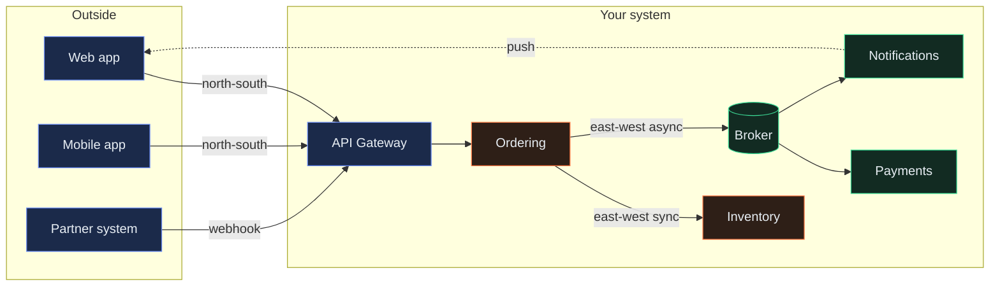

---

## D2 — Synchronous vs asynchronous
*Section 2. Hero SVG: [`images/svg/d2-sync-vs-async.svg`](../images/svg/d2-sync-vs-async.svg)*

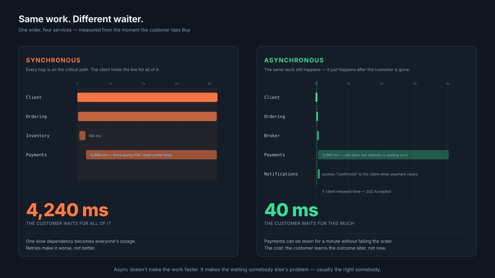

*[PNG for LinkedIn](../images/png/d2-sync-vs-async.png)*

**Synchronous — the caller waits, and inherits every downstream delay**

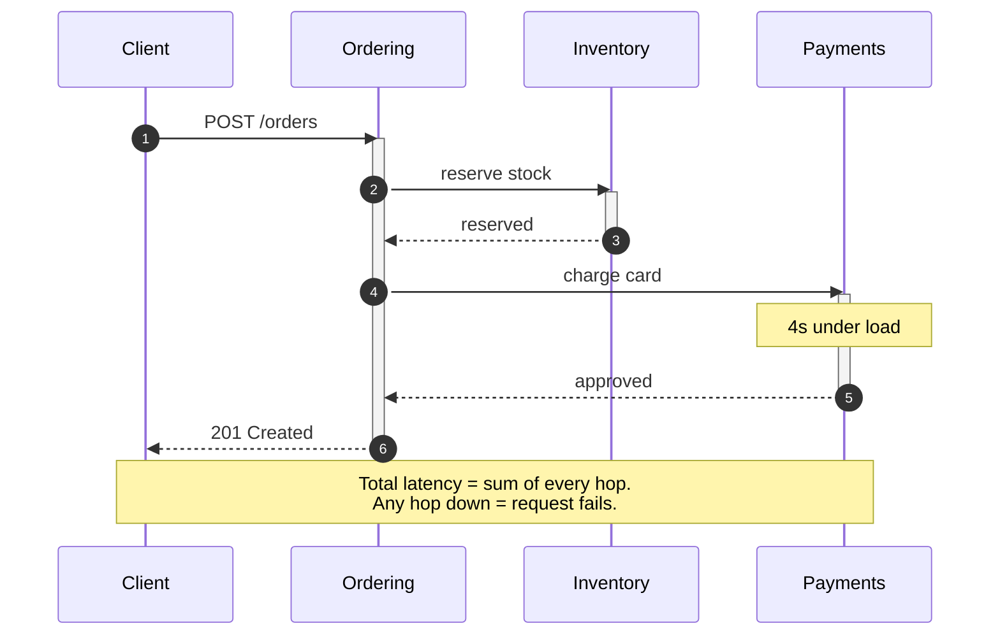

**Asynchronous — the caller commits and leaves**

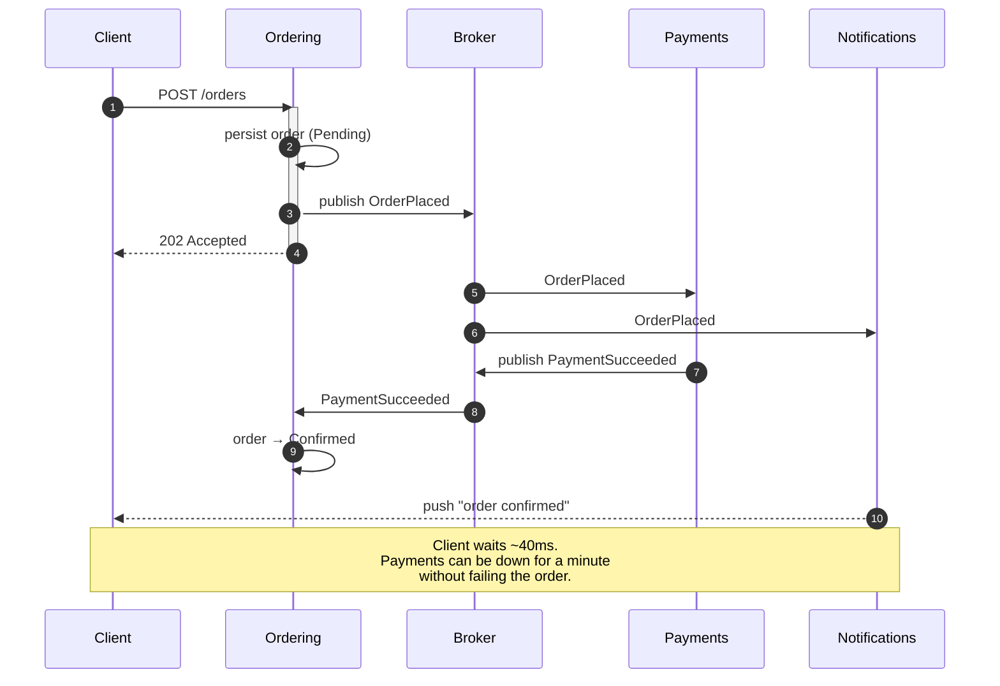

---

## D3 — Commands vs events
*Section 3. The distinction that drives every later decision.*

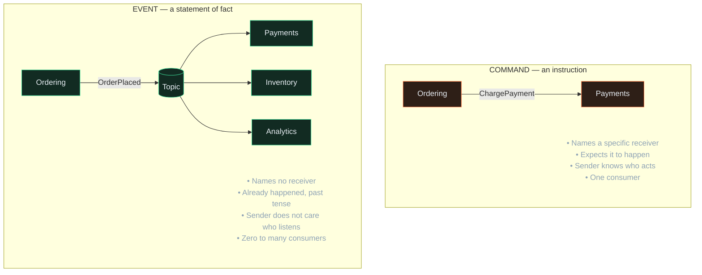

---

## D4 — Choosing a broker
*Section 4. Hero SVG: [`images/svg/d4-broker-decision.svg`](../images/svg/d4-broker-decision.svg) — the most shareable asset in the set.*

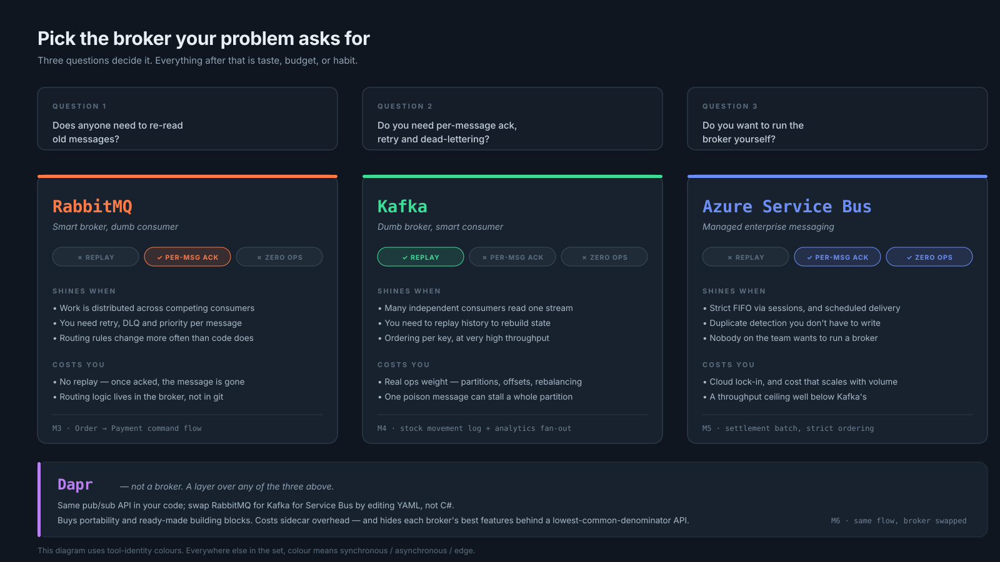

*[PNG for LinkedIn](../images/png/d4-broker-decision.png)*

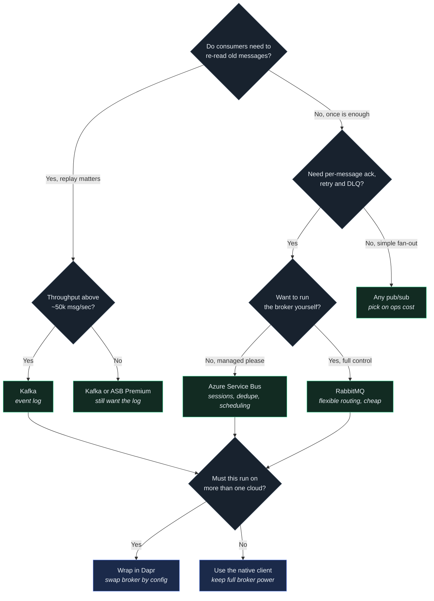

---

## D5 — Gateway and BFF topology
*Section 5.*

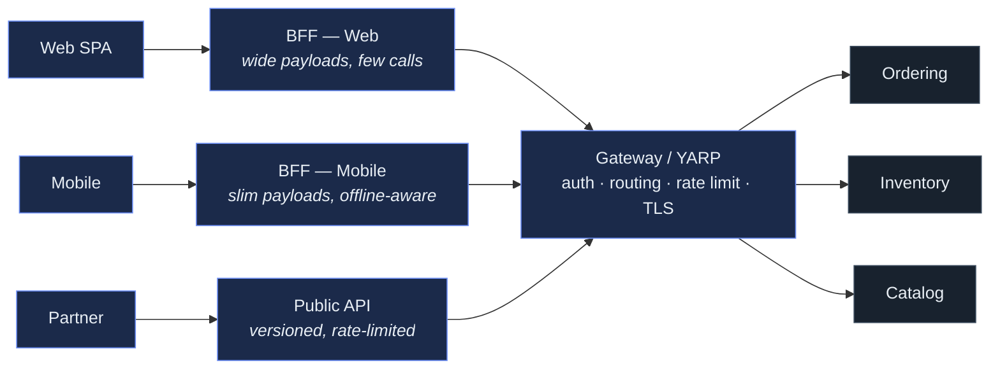

---

## D6 — Bounded contexts and data ownership
*Section 6. "Customer" means four different things here — and that is correct, not a bug.*

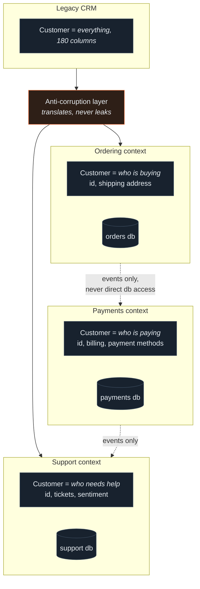

---

## D7 — Saga: choreography vs orchestration
*Section 7a. Hero SVG: [`images/svg/d7-saga.svg`](../images/svg/d7-saga.svg)*

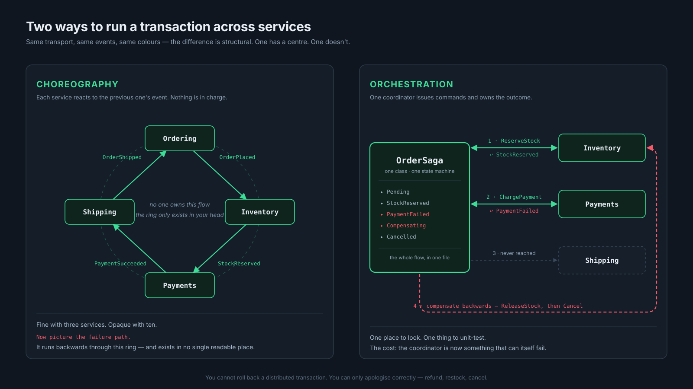

*[PNG for LinkedIn](../images/png/d7-saga.png)*

**Choreography — no coordinator; each service reacts**

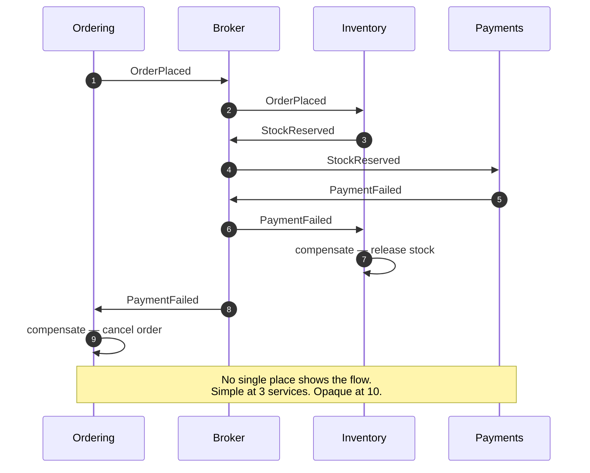

**Orchestration — one coordinator owns the flow**

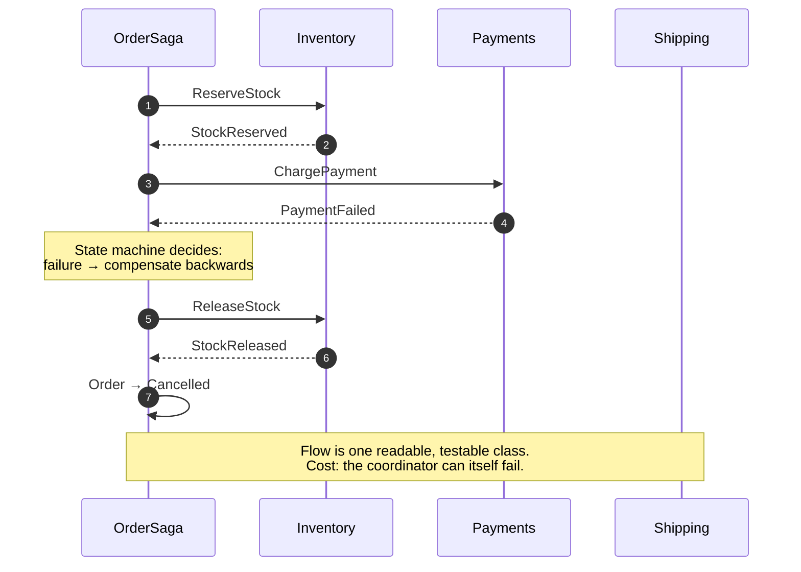

---

## D8 — The dual-write problem and the Outbox
*Section 7b.*

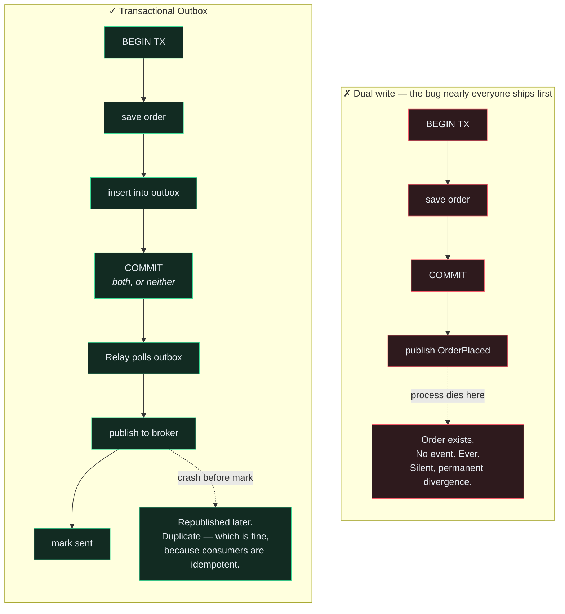

---

## D9 — Resilience layers
*Section 7c. Order matters — each layer only works because the one outside it exists.*

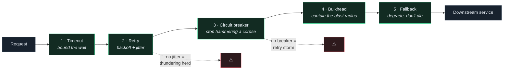

---

## D10 — One trace, five services
*Section 8. The article's payoff image — context propagating across HTTP **and** the broker.*

```mermaid
gantt
    title trace_id 4bf92f3577b34da6 — total 214ms
    dateFormat SSS
    axisFormat %Lms

    section Gateway
    POST /orders                  :a1, 000, 214ms
    section Ordering
    handle request                :a2, 012, 38ms
    db write + outbox             :a3, 020, 22ms
    section Broker
    OrderPlaced in flight         :crit, a4, 052, 18ms
    section Payments
    consume OrderPlaced           :a5, 070, 96ms
    call PSP (external)           :a6, 082, 78ms
    section Notifications
    consume OrderPlaced           :a7, 070, 24ms
    SignalR push                  :a8, 090, 8ms
```

---

## Production status

| ID | Mermaid | Hero SVG | Carousel slide |
|---|---|---|---|
| D1 | ✅ | ✅ | ✅ |
| D2 | ✅ | ✅ | ✅ |
| D3 | ✅ | — | ✅ |
| D4 | ✅ | ✅ | ✅ |
| D5 | ✅ | — | — |
| D6 | ✅ | — | ✅ |
| D7 | ✅ | ✅ | ✅ |
| D8 | ✅ | — | ✅ |
| D9 | ✅ | — | ✅ |
| D10 | ✅ | — | ✅ |

Any Mermaid diagram can be promoted to a hero SVG on request — say which.
