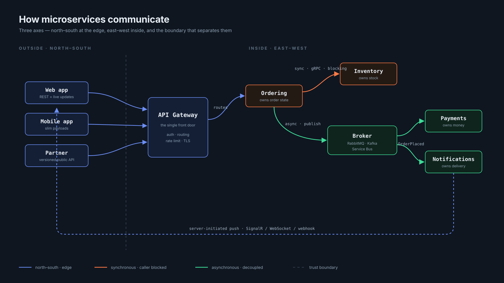

# Chapter 1 — The Three Axes

← [The running example](00-the-example.md) · [Tutorial index](README.md) · Next: [Chapter 2 — Synchronous](02-synchronous.md)

---

## The story so far

It is your first week on the backend team at the store. Last year the team split their monolith into six services. Everyone agrees this was the right thing to do. Nobody can quite explain how the pieces fit together any more.

Your manager asks you to draw the system on one page. This chapter is that page — and the vocabulary you need to describe what you drew.

---

## In one line

Your services talk in three different directions, and most teams only think about one of them.

---

## The words you need

| Word | Plain meaning |
|---|---|
| **Service** | One program you can deploy on its own. It owns some data and does some job. |
| **Boundary** | The line around a service. Inside the line is yours. Outside the line you must ask. |
| **Coupling** | How much two services need each other. High coupling means changing one forces you to change the other. |
| **Latency** | How long a call takes. Measured end to end, including the network. |
| **Blast radius** | How much breaks when one thing breaks. |
| **Trust boundary** | The edge of your own network. Inside, you can assume callers are your own services. Outside, you assume nothing. |

---

## The store, on one page

Here is what you draw:

```
   Priya's browser ─┐
   Priya's phone  ──┼──►  [ your system ]
   BlueDart        ─┘      Catalog · Inventory · Ordering
   (shipping partner)      Payments · Notifications · Shipping
```

Six services, three kinds of caller. Now the useful part: **the arrows are not all the same kind of arrow.** There are three distinct kinds, and they have completely different rules.

---

## Axis 1 — East-west: service to service

One of your services calling another of your services. Both inside your network. Both yours.

**In the store:** `Ordering` needs to know whether 2 units of `SKU-88` are in stock, so it asks `Inventory`.

```
Ordering ──── "how many SKU-88?" ────► Inventory
Ordering ◄─── "42 available" ───────── Inventory     (12 ms)
```

Why it is called east-west: on an architecture diagram, services sit in a row and call each other sideways.

Almost every microservices article is about this axis. It matters — but it is one third of the problem.

---

## Axis 2 — North-south: the outside world to your system

Traffic crossing your **trust boundary**. Priya's phone. Her browser. BlueDart's server calling you when a parcel is scanned.

**In the store:** Priya taps *Buy now*. Her phone sends `POST /orders` to you.

North-south is different from east-west in every way that matters:

| | East-west (`Ordering` → `Inventory`) | North-south (Priya's phone → you) |
|---|---|---|
| Can you trust the caller? | Mostly — it is your own code | **No.** Authenticate everything |
| Can you change the caller? | Yes, deploy both together | **No.** Her app version is two years old and still installed |
| How good is the network? | Data-centre switch, ~1 ms | 4G on a train, 300 ms and drops |
| How stable is the contract? | Change it on a Tuesday | **Effectively permanent** |

That last row is the one people underestimate. An internal API you can rename over lunch. The API your mobile app uses is a promise you are stuck with for years.

---

## Axis 3 — The boundary itself: who owns what

This axis is not a network call at all. It is about where you drew the lines, and which service owns which piece of data.

**In the store, a real question:** who owns Priya's shipping address?

- `Ordering` needs it to fulfil the order.
- `Shipping` needs it to print a label.
- `Notifications` needs it to say "arriving at Flat 4B".

Three services need it. **Exactly one should own it.** If two of them can write it, you have a problem that no amount of good messaging will fix.

---

> **Diagram: D1 — The communication landscape**
> [`images/svg/d1-landscape.svg`](../images/svg/d1-landscape.svg) · [Mermaid source](../diagrams/README.md#d1--the-communication-landscape)



---

## Why axis 3 matters most

Here is the claim, stated plainly:

> Most teams obsess over axis 1, under-invest in axis 2, and skip axis 3 entirely. Skipping axis 3 is what produces a **distributed monolith** — the worst of both worlds.

A distributed monolith has all the operational cost of microservices (many deploys, network calls, distributed debugging) and none of the benefit (independent deployment, independent failure, independent teams).

You get one by splitting the code without splitting the ownership.

### What that looks like in the store

Suppose last year the team split `Ordering` and `Inventory` into two services — but to save time, both kept pointing at the original database.

It looks like two services. There are two repos, two pipelines, two dashboards. But:

- Both connect to the same database.
- Both read and write the `Products` table.
- `Ordering` reads `Inventory`'s `StockLevels` table directly, because "it is faster than an API call".

**What have they actually built?** One service with extra network hops. Here is the proof:

| Test | Result |
|---|---|
| Can you deploy `Inventory` alone? | No — a schema change breaks `Ordering` |
| Can you scale them separately? | Not usefully — they share the same database bottleneck |
| Can a slow query in `Ordering` hurt `Inventory`? | Yes. Same database, same connection pool |
| Can the Inventory team change their own tables? | Not without asking the Ordering team |

The network calls made everything slower and harder to debug. The team got nothing back.

**This is the single most common way microservices go wrong**, and it is why chapter 6 exists.

---

## Sharp edges

**Edge 1 — East-west security is not optional any more.** "Inside the trust boundary means no auth needed" used to be acceptable. With shared clusters and supply-chain attacks, that assumption is dead. Modern practice is service-to-service identity — mTLS via a service mesh, or signed tokens. Treat the trust boundary as *thin*, not *absent*.

**Edge 2 — A north-south contract is forever.** You can refactor an internal API on a Tuesday afternoon. You cannot refactor the API Priya's phone uses without a migration measured in months, because you do not control when she updates the app. Some customers never update.

**Edge 3 — Boundaries are expensive to move later.** Changing which service owns the `Customers` table is a data migration plus a code change plus a coordinated deploy across every service that touches it. This is why axis 3 deserves the most thought up front, even though it feels like the least urgent thing on your first week.

---

## When to use what — the short version

You will get the full framework in [chapter 11](11-decision-framework.md). The one-line version:

- Caller **cannot continue** without the answer, and the answer is fast → **synchronous** ([chapter 2](02-synchronous.md))
- Caller **can continue** → **asynchronous** ([chapter 3](03-asynchronous.md))
- Traffic **crosses your boundary** → put a **gateway** in front of it ([chapter 5](05-gateway-and-bff.md))
- Two services want the **same table** → you drew the boundary wrong ([chapter 6](06-boundaries-and-data.md))

---

## Try it yourself

Take a system you work on now. On one page, draw:

1. Every service as a box.
2. Every synchronous call as a **solid arrow**.
3. Every message or event as a **dashed arrow**.
4. Every database as a cylinder, connected to the services that **write** to it.

Then answer three questions honestly:

| Question | What the answer tells you |
|---|---|
| **Q1.** Is there a cylinder with more than one solid arrow into it? | That is a shared database. Axis 3 is broken. Start here |
| **Q2.** What is the longest chain of solid arrows for one user request? Multiply hops × average call time | That number is your latency floor, before any real work happens |
| **Q3.** Which single box, if it went down, takes the most other boxes with it? | That is your blast radius. Chapter 9 is about shrinking it |

Keep this drawing. You will use it again in chapters 6, 9, and 11.

---

## What is still broken

Nothing yet — you have only drawn a map. But the map has told you where to look.

In the store, that map shows one arrow that should worry you: **`Ordering` calls `Payments` synchronously, and waits.** Acme Pay normally answers in 800 ms, which feels fine.

Next chapter is the night it does not answer in 800 ms.

---

← [The running example](00-the-example.md) · [Tutorial index](README.md) · Next: [Chapter 2 — Synchronous communication](02-synchronous.md)
