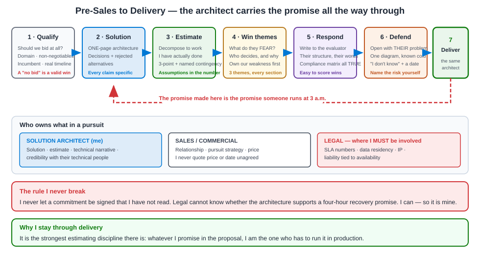

# 06 · RFP & Pre-Sales (7 questions)

[← Client Engagement](05-client-engagement.md) · [Home](README.md) · [Next → Support & Post-Delivery](07-support-post-delivery.md)

Pre-sales is where an architect earns disproportionate value, because the solution architect is usually the only person in the pursuit who will still be there when it has to be built. That is my whole approach: **I write proposals I am willing to be held to.**



*Figure 6.1 — The pre-sales funnel. The dotted line is the one that matters: the promises made at the top are the ones someone has to run at the bottom.*

**Jump to:** [R1](#r1--walk-me-through-how-you-led-an-rfp-response) · [R2](#r2--how-do-you-build-the-solution-outline) · [R3](#r3--how-do-you-estimate-effort-for-something-you-have-not-built-before) · [R4](#r4--how-do-you-build-a-win-strategy) · [R5](#r5--how-do-you-work-with-sales-commercial-and-legal) · [R6](#r6--the-rfp-has-a-requirement-you-cannot-meet-what-do-you-do) · [R7](#r7--how-do-you-defend-the-solution-in-front-of-an-evaluation-panel) · [Response outline](#the-response-outline-i-reuse) · [Checklist](#the-checklist-i-run-every-time)

---

## R1 · Walk me through how you led an RFP response.

**Situation.** A client in the investment-management space issued a request covering a reporting and data-integration platform: ingest from a third-party investment system, build a reporting layer, and take on production support. It sat exactly on my experience, and I led the technical response.

**Task.** Own the solution, the estimate and the technical narrative, and coordinate with the people who own the commercial and legal parts.

**Action.** I run every response the same way, in five stages.

**Stage one — qualify honestly, before writing anything.** The first question is not "how do we win?" It is **"should we bid?"** I look at four things: do we understand the domain, can we meet the non-negotiable requirements, is there an incumbent who will be very hard to displace, and is the timeline real. A bid takes serious senior time. Bidding on something you cannot win costs you the one you could have won. I have recommended not bidding, and being willing to say that is what makes the recommendations to bid credible.

**Stage two — read the document for what is not written.** Every RFP has a story underneath it. Which requirements are described in unusual detail? That is where they have been burned before. Is there a section on support and SLAs that is longer than the build section? Then the real pain is operational, and the proposal should be built around that. I write down my read of "what this client is actually worried about" before I write any solution, and I test it in the clarification round.

**Stage three — solution outline before words.** Boxes, data flow, integration points, hosting. If I cannot draw it on one page, I do not understand it well enough to write about it. See [R2](#r2--how-do-you-build-the-solution-outline).

**Stage four — estimate bottom-up, then sanity-check top-down.** See [R3](#r3--how-do-you-estimate-effort-for-something-you-have-not-built-before).

**Stage five — write to the evaluator, not to myself.** Evaluators score against criteria, often with a scoring sheet. So I answer in their structure and their words, I make it easy to find each answer, and I do not make them hunt. A brilliant solution that is hard to score loses to an adequate one that is easy to score. That is not cynicism; it is respect for the person doing the evaluation.

**Result.** A response that was technically defensible, priced on a real work breakdown, and structured around what the client was actually anxious about — which was the daily deadline and the support model, not the build.

**Lesson.** *"An RFP is not a technical document. It is a risk-reduction document. The client is not buying a design; they are buying confidence that this will work and that you will still be there when it does not."*

**Follow-ups**

- *"How long does a response take?"* — Days of concentrated senior time, not hours. If the timeline does not allow it, that is itself a qualification signal.
- *"What is the most common mistake you see?"* — Answering the question the team wishes had been asked. Teams describe their favourite architecture instead of the client's problem.
- *"How do you handle the clarification round?"* — I use it deliberately. Good clarification questions are a marketing exercise in their own right — they show the evaluator you have read the document properly and thought about the edges.

---

## R2 · How do you build the solution outline?

**Situation.** The solution outline is the core of the technical response — the thing an evaluator looks at first and remembers.

**Task.** Communicate a credible solution to a mixed audience: technical evaluators who will probe the detail, and business evaluators who need to believe the outcome.

**Action.** I build it in a fixed order, and the order matters because it forces me to lead with their world rather than mine.

**One — the current-state and problem statement, in their words.** One short section proving I understood the brief. Evaluators are reading many responses; the ones that open by demonstrating comprehension immediately stand out from the ones that open with the vendor's credentials.

**Two — the target architecture on a single page.** One diagram. Boxes, data flow, integration points, hosting. If it needs two pages, the solution is not clear enough yet. I annotate it directly with where each RFP requirement is met, so an evaluator can trace a requirement to a box without reading prose.

**Three — the key design decisions, with the alternatives.** This is the section that separates a real architect's response from a templated one. For each major decision: what I chose, what I rejected, and why — in terms of *their* constraint, not general best practice. "We land data into an operational store and a separate analytical store, so a heavy historical query can never slow the report that has your morning deadline." That sentence is worth more than three pages of platform description.

**Four — how the non-functional requirements are met, specifically.** Availability, recovery, security, performance, and the deadline. With numbers. This is where most responses go vague and where a good one wins, because it is exactly where the evaluator's anxiety lives.

**Five — delivery approach, team shape and timeline.** Who does what, in what order, and what the client has to provide. Naming client dependencies is not defensive; it is what an experienced supplier does, and evaluators recognise it.

**Six — the transition to support.** Covered in [Support & Post-Delivery](07-support-post-delivery.md). Including it unprompted signals that you have run systems, not just built them.

The style rule I hold to: **every claim is either specific or cut**. "Robust, scalable and secure" scores nothing. "Recovers from a failed load by replaying from the last checkpoint, without duplicating data" scores.

**Result.** An outline an evaluator can score quickly, a technical reviewer can interrogate, and a delivery team can actually build from — because the same person wrote it and will run it.

**Lesson.** *"Write the solution so the evaluator can find the answer without hunting, and so the delivery team can build it without a translation layer. If those two are different documents, one of them is wrong."*

**Follow-ups**

- *"How much detail is too much?"* — If it does not change the evaluator's confidence or their score, it is too much. Depth goes in appendices.
- *"Do you reuse material?"* — Patterns and diagrams yes, narrative no. A recycled narrative is obvious immediately and it reads as "we did not think about you".
- *"How do you show credibility?"* — Concrete, comparable delivery — a similar integration, a similar deadline, a similar regulated environment — with the actual outcome. Not a logo wall.

---

## R3 · How do you estimate effort for something you have not built before?

**Situation.** Every serious estimate has this problem. On the reporting and integration proposal, one part was well understood, and one part — the depth of the third-party integration — depended on information we did not have.

**Task.** Produce a number I can defend, and be honest about the uncertainty without hiding behind it.

**Action.** Four steps.

**One — break it down until the pieces are things I have done.** I decompose to a level where each item resembles work I have actually delivered. "Build the integration" is not estimable. "Ingest one entity type with validation, reconciliation and error handling" is — because I have built exactly that, more than once, and I know what it costs. Then I multiply by the number of entity types. Estimation accuracy comes almost entirely from decomposition depth.

**Two — estimate three points, not one.** Best case, likely, and worst case for each item. The spread is information — it tells me and the client where the actual risk sits. An item where the worst case is four times the best case is not an estimate problem; it is a flagged risk that needs a discovery activity.

**Three — separate the estimate from the contingency, visibly.** I never quietly pad. I give the estimate and then a named contingency with the reason attached: "plus this much, held against the unknown depth of the third-party integration". Hidden padding gets negotiated away by someone who suspects it is there. Named contingency with a reason survives, because it is a risk conversation rather than a price conversation.

**Four — cross-check top-down.** Once I have the bottom-up total, I compare it to a comparable delivery I have actually done. If bottom-up says twelve weeks and my instinct from a similar programme says six months, one of them is wrong and I find out which before the number leaves the building. This check has saved me more than once — usually because the bottom-up missed environment setup, data migration, or UAT support, which are the three things everyone underestimates.

And I always state the assumptions **as part of the number**, not in an appendix. "This assumes the third-party API provides X, that environments are available by week two, and that one client BA is available half-time." An estimate without assumptions is not an estimate; it is a guess with a decimal point.

**Result.** Numbers that survive scrutiny, because the client can see the build-up and challenge an assumption rather than just challenge the total. That reframes the negotiation from "too expensive" to "let us look at this assumption together" — which is a conversation you can win.

**Lesson.** *"Estimate what you know, name what you do not, and put the assumptions inside the number. A defensible range beats a confident-looking figure you cannot explain."*

**Follow-ups**

- *"What if sales says the number is too high to win?"* — I do not change the estimate. I offer to change the scope or the phasing, and I show what each option removes. Cutting the number without cutting the work is how you win a bid and lose the delivery.
- *"How do you estimate discovery-heavy work?"* — Fund a short paid discovery as phase one with a firm price, and price the rest after it. Clients respect this far more than a large number with a large disclaimer.
- *"How accurate are you?"* — Good on decomposed, familiar work. Less good on anything that depends on a third party's behaviour — which is exactly why that part gets a named contingency rather than false confidence.

---

## R4 · How do you build a win strategy?

**Situation.** Winning is not about being the best on paper. It is about being the lowest-risk credible choice for the specific people making the decision.

**Task.** Work out why *this* client would choose *us*, and make that thread run through the whole response.

**Action.** I answer four questions before anyone writes a word.

**One — what is the client actually buying?** Rarely the technology. Usually certainty. On a reporting platform with a daily deadline, they are buying "this will be ready before the market opens, every day, and someone competent will answer the phone when it is not". If the response is built around that sentence, the technology sections become supporting evidence rather than the argument.

**Two — who decides, and what does each of them fear?** The technical evaluator fears a design that will not scale or a supplier who cannot go deep. The business sponsor fears an overrun and a bad headline. Procurement fears an uncontrolled price. Security fears an audit finding. Each of those fears needs to be answered somewhere in the document, ideally in the section that person reads.

**Three — what are our real differentiators, honestly?** Not marketing claims. For an engagement like this, mine are genuinely specific: deep experience integrating a third-party investment platform into both an operational and an analytical store; delivering to a hard daily reporting window in regulated environments; and an architect who stays through delivery and support rather than handing over after signature. I only claim things I can evidence with a delivery.

**Four — where are we weak, and what do we do about it?** Every bid has a weakness. Maybe a competitor is the incumbent. Maybe our price is higher. The mistake is ignoring it and hoping the evaluator does not notice — they always notice. The right move is to address it in our own words, on our own terms. If we are more expensive, the response makes the case for total cost over time rather than pretending the difference does not exist.

Then I write **three win themes** and repeat them consistently through the document — in the executive summary, in the solution, in the delivery approach, in the support model. Repetition is how a message survives an evaluation panel where different people read different sections.

**Result.** A response that reads as one argument rather than a set of assembled sections, and that speaks to each evaluator's specific anxiety.

**Lesson.** *"Work out what they are afraid of, then build the response around removing that fear. Everything else is supporting evidence."*

**Follow-ups**

- *"What if there is an incumbent?"* — Then transition risk is the real battleground, and I address it head-on with a detailed, low-risk transition plan. Vague reassurance loses to a named incumbent every time.
- *"What if we are clearly not the cheapest?"* — Compete on total cost and risk, with specifics: fewer incidents, faster releases, less rework. And accept that on a pure price-driven procurement, sometimes the right answer is not to bid.
- *"How do you know what they fear?"* — The RFP tells you, in what it over-specifies. And I ask directly in the clarification round.

---

## R5 · How do you work with sales, commercial and legal?

**Situation.** In a pursuit I am one of several people, and the architect who treats the commercial team as an obstacle produces proposals that are technically excellent and commercially unsignable.

**Task.** Be the technical authority in the pursuit while genuinely helping the commercial and legal work rather than fighting it.

**Action.** How I split it in practice.

**With sales**, my job is to be the credibility. Sales owns the relationship and the strategy; I own whether the client's technical people believe us. The place I add most value is in the meeting where the client's architect probes the solution — that conversation is won on substance, and sales cannot win it. In exchange, I do not freelance on commercial terms, and I never quote a price or a date in a client meeting without agreement. That discipline is what earns me a seat in the early conversations.

**With commercial and pricing**, my job is to make sure the price is built on a real work breakdown, and to be very clear about what is included. The most valuable thing I do here is define the **boundary of scope precisely** — what is in, what is explicitly out, and what depends on the client. Most delivery disputes come from an undefined edge, not from a disagreed price.

**With legal**, the areas where I have to be involved are specific and I have learned not to skip them: **service levels** (a legally binding SLA must match what the architecture can actually deliver — I have seen an SLA written by someone who had never seen the design), **data protection and residency** (a clause committing to something the architecture does not do is my problem, not legal's), **intellectual property** on anything reusable I build, and **liability tied to availability**, which must be consistent with the recovery design.

The rule I follow: **I never let a commitment be signed that I have not read.** If my name is on the solution, I read the SLA and the data clauses. Legal cannot know whether the architecture supports a four-hour recovery commitment; I can, and that makes it my responsibility.

**Result.** Proposals where the technical solution, the price and the contractual commitments actually match — so delivery starts without renegotiating what was sold.

**Lesson.** *"The architect's job in a pursuit is to make sure we do not sign up to something the architecture cannot do. Nobody else in the room can check that."*

**Follow-ups**

- *"What if sales promises something you cannot deliver?"* — I raise it internally immediately and privately, and we fix it before it reaches the client. In front of the client we are one team.
- *"Have you pushed back on an SLA?"* — Yes. A proposed recovery commitment was tighter than the design supported. Options were: change the number, or change the architecture and the price. We changed the number, with the client, before signature — which is a five-minute conversation before signing and a dispute afterwards.
- *"How technical should the proposal be?"* — Layered. Executive summary for the sponsor, solution section for the technical evaluator, appendices for the deep detail. One document, three reading depths.

---

## R6 · The RFP has a requirement you cannot meet. What do you do?

**Situation.** This is common and it is a test of integrity that clients are watching for. A recent example: a requirement specifying a technology standard that was not the best fit for the outcome they described.

**Task.** Do not lie, and do not lose the bid unnecessarily.

**Action.** I first work out which of three cases it is, because the response differs.

**Case one — we cannot meet it and it is genuinely mandatory.** Then either we partner to cover it, or we do not bid. Bidding while quietly hoping it will not be noticed is how you win a contract you then breach. I have recommended withdrawing, and it protected the relationship for the next opportunity.

**Case two — we can meet the underlying need a different way.** This is the most common case by far. The requirement describes a *solution* the client has assumed, when what they need is an *outcome*. Here I answer honestly and directly: "We do not do it that way. Here is how we meet the underlying need, and here is why we believe it serves your stated outcome better." Then I let them judge. Sometimes the requirement was written by someone repeating what a previous vendor said, and a well-argued alternative is welcomed. Sometimes it is genuinely fixed, and I have lost that point — but I have lost it honestly, and evaluators notice which vendors were straight with them.

**Case three — we can meet it, but it is a bad idea.** I comply and say so. I mark it compliant, and add a short, non-preachy note: here is the consequence, here is what we would recommend instead, happy to discuss. That is the [C5](05-client-engagement.md#c5--how-do-you-say-no-to-a-client) pattern applied to a document.

What I never do is mark something compliant when it is not. Compliance matrices get audited during delivery, and a false "yes" in a bid becomes a contractual failure later — one that is far more expensive than the point it won.

**Result.** Responses where every compliance answer is true, and where the alternatives we proposed were taken seriously because the rest of the document had been straight.

**Lesson.** *"Answer honestly and argue your case. A lost point you were honest about costs less than a won point you cannot deliver."*

**Follow-ups**

- *"Does honesty lose bids?"* — Occasionally. It also wins them — evaluators compare responses, and the one that admits a limitation while others claim everything reads as the more credible document.
- *"What if the requirement is simply outdated?"* — I say so respectfully, with the reasoning and the alternative. Politely challenging a stale requirement often signals more expertise than complying with it.
- *"Partnering to cover a gap?"* — Yes, and I am explicit about who does what and where the integration seam is. Hiding a partner behind your own name is a risk the client should get to assess.

---

## R7 · How do you defend the solution in front of an evaluation panel?

**Situation.** The oral stage. The written response got us here; this session decides it. The panel is usually mixed — a sponsor, a technical evaluator, sometimes procurement and security.

**Task.** Be believed. Panels are not scoring the architecture in isolation; they are deciding whether they want to work with this person for the next two years.

**Action.** Five things.

**One — I open with their problem, not our credentials.** The first ninety seconds should prove we understood the brief. Opening with company history wastes the only part of the session where everyone is fully attentive.

**Two — I bring one diagram and I know it cold.** One page, walked through in plain language, no jargon. I can answer at any depth from it. Slides that require me to read them signal that someone else built the solution.

**Three — I answer the question that was asked.** Panels notice evasion instantly, and it is the fastest way to lose a room. If I do not know, I say "I do not know — here is how I would find out, and I will come back to you by Thursday." Then I actually do, by Thursday. That single behaviour has won more credibility for me than any technical answer.

**Four — I bring the delivery person, not just the sales team.** If I will be the architect on the engagement, the panel needs to meet me and believe me. Panels are quietly assessing whether the people in the room are the people who will show up on day one. Where I have seen bids lost, this was often why.

**Five — I prepare for the two questions I do not want.** Every solution has a soft spot — a cost, a dependency, a limitation. I prepare a straight answer for each, in advance, so I am calm rather than defensive. Defensiveness on a weak point does more damage than the weakness itself.

The closing I use: restate the three things that make us the low-risk choice, name the biggest risk in the engagement, and say how we would manage it. Naming the risk yourself at the end is counter-intuitive and it works — it reads as confidence and experience rather than as a warning.

**Result.** Sessions where the panel's technical evaluator ends up in a genuine working discussion rather than an interrogation. That shift is the signal you have won them.

**Lesson.** *"Panels buy the person as much as the solution. Answer straight, admit the gaps, and let them see who will actually turn up on day one."*

**Follow-ups**

- *"What if a panel member is hostile?"* — Usually they have been burned before, or they backed another option. I take the question seriously and answer it fully. Winning over the sceptic is worth more than pleasing the friendly one.
- *"How do you handle a question aimed at a colleague?"* — Let them answer. Talking over your own team in a panel tells the client exactly how you will behave in delivery.
- *"How do you prepare?"* — A dry run with someone briefed to be difficult, plus the two-hard-questions preparation above.

---

## The response outline I reuse

A reusable skeleton. I adapt the wording to the client's structure — never the other way round.

```text
1.  EXECUTIVE SUMMARY                                    (1 page, sponsor-readable)
    1.1  Our understanding of your objective            — in their words
    1.2  The three reasons to choose us                 — the win themes
    1.3  Headline commercials and timeline
    1.4  The main risk, and how we manage it            — naming it builds trust

2.  UNDERSTANDING OF REQUIREMENTS
    2.1  Current state as we understand it
    2.2  The outcomes you have asked for
    2.3  Constraints and non-negotiables we have noted
    2.4  Assumptions we have made                        — explicit, numbered

3.  SOLUTION
    3.1  Target architecture                             — ONE annotated page
    3.2  Component walkthrough                           — data flow, integrations, hosting
    3.3  Key design decisions and rejected alternatives  — this section wins bids
    3.4  Non-functional requirements                     — availability, recovery, security,
                                                           performance, with NUMBERS
    3.5  Security and compliance position
    3.6  Data model and integration contracts            — summary, detail in appendix

4.  DELIVERY APPROACH
    4.1  Phasing and milestones
    4.2  Team shape and named key roles                  — name the architect
    4.3  Governance, reporting cadence, decision forums
    4.4  Testing and quality strategy
    4.5  What we need from you                           — client dependencies, stated plainly
    4.6  Risks and mitigations                           — top 5 only, with owners

5.  TRANSITION TO SUPPORT
    5.1  Support model, hours, and escalation path
    5.2  Service levels and how they are measured
    5.3  Runbooks and knowledge transfer
    5.4  Continuous improvement / what year two looks like

6.  COMMERCIALS
    6.1  Price breakdown by phase
    6.2  Basis of estimate and assumptions               — assumptions INSIDE the number
    6.3  Change control mechanism
    6.4  What is explicitly out of scope                 — prevents most later disputes

7.  WHY US
    7.1  Comparable delivery                             — similar domain, similar constraint
    7.2  Measurable outcomes achieved elsewhere
    7.3  Named team credentials

APPENDICES
    A.  Compliance matrix                                — every answer TRUE
    B.  Detailed architecture and sequence diagrams
    C.  Detailed estimate breakdown
    D.  CVs of named key roles
```

---

## The checklist I run every time

The full version, including the pre-sales activity checklist, is in [Checklists](12-checklists.md). The short form:

| Stage | Check | Why it matters |
|---|---|---|
| **Qualify** | Do we understand the domain? | Bidding blind burns senior time you need elsewhere |
| | Can we meet every non-negotiable? | See [R6](#r6--the-rfp-has-a-requirement-you-cannot-meet-what-do-you-do) |
| | Is there an incumbent, and can we displace them? | Transition risk decides these bids |
| | Is the timeline real? | An impossible timeline is a qualification signal |
| **Read** | What is over-specified? | That is where they were burned before |
| | Is the support section longer than the build section? | Then the real pain is operational |
| **Solve** | Does the architecture fit on one page? | If not, it is not clear yet |
| | Is every claim specific, or is it adjectives? | "Robust and scalable" scores zero |
| | Are rejected alternatives written down? | This section separates architects from templates |
| **Estimate** | Decomposed to work I have actually done? | Accuracy comes from decomposition depth |
| | Three-point, with contingency named not hidden? | Hidden padding gets negotiated away |
| | Cross-checked against a comparable delivery? | Catches the missing UAT/migration/environment effort |
| | Assumptions inside the number? | An estimate without assumptions is a guess |
| **Commit** | Have I personally read the SLA and data clauses? | Nobody else can check the architecture supports them |
| | Is out-of-scope explicitly written? | Prevents most delivery disputes |
| **Win** | Three win themes, repeated in every section? | Different evaluators read different sections |
| | Have we addressed our own weakness in our words? | They will notice it anyway |
| **Defend** | Is the delivery architect in the room? | Panels buy the person who will turn up |
| | Prepared for the two questions I do not want? | Defensiveness costs more than the weakness |

---

## Section index

| # | Question | Core message |
|---|---|---|
| R1 | Leading an RFP response | An RFP is a risk-reduction document, not a technical one |
| R2 | Building the solution outline | One page; every claim specific; rejected alternatives written down |
| R3 | Estimating the unknown | Decompose to work you have done; assumptions inside the number |
| R4 | Win strategy | Find what they fear; build the response around removing it |
| R5 | Sales, commercial and legal | Never let a commitment be signed that you have not read |
| R6 | A requirement you cannot meet | Answer honestly; argue the alternative; never a false compliant |
| R7 | Defending to a panel | Answer straight, admit gaps, name the risk yourself at the close |

---

[← Client Engagement](05-client-engagement.md) · [Home](README.md) · [Next → Support & Post-Delivery](07-support-post-delivery.md)
