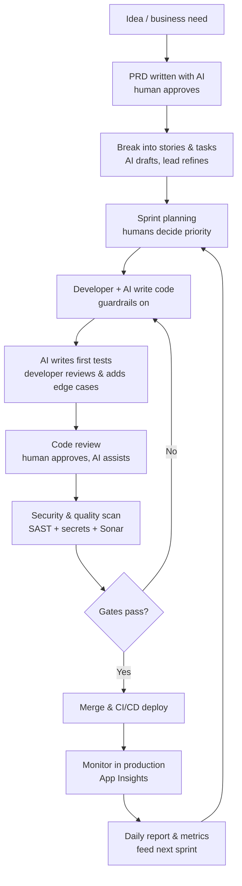

# 20 · Setting Up AI-Assisted Development in a Team (start to end)

[← Performance Deep Dive](19-performance-deep-dive.md) · [Home](README.md) · [Next → Objections & Tough Questions](21-objections-and-tough-questions.md)

This is my complete playbook for bringing AI into how a team builds software — from the first pilot to a steady, safe, measured way of working. I am well placed to run this: on TCW (B) I defined the firm's AI/LLM reference architecture and shipped its first production RAG app, so I have already done the *"make AI safe and useful in a regulated firm"* work — and I use GitHub Copilot in my own daily coding.

> How I frame this to leadership: *"AI does not replace the engineer — it speeds up the engineer. My job is to set it up so we go faster **without** losing quality, security, or control. I do that with clear roles, guardrails, and metrics — the same way I run any production system."*

**The golden rule I repeat everywhere:** *the human is accountable for every line, whether they typed it or the AI did.* AI is a very fast junior pair-programmer — helpful, but always reviewed.

**Jump to:**
[The big picture](#the-big-picture-end-to-end-flow) · [1 Where to start](#1--where-to-start-the-pilot) · [2 Roles](#2--roles-and-who-does-what) · [3 Controlling AI while coding](#3--controlling-ai-behaviour-while-writing-code) · [4 QA with AI](#4--qa-and-testing-with-ai) · [5 Security](#5--security-with-ai) · [6 Metrics](#6--performance-metrics-how-we-know-its-working) · [7 Daily reporting](#7--daily-report-and-sprint-rhythm) · [8 Order of work in a sprint](#8--the-order-of-work-in-a-sprint) · [9 Writing the PRD](#9--writing-the-prd-with-ai) · [10 Rollout plan](#10--the-rollout-plan-90-days) · [Q&A](#interview-qa-on-this-topic)

---

## The big picture (end-to-end flow)

Here is the whole cycle, from idea to running software, with AI helping at each step but a human owning each gate.

Every box has AI helping and a human accountable. That balance is the whole point.

---

## 1 · Where to start (the pilot)

**Do not roll out to everyone on day one.** I start with a small, safe pilot so we learn without risk.

1. **Pick a small team and a low-risk project.** One squad, an internal or non-critical service — somewhere a mistake is cheap and lessons are fast.
2. **Choose the tools deliberately.** For coding: GitHub Copilot / an approved assistant. For chat/design: an approved enterprise LLM (data stays inside the company — critical in a regulated firm). Approve the tool list with security first.
3. **Set the guardrails before the first prompt.** Rules for what data can and cannot go into a prompt, what must be reviewed, and where AI output is banned (see [security](#5--security-with-ai)).
4. **Set a baseline.** Measure the team's current cycle time, defect rate and review time *before* AI — so later we can prove the change, not guess it ([metrics](#6--performance-metrics-how-we-know-its-working)).
5. **Run for 4–6 weeks, then review.** Keep what worked, drop what did not, then expand.

**Why start small.** *"A pilot turns opinions into evidence. After six weeks I can show leadership real numbers and a real risk assessment, instead of hype."*

---

## 2 · Roles and who does what

AI works best when responsibilities are clear. These are roles (a person can hold more than one on a small team), not necessarily new hires.

| Role | What they own with AI |
|---|---|
| **AI Champion / Lead (me)** | Owns the whole setup: tools, guardrails, metrics, training. Removes blockers, keeps it safe. |
| **Product Owner** | Writes the PRD with AI help, approves scope, keeps priorities clear so AI builds the *right* thing. |
| **Developers** | Use AI to write code and tests faster — and **review every line**. They stay accountable for what ships. |
| **Reviewer / Senior Dev** | Reviews AI-assisted PRs with extra care for correctness and "looks right but is subtly wrong" bugs. |
| **QA Engineer** | Uses AI to generate test cases and edge cases; verifies AI-written tests actually test the right thing. |
| **Security Champion** | Owns the rules for data-in-prompts, runs the scans, checks AI output for vulnerabilities and licences. |
| **Scrum Master / Delivery Lead** | Tracks the metrics and the daily report; keeps the AI process honest in ceremonies. |

**The one line I insist on:** *"AI has no role that removes human accountability. It assists a role; it never owns a decision."*

---

## 3 · Controlling AI behaviour while writing code

This is the heart of it — how I keep AI-written code consistent, correct and in-house style, not random.

**a) Give the AI the rules in writing.** Modern assistants read repo-level instruction files. I add a **coding-standards / custom-instructions file** to the repo so every suggestion follows our rules:
- our language/framework versions and style (naming, structure, layering — thin controller → service → data, like [F1](14-fullstack-hands-on.md#f1--build-a-clean-aspnet-core-web-api-endpoint));
- "always async for I/O, always pass CancellationToken, always validate input";
- "never put secrets in code, use Key Vault" ([D10](15-deepdive-dotnet.md#d10--configuration-options-and-secrets));
- "write a test for every new function."

**b) Prompt well — give context, not just a wish.** A vague prompt gives vague code. I teach the team to include: the goal, the inputs/outputs, the constraints, and an example. Good context is the difference between usable and useless output.

**c) The developer stays the pilot.** AI suggests; the developer accepts, edits or rejects. Never accept a big block without reading it. If you would not have written it and understood it, do not ship it.

**d) Enforce style automatically anyway.** AI is not trusted to be perfect, so the normal gates still run on every commit: **linter + formatter** (ESLint/Prettier, `ruff`, .NET analyzers) and the build. AI output passes the same gates as human output — no exceptions.

**e) Ban AI in the risky places.** Some code is too sensitive for AI to generate unreviewed — auth logic, cryptography, money calculations. There, AI may explain but a senior writes and reviews.

**Lesson.** *"I control AI code three ways: written rules in the repo so it suggests our style, the developer reading every line, and the same automated gates every human commit faces. Consistency comes from the guardrails, not from hoping the AI behaves."*

---

## 4 · QA and testing with AI

AI is genuinely strong at testing — but it needs supervision.

**How we use it.**
- **Generate the first tests fast.** AI writes the happy-path unit tests from the function, so the developer starts with coverage instead of a blank file ([F11](14-fullstack-hands-on.md#f11--how-do-you-test-what-you-build)).
- **Brainstorm edge cases.** I ask the AI *"what edge cases am I missing?"* — empty input, nulls, huge input, concurrency, bad data. It is a great checklist-generator.
- **Draft test data.** Realistic sample data and fixtures, including the nasty rows.

**How we keep it honest — the danger.** AI can write a test that *passes but tests nothing* (asserts the wrong thing, or mirrors a bug). So the rule is: **a human reviews every AI-written test as carefully as AI-written code.** A test you did not verify is worse than no test — it gives false confidence.

**Where humans still lead.** Exploratory testing, real user-journey thinking, and deciding what "correct" means for the business — AI does not know the domain like the QA engineer does.

**Lesson.** *"AI gives me a fast first draft of tests and a great edge-case checklist. But a test is only worth something if a human confirmed it tests the right thing — I never let AI both write the code and silently bless its own tests."*

---

## 5 · Security with AI

In a regulated firm this is non-negotiable, and it is exactly the muscle I built defining TCW's AI reference architecture (B).

**Two sides of AI security:**

**a) Data going *into* the AI (the biggest risk).**
- **Never paste secrets, customer data, or proprietary code** into a public tool. We use enterprise tools where our data stays in our tenant and is not used to train the model.
- A clear, written policy on what may and may not be shared in a prompt, and training so everyone knows it.
- Prefer tools with the right compliance and data-residency guarantees.

**b) Code coming *out* of the AI.**
- **AI can produce insecure code** — SQL injection, weak crypto, missing validation — because it learned from all kinds of code. So AI output goes through the *same or stricter* security checks:
  - **SAST** (static analysis — SonarQube, [Sonar](19-performance-deep-dive.md)) on every PR;
  - **secret scanning** so a key never lands in the repo;
  - **dependency/SCA scanning** — AI sometimes suggests a package; we check it is real, safe and licensed (AI can "hallucinate" a package name that an attacker then squats).
- **Human security review** for anything touching auth, data access, or money.

**Lesson.** *"Two rules keep AI safe: nothing sensitive goes into the prompt, and nothing insecure comes out unchecked. I put AI output through stricter security scanning than usual, because it can confidently write a vulnerability."*

---

## 6 · Performance metrics (how we know it's working)

I treat this like any change — measured, not assumed. I compare against the baseline from the pilot.

**Delivery speed (is it faster?)**
- **Cycle time** — idea/ticket → in production. Should fall.
- **PR throughput / lead time** — how quickly work moves through review to merge.

**Quality (are we still safe?)** — *watched closely so speed does not cost quality.*
- **Defect / bug rate** in QA and production. Must **not** rise — if it does, the guardrails need tightening.
- **Change failure rate** — how often a release causes an incident (a DORA metric).
- **Rework rate** — how much AI code is rewritten in review. High rework means bad prompts or wrong tool use.

**Adoption & value**
- **AI suggestion acceptance rate** — are people actually using it usefully?
- **Developer satisfaction** — a short survey; does it feel like help or noise?
- **Test coverage** — should rise as AI helps write tests.

**The balance I always state:** *"I track speed **and** quality together. AI that ships features 30% faster but doubles the bug rate is a failure. Success is faster **with** the defect rate flat or lower."*

Production performance itself (latency, errors) I watch with **Application Insights**, exactly as in [Performance Deep Dive](19-performance-deep-dive.md) — AI-assisted code earns no free pass on being fast and reliable.

---

## 7 · Daily report and sprint rhythm

**The daily report** keeps the process visible — short and factual. I keep a simple dashboard/standup note covering:
- **Progress:** stories moved, PRs merged yesterday.
- **Quality signal:** new bugs found, security scan results, any failed gate.
- **AI signal:** notable wins ("AI saved us on the test suite") and notable misses ("AI suggested an unsafe query — caught in review").
- **Blockers:** anything stopping the team, AI-related or not.

Much of this can be **auto-collected** — the tools already produce the numbers (merged PRs, scan results, coverage), so the report is assembled, not hand-typed. AI can even draft the summary from the raw data; a human checks it.

**In ceremonies:**
- **Standup:** normal, plus a quick "any AI wins or misses?" so learnings spread.
- **Sprint review:** show what shipped, including where AI helped.
- **Retro:** specifically ask "where did AI help, where did it hurt?" and tune the guardrails/prompts accordingly. The process improves every sprint.

**Lesson.** *"The daily report should be mostly automatic and always honest — it shows speed, quality and AI wins/misses side by side, so the team sees the real picture and fixes the process fast."*

---

## 8 · The order of work in a sprint

Here is the concrete sequence for a story, showing exactly where AI plugs in and where a human gate is.

1. **Refine the story (human + AI).** PO clarifies the requirement; AI helps draft acceptance criteria. **Human approves.**
2. **Plan (human).** Team estimates and picks priority. AI can suggest a task breakdown; humans decide.
3. **Design the approach (human + AI).** Developer sketches the design; AI suggests options and trade-offs. Senior reviews for anything architectural.
4. **Write code (developer + AI).** AI suggests, developer edits and understands every line, guardrails on ([section 3](#3--controlling-ai-behaviour-while-writing-code)).
5. **Write tests (developer + AI).** AI drafts tests and edge cases; developer verifies they test the right thing ([section 4](#4--qa-and-testing-with-ai)).
6. **Self-review, then open PR.** Developer reads the whole diff first — owns it.
7. **Code review (human, AI-assisted).** Reviewer approves; AI can pre-flag issues but does not approve.
8. **Automated gates.** Build, lint, tests, SAST, secret scan, coverage. **Must pass.**
9. **Merge & deploy (CI/CD).** Same pipeline as always.
10. **Monitor (App Insights).** Watch the release; feed anything into the daily report and next sprint.

**The pattern:** *AI accelerates the making; humans own every gate (approve story, approve design, approve PR, pass security).* Speed in the middle, control at the edges.

---

## 9 · Writing the PRD with AI

A PRD (Product Requirements Document) says *what* we are building and *why*, before code. AI makes writing it faster and more complete — but the Product Owner owns the truth.

**How I use AI to write a good PRD:**

1. **Start from the goal.** Feed the AI the business problem, the users, and the outcome we want. Ask it to draft the PRD structure.
2. **Use a fixed template** so every PRD is consistent:
   - **Problem / background** — what pain, for whom.
   - **Goal & success metrics** — how we will know it worked (numbers).
   - **Users & scenarios** — who uses it and how.
   - **Requirements** — what it must do (functional) and how well (non-functional: performance, security, availability).
   - **Out of scope** — what we are deliberately *not* doing.
   - **Acceptance criteria** — the testable "done" list.
   - **Risks & open questions.**
3. **Let AI find the gaps.** I ask *"what questions is this PRD not answering? what edge cases or non-functional needs am I missing?"* — AI is excellent at catching the blank spots ("you didn't say what happens when the third-party feed is late").
4. **Turn it into stories.** Once approved, AI drafts user stories and acceptance criteria from the PRD; the PO and lead refine.
5. **Human owns it.** The AI drafts and challenges; the Product Owner decides what is true and signs it off. AI never invents a requirement the business did not ask for.

**Lesson.** *"AI makes a PRD faster and more thorough — it drafts the structure, catches the missing non-functional requirements, and turns it into stories. But the Product Owner owns every word, because a requirement the AI invented is a feature nobody asked for."*

---

## 10 · The rollout plan (90 days)

How I take it from pilot to normal way of working, safely.

| Phase | Weeks | What happens |
|---|---|---|
| **Foundation** | 1–2 | Approve tools with security; write guardrails, coding-standards file, prompt guide; set the baseline metrics. |
| **Pilot** | 3–8 | One squad, low-risk project. Train them. Measure speed + quality vs baseline. Weekly retro to tune rules. |
| **Review & decide** | 9 | Show leadership the evidence: metrics, risks, lessons. Decide go / adjust / stop. |
| **Scale** | 10–12 | Expand to more teams with the proven guardrails. Champions in each team. Keep measuring. |
| **Steady state** | ongoing | AI is normal, gated and measured. Metrics reviewed each sprint; guardrails evolve as tools do. |

**Lesson.** *"I roll AI out like a production system: foundation, a measured pilot, an evidence-based decision, then careful scaling. Never big-bang — that is how you lose control and trust in one go."*

---

## Interview Q&A on this topic

### AI1 · How would you introduce AI-assisted development to a team that has never used it?

**Answer.** I start small and safe: one squad, a low-risk project, a 4–6 week pilot. Before anything, I set guardrails (what data can go in a prompt, what must be reviewed) and a baseline (current cycle time and defect rate) so I can prove the impact. I pick approved tools with security first, train the team on good prompting, and run weekly retros to tune. After six weeks I bring leadership evidence, not opinions, and decide whether to scale.

**Follow-ups**
- *"Why not roll out to everyone at once?"* — Because a mistake at scale is expensive and you learn nothing you can act on. A pilot turns hype into measured facts.
- *"What if the team resists?"* — I position AI as help, not a threat — it removes boilerplate, not jobs. Champions who show real time saved convert people faster than a mandate.

### AI2 · How do you stop AI from writing bad or inconsistent code?

**Answer.** Three layers. First, written rules in the repo (coding-standards / custom-instructions) so the AI suggests our style, versions and patterns. Second, the developer reads and owns every line — AI suggests, the human decides. Third, the same automated gates every commit faces: linter, formatter, build, tests, and security scans. AI output gets no shortcut. And for sensitive code — auth, crypto, money — a senior writes it; AI only explains.

**Follow-ups**
- *"What's the most common AI mistake?"* — Code that looks right but is subtly wrong, and tests that pass without testing anything. Both are caught by careful human review.
- *"Does AI make juniors lazy?"* — It can, so I require them to understand and explain any code they submit. If they can't explain it, they can't ship it.

### AI3 · How do you keep AI use secure in a regulated firm?

**Answer.** Two directions. Into the AI: never paste secrets, customer data or proprietary code into a public tool — we use enterprise tools where data stays in our tenant, with a written policy and training. Out of the AI: treat generated code as untrusted — run SAST, secret scanning and dependency checks on every PR, and have a human security-review anything touching auth or data. AI can confidently produce a vulnerability, so I scan it harder, not softer.

**Follow-ups**
- *"What is a hallucinated dependency?"* — AI suggests a package that doesn't exist; an attacker can register that name with malware. So we verify every suggested package is real, safe and licensed.
- *"How does your RAG experience help here?"* — On B I already built grounding, evaluation and governance for AI in a regulated firm — the same discipline (control the input, verify the output, measure it) applies directly.

### AI4 · How do you measure whether AI is actually helping?

**Answer.** I measure speed and quality together against a baseline. Speed: cycle time and lead time should fall. Quality: defect rate, change-failure rate and rework must not rise — ideally fall. Plus adoption signals: suggestion acceptance, coverage, and developer satisfaction. The headline I hold myself to: faster delivery **with** a flat-or-lower defect rate. If speed goes up but bugs go up too, that's a failure and I tighten the guardrails.

**Follow-ups**
- *"One metric if you could keep only one?"* — Change failure rate — it captures whether we're shipping faster *safely*.
- *"How do you collect these?"* — Mostly automatically from the tools (Git, CI, scanners, App Insights), assembled into a daily report so it's honest and low-effort.

---

## Section index

| # | Topic | Core message |
|---|---|---|
| 1 | Where to start | Small safe pilot, guardrails + baseline first, review after 4–6 weeks |
| 2 | Roles | Clear roles; AI assists a role but never owns a decision |
| 3 | Controlling code | Repo rules + developer owns every line + same automated gates |
| 4 | QA with AI | AI drafts tests & edge cases; a human must verify they test the right thing |
| 5 | Security | Nothing sensitive in; nothing insecure out unchecked; scan harder |
| 6 | Metrics | Speed and quality together; faster with defects flat-or-lower |
| 7 | Daily report | Mostly automatic; shows speed, quality, AI wins/misses honestly |
| 8 | Sprint order | AI accelerates making; humans own every gate |
| 9 | PRD with AI | AI drafts, structures and finds gaps; the PO owns every word |
| 10 | Rollout | Foundation → pilot → evidence-based decision → scale, never big-bang |

---

[← Performance Deep Dive](19-performance-deep-dive.md) · [Home](README.md) · [Next → Objections & Tough Questions](21-objections-and-tough-questions.md)
