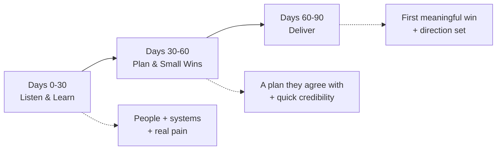

# 27 · My First 90 Days (the plan I bring to the room)

[← Reverse-Interview Questions](26-reverse-interview-questions.md) · [Home](README.md) · [Next → Concept: ReactJS](28-concept-reactjs.md)

Near the end of most senior/architect interviews I get asked: *"If we hired you, what would you do in your first 90 days?"* They're checking that I already think like someone who **owns** the role — that I'll learn, earn trust, and deliver something visible early, not sit and wait to be told. This is my ready answer, in first person, split into three phases.

> **My rule for the first 90 days:** *listen before I change anything.* I earn the right to make big calls by first understanding the system, the people and the real pain — then I ship one visible win.

**Jump to:**
[The shape](#the-shape-in-one-line) · [Days 0–30 Listen & Learn](#days-030--listen--learn) · [Days 30–60 Plan & Small Wins](#days-3060--plan--small-wins) · [Days 60–90 Deliver](#days-6090--deliver) · [Said out loud](#the-90-second-spoken-version) · [Follow-ups](#follow-ups) · [Section index](#section-index)

---

## The shape in one line

> "First I **listen and learn**, then I **plan and score small wins**, then I **deliver one visible improvement** — without breaking trust or production on the way."

---

## Days 0–30 — Listen & Learn

**Goal:** understand the system, the people and the real pain. **Change nothing big yet.**

- **Meet the people.** One-to-ones with my team, peer architects, product owners, and the key business stakeholders. I ask what works, what hurts, and what they wish someone would fix.
- **Read the architecture and the code.** I trace one real request end to end — exactly as I did on Project A, following data from source to report — so I understand it for real, not from a diagram.
- **Learn how it ships.** I walk the path from a commit to production: CI/CD maturity, environments, release process, who owns production when it breaks.
- **Find the real pain.** Every team has a quiet problem everyone tolerates. I listen for it — the flaky pipeline, the report that's always late, the module no one wants to touch.
- **Earn trust, don't spend it.** I'm deliberately humble here. Coming in and reorganising everything on day three loses the room. I ask more than I assert.

**By day 30 I can say:** "Here's how the system really works, here's the top pain, and here's who owns what."

---

## Days 30–60 — Plan & Small Wins

**Goal:** turn understanding into an agreed plan, and build credibility with a few quick, safe wins.

- **Propose a plan, get buy-in.** I write a short, honest assessment — strengths, risks, and the two or three things worth fixing first — and I socialise it before I present it, so it's *our* plan, not mine imposed.
- **Score small, visible wins.** I pick low-risk, high-visibility fixes that prove I add value fast: kill an obvious N+1, tidy a noisy alert, document a tribal-knowledge process, or introduce a lightweight ADR habit if decisions are undocumented.
- **Set standards gently.** If it helps, I introduce a reusable pattern the way I did on Project A — by pairing on one example and letting the result convince people, not by mandate ([see B2 in the story bank](25-star-story-bank.md#b2--a-conflict-with-a-colleague)).
- **Confirm the first big target.** With the team, I lock in the one meaningful improvement I'll deliver by day 90.

**By day 60 I can say:** "Here's the agreed plan, I've already fixed a few things, and here's the first real win coming."

---

## Days 60–90 — Deliver

**Goal:** ship the first meaningful improvement and set the direction going forward.

- **Deliver the win end to end.** I don't just design it — I build alongside the team and take it to production, because that's my whole positioning: I own design *and* I write the code.
- **Prove it with a number.** I measure the before/after — latency down, errors down, release cycle shorter — the same evidence discipline I use for every claim in this kit.
- **Set the direction.** I turn the 30–60 plan into a lightweight roadmap the team owns, so momentum outlives my first quarter.
- **Close the loop with stakeholders.** I report back to the people I met in week one: here's what you told me hurt, here's what I changed, here's the result.

**By day 90 I can say:** "I've shipped a measurable improvement, the team has a direction, and the business has seen a return on the hire."

---

## The 90-second spoken version

> "In my first thirty days I'd listen and learn — one-to-ones across the team and stakeholders, tracing a real request end to end through the code and the pipeline, and understanding how you get from a commit to production. I'd deliberately not change anything big yet; I'd earn trust first.
>
> In days thirty to sixty I'd turn that into an agreed plan — socialised, not imposed — and score a few small, visible wins to build credibility: an obvious performance fix, a noisy alert cleaned up, a tribal process written down.
>
> By days sixty to ninety I'd deliver the first meaningful improvement end to end — designed *and* built by me with the team — prove it with a before/after number, and leave the team with a direction they own. That's how I've worked on every platform: understand it, earn the right to change it, then ship something real."

---

## Follow-ups

- *"What if you find a fire on day one?"* — Then stabilising it *is* my first win — I flex the plan. Listening first doesn't mean ignoring a live incident; it means not reorganising the org before I understand it.
- *"What if the team resists your plan?"* — That usually means it's my plan, not ours. I go back to listening, involve them in shaping it, and let a small proven win do the persuading.
- *"90 days feels slow — why not move faster?"* — Small safe wins come in weeks; I move fast on those. What I *don't* rush is the big structural calls — making those before I understand the system is how architects break things.
- *"How do you measure success at 90 days?"* — One shipped, measurable improvement; an agreed roadmap the team owns; and stakeholders who feel heard. Evidence, not activity.

---

## Section index

| Phase | Days | Goal | By the end I can say… |
|---|---|---|---|
| Listen & Learn | 0–30 | Understand system, people, real pain | "Here's how it really works and what hurts most" |
| Plan & Small Wins | 30–60 | Agreed plan + quick credibility | "Here's our plan, and I've already fixed a few things" |
| Deliver | 60–90 | One measurable win + direction set | "I shipped a measurable improvement and set direction" |

---

[← Reverse-Interview Questions](26-reverse-interview-questions.md) · [Home](README.md) · [Next → Concept: ReactJS](28-concept-reactjs.md)
