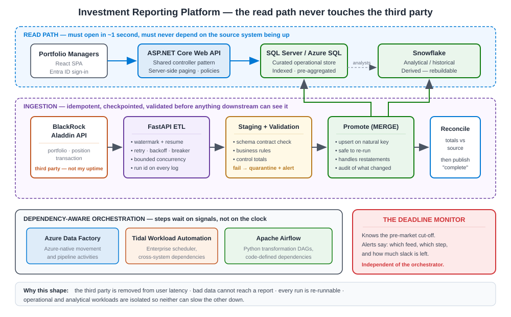

# 53 · Case Study A — Investment Reporting Platform (TCW) (6 questions + follow-ups)

[← Case Studies Hub](52-concept-case-studies-decision-making.md) · [Home](README.md) · [Next → Case Study B: AI/RAG Assistant](54-case-study-b-ai-rag-assistant.md)

This is my flagship **data-platform** case study: the investment-reporting vertical I own end to end at **TCW Group** in Los Angeles. It is the one I reach for when an interviewer asks *"walk me through a system you own end to end"* or *"how do you make a deadline-driven pipeline reliable?"* For the topic theory behind it, see [34 SQL Server](34-concept-sql-server.md), [35 Snowflake](35-concept-snowflake.md), [36 SQL vs Snowflake](36-concept-sqlserver-vs-snowflake.md) and [32 FastAPI](32-concept-fastapi.md).

> One-line decision: *"I split the data tier by workload — SQL Server for operational, Snowflake for analytical — because a shared engine would let heavy analytics starve my pre-market deadline."*

**Jump to:** [The story](#the-story-the-8-beats) · [Architecture](#architecture-at-a-glance) · [Decision log](#decision-log-adr-style) · [CA1](#ca1--why-did-you-split-the-data-tier-into-sql-server-and-snowflake) · [CA2](#ca2--why-fastapipython-for-the-etl-when-your-api-tier-is-net) · [CA3](#ca3--how-did-you-meet-the-pre-market-deadline-reliably-day-after-day) · [CA4](#ca4--who-was-involved-and-what-did-you-personally-own-versus-delegate) · [CA5](#ca5--how-do-you-prove-a-financial-number-is-correct) · [CA6](#ca6--how-would-you-evolve-this-platform-next) · [Section index](#section-index)

---

## The story (the 8 beats)

*Figure 53.1 — Project A. The vertical I own end to end: ingestion → ETL → two data stores → Web API → React reporting, on a pre-market deadline.*

**1. How it started.** TCW is a large US asset manager in Los Angeles. Portfolio managers and client-reporting teams needed Emerging-Markets and Equity reports on their desk **before the US market opened**. The old way leaned on manual pulls and bespoke per-report code, and it was fragile against the deadline — one late feed or one slow query and a portfolio manager started the trading day blind. The source of truth for portfolio, position and transaction data is **BlackRock Aladdin**, a third-party investment platform we consume through its API. The business trigger was simple and hard: *reports must be correct and on the desk pre-market, every trading day.*

**2. The problem / constraints.** Four constraints shaped everything:
- **A hard time window.** Pre-market. Late is the same as wrong.
- **A rate-limited, sometimes-late third party.** Aladdin has API limits, and data occasionally arrives late — I cannot control the source.
- **Financial correctness.** Every number must be reconcilable and auditable. Correctness beats speed; a wrong number published on time is worse than no number.
- **Two opposite read patterns.** The app needs fast, small, operational reads; research needs heavy, historical, analytical scans over years of positions and transactions.

**3. Options I considered.**
- *One database for everything — SQL Server only.* Simple to run, but analytical queries on years of history would fight the operational workload and threaten the deadline.
- *One database for everything — Snowflake only.* Great for analytics, but poor for the low-latency transactional reads the app needs, and more expensive for constant small reads.
- *A single monolithic ETL job.* Easy at first, but one late Aladdin feed would stall the whole run, and I could not restart just the failed part before the deadline.
- *ETL in .NET* (same stack as the API). Viable, but the data-engineering ecosystem and the team's Python skill made **FastAPI/Python** faster to build and clearer to reason about for pipelines.
- *One scheduler only.* The client already ran ADF, Tidal and Airflow across the estate; forcing one new scheduler would fight the operating model.

**4. The decision & why.** I **split the data tier**: **SQL Server** for transactional/operational reads, **Snowflake** for analytical/historical. The dominant constraint — a deadline over correct financial data — meant I could not let heavy analytics starve the operational path. I built the ETL as **FastAPI services in Python** with validation, retries and reconciliation, and I made the orchestration **dependency-aware** across **Azure Data Factory + Tidal Workload Automation + Apache Airflow** so a single late feed only re-runs its own branch, not the whole pipeline. Everything sits behind a reusable **controller + Web API pattern** so new reports reuse the design instead of inventing their own.

**5. What I built.**
- **FastAPI ETL services** with automated schema validation (Pydantic), bounded-concurrency pulls with retry/back-off against the Aladdin API, and reconciliation checks.
- A **dependency-aware orchestration layer** across ADF, Tidal and Airflow, with structured logging at every stage and automated failure alerting.
- A reusable **server-side controller + Web API pattern** that replaced bespoke per-report code.
- A **cross-platform database-utility generator** that standardises script and data-access generation across Azure SQL and Snowflake, so the two-store split does not double the maintenance.
- **React reporting screens** on top, handling the load/empty/error/success states cleanly.

**6. Who was involved.** I was the solution architect and owned the whole vertical.
- **Business analysts & stakeholders** — I turned business language into design and agreed what *"correct"* meant for each report and what the window was.
- **Data engineers** — built pipelines on the shape I set.
- **Application engineers** — built the Web API and React screens on the shared pattern.
- **QA** — validated against the reconciliation totals.
- **Ops / on-call** — received the runbooks and alerting.
- I **mentored** across the app, API and data workstreams and set the code-review standard so the pattern held.

**7. The result.** Daily reporting lands **inside the pre-market window**. New reports are built on the shared pattern, so the build cycle is shorter, and change is traceable from schema edit to release in one repeatable path. When something upstream is late, the blast radius is one branch, not the whole run.

**8. The lesson.** *"The hard part of a data platform is not moving the data — it is proving the data is right, and proving it before a deadline."* That is why validation and reconciliation are first-class stages, not an afterthought.

---

## Architecture at a glance

**Data flow (left to right):**

1. **Aladdin API** → 2. **FastAPI ingestion** (validate + retry + rate-limit) → 3. **Landing / staging** → 4. **Transform + reconcile** → 5a. **SQL Server** (operational) and 5b. **Snowflake** (analytical/history) → 6. **ASP.NET Core Web API** (reusable controller pattern) → 7. **React reporting screens**.

**Orchestration** wraps steps 2–5 as a **dependency graph** across ADF, Tidal and Airflow: each report's data is a branch that runs only when its inputs are ready, with a **reconciliation gate** before publish. See the Aladdin ingestion sequence in [assets/aladdin-ingestion-sequence.svg](assets/aladdin-ingestion-sequence.svg).

**Non-functionals I own:** pre-market deadline (timeliness), reconcilable & auditable numbers (correctness), restartable branches (resilience), and cost-shaped stores (SQL for constant small reads, Snowflake compute suspended when idle).

---

## Decision log (ADR-style)

| # | Decision | Options weighed | What I chose & the trade-off accepted |
|---|----------|-----------------|----------------------------------------|
| A-1 | Data-tier topology | One SQL / one Snowflake / **split by workload** | **Split** — extra surface & reconciliation, bought deadline safety |
| A-2 | ETL stack | .NET / SQL procs / **FastAPI-Python** | **FastAPI** — polyglot cost, bought data-native speed + team skill |
| A-3 | Orchestration shape | Linear job / **dependency graph** | **Dependency graph** — more design up front, bought partial-failure isolation |
| A-4 | Scheduler estate | One new scheduler / **reuse ADF+Tidal+Airflow** | **Reuse** — three tools to reason about, bought fit-to-operating-model |
| A-5 | Report build model | Per-report bespoke / **reusable controller+API pattern** | **Reusable pattern** — some abstraction cost, bought shorter build cycle |
| A-6 | Correctness gate | Trust the load / **reconciliation before publish** | **Reconcile** — a little latency, bought "never publish a wrong number" |

---

### CA1 · Why did you split the data tier into SQL Server and Snowflake?

**Context.** The platform has two very different read patterns on the same underlying data: the application needs **fast, small, operational reads**, and research needs **heavy, historical, analytical reads** over years of positions and transactions.

**The problem.** If both run on one engine, they fight. Analytical scans lock or starve the operational path, and my **pre-market deadline** is the first casualty. On money data, I also cannot risk a slow report pushing an operational read past the window.

**Options I considered.** *SQL Server only* — simplest to run, but big analytical scans hurt operational latency. *Snowflake only* — superb for analytics, but weak and comparatively costly for constant small transactional reads. *One engine plus read-replicas* — helps read scaling but does not fix the fundamentally different storage/compute profile of OLTP vs OLAP.

**The decision & why.** I split by **workload, not by team preference**: **SQL Server** for OLTP/operational, **Snowflake** for OLAP/analytical and history. Each engine does what it is best at, and Snowflake's separated compute means analysts can run heavy queries on their own warehouse **without touching** the operational path or the deadline.

**What I built.** The ETL lands operational data in SQL Server and the analytical/historical model in Snowflake, with a **reconciliation check** so both agree. A cross-platform database-utility generator standardises data-access code across both so the split does not double the maintenance.

**Result.** The deadline holds because analytics and operations no longer compete for the same resources, and each store is cost-shaped to its job.

**Lesson.** *"Split data stores by workload, not by fashion. OLTP and OLAP have different physics — trying to make one engine do both is how you miss a deadline."*

**Follow-up: How do you keep the two stores consistent?**
> Reconciliation is a pipeline stage, not a hope. After load, I compare control totals (row counts, key sums) between the operational and analytical models for the same as-of date; a mismatch fails the run and alerts before the report is published. Correctness beats a published-but-wrong number.

**Follow-up: Doesn't two stores double your cost and complexity?**
> It adds surface, yes — so I contain it. One shared data-access pattern (the utility generator), one orchestration layer, and Snowflake compute that I can suspend when idle. The alternative — a single engine choking on mixed workloads — costs more in missed deadlines and emergency tuning than the second store costs to run.

**Follow-up: When would you *not* split, and use one store?**
> When the analytical load is small and bursty and the data is modest — then a single SQL Server (maybe with a read replica or columnstore index) is simpler and cheaper. I split only when the workloads genuinely conflict or the history is large. See [36 SQL vs Snowflake](36-concept-sqlserver-vs-snowflake.md) for the full decision framework.

---

### CA2 · Why FastAPI/Python for the ETL when your API tier is .NET?

**Context.** The application and Web API tier is ASP.NET Core in C#. The natural instinct would be to write the ETL in the same stack.

**The problem.** The ETL has to pull from a rate-limited third-party API (Aladdin), validate financial data, retry gracefully, and reconcile — all inside a deadline. I need the fastest path to *correct, observable* pipelines, not stack purity.

**Options I considered.** *.NET ETL* — one language, but more ceremony for data work and fewer data-native libraries. *Pure SQL/stored-procedure ETL* — fast for set work but poor for API calls, retries and complex validation logic. *FastAPI/Python* — first-class async for API pulls, a rich data ecosystem (Pandas, Pydantic validation), and the team already had the skill.

**The decision & why.** I chose **FastAPI/Python** for the ETL. The dominant filters were *fit to the problem* (data + third-party API work) and *skills in the team*. Pydantic gives me schema validation at the boundary; async gives me controlled concurrency against Aladdin's rate limits; and the pipeline logic reads clearly. The .NET tier stays where it is strong — the transactional Web API.

**What I built.** FastAPI ETL services with typed validation, bounded-concurrency pulls with retry/back-off against the Aladdin API, reconciliation checks, and structured logging that feeds the alerting.

**Result.** Reliable, restartable ingestion that meets the window, built quickly because the tool fits the job and the team.

**Lesson.** *"Use the right tool per tier. C# for the transactional API, Python for the data pipeline — a polyglot stack is fine when each choice is deliberate and behind a clear contract."*

**Follow-up: Isn't a polyglot stack harder to maintain?**
> Only if the boundaries are fuzzy. The ETL and the API meet at the database and at well-defined contracts, not in shared code. Each tier has its own tests and pipeline. The cost of two languages is far less than the cost of forcing data work into a stack that fights it.

**Follow-up: How do you handle Aladdin's rate limits and late data?**
> Bounded concurrency and exponential back-off so I never hammer the API; idempotent loads so a retry is safe; and dependency-aware orchestration so if one feed is late, only its branch waits and re-runs — the rest of the report still lands. Late data raises an alert with the as-of date so nobody publishes a partial number silently.

**Follow-up: How do you test an ETL pipeline?**
> Unit tests on the validation and transform logic with known-good and known-bad fixtures; contract tests against a mocked Aladdin so I don't depend on the live API; and an end-to-end run against a small sample that asserts the reconciliation totals. See [17 Deep Dive: Python & Data](17-deepdive-python-data.md).

---

### CA3 · How did you meet the pre-market deadline reliably, day after day?

**Context.** "Reliable" is the whole product here. A report that is correct but late is a failed report.

**The problem.** Many moving parts — a third-party feed, ETL, two data stores, and reports — must all finish inside a fixed window, unattended, every trading morning.

**The decision & why.** I made the orchestration **dependency-aware** rather than a single linear job. Each report's data has a dependency graph; a branch only runs when its inputs are ready, and a failure isolates to its branch. I run it across **ADF, Tidal and Airflow** because that matched the client's existing scheduling estate — I met the operating model instead of forcing a new scheduler on them.

**What I built.** The dependency graph, structured logging at each stage, automated failure alerting, and restartable steps so a late feed re-runs just its part. Reconciliation gates publish so a wrong number never ships.

**Result.** The pre-market window is met daily, and when something upstream is late, the blast radius is one branch, not the whole run.

**Lesson.** *"For deadline systems, design for partial failure. The question is never 'will something be late?' — it's 'when it is, how small can I make the damage?'"*

**Follow-up: What happens when the deadline genuinely can't be met?**
> There is a runbook: alert fires, on-call sees exactly which branch failed and why from the structured logs, and there is a defined fallback (publish the reports that are ready and correct, flag the delayed one with its as-of status) rather than an all-or-nothing miss. Communication to the business is part of the design, not an afterthought. See [07 Support](07-support-post-delivery.md).

**Follow-up: Why three schedulers — isn't that a smell?**
> On a greenfield build I'd use one. Here, ADF, Tidal and Airflow were already in the estate, each owning part of the workflow, and each team knew their tool. Rewiring everything onto one scheduler was risk with little reward. I unified them at the *dependency* level — one logical graph — rather than forcing one *tool*. Fit-to-operating-model beat purity.

---

### CA4 · Who was involved, and what did you personally own versus delegate?

**Context.** This platform spans business, data, application and operations. Interviewers want to know I can lead across all of it and still be hands-on.

**My answer.** I owned the **end-to-end design** and the **non-functional promises** (correctness, the deadline, auditability). I personally built the reusable controller + Web API pattern and set the shape of the FastAPI ETL and the orchestration graph. I worked with **business analysts** to define what "correct" meant per report and with **stakeholders** to agree the window and priorities. I **delegated** report-by-report build to application and data engineers **on the shared pattern**, and I **mentored** them and ran the code-review standard so the pattern stayed intact. QA validated against the reconciliation totals; ops got the runbooks and alerts.

**Result.** New reports are built by the team on the pattern I set, not by me one at a time — that is the real test of an architect: the design outlives my direct involvement.

**Lesson.** *"My job is to make myself unnecessary for the next report. I own the decisions and the pattern; the team owns the throughput."*

**Follow-up: How do you stop a shared pattern from rotting as the team grows?**
> Code review against the pattern, a small reference implementation people copy, and the utility generator that makes the right way the easy way. When someone needs to deviate, that is a design conversation, not a silent fork.

**Follow-up: How did you mentor engineers on this platform?**
> By pairing on the first report each engineer built on the pattern, reviewing with the *why* not just the *what*, and handing over increasing ownership. The measure of success is that they build the next one without me.

---

### CA5 · How do you prove a financial number is correct?

**Context.** In asset management, an unreconciled number is a liability. "It ran without error" is not proof of correctness.

**The decision & why.** I make **reconciliation a first-class stage** with control totals — row counts and key sums — compared between source, operational store and analytical store for the same **as-of date**. A mismatch **fails the run and alerts** before anything publishes. Every value is traceable from the report back through the transform to the Aladdin source, so an auditor can follow the chain.

**Result.** Numbers are provable, not just present — and a wrong number is caught before a portfolio manager ever sees it.

**Lesson.** *"On money data, correctness is a gate, not a hope. Reconcile before you publish, and make every number traceable to its source."*

**Follow-up: What do you do when reconciliation fails close to the deadline?**
> The gate holds — I do not publish a number I can't stand behind. The runbook publishes the reports that *did* reconcile, flags the one that didn't with its status, and alerts the business with the as-of detail. A known gap beats a silent error.

**Follow-up: How is this auditable?**
> Structured logs at each stage, versioned transforms, and the reconciliation record for each run form the audit trail — the same regulated-delivery instinct I brought from healthcare/public sector work (Case Study E). See [57 Case Study E](57-case-study-e-uk-web-platforms.md).

---

### CA6 · How would you evolve this platform next?

**Context.** A good architect states the **downside of their own design** and where it goes next — the highest-scoring part of C-QUAD.

**My answer.** Three moves, in order of value: (1) **tighten observability** into a single dependency-and-SLA dashboard so on-call sees the whole graph and time-to-deadline at a glance; (2) **push more validation upstream** so bad data is caught at ingestion, not at reconciliation, shrinking rework near the deadline; (3) **consider consolidating the three schedulers** onto one *if and only if* the operating model shifts — reversible, behind the logical dependency graph I already own. I'd also add a **RAG-assisted support layer** (reusing Case Study B) so on-call gets grounded answers to recurring pipeline issues.

**Result (expected).** Faster incident triage, less deadline-adjacent rework, and a simpler estate *when* the org is ready — not before.

**Lesson.** *"Name the weakness of your own design and the next step. Evolution beats a big-bang rewrite, and reversibility keeps the options open."*

**Follow-up: What's the single biggest risk in the current design?**
> The third party. Aladdin is outside my control, so late or malformed source data is the top risk — which is exactly why ingestion validation, retries, idempotency and partial-failure isolation are where I invested most. I harden the boundary I don't own.

---

## Section index

| ID | Topic | One-line summary |
|----|-------|------------------|
| — | The story | Pre-market deadline; SQL+Snowflake split; FastAPI ETL; dependency-aware orchestration |
| — | Decision log | Six ADR-style decisions with the trade-off accepted for each |
| CA1 | Two data stores | Split OLTP/OLAP by workload, not fashion; reconcile to stay consistent |
| CA2 | FastAPI for ETL | Right tool per tier; Python for data, C# for the API |
| CA3 | Meeting the deadline | Dependency-aware orchestration; design for partial failure |
| CA4 | Ownership vs delegation | Own the pattern and NFRs; team owns throughput |
| CA5 | Proving correctness | Reconcile before publish; make every number traceable |
| CA6 | Evolving it next | Observability, upstream validation, reversible consolidation |

---

[← Case Studies Hub](52-concept-case-studies-decision-making.md) · [Home](README.md) · [Next → Case Study B: AI/RAG Assistant](54-case-study-b-ai-rag-assistant.md)
