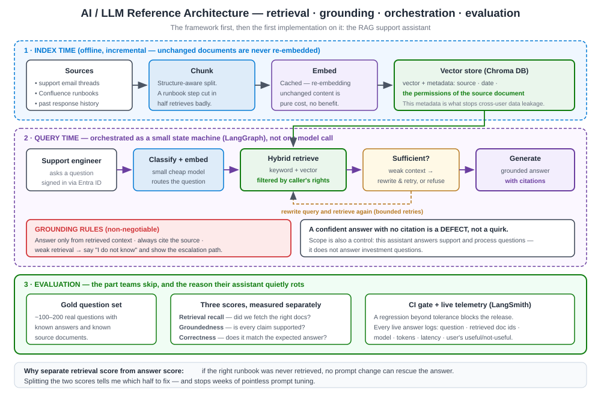

# 54 · Case Study B — AI/LLM Framework & RAG Support Assistant (TCW) (6 questions + follow-ups)

[← Case Study A: Investment Reporting](53-case-study-a-investment-reporting.md) · [Home](README.md) · [Next → Case Study C: Completion Platform](55-case-study-c-completion-platform.md)

This is my **AI/innovation** case study: TCW's **AI/LLM reference architecture** and the firm's **first production RAG support assistant**. I reach for it when an interviewer asks *"how did you build a production AI feature?"* or *"how do you make AI safe in a regulated firm?"* For the theory, see [40 RAG](40-concept-rag.md), [41 LangChain](41-concept-langchain.md), [42 LangGraph](42-concept-langgraph.md), [43 LangSmith](43-concept-langsmith.md), [44 Vector DBs & Chroma](44-concept-vector-databases-chroma.md), [45 Embeddings](45-concept-embeddings-semantic-search.md) and [46 LLM App Integration](46-concept-llm-application-integration.md).

> One-line decision: *"I built the safe reusable AI pattern first — retrieval, grounding, orchestration, evaluation — then proved it with the firm's first RAG app; RAG over fine-tuning because the knowledge changes and must be cited."*

**Jump to:** [The story](#the-story-the-8-beats) · [Architecture](#architecture-at-a-glance-the-four-pillars) · [Decision log](#decision-log-adr-style) · [CB1](#cb1--why-build-a-reference-architecture-first-instead-of-just-shipping-the-rag-app) · [CB2](#cb2--why-rag-instead-of-fine-tuning-the-model) · [CB3](#cb3--why-chroma-langchain-langgraph-and-langsmith-specifically) · [CB4](#cb4--how-do-you-prove-an-llm-feature-is-safe-and-good-enough-for-a-regulated-firm) · [CB5](#cb5--how-do-you-control-the-cost-of-an-llm-feature) · [CB6](#cb6--how-would-you-take-this-from-assistant-to-agent) · [Section index](#section-index)

---

## The story (the 8 beats)

*Figure 54.1 — Project B. The reference architecture — retrieval, grounding, orchestration, evaluation — proven by the firm's first production RAG assistant.*

**1. How it started.** The firm wanted to use LLMs but had **no agreed, safe way to do it**. Left alone, every team would invent its own approach — different models, different data handling, no evaluation — which in a **regulated asset manager** is how you create a compliance problem. Meanwhile support engineers were spending hours digging through mail archives and runbooks to answer the same recurring questions. The trigger was a **governance gap plus a real, measurable pain**, not a shiny-tech wish.

**2. The problem / constraints.**
- **Regulated data.** Grounding and auditability are non-negotiable — answers must be traceable to a source, and sensitive data must be handled correctly.
- **Non-determinism.** LLM output varies, so I need an **evaluation loop** to know when quality degrades.
- **Reusability.** It must be a **pattern the firm reuses**, not a one-off, so there is one safe way to add AI.
- **Cost & latency.** LLM calls cost money and time; the design has to control both.

**3. Options I considered.**
- *Let each team integrate an LLM directly.* Fastest to a first demo, worst for governance and consistency — rejected.
- *Fine-tune a model on internal data.* Powerful but expensive, slow to update, and it bakes data into weights (hard to audit and to unlearn) — wrong for frequently-changing support knowledge.
- *Retrieval-Augmented Generation (RAG).* Keep the model as a commodity; put the firm's knowledge in a **retrievable, citable** store the model reads at answer time. Cheaper to update, auditable, and safe.
- *Buy a closed SaaS assistant.* Fast, but I'd hand a regulated firm's sensitive knowledge to a black box with no evaluation control — rejected.

**4. The decision & why.** I built a **reference architecture first** — a reusable pattern for **retrieval, grounding, orchestration and evaluation** — then **proved it** with the first end-to-end app. RAG over fine-tuning because the knowledge changes often and must be **cited and auditable**. **Chroma** as the vector store for its simplicity and fit; **LangChain** for the chain, **LangGraph** for multi-step orchestration, **LangSmith** for tracing and evaluation. The settling reason: *in a regulated firm, the architecture is the retrieval quality, the grounding, and the evaluation loop — the model itself is replaceable.*

**5. What I built.** A **RAG support-assistant**: it indexes support emails, Confluence runbooks and past response threads — chunked and embedded — into a **Chroma** vector database, retrieves the most relevant passages, and answers recurring support questions with **grounded, cited** answers. **LangChain** wires the retrieval-and-answer chain; **LangGraph** orchestrates the multi-step flow (retrieve → reason → maybe re-retrieve → answer); **LangSmith** traces every run and scores it against an evaluation dataset. The whole thing is the concrete instance of the reusable framework.

**6. Who was involved.** I defined the reference architecture and led the build.
- **Compliance/risk stakeholders** — agreed data handling and what "safe" meant.
- **Support-team subject-matter experts** — sourced and validated the knowledge and the golden answers.
- **Engineers** — built the ingestion pipeline and the app on the pattern.
- I set the **evaluation datasets and metrics** so quality is measured, not assumed.

**7. The result.** TCW's **first production RAG application**, and a **pattern the firm now reuses**. Support engineers get grounded, cited answers to repeat issues in **minutes instead of digging through mail archives**.

**8. The lesson.** *"With LLMs, the architecture is not the model. The model is a commodity. The architecture is retrieval quality, grounding, and the evaluation loop that tells you when it degrades."*

---

## Architecture at a glance (the four pillars)

| Pillar | What it does | How I built it |
|--------|--------------|----------------|
| **1. Retrieval** | Find the right knowledge for the question | Chunk sources → embed → store in **Chroma**; retrieve top-k with metadata filters (and hybrid search where it helps) |
| **2. Grounding** | Answer only from retrieved sources, with citations | Prompt that forces source-grounded answers; **citations on every answer**; refuse when nothing relevant is found |
| **3. Orchestration** | Run the multi-step flow reliably | **LangGraph** stateful graph: retrieve → reason → re-retrieve if needed → answer; **LangChain** for the building blocks |
| **4. Evaluation** | Know quality, and catch drift | **LangSmith** traces + a golden dataset scored for grounding, correctness and safety, run continuously and on every change |

**Data flow:** sources → chunk + embed → Chroma → retrieve → grounded LLM answer with citations → traced & scored in LangSmith. **Non-functionals I own:** grounding & auditability (every answer cited), measurable quality (evaluation loop), cost/latency control (caching, top-k limits, model choice), and safety (guardrails, least-privilege retrieval).

---

## Decision log (ADR-style)

| # | Decision | Options weighed | What I chose & the trade-off accepted |
|---|----------|-----------------|----------------------------------------|
| B-1 | Delivery shape | Ship one app / **framework-first, then app** | **Framework-first** — slightly slower start, bought a reusable safe pattern |
| B-2 | Knowledge method | Fine-tune / **RAG** / prompt-only | **RAG** — retrieval infra to run, bought current + cited + auditable answers |
| B-3 | Vector store | pgvector / Azure AI Search / **Chroma** | **Chroma** — less enterprise tooling, bought simplicity + fit for the corpus (behind an interface) |
| B-4 | Orchestration | Straight chain / **LangGraph stateful graph** | **LangGraph** — more concepts, bought clean multi-step + cycles + human-in-the-loop |
| B-5 | Observability | Logs only / **LangSmith tracing + eval** | **LangSmith** — a dependency, bought first-class evaluation & drift detection |
| B-6 | Safety posture | Trust the model / **grounded-only + guardrails** | **Grounded-only** — refuses more often, bought no ungrounded/unsourced answers |

---

### CB1 · Why build a reference architecture first instead of just shipping the RAG app?

**Context.** The fastest route to a demo is to wire one team's LLM call directly. I deliberately did not do that.

**The problem.** In a regulated firm, ten teams each inventing their own LLM integration means ten different data-handling stories, no shared evaluation, and a compliance surface nobody owns. The risk is organisational, not technical.

**The decision & why.** I built the **reusable pattern first** — retrieval, grounding, orchestration, evaluation — so there is **one safe way** to add AI, then proved it with a real app. This turns "AI" from a scattering of experiments into a governed capability. The one reason that settled it: *a pattern the firm reuses is worth more than a single clever app.*

**Result.** One production app **and** a reusable framework, so the next AI use case starts from a safe baseline instead of a blank page.

**Lesson.** *"In a regulated firm, the first AI project's real deliverable is the safe pattern. The app is how you prove the pattern works."*

**Follow-up: How do you stop a 'reference architecture' from becoming shelfware?**
> By shipping it *as* a working app, not a slide deck. The pattern is code people can copy, with the evaluation harness attached. If it is easier to do it the safe way than to reinvent it, teams use it.

**Follow-up: Didn't building the framework slow down the first delivery?**
> A little at the start, and it paid back immediately. The framework *is* what the app is built on, so I wasn't building twice — I was building the app in a reusable shape. The second use case is where the speed shows.

---

### CB2 · Why RAG instead of fine-tuning the model?

**Context.** Support knowledge — emails, runbooks, past threads — **changes constantly** and must be **traceable to a source** for a regulated firm.

**Options I considered.** *Fine-tuning* bakes knowledge into the model weights: expensive, slow to update, and hard to audit or unlearn — poor for fast-changing, must-be-cited knowledge. *RAG* keeps the model generic and retrieves the firm's current knowledge at answer time, with citations.

**The decision & why.** **RAG.** It updates by re-indexing (cheap, fast), every answer is **grounded and cited** (auditable), and swapping the underlying model is easy because knowledge lives outside it. Fine-tuning would be the wrong tool for knowledge that changes weekly and must be provably sourced.

**Result.** Answers stay current as knowledge changes, and each one can be traced to its source document — exactly what compliance needs.

**Lesson.** *"Fine-tune to change *behaviour/style*; retrieve to supply *knowledge*. For fast-moving, must-be-cited facts, RAG wins."* Full detail in [40 RAG](40-concept-rag.md).

**Follow-up: When *would* you fine-tune, then?**
> When I need a consistent format, tone, or a domain skill the base model lacks — behaviour, not facts. Often the best answer is both: fine-tune for style, retrieve for knowledge.

**Follow-up: How do you keep retrieval quality high?**
> Good chunking, the right embedding model, metadata filters, and often hybrid (keyword + vector) search with re-ranking — all measured against an evaluation set in LangSmith so I can see quality, not guess it. See [45 Embeddings & Semantic Search](45-concept-embeddings-semantic-search.md).

**Follow-up: How do you chunk the source documents well?**
> Chunk on natural boundaries (sections, threads) with a little overlap so context isn't cut mid-thought, sized to the embedding model and the answer budget. I tune chunk size against the evaluation set — too big dilutes retrieval, too small loses context.

---

### CB3 · Why Chroma, LangChain, LangGraph and LangSmith specifically?

**Context.** There are many vector stores and orchestration options. I chose a deliberate, coherent set.

**The decision & why.**
- **Chroma** for the vector store: simple to run, good developer experience, right-sized for the assistant's corpus — the *most-managed-that-fits* filter. (For enterprise scale I'd weigh Azure AI Search or pgvector — see [44 Vector DBs](44-concept-vector-databases-chroma.md).)
- **LangChain** for the chain: mature building blocks for retrievers, prompts and output parsing so I don't reinvent plumbing.
- **LangGraph** for orchestration: the assistant is **multi-step** (retrieve → reason → maybe ask again → answer). A stateful graph with cycles models that cleanly, unlike a straight chain.
- **LangSmith** for tracing and evaluation: I can see every step of a run and score quality against datasets — the evaluation loop the whole architecture depends on.

**Result.** A coherent, observable stack where each tool earns its place, and evaluation is built in rather than bolted on.

**Lesson.** *"Pick tools that make the non-negotiable — here, evaluation and observability — the easy path."*

**Follow-up: What would make you swap Chroma later?**
> Scale, enterprise security/compliance features, or wanting one platform for search + vectors (Azure AI Search). Because retrieval sits behind an interface, swapping the store is a contained change, not a rewrite — the reversible-path filter in action.

**Follow-up: LangChain gets criticised as heavy — how do you handle that?**
> I use the parts that earn their keep and keep my own thin abstractions at the boundaries, so I'm not locked in. If a piece adds more indirection than value, I drop it. The evaluation and tracing (LangSmith) are the parts I'd never give up.

---

### CB4 · How do you prove an LLM feature is safe and good enough for a regulated firm?

**Context.** Non-deterministic output plus regulated data means "it looked good in the demo" is not acceptable evidence.

**The decision & why.** I make **evaluation a first-class part of the architecture**. A curated **golden dataset** of representative questions with expected, sourced answers; automated scoring in **LangSmith** for grounding (is the answer supported by retrieved sources?), correctness and safety; and **citations on every answer** so a human can verify. Sensitive data handling is agreed with compliance up front, and there is a rollback story.

**Result.** Quality is **measured over time**, so I can see degradation before users do, and every answer is auditable to a source.

**Lesson.** *"For AI in a regulated firm: nothing ungrounded, nothing uncited, nothing unmeasured, and always a rollback."*

**Follow-up: How do you catch quality drift after go-live?**
> The evaluation set runs continuously and on every change; LangSmith traces flag runs where grounding scores drop. Drift usually means the corpus changed or a prompt/model changed — the trace tells me which. See [43 LangSmith](43-concept-langsmith.md) and [46 LLM Application Integration](46-concept-llm-application-integration.md).

**Follow-up: How do you defend against prompt injection or data leakage?**
> Least-privilege on what the retriever can reach, input/output guardrails, never putting secrets in prompts, and grounding-only answers so the model doesn't free-wheel. It's the same integration discipline as any external system: contracts, boundaries, and observability.

**Follow-up: What's your rollback story for an AI feature?**
> Model and prompt are versioned and configurable, so I can revert to the last known-good instantly; the corpus index is versioned too. If evaluation scores fall after a change, I roll back the change, not the whole feature.

---

### CB5 · How do you control the cost of an LLM feature?

**Context.** LLM calls cost money per token and add latency; unmanaged, they surprise the bill and the user.

**The decision & why.** Cost is a design constraint from day one. I **cache** frequent answers, **limit top-k and context size** to what retrieval actually needs, **choose the smallest model** that passes the evaluation bar for each step, and **short-circuit** when retrieval finds nothing relevant (refuse rather than pay to hallucinate). Because the model is behind an interface, I can move to a cheaper model whenever it still passes evaluation.

**Result.** Predictable cost and latency, with quality held to the evaluation bar rather than to the biggest model.

**Lesson.** *"Treat tokens like money, because they are. The cheapest call is the one you don't make — cache, cap context, and refuse when there's nothing to ground on."*

**Follow-up: Bigger model or better retrieval for quality?**
> Better retrieval first, almost always. A smaller model with the right context usually beats a bigger model with poor context — and it's cheaper. I only reach for a bigger model when the evaluation set proves the smaller one can't do the reasoning.

---

### CB6 · How would you take this from assistant to agent?

**Context.** The assistant answers; an **agent** could also *act* (open a ticket, run a diagnostic). The interviewer wants to see I know the line and the risk.

**My answer.** I'd extend the LangGraph orchestration to give the model **tools** with **least-privilege**, keep a **human-in-the-loop** for any state-changing action at first, and hold every tool call to the same **evaluation and guardrail** bar as answers. Autonomy increases only as evaluation earns trust — read-only actions before write actions, always reversible, always logged. See [39 AI Agents & Agentic AI](39-concept-ai-agents-agentic.md).

**Result (expected).** A safe path from "grounded answers" to "grounded, bounded actions" without giving an unproven system the keys.

**Lesson.** *"Earn autonomy with evidence. Give an agent tools the way you'd give a new hire access — least-privilege, reversible, and reviewed — then widen it as it proves itself."*

**Follow-up: What's the biggest risk moving to agents?**
> An action taken on a wrong conclusion. That's why state-changing tools stay human-approved and reversible until evaluation shows the agent is reliable on that action class. Grounding protects answers; guardrails and human-in-the-loop protect *actions*.

---

## Section index

| ID | Topic | One-line summary |
|----|-------|------------------|
| — | The story | Reference architecture first; RAG over fine-tuning; four pillars proven by a real app |
| — | Four pillars | Retrieval, grounding, orchestration, evaluation |
| — | Decision log | Six ADR-style AI decisions with the trade-off accepted |
| CB1 | Framework first | The safe reusable pattern is the real deliverable |
| CB2 | RAG vs fine-tune | Retrieve knowledge (cited, current); fine-tune behaviour |
| CB3 | Tool choices | Each tool makes evaluation/observability the easy path |
| CB4 | Proving it's safe | Grounded, cited, measured, with rollback |
| CB5 | Controlling cost | Cache, cap context, smallest model that passes eval, refuse when ungrounded |
| CB6 | Assistant to agent | Earn autonomy with evaluation; least-privilege, reversible, reviewed |

---

[← Case Study A: Investment Reporting](53-case-study-a-investment-reporting.md) · [Home](README.md) · [Next → Case Study C: Completion Platform](55-case-study-c-completion-platform.md)
