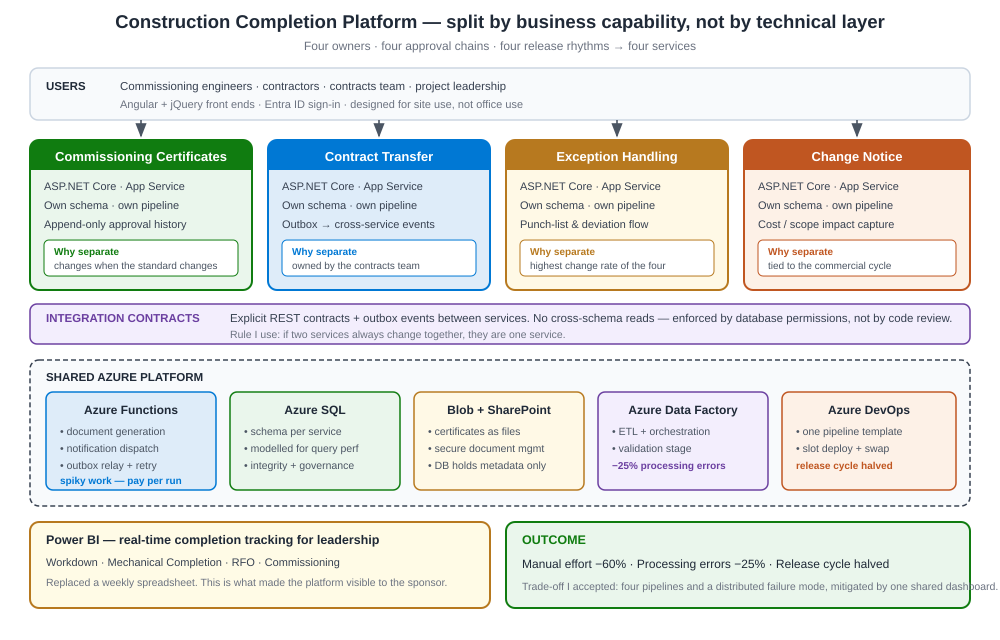

# 55 · Case Study C — Construction Completion Platform (TengizChevroil) (6 questions + follow-ups)

[← Case Study B: AI/RAG Assistant](54-case-study-b-ai-rag-assistant.md) · [Home](README.md) · [Next → Case Study D: Asset-Management Reporting](56-case-study-d-asset-management-reporting.md)

This is my **microservices, Azure hosting and on-site delivery** case study: the construction-completion platform at **TengizChevroil** in Kazakhstan — four cloud apps that replaced paper across many contractors. I reach for it on *"microservices vs monolith"*, *"how do you host on Azure"*, *"integration between systems"*, and *"delivering with stakeholders on site"*. For theory, see [47 System Design](47-concept-system-design.md), [37 Azure Services](37-concept-azure-services.md), [31 Web API](31-concept-aspnet-webapi.md) and [50 Data Design](50-concept-data-design.md).

> One-line decision: *"I split four business processes into microservices on managed Azure because they have independent lifecycles — and I treated shop-floor adoption as an architecture requirement, not training."*

**Jump to:** [The story](#the-story-the-8-beats) · [Architecture](#architecture-at-a-glance) · [Decision log](#decision-log-adr-style) · [CC1](#cc1--why-microservices-and-not-a-single-application-for-the-completion-platform) · [CC2](#cc2--how-did-you-make-sure-the-platform-was-actually-adopted-on-the-shop-floor) · [CC3](#cc3--how-did-you-halve-the-release-cycle) · [CC4](#cc4--how-did-you-design-the-integration-contracts-between-construction-systems) · [CC5](#cc5--why-managed-azure-app-services-and-functions-and-not-kubernetes) · [CC6](#cc6--how-did-you-deliver-this-on-site-with-many-contractors) · [Section index](#section-index)

---

## The story (the 8 beats)

*Figure 55.1 — Project C. Four cloud apps decomposed into services on Azure, with integration contracts between construction systems.*

**1. How it started.** TengizChevroil runs one of the world's largest oil-and-gas expansion projects in Kazakhstan. **"Completion"** is proving that thousands of pieces of equipment have been built, tested, commissioned and handed over. It was running on **paper, spreadsheets and email** across many contractors — slow, error-prone, and impossible to track in real time. The trigger: leadership had **no live view** of completion progress, and manual effort was enormous.

**2. The problem / constraints.**
- **Many contractors and systems** to integrate, each with its own data.
- **Four distinct processes** — commissioning certificates, contract transfer, exception handling, change notice — with **different lifecycles and owners**.
- **Adoption on a shop floor.** If the screen doesn't fit how a commissioning engineer works, the best design stays unused.
- **On-site, regulated heavy-industry governance**, and a need for **real-time tracking** for leadership.

**3. Options I considered.**
- *One big application (monolith).* Simpler to deploy at first, but the four processes have different lifecycles and owners; one release would couple them and slow everyone down.
- *Buy an off-the-shelf completion tool.* Faster on paper, but it wouldn't fit the client's contractor mix and bespoke change/exception flows — adoption would fail.
- *Microservices per process, on managed Azure.* Each process evolves and deploys independently, with clear integration contracts between them.
- *Self-managed Kubernetes (AKS).* Powerful, but a heavy ops burden the client's team would have to carry.

**4. The decision & why.** **Microservices per business process** — commissioning certificates, contract transfer, exception handling, change notice — hosted on **managed Azure** (App Services, Azure Functions, Blob Storage, Azure SQL). The settling reason: the four processes have **different lifecycles and owners**, so they must deploy and scale independently. I chose **managed** services deliberately (not AKS) to fit the client's operating model — the team could run App Services and Functions without a Kubernetes ops burden. **REST integration contracts** let the construction systems exchange data in real time.

**5. What I built.**
- **Four cloud applications** on **ASP.NET Core and Azure Functions**.
- An **ETL and orchestration layer** on Azure Data Factory and Functions with a **validation stage**.
- **SQL Server schemas** modelled for query performance, integrity and governance across completion, commissioning and change management.
- **REST API contracts** for real-time exchange between construction systems, with **Angular and jQuery** front ends.
- **Power BI** dashboards — Workdown, Mechanical Completion, RFO, Commissioning.
- **Azure DevOps CI/CD** pipelines and a release strategy.

**6. Who was involved.** I was the solution architect, **on site**. I defined the microservices decomposition, the Azure hosting topology, and the integration contracts. I **mentored engineers** on Azure, microservices and API design, ran the delivery, and **presented architecture decisions to stakeholders** for refinement. I worked closely with **commissioning engineers** (the real users) so the screens fit their workflow, and with **contractors' system owners** on the integration contracts.

**7. The result.** Manual effort down **60%**. Processing errors down **25%**. Release cycle time **halved**. Leadership got **real-time completion tracking** instead of a weekly spreadsheet.

**8. The lesson.** *"In heavy industry, adoption is the architecture problem. If the approval screen does not fit how a commissioning engineer actually works, the best design on paper stays unused."*

---

## Architecture at a glance

**Service boundaries (by business capability):** Commissioning Certificates · Contract Transfer · Exception Handling · Change Notice — each an independently deployable service.

**Hosting topology:** App Services (the apps/APIs) + Azure Functions (event-driven and ETL steps) + Blob Storage (documents/attachments) + Azure SQL (governed schemas). **Integration:** versioned REST contracts between services and contractor systems; async where real-time isn't essential. **Delivery:** Azure DevOps CI/CD per service. **Visibility:** Power BI dashboards over the governed data.

**Non-functionals I own:** independent deployability (per-process lifecycle), real-time integration (contracts), adoption (workflow-shaped UIs), data integrity/governance (schema design + validation), and operability (managed services the client's team can run).

---

## Decision log (ADR-style)

| # | Decision | Options weighed | What I chose & the trade-off accepted |
|---|----------|-----------------|----------------------------------------|
| C-1 | Application shape | Monolith / buy / **microservices per process** | **Microservices** — more integration surface, bought independent lifecycles |
| C-2 | Hosting | AKS / VMs / **managed Azure (App Service + Functions)** | **Managed** — less control, bought low ops burden for the client's team |
| C-3 | Integration | Shared DB / **versioned REST contracts** | **Contracts** — more design, bought decoupling & independent evolution |
| C-4 | Data tier | One shared schema / **governed per-domain schemas** | **Governed schemas** — more modelling, bought integrity & query performance |
| C-5 | Delivery | Manual releases / **Azure DevOps CI/CD** | **CI/CD** — pipeline setup cost, bought halved, safer release cycle |
| C-6 | UX approach | Standard forms / **workflow-shaped screens** | **Workflow-shaped** — more user research, bought real shop-floor adoption |

---

### CC1 · Why microservices and not a single application for the completion platform?

**Context.** Four processes — certificates, transfer, exceptions, change notices — with different owners and change rates.

**The problem.** In a monolith, a change to the change-notice flow forces a full redeploy that risks the certificate flow. Different contractors drive different processes at different times; coupling them slows everyone.

**Options I considered.** *Monolith* — simple ops, but coupled releases and blast radius. *Microservices* — independent deploy/scale per process, at the cost of more integration and operational surface.

**The decision & why.** **Microservices per business process**, because the **independent lifecycles** were real, not theoretical. I kept the count small (four, aligned to real business boundaries) so I didn't over-fragment into a distributed monolith. Managed Azure hosting kept the extra operational surface affordable for the client's team.

**Result.** Each process ships on its own cadence; a change to one doesn't threaten the others; and leadership gets a live, integrated view across all four.

**Lesson.** *"Split by business capability with a real, independent lifecycle — not by layer, and not just because microservices are fashionable. Too many services is its own monolith."*

**Follow-up: How did you avoid a distributed monolith?**
> Services aligned to business capabilities (not technical layers), asynchronous integration where I could, and clear REST contracts so services talk through interfaces, not shared databases. If two services always change together, that's a signal they should be one — I watched for that.

**Follow-up: Would you still choose microservices if the team were smaller?**
> Maybe not. With a small team and tightly-coupled processes, a modular monolith (clear internal boundaries, one deployable) can be the better call — fewer moving parts. I choose microservices for *independent lifecycles*, not for the label. See [47 System Design](47-concept-system-design.md).

---

### CC2 · How did you make sure the platform was actually adopted on the shop floor?

**Context.** The best-designed approval flow is worthless if a commissioning engineer won't use it.

**The decision & why.** I treated **adoption as an architecture requirement**, not a training afterthought. I sat with the actual users — commissioning engineers — to shape the screens around **how they really work**, kept the critical paths short, and rolled out with their feedback. The integration contracts meant data flowed automatically instead of asking users to re-key it.

**Result.** The 60% manual-effort reduction only happened because people used the system. Adoption was the mechanism behind the number.

**Lesson.** *"In heavy industry, usability *is* the architecture. Design for the person doing the job at 6 a.m. on site, not for the diagram."*

**Follow-up: How do you balance user requests against a clean design?**
> I separate "fits their real workflow" (must-have, shapes the design) from "personal preference" (nice-to-have, backlog). Contracts and service boundaries stay clean underneath; the UI flexes to the user. The design authority is me, but the workflow authority is the engineer on site.

**Follow-up: How did being on site change your design?**
> Enormously. Watching the actual paper process — who signs what, in what order, under what pressure — shaped the approval flows in ways no remote spec would have. Proximity to the user is a design input.

---

### CC3 · How did you halve the release cycle?

**Context.** Multiple apps, multiple contractors, on-site — releases were slow and risky.

**The decision & why.** **Azure DevOps CI/CD** with a defined release strategy, plus the microservices split so I could release one service without redeploying everything. Automated build, test and deploy replaced manual, error-prone steps; the validation stage in the ETL caught bad data before release.

**Result.** Release cycle time **halved**, and releases got safer because they were smaller and automated.

**Lesson.** *"Small, automated, independent releases beat big manual ones. The architecture (services) and the pipeline (CI/CD) have to agree for that to work."*

**Follow-up: How do you keep quality up when you release more often?**
> Automated tests as gates, the validation stage, and small changes that are easy to review and roll back. Frequency and quality aren't opposites — smaller batches are *easier* to keep correct than big-bang releases.

---

### CC4 · How did you design the integration contracts between construction systems?

**Context.** Many systems from many contractors had to exchange completion data in real time.

**The decision & why.** **REST contracts as the boundary.** I defined clear, versioned request/response contracts so each system could evolve independently as long as it honoured the contract. Validation at the boundary rejected bad data early; async where real-time wasn't essential kept systems decoupled.

**Result.** Systems integrated in real time without being tightly coupled to each other's internals — a contractor could change their system without breaking ours.

**Lesson.** *"Integrate through contracts, not through shared databases. The contract is the thing you promise; everything behind it is yours to change."*

**Follow-up: How do you version a contract without breaking consumers?**
> Additive changes stay backward-compatible; breaking changes get a new version with a deprecation window so consumers migrate on their schedule. The contract is a promise — I don't break promises silently.

**Follow-up: How do you handle a contractor system that's unreliable?**
> Defensive integration: validate everything at the boundary, timeouts and retries, and async buffering so their outage doesn't cascade into mine. I harden the boundaries I don't control — the same instinct as the Aladdin boundary in Case Study A.

---

### CC5 · Why managed Azure (App Services and Functions) and not Kubernetes?

**Context.** Container orchestration is the fashionable default; I chose managed PaaS instead.

**The decision & why.** The *fit-to-operating-model* filter decided it. The client's team could operate **App Services and Functions** comfortably; a self-managed **AKS** cluster would have added patching, scaling and networking ops they didn't need for this scale. I chose the **most-managed option that met the requirement** — deliberately avoiding the ops cost, not the technology. Functions gave me event-driven, pay-per-use compute for the ETL steps; App Services gave simple, scalable hosting for the apps and APIs.

**Result.** A platform the client's own team could run and evolve after I left — which is the real test.

**Lesson.** *"Choose the most-managed platform that meets the need. Kubernetes is a tool, not a trophy — don't buy ops overhead you don't need."* See [21 Objections](21-objections-and-tough-questions.md).

**Follow-up: When *would* you reach for AKS/containers here?**
> If I needed fine-grained control over the runtime, portability across clouds, or dense multi-service packing at a scale where App Service plans got expensive. None of that applied — so paying the AKS ops tax would have been over-engineering.

---

### CC6 · How did you deliver this on site with many contractors?

**Context.** On-site, heavy-industry, multi-contractor delivery is as much a people problem as a technical one.

**My answer.** I **presented architecture decisions to stakeholders for refinement**, not just sign-off — that built the buy-in that made adoption possible. I aligned **contractors' system owners** on the integration contracts early, so integration wasn't a surprise. I **mentored the engineering team** on Azure, microservices and API design so the capability stayed after me. And I kept the delivery in **small, visible increments** so stakeholders saw progress and could course-correct.

**Result.** Decisions were owned by the stakeholders, not imposed; contractors integrated without friction; and the team could run the platform after handover.

**Lesson.** *"On site, the architecture is only half the job. Buy-in, contracts agreed early, and a team that can run it without you are the other half."* See [04 Team](04-team-management.md) and [05 Client](05-client-engagement.md).

**Follow-up: How did you handle a stakeholder who disagreed with a decision?**
> I presented the trade-off — constraint, options, recommendation, what I'd give up — and invited refinement. Most disagreements dissolve when people see the options you already weighed. If overruled after a fair hearing, I document the risk and commit. See [58 Decision-Making DM5](58-case-study-decision-making.md#dm5--how-do-you-get-buy-in-for-an-architecture-decision-from-stakeholders).

---

## Section index

| ID | Topic | One-line summary |
|----|-------|------------------|
| — | The story | Microservices per process; managed Azure; adoption as architecture |
| — | Decision log | Six ADR-style decisions with the trade-off accepted |
| CC1 | Microservices choice | Split by capability with real independent lifecycles |
| CC2 | Adoption | Usability is the architecture in heavy industry |
| CC3 | Halved release cycle | Small, automated, independent releases via CI/CD |
| CC4 | Integration contracts | Integrate through versioned REST contracts, not shared DBs |
| CC5 | Managed vs Kubernetes | Most-managed platform that meets the need; no ops trophy |
| CC6 | On-site delivery | Buy-in, early contracts, a team that can run it after you |

---

[← Case Study B: AI/RAG Assistant](54-case-study-b-ai-rag-assistant.md) · [Home](README.md) · [Next → Case Study D: Asset-Management Reporting](56-case-study-d-asset-management-reporting.md)
