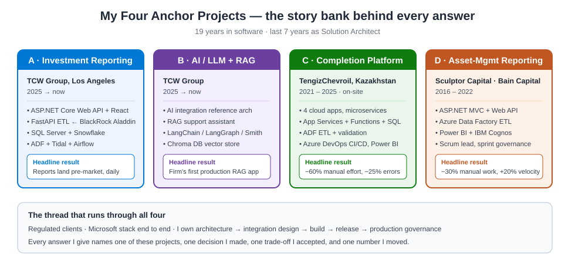

# Solution Architect (Hands-On Full-Stack) Interview Kit — Hem Singh

**Position:** Solution Architect (Azure & .NET) who still writes production code · 7 years as an architect, 19 years in software
**Built for:** interviews, client panels, pre-sales conversations, and deep-technical / coding rounds
**Tone of this kit:** simple English, short sentences, real numbers, my own projects

> **My positioning in one line:** *I am a hands-on Solution Architect — I own the design end to end, and I still write production code myself across the full stack (React/Angular front end, ASP.NET Core Web API and C#, and Python/FastAPI ETL, with the SQL underneath).*

---

## How to use this kit

1. Read [Overview & Positioning](01-overview-positioning.md) first. It holds my **story bank** — four projects I keep coming back to in every answer.
2. Then pick the section that matches your interview round.
3. Every question follows the same shape:
   - **The question** — short, as an interviewer would ask it.
   - **My answer** — a story. Context → what I did → the trade-off → the number → the lesson.
   - **Follow-ups** — what they usually ask next, with a short reply.
4. Before the interview, read [Cheat Sheets](08-cheatsheets.md) and the [Pitches](10-pitch-and-resume.md). That is 20 minutes of work and it covers 80% of the opening.

> **Rule I follow in every answer:** never give theory alone. Always attach it to a project, a decision, and a number.

---

## Quick index by interview round

Under pressure, jump straight to the round you are in:

| If the round is… | Go to |
|---|---|
| **Intro / "tell me about yourself"** | [01 Overview](01-overview-positioning.md) · [10 Pitches](10-pitch-and-resume.md) |
| **Behavioural / leadership** | [04 Team](04-team-management.md) · [05 Client](05-client-engagement.md) · [06 RFP](06-rfp-presales.md) · [07 Support](07-support-post-delivery.md) |
| **Technical breadth** | [02 Technical Q&A](02-technical-qa.md) |
| **System design** | [03 System Design](03-system-design.md) |
| **Deep-technical (per stack)** | [15 .NET](15-deepdive-dotnet.md) · [16 React/TS](16-deepdive-react-typescript.md) · [17 Python/Data](17-deepdive-python-data.md) |
| **Hands-on coding** | [14 Full-Stack Hands-On](14-fullstack-hands-on.md) · [18 Coding-Round Prep](18-coding-round-prep.md) |
| **Performance / optimisation** | [19 Performance Deep Dive](19-performance-deep-dive.md) |
| **AI / ways-of-working leadership** | [20 AI-Assisted Development](20-ai-assisted-development.md) |
| **Tough / challenge questions** | [21 Objections & Tough Questions](21-objections-and-tough-questions.md) |
| **Behavioural / "tell me about a time"** | [25 STAR Story Bank](25-star-story-bank.md) |
| **Questions to ask them** | [26 Reverse-Interview Questions](26-reverse-interview-questions.md) |
| **"First 90 days?" question** | [27 My First 90 Days](27-first-90-days.md) |
| **Salary / offer negotiation** | [23 Offer & Salary Negotiation](23-offer-negotiation.md) |
| **Tailoring to a specific job** | [24 Role-Tailoring Guide](24-role-tailoring-guide.md) |
| **Last 2 minutes before** | [22 Panic Sheet](22-panic-sheet.md) |
| **Last 20 minutes before** | [08 Cheat Sheets](08-cheatsheets.md) · [09 Study Plan → night before](09-study-plan.md) |

---

## Contents

| # | Section | What is inside | Questions |
|---|---------|----------------|-----------|
| 01 | [Overview & Positioning](01-overview-positioning.md) | Who I am, my 4 anchor projects, answer frameworks | — |
| 02 | [Technical Q&A](02-technical-qa.md) | .NET, Azure, APIs, data, security, DevOps, observability, AI/RAG | 22 |
| 03 | [System Design](03-system-design.md) | 8 full design scenarios with diagrams | 8 |
| 04 | [Team Management](04-team-management.md) | Hiring, mentoring, conflict, scope change, hard messages | 10 |
| 05 | [Client Engagement](05-client-engagement.md) | Proposals, negotiation, PoCs, change requests, follow-ups | 8 |
| 06 | [RFP & Pre-Sales](06-rfp-presales.md) | Leading responses, solution outlines, estimates, win themes | 7 |
| 07 | [Support & Post-Delivery](07-support-post-delivery.md) | Runbooks, SLAs, escalation, knowledge transfer, upsell | 8 |
| 08 | [Cheat Sheets](08-cheatsheets.md) | One-page recall: patterns, Azure services, numbers, phrases | — |
| 09 | [Study Plan](09-study-plan.md) | 2-week and 1-week plans + mock interview scripts | — |
| 10 | [Pitch & Resume Summary](10-pitch-and-resume.md) | 30-second, 2-minute pitch, one-page resume | — |
| 11 | [Email Templates](11-email-templates.md) | Proposal, demo follow-up, scope change, support handover | — |
| 12 | [Checklists](12-checklists.md) | RFP, pre-sales, design review, go-live, handover | — |
| 13 | [Reproduce Prompt](13-reproduce-prompt.md) | One paragraph to regenerate or extend this kit | — |
| 14 | [Full-Stack Hands-On](14-fullstack-hands-on.md) | Code-backed answers: C#, Web API, EF, FastAPI, React, Angular, SQL, auth, testing, debugging | 12 |
| 15 | [Deep Dive: .NET & C#](15-deepdive-dotnet.md) | DI/lifetimes, middleware, LINQ, Span/GC, concurrency, Polly, caching, EF advanced, gRPC, secrets | 10 |
| 16 | [Deep Dive: React & TypeScript](16-deepdive-react-typescript.md) | Generics, typed components, hooks internals, effects, performance, forms, error boundaries, testing, a11y | 10 |
| 17 | [Deep Dive: Python & Data](17-deepdive-python-data.md) | Async, Pydantic, Pandas, idempotent ETL, SQL tuning, Snowflake, orchestration, RAG code, quality, testing | 10 |
| 18 | [Coding-Round Prep](18-coding-round-prep.md) | Both formats: DSA patterns + worked examples (C#/TS/Python) and a feature-building playbook | — |
| 19 | [Performance Deep Dive](19-performance-deep-dive.md) | Front-end, backend & database performance with project stories, metrics and tools | 12 |
| 20 | [AI-Assisted Development](20-ai-assisted-development.md) | End-to-end team playbook: pilot, roles, guardrails, QA, security, metrics, PRDs, rollout | 4 |
| 21 | [Objections & Tough Questions](21-objections-and-tough-questions.md) | Crisp rebuttals to the hardest challenges about being a hands-on architect | 10 |
| 22 | [Panic Sheet](22-panic-sheet.md) | One page for the last 2 minutes: opening line, projects, numbers, phrases, reset routine | — |
| 23 | [Offer & Salary Negotiation](23-offer-negotiation.md) | Calm, evidence-based answers to the compensation conversation | 8 |
| 24 | [Role-Tailoring Guide](24-role-tailoring-guide.md) | 20-minute routine to adapt the kit to any job description | — |
| 25 | [STAR Story Bank](25-star-story-bank.md) | 10 fully-written behavioural stories in STAR-D form (failure, conflict, influence, deadline, crisis…) | 10 |
| 26 | [Reverse-Interview Questions](26-reverse-interview-questions.md) | Sharp questions to ask them, grouped by interviewer, with a signal-reading table | — |
| 27 | [My First 90 Days](27-first-90-days.md) | Ready answer to "what would you do in your first 90 days?" — Listen → Plan → Deliver | — |

**Total: 149 questions with full answers and follow-ups.**

---

## My four anchor projects (memorise these)

*Figure 1 — My story bank. Nearly every question in this kit maps back to one of these four.*

| Code | Project | Client & years | Use it for |
|------|---------|----------------|-----------|
| **A** | Investment Reporting Platform + Aladdin ingestion | TCW Group, Los Angeles · 2025→now | Data platform, orchestration, SLA, API design, performance |
| **B** | AI/LLM integration framework + RAG support assistant | TCW Group · 2025→now | AI architecture, innovation, governance, cost, evaluation |
| **C** | Construction completion platform (4 cloud apps) | TengizChevroil, Kazakhstan · 2021–2025 | Microservices, Azure hosting, CI/CD, integration, stakeholders |
| **D** | Asset-management reporting & ETL | Sculptor Capital NY, Bain Capital Boston · 2016–2022 | ETL, reporting, Agile leadership, delivery metrics |
| **E** | UK enterprise web platforms | Bupa, NHS e-Contracting, Unilever · 2012–2016 | PoCs, pre-sales, code standards, regulated/public sector |

---

## Quick numbers I never forget

These come up in almost every answer. Learn them cold.

| Number | Where it comes from |
|--------|--------------------|
| **60%** less manual effort | Four completion apps automated the paper workflow (Project C) |
| **25%** fewer processing errors | Validation layer added in the ADF/Functions ETL (Project C) |
| **50%** shorter release cycle | Azure DevOps CI/CD pipelines and release strategy (Project C) |
| **30%** less manual processing | ADF ingestion + transformation + validation (Project D) |
| **20%** faster decision turnaround | Power BI and Cognos reporting (Project D) |
| **+20%** team velocity, **−15%** post-deploy defects | Sprint discipline and review gates (Project D) |
| **Pre-market window met daily** | Dependency-aware ADF + Tidal + Airflow orchestration (Project A) |
| **First production RAG app** at the firm | AI/LLM reference architecture (Project B) |
| **19 years** total, **7 years** as architect | My career line |

---

## The three sentences I open with

> "I am a solution architect on the Microsoft stack. Nineteen years in software, the last seven owning solutions end to end — architecture, integration design, build, release and production governance.
>
> Right now I architect the investment-reporting platform for TCW Group in Los Angeles: the .NET application tier, the Web API layer, and the data pipeline that ingests BlackRock Aladdin data into SQL Server and Snowflake.
>
> I also wrote the firm's reference architecture for AI/LLM integration and shipped its first production RAG application."

Full versions are in [Pitch & Resume Summary](10-pitch-and-resume.md).

---

[Start here → Overview & Positioning](01-overview-positioning.md)
