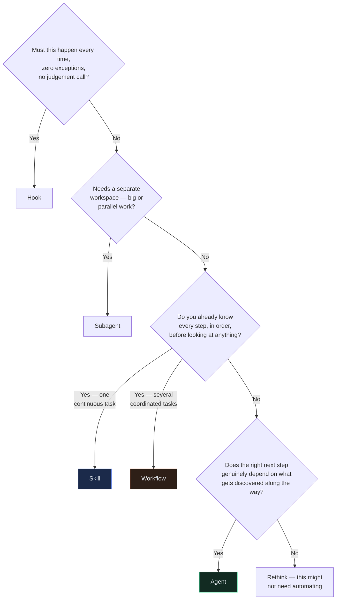
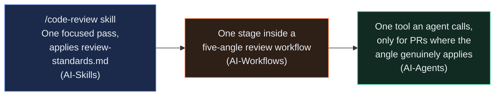

# How Skills, Workflows, and Agents Connect

[AI-Skills](../AI-Skills/README.md) · [AI-Workflows](../AI-Workflows/README.md) · [AI-Agents](../AI-Agents/README.md)

This page is the map that ties three separate tutorials into one story. If you've read all three — or even just want to know how they fit together before you start — this is where that picture lives.

---

## The one-sentence version

**A skill is one focused set of instructions. A workflow is a fixed plan that coordinates several. An agent is a goal-driven loop that decides its own steps.** Each one is the right tool for a genuinely different kind of task, and none of them replaces the one before it — each new tool *reuses* the last one, it doesn't discard it.

---

## The three tutorials, side by side

| | [AI-Skills](../AI-Skills/README.md) | [AI-Workflows](../AI-Workflows/README.md) | [AI-Agents](../AI-Agents/README.md) |
|---|---|---|---|
| **What it is** | One set of instructions, followed in one continuous flow of reasoning | A fixed, deterministic plan — several pieces of work, coordinated on purpose | A goal and a loop — decides its own next step from what it discovers |
| **When it's picked** | Automatically, when a request matches its trigger description | Deliberately, run on purpose, never automatic | Deliberately, given a goal, then runs its own loop until done |
| **Its plan exists...** | As one continuous instruction set | Before the first real input — fully readable in advance | Only as it runs — built one step at a time |
| **Right for...** | One focused, recognisable, repeated request | Several genuinely separate or staged pieces of work, all knowable in advance | A goal where the right next step can't be known until you've taken the last one |
| **The risk that's unique to it** | Triggering on the wrong thing, or acting on something irreversible without care | Nested orchestration multiplying cost invisibly | Taking an irreversible action nobody explicitly approved |
| **Your first chapter** | [What Is a Skill?](../AI-Skills/tutorial/01-what-is-a-skill.md) | [What Is a Workflow?](../AI-Workflows/tutorial/01-what-is-a-workflow.md) | [What Is an Agent?](../AI-Agents/tutorial/01-what-is-an-agent.md) |

---

## The single decision framework

Each tutorial builds this up on its own, one branch at a time. Here's the complete version, all at once:

The axis that actually separates the last three branches: **when is the plan decided?** A skill's "plan" is a single continuous pass. A workflow's plan is written out before the first real input arrives. An agent's plan doesn't exist until it's built, one step at a time, out of what each step reveals.

---

## The one thread that runs through all three

The clearest proof that nothing gets thrown away as you move up this ladder is a single piece of logic — Rahul's PR review — followed across all three repos.

**Stop 1 — [AI-Skills Case Study 4](../AI-Skills/case-studies/04-code-review-skill/README.md).** Rahul builds a skill that reviews a PR in one focused pass, applying a separate `review-standards.md` policy file so the rules can change without touching the skill's instructions. This is genuinely all a small-to-medium PR needs.

**Stop 2 — [AI-Workflows Case Study 4](../AI-Workflows/case-studies/04-code-review-workflow/README.md).** A 600-line PR needs five genuinely different angles of attention — security, tests, style, data access, docs — more than one continuous pass can give each of them real focus. The workflow's "style" angle isn't rewritten from scratch. It's a direct call to the same `/code-review` skill, running as one stage inside a bigger, verified review. The skill didn't get replaced. It got promoted.

**Stop 3 — [AI-Agents Case Study 4](../AI-Agents/case-studies/04-code-review-agent/README.md).** Always running all five angles wastes real effort on a PR that's obviously narrow — a one-line doc fix doesn't need a security check. The agent's job isn't to redo the five-angle review. It reads the actual diff, decides *which* angles genuinely apply — grounded in the diff's real content, not just file names — and calls the same five-angle workflow with only that subset. On a genuinely large, cross-cutting PR, it still ends up calling all five, because for that PR, all five genuinely do apply.

**The result:** one piece of review logic, written once, trusted at every level above it. A skill inside a workflow. A workflow inside an agent's toolset. Nothing rebuilt, nothing thrown away — each layer added exactly the thing the one below it structurally couldn't do.

---

## Why the order matters

Read [AI-Skills](../AI-Skills/README.md) first, then [AI-Workflows](../AI-Workflows/README.md), then [AI-Agents](../AI-Agents/README.md) — each one assumes the tool below it exists and is trustworthy. AI-Workflows' whole premise is "you've hit a skill's ceiling." AI-Agents' whole premise is "you've hit a workflow's ceiling — a fixed plan, however well-designed, can't adapt mid-run to what it discovers." Skipping ahead means arriving at "isn't this just a bigger version of the last tool?" without the grounding to answer it — which is exactly the question Rahul asks at the start of both AI-Workflows and AI-Agents, and exactly the question each tutorial's Chapter 6 exists to answer for real.

---

## The cast, across all three

The same five people, the same company, one continuous story:

| Who | Role | Skill (AI-Skills) | Workflow (AI-Workflows) | Agent (AI-Agents) |
|---|---|---|---|---|
| **You** | Backend engineer, new joiner | [Commit-message skill](../AI-Skills/tutorial/03-your-first-skill.md), built chapter by chapter | [Function-review workflow](../AI-Workflows/tutorial/03-your-first-workflow.md), then the full five-angle review | [Config-discrepancy investigator](../AI-Agents/tutorial/02-anatomy-of-an-agent.md), built across Chapters 2–5 |
| **Rahul** | Tech lead | [`/code-review`](../AI-Skills/case-studies/04-code-review-skill/README.md) | [Five-angle review](../AI-Workflows/case-studies/04-code-review-workflow/README.md) | [Adaptive review](../AI-Agents/case-studies/04-code-review-agent/README.md) |
| **Divya** | Frontend engineer | [Accessibility check](../AI-Skills/case-studies/01-frontend-skill/README.md) | [Cross-size check](../AI-Workflows/case-studies/01-frontend-workflow/README.md) | [Regression investigator](../AI-Agents/case-studies/01-frontend-agent/README.md) |
| **Vikram** | Backend engineer | [Endpoint scaffolder](../AI-Skills/case-studies/02-backend-skill/README.md) | [Scaffold-test-document](../AI-Workflows/case-studies/02-backend-workflow/README.md) | [Flaky-test triage](../AI-Agents/case-studies/02-backend-agent/README.md) |
| **Ananya** | QA lead | [Test-case generator](../AI-Skills/case-studies/03-qa-skill/README.md) | [Generate-and-verify](../AI-Workflows/case-studies/03-qa-workflow/README.md) | [Bounded exploration](../AI-Agents/case-studies/03-qa-agent/README.md) |

Same person, same underlying concern, three genuinely different tools reached for as the problem outgrew the last one — never a different concern, just a bigger version of the same one.

---

## The one lesson that survives all three tutorials

Every governance chapter — [AI-Skills Chapter 9](../AI-Skills/tutorial/09-governance-and-capstone.md), [AI-Workflows Chapter 9](../AI-Workflows/tutorial/09-governance-and-capstone.md), [AI-Agents Chapter 9](../AI-Agents/tutorial/09-governance-and-capstone.md) — teaches a version of the same underlying idea: **the thing that makes a tool more capable is also, specifically, what makes its unique risk possible.** A skill's automatic triggering is what makes it convenient, and also what makes an unintended trigger possible. A workflow's ability to coordinate many pieces of work is what makes it powerful, and also what makes uncontrolled cost multiplication possible. An agent's ability to decide its own next step is what makes it able to investigate the genuinely unknown, and also what makes an unapproved irreversible action possible.

None of these risks are reasons to avoid the tool. They're reasons to build the specific, real safeguard each one needs — a trigger test, a cost cap, an approval gate — instead of hoping the risk doesn't come up.

---

## Where to start

New to all three? Start at [AI-Skills](../AI-Skills/README.md).

Already know skills, want to coordinate more than one thing at once? Start at [AI-Workflows](../AI-Workflows/README.md).

Already have a solid workflow, but the right next step keeps depending on what you find? Start at [AI-Agents](../AI-Agents/README.md).
